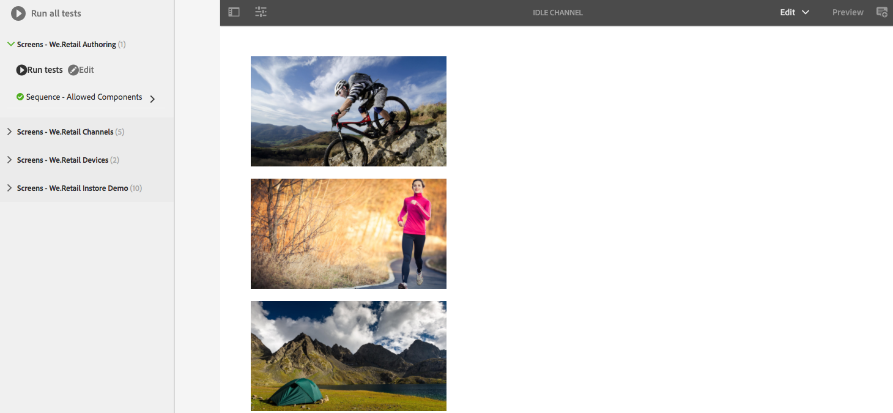

# UI 테스트{#testing-your-ui}

>[!NOTE]
>
>AEM 6.5 이상 버전에서 hobes.js UI 테스트 프레임워크는 더 이상 사용되지 않습니다. Adobe은 이를 더 이상 개선할 계획이 없으며 고객이 Selenium 자동화를 사용할 것을 권장합니다.
>
>[사용되지 않음 및 제거된 기능](/help/release-notes/deprecated-removed-features.md)을 참조하십시오.

AEM은 AEM UI에 대한 테스트를 자동화하기 위한 프레임워크를 제공합니다. 이 프레임워크를 사용하면 웹 브라우저에서 직접 UI 테스트를 작성하고 실행할 수 있습니다. 이 프레임워크는 테스트를 만들기 위한 javascript API를 제공합니다.

AEM 테스트 프레임워크는 Javascript로 작성된 테스트 라이브러리인 Hobes.js를 사용합니다. Hobes.js 프레임워크는 개발 프로세스의 일부로 AEM을 테스트하기 위해 개발되었습니다. 이 프레임워크는 이제 AEM 애플리케이션을 테스트하는 데 공개적으로 사용할 수 있습니다.

>[!NOTE]
>
>API에 대한 자세한 내용은 Hobes.js [설명서](https://helpx.adobe.com/experience-manager/6-5/sites/developing/using/reference-materials/test-api/index.html)를 참조하십시오.

## 테스트 구조 {#structure-of-tests}

AEM 내에서 자동화된 테스트를 사용하는 경우 다음 용어를 이해하는 것이 중요합니다.

| 작업 | **작업**&#x200B;은 링크나 단추를 클릭하는 것과 같은 웹 페이지의 특정 활동입니다. |
|---|---|
| 테스트 케이스 | **테스트 케이스**&#x200B;는 하나 이상의 **액션**&#x200B;으로 구성될 수 있는 특정 상황입니다. |
| 테스트 세트 | **테스트 세트**&#x200B;는 특정 사용 사례를 모두 테스트하는 관련 **테스트 케이스**&#x200B;의 그룹입니다. |

## 테스트 실행 {#executing-tests}

### 테스트 세트 보기 {#viewing-test-suites}

등록된 테스트 세트를 보려면 테스트 콘솔을 엽니다. [테스트] 패널에는 테스트 세트 및 테스트 케이스 목록이 포함되어 있습니다.

**전역 탐색 -> 도구 > 작업 -> 테스트**&#x200B;를 통해 도구 콘솔로 이동합니다.


콘솔을 열면 테스트 세트가 모든 테스트를 순차적으로 실행하는 옵션과 함께 왼쪽에 나열됩니다. 바둑판식 배경 바둑판식 배열 등과 함께 표시되는 오른쪽의 공백은 테스트가 실행될 때 페이지 컨텐츠를 표시하는 자리 표시자입니다.


### 단일 테스트 세트 실행 {#running-a-single-test-suite}

테스트 세트는 개별적으로 실행할 수 있습니다. Test Suite를 실행할 때 테스트 케이스 및 해당 작업이 실행될 때 페이지가 변경되고 테스트 완료 후 결과가 나타납니다. 아이콘은 결과를 나타냅니다.

확인 표시 아이콘은 전달된 테스트를 나타냅니다.


&quot;X&quot; 아이콘은 실패한 테스트를 나타냅니다.


테스트 세트를 실행하려면:

1. 테스트 패널에서 실행할 테스트 케이스 이름을 클릭하거나 탭하여 동작의 세부 사항을 확장합니다.

   

1. **테스트 실행** 단추를 클릭하거나 탭합니다.

   

1. 테스트 실행 시 자리 표시자가 페이지 컨텐츠로 대체됩니다.

   

1. 설명을 탭하거나 클릭하여 **결과** 패널을 열어 테스트 케이스 결과를 검토합니다. **결과** 패널에서 테스트 케이스 이름을 탭하거나 클릭하면 모든 세부 사항이 표시됩니다.

   

### 여러 테스트 실행 {#running-multiple-tests}

테스트 세트는 콘솔에 나타나는 순서대로 실행됩니다. 테스트를 드릴다운하여 자세한 결과를 볼 수 있습니다.


1. 테스트 패널에서 **모든 테스트 실행** 단추 또는 실행할 테스트 세트 제목 아래의 **테스트 실행** 단추를 탭하거나 클릭합니다.

   

1. 각 테스트 케이스의 결과를 보려면 테스트 케이스의 제목을 탭하거나 클릭합니다. **결과** 패널에서 테스트 이름을 탭하거나 클릭하면 모든 세부 사항이 표시됩니다.

   

## 단순 테스트 세트 만들기 및 사용 {#creating-and-using-a-simple-test-suite}

다음 절차에서는 [We.Retail 컨텐트](/help/sites-developing/we-retail.md)를 사용하여 테스트 세트를 만들고 실행하는 절차를 거치지만, 다른 웹 페이지를 사용하도록 테스트를 쉽게 수정할 수 있습니다.

자체 테스트 세트 만들기에 대한 자세한 내용은 [Hobes.js API 설명서](https://helpx.adobe.com/experience-manager/6-5/sites/developing/using/reference-materials/test-api/index.html)를 참조하십시오.

1. CRXDE Lite 열기 ([https://localhost:4502/crx/de](https://localhost:4502/crx/de))
1. `/etc/clientlibs` 폴더를 마우스 오른쪽 단추로 클릭하고 **만들기 > 폴더 만들기**&#x200B;를 클릭합니다. 이름에 `myTests`을 입력하고 **확인**&#x200B;을 클릭합니다.
1. `/etc/clientlibs/myTests` 폴더를 마우스 오른쪽 단추로 클릭하고 **만들기 > 노드 만들기**&#x200B;를 클릭합니다. 다음 속성 값을 사용한 다음 **확인**&#x200B;을 클릭합니다.

   * 이름: `myFirstTest`
   * 유형: `cq:ClientLibraryFolder`

1. myFirstTest 노드에 다음 속성을 추가합니다.

   | 이름 | 유형 | 값 |
   |---|---|---|
   | `categories` | String[] | `granite.testing.hobbes.tests` |
   | `dependencies` | 문자열[] | `granite.testing.hobbes.testrunner` |

   >[!NOTE]
   >
   >**AEM Forms 전용**
   >
   >
   >적응형 양식을 테스트하려면 카테고리 및 종속성에 다음 값을 추가합니다. 예:
   >
   >
   >**카테고리**:  `granite.testing.hobbes.tests, granite.testing.hobbes.af.commons`
   >
   >
   >**종속성**:  `granite.testing.hobbes.testrunner, granite.testing.hobbes.af`

1. **모두 저장**&#x200B;을 클릭합니다.
1. `myFirstTest` 노드를 마우스 오른쪽 단추로 클릭하고 **만들기 > 파일 만들기**&#x200B;를 클릭합니다. `js.txt` 파일의 이름을 지정하고 **확인**&#x200B;을 클릭합니다.
1. `js.txt` 파일에서 다음 텍스트를 입력합니다.

   ```
   #base=.
   myTestSuite.js
   ```

1. **모두 저장**&#x200B;을 클릭한 다음 `js.txt` 파일을 닫습니다.
1. `myFirstTest` 노드를 마우스 오른쪽 단추로 클릭하고 **만들기 > 파일 만들기**&#x200B;를 클릭합니다. `myTestSuite.js` 파일의 이름을 지정하고 **확인**&#x200B;을 클릭합니다.
1. 다음 코드를 `myTestSuite.js` 파일에 복사한 다음 파일을 저장합니다.

   ```
   new hobs.TestSuite("Experience Content Test Suite", {path:"/etc/clientlibs/myTests/myFirstTest/myTestSuite.js"})
      .addTestCase(new hobs.TestCase("Navigate to Experience Content")
         .navigateTo("/content/we-retail/us/en/experience/arctic-surfing-in-lofoten.html")
      )
      .addTestCase(new hobs.TestCase("Hover Over Topnav")
         .mouseover("li.visible-xs")
      )
      .addTestCase(new hobs.TestCase("Click Topnav Link")
         .click("li.active a")
   );
   ```

1. **테스트** 콘솔로 이동하여 테스트 세트를 시도합니다.
