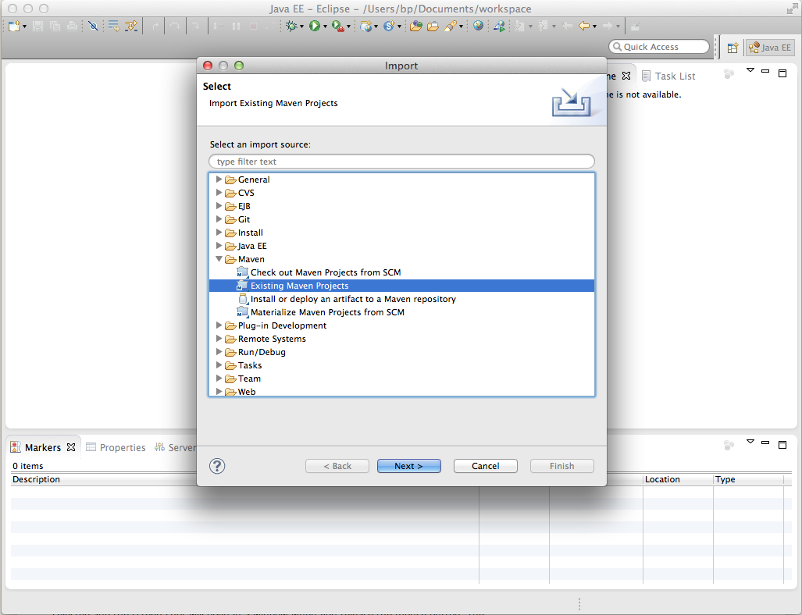

# Eclipse를 사용하여 AEM 프로젝트를 개발하는 방법{#how-to-develop-aem-projects-using-eclipse}

이 안내서에서는 AEM 기반 프로젝트 개발을 위해 Eclipse를 사용하는 방법을 설명합니다.

>[!NOTE]
>
>이제 Adobe에서 Eclipse를 사용하여 AEM 솔루션을 개발하는 데 도움이 되는 [Eclipse용 AEM 개발 도구](/help/sites-developing/aem-eclipse.md)를 제공합니다.

## 개요 {#overview}

Eclipse에서 AEM 개발을 시작하려면 다음 단계가 필요합니다.

이 방법 의 나머지 부분에서 각 탭에 대해 보다 자세히 설명합니다.

* Eclipse 4.3(Kepler) 설치
* Maven을 기반으로 AEM 프로젝트 설정
* Maven POM에서 Eclipse에 대한 JSP 지원 준비
* Maven 프로젝트를 Eclipse로 가져오기

>[!NOTE]
>
>이 안내서는 Eclipse 4.3(Kepler) 및 AEM 5.6.1을 기반으로 합니다.

## Eclipse 설치 {#install-eclipse}

[Eclipse 다운로드 페이지](https://www.eclipse.org/downloads/)에서 &quot;Java EE 개발자용 Eclipse IDE&quot;를 다운로드합니다.

[설치 지침](https://wiki.eclipse.org/Eclipse/Installation)에 따라 Eclipse를 설치합니다.

## Maven을 기반으로 AEM 프로젝트 설정 {#set-up-your-aem-project-based-on-maven}

그런 다음 [Apache Maven을 사용하여 AEM 프로젝트 빌드 방법](/help/sites-developing/ht-projects-maven.md)에 설명된 대로 Maven을 사용하여 프로젝트를 설정합니다.

## Eclipse에 대한 JSP 지원 준비 {#prepare-jsp-support-for-eclipse}

Eclipse는 JSP 작업(예: )도 지원할 수 있습니다.

* 태그 라이브러리 자동 완성
* &lt;cq:defineObjects /> 및 &lt;sling:defineObjects />로 정의된 개체의 Eclipse-insights

이를 위해 다음 작업을 수행합니다.

1. [Apache Maven을 사용하여 AEM 프로젝트를 작성하는 방법](/help/sites-developing/ht-projects-maven.md)의 [JSP로 작업하는 방법](/help/sites-developing/ht-projects-maven.md#how-to-work-with-jsps)에 대한 지침을 따르십시오.
1. 콘텐츠 모듈 POM의 &lt;build /> 섹션에 다음을 추가합니다.

   Eclipse의 Maven 지원 플러그인 m2e는 maven-jspc-plugin을 지원하지 않으며, 이 구성은 m2e에게 플러그인과 임시 컴파일 결과를 정리하는 관련 작업을 무시하도록 지시합니다.

   이는 문제가 아닙니다. [JSP로 작업하는 방법](/help/sites-developing/ht-projects-maven.md#how-to-work-with-jsps)에서 설명한 대로 이 설정의 maven-jspc-plugin은 JSP가 빌드 프로세스의 일부로 컴파일되는지 확인하는 데만 사용됩니다. Eclipse는 이미 JSP의 문제를 보고하며 이 Maven 플러그인을 사용하여 이를 수행할 수 없습니다.

   **myproject/content/pom.xml**

   ```xml
   <build>
     <!-- ... -->
     <pluginManagement>
       <plugins>
         <!--This plugin's configuration is used to store Eclipse m2e settings only. It has no influence on the Maven build itself.-->
         <plugin>
           <groupId>org.eclipse.m2e</groupId>
           <artifactId>lifecycle-mapping</artifactId>
           <version>1.0.0</version>
           <configuration>
             <lifecycleMappingMetadata>
               <pluginExecutions>
                 <pluginExecution>
                   <pluginExecutionFilter>
                     <groupId>org.apache.sling</groupId>
                     <artifactId>maven-jspc-plugin</artifactId>
                     <versionRange>[2.0.6,)</versionRange>
                     <goals>
                       <goal>jspc</goal>
                     </goals>
                   </pluginExecutionFilter>
                   <action>
                     <ignore/>
                   </action>
                 </pluginExecution>
                 <pluginExecution>
                   <pluginExecutionFilter>
                     <groupId>org.apache.maven.plugins</groupId>
                     <artifactId>maven-clean-plugin</artifactId>
                     <versionRange>[2.4.1,)</versionRange>
                     <goals>
                       <goal>clean</goal>
                     </goals>
                   </pluginExecutionFilter>
                   <action>
                     <ignore/>
                   </action>
                 </pluginExecution>
               </pluginExecutions>
             </lifecycleMappingMetadata>
           </configuration>
         </plugin>
       </plugins>
     </pluginManagement>
   </build>
   ```

### Maven 프로젝트를 Eclipse로 가져오기 {#import-the-maven-project-into-eclipse}

1. Eclipse에서 [파일] > [가져오기...]를 선택합니다.
1. 가져오기 대화 상자에서 Maven > 기존 Maven 프로젝트를 선택한 후 &quot;다음&quot;을 클릭합니다.

   

1. 프로젝트의 최상위 폴더에 대한 경로를 입력한 다음 &quot;모두 선택&quot; 및 &quot;마침&quot;을 클릭합니다.

   

1. 이제 JSP 자동 완성을 포함하여 Eclipse를 사용하여 AEM 프로젝트를 개발할 준비가 되었습니다.

   

   >[!NOTE]
   >
   >`/libs`에 `/libs/foundation/global.jsp` 또는 다른 JSP를 포함하는 경우 Eclipse가 포함 문제를 해결할 수 있도록 프로젝트에 복사해야 합니다. 동시에 Maven의 콘텐츠 패키지에 번들로 제공되지 않는지 확인해야 합니다. 이를 수행하는 방법은 [Apache Maven을 사용하여 AEM 프로젝트를 빌드하는 방법](/help/sites-developing/ht-projects-maven.md)에 설명되어 있습니다.
