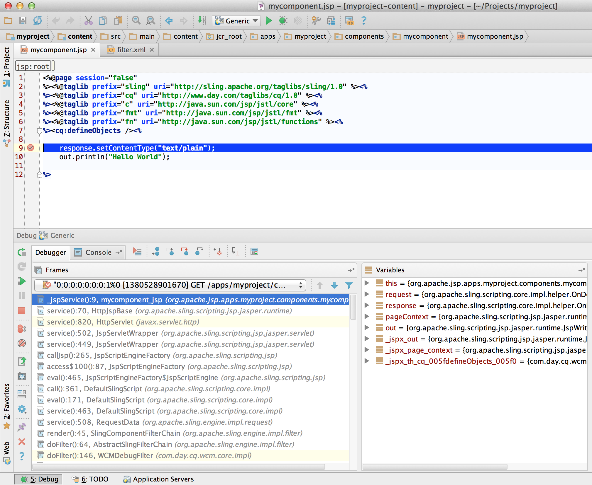

# IntelliJ IDEA를 사용하여 AEM 프로젝트를 개발하는 방법{#how-to-develop-aem-projects-using-intellij-idea}

## 개요 {#overview}

IntelliJ에서 AEM 개발을 시작하려면 다음 단계가 필요합니다.

각 단계는 이 주제의 나머지 부분에서 더 자세히 설명합니다.

* IntelliJ 설치
* Maven을 기반으로 AEM 프로젝트 설정
* Maven POM에서 IntelliJ에 대한 JSP 지원 준비
* Maven 프로젝트를 IntelliJ로 가져오기

>[!NOTE]
>
>이 안내서는 IntelliJ IDEA Ultimate Edition 12.1.4 및 AEM 5.6.1을 기반으로 합니다.

### IntelliJ IDEA 설치 {#install-intellij-idea}

[JetBrains의 다운로드 페이지](https://www.jetbrains.com/idea/download/)에서 IntelliJ IDEA를 다운로드합니다.

그런 다음 해당 페이지의 설치 지침을 따릅니다.

### Maven을 기반으로 AEM 프로젝트 설정 {#set-up-your-aem-project-based-on-maven}

그런 다음 [Apache Maven을 사용하여 AEM 프로젝트 빌드 방법](/help/sites-developing/ht-projects-maven.md)에 설명된 대로 Maven을 사용하여 프로젝트를 설정합니다.

IntelliJ IDEA에서 AEM 프로젝트 작업을 시작하려면 [5분 후에 시작](https://maven.apache.org/guides/getting-started/maven-in-five-minutes.html)의 기본 설정으로 충분합니다.

### IntelliJ IDEA에 대한 JSP 지원 준비 {#prepare-jsp-support-for-intellij-idea}

IntelliJ IDEA는 JSP 작업을 지원할 수도 있습니다. 예를 들면 다음과 같습니다.

* 태그 라이브러리 자동 완성
* `<cq:defineObjects />` 및 `<sling:defineObjects />`에 의해 정의된 개체 인식

이를 위해 [Apache Maven을 사용하여 AEM 프로젝트를 작성하는 방법](/help/sites-developing/ht-projects-maven.md)의 [JSP로 작업하는 방법](/help/sites-developing/ht-projects-maven.md#how-to-work-with-jsps)에 대한 지침을 따르십시오.

### Maven 프로젝트 가져오기 {#import-the-maven-project}

1. IntelliJ IDEA에서 **가져오기** 대화 상자를 여는 방법

   * 아직 열려 있는 프로젝트가 없는 경우 시작 화면에서 **프로젝트 가져오기**&#x200B;를 선택합니다.
   * 기본 메뉴에서 **파일 > 프로젝트 가져오기** 선택

1. 가져오기 대화 상자에서 프로젝트의 POM 파일을 선택합니다.

   

1. 아래 대화 상자에 표시된 대로 기본 설정을 계속 진행합니다.

   

1. **다음** 및 **마침**&#x200B;을 클릭하여 다음 대화 상자를 계속 진행합니다.
1. 이제 IntelliJ IDEA를 사용하여 AEM 개발에 대해 설정되었습니다.

   

### IntelliJ IDEA를 사용하여 JSP 디버깅 {#debugging-jsps-with-intellij-idea}

IntelliJ IDEA로 JSP를 디버깅하려면 다음 단계가 필요합니다

* 프로젝트에서 웹 Facet 설정
* JSR45 지원 플러그인 설치
* 디버그 프로필 구성
* 디버그 모드에 대한 AEM 구성

#### 프로젝트에서 웹 Facet 설정 {#set-up-a-web-facet-in-the-project}

IntelliJ IDEA는 디버깅을 위해 JSP를 찾을 위치를 이해해야 합니다. IDEA는 `content-package-maven-plugin` 설정을 해석할 수 없으므로 수동으로 구성해야 합니다.

1. **파일 > 프로젝트 구조**(으)로 이동
1. **콘텐츠** 모듈 선택
1. 모듈 목록 위에 있는 **+**&#x200B;을(를) 클릭하고 **웹**&#x200B;을(를) 선택합니다.
1. 웹 리소스 디렉터리로 아래 스크린샷과 같이 프로젝트의 `content/src/main/content/jcr_root subdirectory`을(를) 선택합니다.


#### JSR45 지원 플러그인 설치 {#install-the-jsr-support-plugin}

1. IntelliJ IDEA 설정의 **플러그인** 창으로 이동합니다.
1. **JSR45 통합** 플러그인으로 이동하여 옆에 있는 확인란을 선택합니다.
1. **적용** 클릭
1. 요청하면 IntelliJ IDEA 다시 시작


#### 디버그 프로필 구성 {#configure-a-debug-profile}

1. **실행 > 구성 편집**(으)로 이동
1. **+**&#x200B;을(를) 히트하고 **JSR45 원격**&#x200B;을(를) 선택하십시오.
1. 구성 대화 상자에서 **응용 프로그램 서버** 옆의 **구성**&#x200B;을 선택하고 일반 서버를 구성합니다
1. 디버깅을 시작할 때 브라우저를 열려면 시작 페이지를 적절한 URL로 설정하십시오
1. vlt 자동 동기화를 사용하는 경우 **실행 전** 작업을 모두 제거하거나, 그렇지 않은 경우 적절한 Maven 작업을 구성하십시오.
1. **시작/연결** 창에서 필요한 경우 포트를 조정합니다
1. IntelliJ IDEA에서 제안하는 명령줄 인수 복사

 

#### 디버그 모드에 대한 AEM 구성 {#configure-aem-for-debug-mode}

필요한 마지막 단계는 IntelliJ IDEA에서 제안한 JVM 옵션으로 AEM을 시작하는 것입니다.

AEM jar 파일을 직접 시작하고 다음 명령줄을 사용하여 이러한 옵션을 추가합니다.

`java -Xdebug -Xrunjdwp:transport=dt_socket,address=58242,suspend=n,server=y -Xmx1024m -jar cq-quickstart-6.5.0.jar`

아래와 같이 `crx-quickstart/bin/start`의 시작 스크립트에 이러한 옵션을 추가할 수도 있습니다.

```shell
# ...

# default JVM options
if [ -z "$CQ_JVM_OPTS" ]; then
 CQ_JVM_OPTS='-server -Xmx1024m -Djava.awt.headless=true'
fi

CQ_JVM_OPTS="$CQ_JVM_OPTS -Xdebug -Xrunjdwp:transport=dt_socket,address=58242,suspend=n,server=y"

# ...
```

#### 디버깅 시작 {#start-debugging}

이제 AEM에서 JSP를 디버깅하도록 모두 설정되었습니다.

1. **실행 > 디버그 > 디버그 프로필을 선택합니다**
1. 구성 요소 코드에서 중단점 설정
1. 브라우저에서 페이지에 액세스



### IntelliJ IDEA를 사용하여 번들 디버깅 {#debugging-bundles-with-intellij-idea}

표준 일반 원격 디버그 연결을 사용하여 번들의 코드를 디버깅할 수 있습니다. 원격 디버깅에 대한 [Jetbrain 설명서](https://www.jetbrains.com/help/idea/remote-debugging-with-product.html#remote-interpreter)를 따를 수 있습니다.
