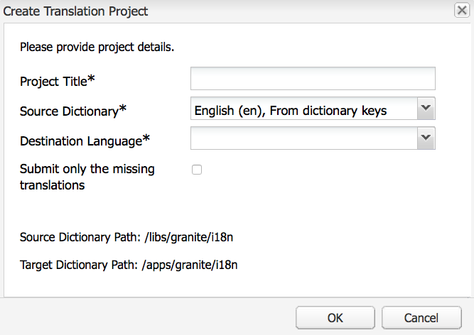
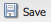

# 번역기를 사용하여 사전 관리{#using-translator-to-manage-dictionaries}

AEM은 구성 요소 UI에 사용된 텍스트의 다양한 번역 관리를 위한 콘솔을 제공합니다. 이 콘솔은 다음에서 사용할 수 있습니다.

`https://<hostname>:<port-number>/libs/cq/i18n/translator.html`

번역기 도구를 사용하여 영어 문자열과 번역을 관리합니다. 사전은 저장소에 생성됩니다(예: /apps/myproject/i18n).

번역기 도구 및 관리하는 사전은 구성 요소 UI를 다른 언어로 표시하는 데 사용됩니다. 페이지 또는 사용자가 생성한 컨텐츠를 번역하려면 다음을 참조하십시오 [다국어 사이트의 컨텐츠 번역](/help/sites-administering/translation.md) 및 [사용자 생성 컨텐츠 번역](/help/communities/translate-ugc.md).

>[!CAUTION]
>
>프로젝트에 대해 작성되고 아래에 있는 사전만 편집합니다 `/apps`.
>
>AEM 시스템 사전은 이 도구에서도 사용할 수 있습니다. AEM UI에 문제가 발생할 수 있으므로 AEM 시스템 사전을 변경하지 마십시오. 또한 업그레이드 시 변경 사항이 손실될 수 있습니다. AEM 시스템 사전은 `/libs`.

>[!NOTE]
>
>번역기 도구에는 클래식 UI 인터페이스가 있지만 해당 구문이 있는 인터페이스에 관계없이 구문을 번역하는 데 사용됩니다.

번역기는 AEM에서 사용되는 다양한 언어 번역과 함께 다음과 같이 나열합니다.


영어 및 번역된 텍스트를 검색, 필터링 및 편집할 수 있습니다. 번역하기 위해 사전을 XLIFF 형식으로 내보내고 다시 사전으로 가져올 수도 있습니다.

또한 이 콘솔에서 i18n 다이커너리 를 번역 프로젝트에 추가할 수도 있습니다. 새 프로젝트를 만들거나 기존 프로젝트에 추가할 수 있습니다.

1. 클릭 **번역 사전**.

   

1. 필요에 따라 만들기 또는 추가 옵션을 선택합니다. 대화 상자가 열립니다.

   

1. 필요에 따라 필드를 채우고 [확인]을 클릭합니다. 

1. 이제 을(를) 클릭합니다. **확인** 또는 Target 사전을 참조하십시오.

   >[!NOTE]
   >
   >번역 프로젝트에 대한 자세한 내용은 [번역 프로젝트 관리](/help/sites-administering/tc-manage.md).

## 사전 만들기 {#creating-a-dictionary}

현지화된 UI 문자열을 관리하기 위한 사전을 만듭니다. 사전을 만든 후 번역 도구를 사용하여 관리할 수 있습니다.

1. CRXDE Lite을 사용하여 루트 노드 추가( `sling:Folder`) 새 사전을 언어 정의를 저장할 구조로 만들 수 있습니다.

   ` /apps/<projectName>/i18n`

   예, `/apps/myProject/i18n`

1. 이 루트 아래에 필요한 언어 구조를 추가합니다. 예:

   ```shell
   /apps/myProject/i18n [sling:Folder]
       - de.json [nt:file] [mix:language]
           + jcr:language = de
       - fr.json [nt:file] [mix:language]
           + jcr:language = fr
   ```

   >[!NOTE]
   >
   >이것은 [Sling i18n 모듈](https://sling.apache.org/site/internationalization-support.html).

1. 번역기와 사전 경로를 다시 로드합니다(예: `/apps/myProject/i18n`)은 도구 모음의 드롭다운 선택기에서 사용할 수 있습니다. 문자열 및 해당 번역 추가를 시작하려면 이 옵션을 선택합니다.

   >[!NOTE]
   >
   >번역기는 경로 아래에 실제로 있는 언어(예: `/apps/myProject/i18n`).
   >
   >이러한 언어가 그리드에 표시된 언어에 해당하는지 확인합니다.

## 사전 문자열 관리 {#managing-dictionary-strings}

번역 도구를 사용하여 사전의 문자열을 관리합니다. 영어 문자열을 추가, 수정 및 제거하고 번역된 문자열을 제공할 수도 있습니다.

>[!CAUTION]
>
>프로젝트에 대해 작성되고 아래에 있는 사전만 편집합니다 `/apps`.
>
>AEM UI에 문제가 발생할 수 있으므로 AEM 시스템 사전을 변경하지 마십시오. 또한 업그레이드 시 변경 사항이 손실될 수 있습니다. AEM 시스템 사전은 `/libs`.

### 문자열 추가, 변경 및 제거 {#adding-changing-and-removing-strings}

구성 요소가 국제화된 사전에 영어 문자열을 추가합니다. 사용되지 않는 문자열을 번역하여 리소스를 낭비하지 않도록 국제화된 문자열만 추가합니다.

사전에 추가하는 문자열은 코드에 지정된 문자열과 정확히 일치해야 합니다. 코드에서 사용되는 기본 영어 문자열이 사전의 영어 문자열과 일치하지 않으면 필요할 때 번역된 문자열이 UI에 표시되지 않습니다. 문자열은 대/소문자를 구분합니다.

**번역 힌트 제공**

사전 문자열의 주석 속성을 사용하여 번역자에게 문자열의 의미를 명확히 할 수 있는 정보를 제공합니다. 일반적으로 UI는 사용자가 모호한 단어의 의미를 파악하는 데 도움이 됩니다. 그러나 번역기가 UI 컨텍스트 내에 문자열을 표시하지 않습니다. 번역 힌트는 모호성을 제거합니다. 예를 들어, 한 주석은 번역자가 영어 단어 Request 가 동사가 아닌 명사로 사용된다는 것을 이해하도록 도와줍니다.

번역 힌트는 또한 동일하고 다른 의미를 가지는 문자열을 구분합니다. 예를 들어, Search라는 단어는 명사나 동사일 수 있으며, 사전에서 두 개의 다른 번역 힌트가 있는 두 개의 &quot;Search&quot; 항목이 필요합니다. 문자열을 요청하는 코드에도 번역 힌트가 포함되어 있어 UI에서 올바른 문자열을 사용합니다.

**인덱싱된 변수 포함**

현지화된 문자열에 변수를 포함하여 문장에 컨텍스트 의미를 구축합니다. 예를 들어, 웹 애플리케이션에 로그인하면 홈 페이지에 &quot;Welcome back Administrator&quot;라는 메시지가 표시됩니다. 받은 편지함에 메시지가 2개 있습니다.&quot; 페이지 컨텍스트는 사용자 이름과 메시지 수를 결정합니다.

지역화된 문자열에 변수를 포함하려면 get 메서드의 첫 번째 인수에서 변수 위치에 대괄호로 묶인 인덱스를 배치합니다. 지역화 힌트를 사용하여 값을 설명합니다. 언어마다 다른 문장 구조를 사용하기 때문에 번역자가 변수의 의미를 이해해야 합니다.

참고 사항 [번역된 문자열을 요청하는 코드](/help/sites-developing/i18n-dev.md#including-variables-in-localized-sentences) 컨텍스트에 따라 인덱싱된 변수의 값을 제공합니다.

예를 들어, 사용자가 웹 사이트에 로그인하고 사전에 포함되는 경우 다음 문자열이 표시됩니다.

`Welcome back {0}. You have {1} messages.`

다음 주석에서는 변수를 설명합니다.

`{0} = the user name, {1} = the number of items in the user's inbox`

**문자열 수정**

코드에서 변경되거나 제거될 때 영어 문자열을 변경하거나 제거합니다. 문자열을 변경하면 원래 문자열이 지속되고 변경 사항을 반영하는 새 문자열이 만들어집니다. 문자열을 제거하기 전에 코드가 이 문자열을 사용하지 않는지 확인하십시오.

문자열을 추가하려면 다음 절차를 사용하십시오.

1. 사전 드롭다운 메뉴에서 문자열을 추가할 사전을 선택합니다. 드롭다운 메뉴에서 사전은 해당 경로에서 사전으로 표시됩니다.
1. 문자열 및 번역 테이블 위에서 추가를 클릭합니다.

   

1. 문자열 추가 대화 상자의 문자열 상자에 영어 문자열을 입력합니다. 필요한 경우 [주석] 상자에 번역기에 대한 번역 힌트를 입력합니다.
1. 확인을 클릭합니다.
1. 저장을 클릭합니다.

   

사전에서 문자열을 변경하려면 다음 절차를 따르십시오.

1. 사전 드롭다운 메뉴에서 변경할 문자열이 포함된 사전을 선택합니다.
1. 변경할 문자열을 두 번 클릭합니다.
1. 문자열 편집 대화 상자에서 문자열 수정 또는 주석(사본 작성)을 선택합니다.

   

1. 문자열 또는 주석을 수정하고 확인을 누릅니다.
1. 저장을 클릭합니다.

   

다음 절차를 사용하여 사전에서 문자열을 제거합니다.

1. 사전 드롭다운 메뉴에서 문자열을 제거할 사전을 선택합니다.
1. 제거를 클릭합니다.

   

1. 저장을 클릭합니다.

   

### 문자열 검색 {#searching-for-strings}

[번역기 도구] 하단의 검색 막대에서 문자열 선택 옵션을 제공합니다.

* **텍스트별 필터링:** 영어 문자열, 주석 또는 번역과 일치하는 패턴입니다. 패턴의 전체 또는 일부와 일치하는 항목만 테이블에 나타납니다.
* **변경 사항: 임의, 수정, 신규, 삭제:** 변경되고 저장되지 않은 항목을 표시합니다.

   * 임의: 수정, 추가 또는 제거된 항목을 표시합니다.
   * 수정됨: 변경된 항목을 표시합니다.
   * 새로운 기능: 추가된 항목을 표시합니다.
   * 삭제됨: 제거할 항목을 표시합니다.
   * 복수 선택: 선택한 모든 속성이 있는 항목을 표시합니다.

* **댓글 있음**: 변환기에 대한 주석이 있는 항목을 표시합니다.
* **누락된 번역:** 하나 이상의 언어에 번역이 없는 항목을 표시합니다.


1. 검색 막대에서 필터링 옵션을 선택합니다.
1. 옵션을 사용하여 필터링하려면 필터 를 클릭합니다.
1. 필터를 제거하고 사전에서 모든 항목을 보려면 지우기를 클릭합니다.

### 번역된 문자열 편집 {#editing-translated-strings}

영어 문자열을 사전에 추가한 후 문자열의 번역을 추가할 수 있습니다. 다음을 수행할 수도 있습니다 [사전 내보내기](/help/sites-developing/i18n-translator.md#exporting-a-dictionary) 제3자가 번역해 드립니다.

1. 선택 [프로젝트 특정 사전](#creating-a-dictionary) 변환 내용을 포함하는 저장소의 경로를 지정합니다. 예를 들어, **사전** 로서의:

   `/apps/myProject/i18n`

   >[!CAUTION]
   >
   >프로젝트에 대해 작성되고 아래에 있는 사전만 편집합니다 `/apps`.
   >
   >AEM 시스템 사전은 이 도구에서도 사용할 수 있습니다. AEM UI에 문제가 발생할 수 있으므로 AEM 시스템 사전을 변경하지 마십시오. 또한 업그레이드 시 변경 사항이 손실될 수 있습니다. AEM 시스템 사전은 `/libs`.

1. 문자열 중 하나에 대한 번역된 텍스트를 편집하려면 다음 중 하나를 수행할 수 있습니다.

   * 해당 단일 텍스트를 편집하려면 필요한 문자열에 대한 해당 언어를 두 번 클릭합니다.

   

   * 을(를) 두 번 클릭합니다. **문자열** 또는 **댓글** 필수 문자열을 여는 필드 **문자열 편집** 대화 상자에서 필요에 따라 번역을 편집한 다음 를 클릭합니다 **확인** 대화 상자를 닫으려면:

   

1. 클릭 **저장** 도구 모음에서 변경 사항을 커밋합니다.

   >[!NOTE]
   >
   >클릭 **재설정 및 새로 고침** ( 대신) **저장**)은 이전 텍스트의 변경 사항을 되돌립니다.

## 타사 번역기 사용 {#using-third-party-translators}

타사 번역 서비스 사용을 지원하기 위해 번역 도구를 사용하여 사전을 내보내고 가져올 수 있습니다.

### 사전 내보내기 {#exporting-a-dictionary}

사전을 XLIFF 파일로 내보내 타사 서비스에서 사전 문자열을 번역할 수 있습니다.

* 사전을 내보내고 영어 및 번역어를 포함합니다.
* 영어 문자열의 일부 또는 전부만 내보냅니다.

XLIFF 파일을 내보내고 언어를 포함하는 경우 리포지토리에 있는 사전의 노드 구조에 해당 언어가 포함되어야 합니다. 언어가 포함되지 않으면 오류가 발생합니다. 예를 들어 프랑스어 XLIFF 파일을 내보내려면 사전 폴더에 `mix:language` 이름이 지정된 하위 노드 `fr`. (자세한 내용은 [사전 만들기](/help/sites-developing/i18n-translator.md#creating-a-dictionary))

다음 절차를 사용하여 특정 언어의 XLIFF 파일을 내보냅니다.

1. 번역 도구 열기 `http://<host>:<port>/libs/cq/i18n/translator.html`
1. 사전 드롭다운 메뉴를 사용하여 내보낼 사전을 선택합니다.
1. 내보내기 > 전체 내보내기 를 클릭합니다 *XX* Xliff 옵션, 여기서 *XX* 는 DE 또는 FR과 같은 두 문자로 이루어진 언어 코드입니다.

   XLIFF 파일이 새 탭 또는 창에서 열립니다.

1. 웹 브라우저 명령을 사용하여 페이지를 파일 > 다른 이름으로 페이지 저장과 같이 파일 시스템에 파일로 저장합니다.

다음 절차를 사용하여 영어 문자열의 전부 또는 일부를 내보냅니다.

1. 번역 도구를 엽니다. `http://<host>:<port>/libs/cq/i18n/translator.html`
1. 사전 드롭다운 메뉴를 사용하여 내보낼 사전을 선택합니다.
1. 문자열의 하위 집합을 내보내는 경우 내보낼 사전의 항목을 선택합니다. 항목을 선택하지 않으면 모든 항목이 내보내집니다.
1. 내보내기 > 선택 항목을 Xliff(문자열만) 내보내기를 클릭합니다.
1. 대화 상자가 표시되면 텍스트를 복사하여 텍스트 파일에 붙여넣습니다.

### 사전 가져오기 {#importing-a-dictionary}

XLIFF 파일을 사전에 가져와서 사전을 채웁니다. 사전이 영어 문자열에 대한 번역을 포함하고 XLIFF 파일에 동일한 문자열에 대한 다른 번역이 포함되어 있으면 사전 번역이 대체됩니다.

1. 번역 도구 열기 `http://<host>:<port>/libs/cq/i18n/translator.html`
1. 가져오기 > XLIFF 번역을 클릭합니다.
1. 가져올 파일을 선택하고 확인을 클릭합니다.

## 지원되는 언어 관리 {#managing-supported-lanuages}

번역 도구가 지원하고 웹 페이지 사용자에게 제공하는 언어를 추가하거나 제거합니다.

### 사전 테이블에 나열된 언어 변경 {#changing-languages-listed-in-the-dictionary-table}

번역기 도구에는 사전 테이블에 다음 언어가 포함됩니다.

* de - 독일어
* fr - 프랑스어
* it - 이탈리아어
* es - 스페인어
* ja - 일본어
* pt-br - 브라질 포르투갈어
* zh-cn - 중국어 간체
* zh-tw - 중국어 번체(제한된 지원)
* ko-kr - 한국어

언어를 추가하거나 제거하려면 다음 절차를 따르십시오.

1. CRXDE Lite을 사용하여 새 노드를 만듭니다.

   `/etc/languages`

1. 이 노드에서 속성을 만듭니다.

   * **이름**: `languages`
   * **유형**: `Multi-String`
   * **값**: 표시할 언어 목록입니다. 예:

      * fr
      * es

   >[!NOTE]
   >
   >언어 코드는 소문자여야 합니다.

1. 클릭 **모두 저장** CRXDE Lite에서 번역기를 다시 로드합니다. 정의된 언어를 표시하도록 격자가 업데이트됩니다.

   >[!NOTE]
   >
   >번역기는 실제로 번역된 언어만 저장합니다 [사전에서](#creating-a-dictionary) (즉, 사전 경로 아래의 `/apps/myProject/i18n`).
   >
   >이러한 언어가 그리드에 표시된 언어에 해당하는지 확인합니다.

### 작성자가 사용 가능한 언어 만들기 {#making-languages-available-to-authors}

AEM 인스턴스에 새 언어로 사전을 정의한 후에는 작성자가 선택할 수 있도록(예: 에서 사용) 해야 합니다 **기본 설정**):

1. 사용 가능한 언어 목록을 변경하려면 **기본 설정** 의 **보안** 콘솔:

   1. 애플리케이션 코드에서 다음을 위한 오버레이를 만듭니다.

      ```
              /libs/cq/security/widgets/source/widgets/security/Preferences.js
       and update as required.
      ```

1. 에서 언어를 사용할 수 있도록 하려면 **기본 설정** 에서 **웹 사이트** 콘솔에서 응용 프로그램에서 다음 변경 작업을 수행해야 합니다.

   1. 다음 구조에 대한 오버레이를 만듭니다.

      `/libs/cq/security/content/tools/userProperties`

   1. 오버레이 내에서 다음 언어 목록을 업데이트합니다.

      `items/common/items /lang/options`

1. 모든 항목을 저장하고 적절한 콘솔을 다시 로드합니다.

### 언어 이름 및 기본 국가 변경 {#changing-language-names-and-default-countries}

여러 나라들은 같은 언어를 사용합니다. 예를 들어, 미국, 영국, 호주는 모두 영어를 사용합니다. 이는 다음과 같이 언어와 국가를 모두 나타내는 코드로 표시됩니다 `en_US`, `en_GB` 및 `en_AU`.

기본 국가는 플래그를 표시할 때(예: 언어 복사 대화 상자) 사용되며 언어 코드를 위해 국가를 해결하는 데 사용됩니다.

>[!NOTE]
>
>위의 번역기가 관리하는 현지화의 경우 정확한 언어만 작동합니다. 언어 기본 설정 드롭다운에서 을 사용하는 경우 `en_uk`: `en_uk` 사전이 있어야 합니다.

기본 정의를 변경하려면:

1. 언어 목록은 다음 위치에 저장됩니다.

   `/libs/wcm/core/resources/languages`

   다음을 복사하여 오버레이하십시오.

   `/apps/wcm/core/resources/languages`

   그런 다음 목록을 변경하거나 확장합니다. 속성 `defaultCountry` 언어 노드(예: `ja`)에는 다음과 같은 전체 코드가 포함되어야 합니다. `ja_jp`: `jp` 해당 언어의 기본 국가로서 `ja`.

1. 업데이트 **CQ WCM 언어 관리자**.

   * **언어 목록**:

      저장소의 언어 목록 경로입니다. 오버레이에 사용되는 위치로 설정합니다.

      ```
             /apps/wcm/core/resources/languages
      ```
   OSGi 웹 콘솔을 사용하여 다음을 수행할 수 있습니다.

   ```shell
   https://<hostname>:<port-number>/system/console/configMgr/com.day.cq.wcm.core.impl.LanguageManagerImpl
   ```

## 사전 게시 {#publishing-dictionaries}

AEM 애플리케이션의 릴리스 관리 프로세스에 사전을 통합합니다. 예를 들어, 게시 인스턴스에 배포할 응용 프로그램의 컨텐츠 패키지에 사전을 포함하십시오. 이 전략은 다음과 같은 이점을 제공합니다.

* 사전은 게시 환경의 구성 요소에 사용할 수 있습니다.
* 구성 요소 UI 문자열에 대한 변경 사항이 업데이트된 번역과 함께 배포됩니다.

마찬가지로 사전 문자열 테스트는 일반적인 소프트웨어 개발 수명 주기의 일부로 수행해야 합니다.

>[!NOTE]
>
>일반 게시 기능 또는 복제는 사전에 사용해서는 안 됩니다. 대신 dictionary는 코드 및 구성과 동일한 방식으로 처리되어야 합니다. 여기에는 소스 제어를 사용하여 변경 사항을 추적하고 컨텐츠 패키지를 사용하여 작성자 및 게시에 변경 사항을 적용하는 작업이 포함됩니다.

>[!NOTE]
>
>Dispatcher를 사용하는 경우 다음을 수행해야 합니다 [캐시된 페이지 무효화](https://helpx.adobe.com/experience-manager/dispatcher/using/page-invalidate.html) 렌더링된 구성 요소 문자열에 새 디시션 문자열을 포함하려면 다음을 수행하십시오.
