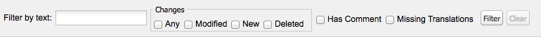

# 번역기를 사용하여 사전 관리{#using-translator-to-manage-dictionaries}

AEM은 구성 요소 UI에 사용된 텍스트의 다양한 번역을 관리하는 콘솔을 제공합니다. 이 콘솔은에서 사용할 수 있습니다.

`https://<hostname>:<port-number>/libs/cq/i18n/translator.html`

Translator 도구를 사용하여 영어 문자열 및 번역을 관리합니다. 사전은 저장소에 생성됩니다(예: /apps/myproject/i18n).

Translator 도구와 관리하는 사전은 구성 요소 UI를 다양한 언어로 제공하기 위한 것입니다. 페이지 또는 사용자 생성 콘텐츠를 번역하려면 다음을 참조하십시오. [다국어 사이트를 위한 콘텐츠 번역](/help/sites-administering/translation.md) 및 [사용자 생성 콘텐츠 번역](/help/communities/translate-ugc.md).

>[!CAUTION]
>
>프로젝트에 대해 만들어지고 아래에 있는 사전만 편집 `/apps`.
>
>AEM 시스템 사전도 이 도구에서 사용할 수 있습니다. AEM UI에 문제가 발생할 수 있으므로 AEM 시스템 사전을 변경하지 마십시오. 또한 업그레이드 시 변경 사항이 손실될 수 있습니다. AEM 시스템 사전은 아래에 있습니다. `/libs`.

>[!NOTE]
>
>번역기 도구에는 클래식 UI 인터페이스가 있지만, 해당 구문이 있는 인터페이스에 관계없이 구문 번역에 사용됩니다.

번역자는 AEM에서 사용되는 텍스트를 다양한 언어 번역과 함께 나란히 나열합니다.


영문과 번역문을 검색하고 필터링하여 편집할 수 있다. 사전을 XLIFF 형식으로 내보내 번역한 다음 다시 사전으로 가져올 수도 있습니다.

이 콘솔에서 번역 프로젝트에 i18n 사전을 추가할 수도 있습니다. 하나를 만들거나 기존 프로젝트에 추가할 수 있습니다.

1. 클릭 **사전 번역**.

   

1. 필요에 따라 만들기 또는 추가 옵션을 선택합니다. 대화 상자가 열립니다.

   

1. 필요에 따라 필드를 채우고 확인을 클릭합니다. 

1. 이제 다음을 클릭할 수 있습니다. **확인** 또는 Target 사전을 참조하십시오.

   >[!NOTE]
   >
   >번역 프로젝트에 대한 자세한 내용은 을 참조하십시오. [번역 프로젝트 관리](/help/sites-administering/tc-manage.md).

## 사전 만들기 {#creating-a-dictionary}

현지화된 UI 문자열을 관리하기 위한 사전을 만드십시오. 사전을 만든 후 번역 도구를 사용하여 사전을 관리할 수 있습니다.

1. CRXDE Lite을 사용하여 루트 노드( `sling:Folder`)를 사용하여 새 사전을 언어 정의를 저장할 구조로 만듭니다.

   ` /apps/<projectName>/i18n`

   예, `/apps/myProject/i18n`

1. 이 루트 아래에 필요한 언어 구조를 추가합니다. 예:

   ```shell
   /apps/myProject/i18n [sling:Folder]
       - de.json [nt:file] [mix:language]
           + jcr:language = de
       - fr.json [nt:file] [mix:language]
           + jcr:language = fr
   ```

   >[!NOTE]
   >
   >다음은 의 구조입니다. [Sling i18n 모듈](https://sling.apache.org/site/internationalization-support.html).

1. 번역기 및 사전 경로 다시 로드(예: `/apps/myProject/i18n`)은 도구 모음의 드롭다운 선택기에서 사용할 수 있습니다. 문자열 및 해당 번역을 추가하려면 선택하십시오.

   >[!NOTE]
   >
   >번역자는 실제로 경로 아래에 있는 언어의 번역만 저장합니다(예: `/apps/myProject/i18n`).
   >
   >이러한 언어가 격자에 표시된 언어에 해당하는지 확인하십시오.

## 사전 문자열 관리 {#managing-dictionary-strings}

[번역 도구]를 사용하여 사전의 문자열을 관리합니다. 영어 문자열을 추가, 수정 및 제거하고 번역된 문자열을 제공할 수 있습니다.

>[!CAUTION]
>
>프로젝트에 대해 만들어지고 아래에 있는 사전만 편집 `/apps`.
>
>AEM UI에 문제가 발생할 수 있으므로 AEM 시스템 사전을 변경하지 마십시오. 또한 업그레이드 시 변경 사항이 손실될 수 있습니다. AEM 시스템 사전은 아래에 있습니다. `/libs`.

### 문자열 추가, 변경 및 제거 {#adding-changing-and-removing-strings}

구성 요소가 국제화된 사전에 영어 문자열을 추가합니다. 사용되지 않는 문자열을 번역하여 리소스를 낭비하지 않도록 국제화된 문자열만 추가합니다.

사전에 추가하는 문자열은 코드에 지정된 문자열과 정확히 일치해야 합니다. 코드에 사용된 기본 영어 문자열이 사전의 영어 문자열과 일치하지 않으면 번역된 문자열이 필요한 경우 UI에 표시되지 않습니다. 문자열은 대소문자를 구분합니다.

**번역 힌트 제공**

번역자에게 정보를 제공하여 문자열의 의미를 명확하게 할 수 있도록 사전 문자열의 Compenet 속성을 사용합니다. 일반적으로 UI는 모호한 단어의 의미를 사용자가 결정할 수 있도록 돕는다. 단, 번역자는 UI의 컨텍스트 내에서 문자열을 볼 수 없습니다. 번역 힌트는 모호성을 제거합니다. 예를 들어, 댓글은 번역자가 영어 단어 Request가 동사가 아닌 명사로 사용된다는 것을 이해하는 데 도움이 됩니다.

번역 힌트도 동일한 문자열과 다른 의미를 가지는 문자열을 구별합니다. 예를 들어, 단어 Search는 명사 또는 동사일 수 있으며, 사전에서 두 개의 다른 번역 힌트가 있는 두 개의 &quot;Search&quot; 항목이 필요합니다. 문자열을 요청하는 코드에는 번역 힌트도 포함되어 있으므로 UI에서 올바른 문자열을 사용할 수 있습니다.

**인덱싱된 변수 포함**

문장에 컨텍스트 의미를 만들려면 지역화된 문자열에 변수를 포함하십시오. 예를 들어 웹 애플리케이션에 로그인하면 홈 페이지에 &quot;다시 관리자를 시작합니다&quot;라는 메시지가 표시됩니다. 받은 편지함에 2개의 메시지가 있습니다.&quot; 페이지 컨텍스트에 따라 사용자 이름과 메시지 수가 결정됩니다.

지역화된 문자열에 변수를 포함하려면 get 메서드의 첫 번째 인수에서 변수 위치에 괄호로 묶인 인덱스를 배치합니다. 현지화 힌트를 사용하여 값을 설명합니다. 언어마다 문장 구조가 다르기 때문에 번역자는 변수의 의미를 이해해야 한다.

참고: [번역된 문자열을 요청하는 코드](/help/sites-developing/i18n-dev.md#including-variables-in-localized-sentences) 는 컨텍스트에 따라 인덱싱된 변수의 값을 제공합니다.

예를 들어, 다음 문자열은 사용자가 웹 사이트에 로그인할 때 나타나며 사전에 포함됩니다.

`Welcome back {0}. You have {1} messages.`

다음 주석은 변수에 대해 설명합니다.

`{0} = the user name, {1} = the number of items in the user's inbox`

**문자열 수정**

코드에서 영어 문자열이 변경되거나 제거되면 해당 문자열을 변경하거나 제거합니다. 문자열을 변경하면 원래 문자열은 지속되고 변경 사항을 반영하는 새 문자열이 만들어집니다. 문자열을 제거하기 전에 해당 문자열을 사용하는 코드가 없는지 확인하십시오.

다음 절차에 따라 문자열을 추가합니다.

1. 사전 드롭다운 메뉴에서 문자열을 추가할 사전을 선택합니다. 드롭다운 메뉴에서 사전은 저장소의 경로로 표시됩니다.
1. 문자열 및 번역 테이블 위에서 추가를 클릭합니다.

   

1. 문자열 추가 대화 상자의 문자열 상자에 영어 문자열을 입력합니다. 주석 상자에 필요한 경우 번역자용 번역 힌트를 입력합니다.
1. 확인을 클릭합니다.
1. 저장을 클릭합니다.

   

사전의 문자열을 변경하려면 다음 절차를 따르십시오.

1. 사전 드롭다운 메뉴에서 변경할 문자열이 포함된 사전을 선택합니다.
1. 변경할 문자열을 두 번 클릭합니다.
1. 문자열 편집 대화 상자에서 문자열 수정 또는 주석(복사본 작성)을 선택합니다.

   

1. 문자열 또는 주석을 수정하고 [확인]을 클릭합니다.
1. 저장을 클릭합니다.

   

다음 절차에 따라 사전에서 문자열을 제거합니다.

1. 사전 드롭다운 메뉴에서 문자열을 제거할 사전을 선택합니다.
1. 제거를 클릭합니다.

   

1. 저장을 클릭합니다.

   

### 문자열 검색 중 {#searching-for-strings}

Translator 도구 하단의 검색 표시줄은 문자열 선택 옵션을 제공합니다.

* **텍스트로 필터링:** 영어 문자열, 댓글 또는 번역과 일치하는 패턴입니다. 패턴 전체 또는 일부와 일치하는 항목만 테이블에 나타납니다.
* **변경 사항: 모두, 수정됨, 신규, 삭제됨:** 변경되었지만 저장되지 않은 항목을 표시합니다.

   * 임의: 수정, 추가 또는 제거된 항목을 표시합니다.
   * 수정됨: 변경된 항목을 표시합니다.
   * 새로 만들기: 추가된 항목을 표시합니다.
   * 삭제됨: 제거할 항목을 표시합니다.
   * 다중 선택: 선택한 모든 속성이 있는 항목을 표시합니다.

* **댓글 있음**: 번역자에 대한 주석이 있는 항목을 표시합니다.
* **누락된 번역:** 하나 이상의 언어에 번역이 없는 항목을 표시합니다.



1. 검색 창에서 필터링 옵션을 선택합니다.
1. 옵션을 사용하여 필터링하려면 필터를 클릭합니다.
1. 필터를 제거하고 사전의 모든 항목을 보려면 지우기를 클릭합니다.

### 번역된 문자열 편집 {#editing-translated-strings}

사전에 영어 문자열을 추가한 후 문자열의 번역을 추가할 수 있습니다. 다음을 수행할 수도 있습니다. [사전 내보내기](/help/sites-developing/i18n-translator.md#exporting-a-dictionary) 타사에서 번역할 수 있습니다.

1. 선택 [프로젝트 특정 사전](#creating-a-dictionary) 변환을 보관하는 저장소의 경로를 지정합니다. 예를 들어 을 선택합니다. **사전** 다음으로:

   `/apps/myProject/i18n`

   >[!CAUTION]
   >
   >프로젝트에 대해 만들어지고 아래에 있는 사전만 편집 `/apps`.
   >
   >AEM 시스템 사전도 이 도구에서 사용할 수 있습니다. AEM UI에 문제가 발생할 수 있으므로 AEM 시스템 사전을 변경하지 마십시오. 또한 업그레이드 시 변경 사항이 손실될 수 있습니다. AEM 시스템 사전은 아래에 있습니다. `/libs`.

1. 문자열 중 하나에 대한 번역된 텍스트를 편집하려면 다음 중 하나를 수행할 수 있습니다.

   * 필요한 문자열에 해당하는 언어를 두 번 클릭하여 해당 단일 텍스트를 편집합니다.

   

   * 를 두 번 클릭합니다. **문자열** 또는 **댓글** 를 여는 데 필요한 문자열 필드 **문자열 편집** 대화 상자에서 필요에 따라 번역을 편집한 다음 **확인** 대화 상자를 닫으려면:

   

1. 클릭 **저장** 을 클릭하여 변경 내용을 커밋합니다.

   >[!NOTE]
   >
   >클릭 중 **재설정 및 새로 고침** (대신) **저장**) 이전 텍스트의 모든 변경 사항을 되돌립니다.

## 서드파티 번역기 사용 {#using-third-party-translators}

서드파티 번역 서비스 사용을 지원하기 위해 번역 도구를 사용하여 사전을 내보내고 가져올 수 있습니다.

### 사전 내보내기 {#exporting-a-dictionary}

사전을 XLIFF 파일로 내보내 서드파티 서비스에서 사전 문자열을 번역할 수 있도록 합니다.

* 사전을 내보내고 언어에 대한 영어 및 번역된 용어를 포함하십시오.
* 일부 또는 모든 영문 문자열만 내보냅니다.

XLIFF 파일을 내보내고 언어를 포함할 때 저장소에 있는 사전의 노드 구조에 해당 언어가 포함되어야 합니다. 언어가 포함되지 않으면 오류가 발생합니다. 예를 들어 프랑스어 XLIFF 파일을 내보내려면 사전 폴더에 `mix:language` 라는 하위 노드 `fr`. (참조: [사전 만들기](/help/sites-developing/i18n-translator.md#creating-a-dictionary).)

다음 절차를 사용하여 특정 언어에 대한 XLIFF 파일을 내보냅니다.

1. 번역 도구 열기 `http://<host>:<port>/libs/cq/i18n/translator.html`
1. 사전 드롭다운 메뉴를 사용하여 내보낼 사전을 선택합니다.
1. 내보내기 > 전체 내보내기 를 클릭합니다. *XX* Xliff 옵션, 여기서 *XX* 는 DE 또는 FR과 같은 두 문자 언어 코드입니다.

   XLIFF 파일이 새 탭이나 창에 열립니다.

1. 웹 브라우저 명령을 사용하여 페이지를 파일 > 다른 이름으로 페이지 저장과 같은 파일 시스템의 파일로 저장합니다.

다음 절차를 사용하여 영문 문자열의 전부 또는 일부만 내보냅니다.

1. 번역 도구를 엽니다. `http://<host>:<port>/libs/cq/i18n/translator.html`
1. 사전 드롭다운 메뉴를 사용하여 내보낼 사전을 선택합니다.
1. 문자열의 하위 집합을 내보내는 경우 사전에서 내보낼 항목을 선택합니다. 항목 없음을 선택하면 모든 항목이 내보내집니다.
1. 내보내기 > 선택 항목을 Xliff로 내보내기(문자열만 해당)를 클릭합니다.
1. 표시되는 대화 상자에서 텍스트를 복사하여 텍스트 파일에 붙여넣습니다.

### 사전 가져오기 {#importing-a-dictionary}

XLIFF 파일을 사전으로 가져와서 사전을 채웁니다. 사전에 영어 문자열에 대한 번역이 포함되어 있고 XLIFF 파일에 동일한 문자열에 대한 다른 번역이 포함되어 있는 경우 사전 번역이 대체됩니다.

1. 번역 도구 열기 `http://<host>:<port>/libs/cq/i18n/translator.html`
1. 가져오기 > XLIFF 번역 을 클릭합니다.
1. 가져올 파일을 선택하고 [확인]을 클릭합니다.

## 지원되는 언어 관리 {#managing-supported-lanuages}

번역 도구가 지원하고 웹 페이지 사용자에게 제공된 언어를 추가하거나 제거합니다.

### 사전 테이블에 나열된 언어 변경 {#changing-languages-listed-in-the-dictionary-table}

번역기 도구에는 사전 테이블에 다음 언어가 포함되어 있습니다.

* de - 독일어
* fr - 프랑스어
* it - 이탈리아어
* es - 스페인어
* ja - 일본어
* pt-br - 포르투갈어(브라질)
* zh-cn - 중국어 간체
* zh-tw - 중국어 번체(제한적 지원)
* ko-kr - 한국어

언어를 추가하거나 제거하려면 다음 절차를 따르십시오.

1. CRXDE Lite을 사용하여 노드를 만듭니다.

   `/etc/languages`

1. 이 노드에서 속성을 만듭니다.

   * **이름**: `languages`
   * **유형**: `Multi-String`
   * **값**: 표시할 언어 목록입니다. 예:

      * fr
      * es

   >[!NOTE]
   >
   >언어 코드는 소문자여야 합니다.

1. 클릭 **모두 저장** CRXDE Lite 후 번역기를 다시 로드합니다. 격자가 업데이트되어 정의된 언어를 표시합니다.

   >[!NOTE]
   >
   >번역자는 실제로 존재하는 언어의 번역만 저장합니다. [사전에 있음](#creating-a-dictionary) (즉, 다음과 같은 사전 경로 아래) `/apps/myProject/i18n`).
   >
   >이러한 언어가 격자에 표시된 언어에 해당하는지 확인하십시오.

### 작성자가 사용할 수 있는 언어 만들기 {#making-languages-available-to-authors}

AEM 인스턴스의 새로운 언어에 대한 사전을 정의한 후에 작성자가 이를 선택할 수 있도록 해야 합니다(예:에서 사용할 수 있도록) **환경 설정**):

1. 사용 가능한 언어 목록을 변경하려면 **환경 설정** / **보안** 콘솔:

   1. 다음에 대한 애플리케이션 코드에 오버레이를 만듭니다.

      ```
              /libs/cq/security/widgets/source/widgets/security/Preferences.js
       and update as required.
      ```

1. 에서 사용할 수 있는 언어 만들기 **환경 설정** 다음에서 **웹 사이트** 콘솔 응용 프로그램에서 다음 사항을 변경해야 합니다.

   1. 다음 아래에 구조에 대한 오버레이를 만듭니다.

      `/libs/cq/security/content/tools/userProperties`

   1. 오버레이 내에서 아래의 언어 목록을 업데이트합니다.

      `items/common/items /lang/options`

1. 모든 내용을 저장하고 적절한 콘솔을 다시 로드합니다.

### 언어 이름 및 기본 국가 변경 {#changing-language-names-and-default-countries}

미국, 영국, 호주 등이 모두 영어를 사용하는 등 다양한 국가에서 동일한 언어를 사용하고 있다. 이는 다음과 같이 언어와 국가를 모두 나타내는 코드로 표시됩니다. `en_US`, `en_GB` 및 `en_AU`.

기본 국가는 플래그를 표시할 때(예: 언어 복사 대화 상자에서) 언어 코드의 국가를 확인하는 데 사용됩니다.

>[!NOTE]
>
>위의 번역자가 관리하는 현지화의 경우 정확한 언어만 작동합니다. 언어 환경 설정 드롭다운에서 `en_uk`, 다음 항목이 있어야 합니다. `en_uk` 사전을 저장소에 추가합니다.

기본 정의를 변경하려면 다음을 수행합니다.

1. 언어 목록은 다음 아래에 저장됩니다.

   `/libs/wcm/core/resources/languages`

   다음 위치에 복사하여 오버레이합니다.

   `/apps/wcm/core/resources/languages`

   그런 다음 목록을 변경하거나 확장합니다. 속성 `defaultCountry` 언어 노드(예: `ja`)에는 다음과 같은 전체 코드가 포함되어야 합니다. `ja_jp`, 다음을 정의합니다. `jp` 를 언어의 기본 국가로 사용 `ja`.

1. 업데이트 **CQ WCM 언어 관리자**.

   * **언어 목록**:

     저장소의 언어 목록 경로. 오버레이에 사용되는 위치로 설정합니다.

     ```
            /apps/wcm/core/resources/languages
     ```

   OSGi 웹 콘솔을 사용하여 이 작업을 수행할 수 있습니다.

   ```shell
   https://<hostname>:<port-number>/system/console/configMgr/com.day.cq.wcm.core.impl.LanguageManagerImpl
   ```

## 사전 게시 {#publishing-dictionaries}

사전을 AEM 애플리케이션의 릴리스 관리 프로세스에 통합합니다. 예를 들어 게시 인스턴스에 배포하기 위해 애플리케이션의 콘텐츠 패키지에 사전을 포함합니다. 이 전략은 다음과 같은 이점을 제공합니다.

* 사전은 게시 환경의 구성 요소에 사용할 수 있습니다.
* 구성 요소 UI 문자열에 대한 변경 사항은 업데이트된 번역과 함께 배포됩니다.

마찬가지로 사전 문자열 테스트는 일반적인 소프트웨어 개발 수명 주기의 일부로 수행해야 합니다.

>[!NOTE]
>
>사전의 경우 일반 게시 기능이나 복제를 사용하지 마십시오. 대신 사전은 코드 및 구성과 동일한 방식으로 처리되어야 합니다. 여기에는 소스 제어를 사용하여 변경 사항을 추적하고 컨텐츠 패키지를 사용하여 작성 및 게시에 변경 사항을 적용하는 작업이 포함됩니다.

>[!NOTE]
>
>Dispatcher를 사용할 때 다음을 수행해야 합니다. [캐시된 페이지 무효화](https://helpx.adobe.com/experience-manager/dispatcher/using/page-invalidate.html) 렌더링된 구성 요소 문자열에 새 사전 문자열을 포함합니다.
