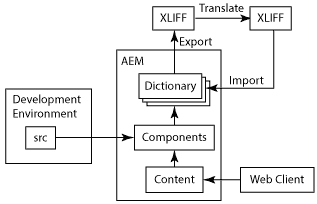

# 구성 요소 다국어화{#internationalizing-components}

구성 요소 및 대화 상자를 현지화하여 UI 문자열을 다른 언어로 표시할 수 있습니다. 국제화용으로 설계된 구성 요소를 사용하면 UI 문자열을 외부화하고 번역한 다음 저장소로 가져올 수 있습니다. 런타임 시 사용자의 언어 환경 설정 또는 페이지 로케일은 UI에 표시되는 언어를 결정합니다.

다음 프로세스를 사용하여 구성 요소를 국제화하고 UI를 다른 언어로 제공합니다.

1. [문자열을 국제화하는 코드를 사용하여 구성 요소를 구현합니다.](/help/sites-developing/i18n-dev.md) 코드에서 번역할 문자열을 식별하고 런타임에 표시할 언어를 선택합니다.
1. [사전을 ](/help/sites-developing/i18n-translator.md#creating-a-dictionary) 만들고   번역할 영어 문자열을 추가합니다.

1.  사전을 XLIFF 형식으로 내보내고, 문자열을   번역한 다음 XLIFF 파일을 다시 AEM으로 가져옵니다. 또는 사전에 [수동으로 번역](/help/sites-developing/i18n-translator.md#editing-translated-strings)을 추가할 수 있습니다.

1. [사전을 애플리케이션의 릴리스 관리 프로세스에 통합합니다](/help/sites-developing/i18n-translator.md#publishing-dictionaries).

>[!NOTE]
>
>구성 요소를 국제화하기 위해 여기에 설명된 방법은 정적 문자열을 번역하기 위한 것입니다. 구성 요소 문자열을 변경해야 하는 경우 기존 번역 워크플로우를 사용해야 합니다. 예를 들어 작성자가 구성 요소의 편집 대화 상자에서 속성을 사용하여 UI 문자열을 편집할 수 있는 경우 언어 사전을 사용하여 문자열을 국제화하면 안 됩니다.

## 언어 사전 {#language-dictionaries}

AEM 국제화 프레임워크는 저장소의 사전을 사용하여 영어 문자열과 번역을 다른 언어로 저장합니다. 프레임워크는 영어를 기본 언어로 사용합니다. 문자열은 영어 버전을 사용하여 식별됩니다. 일반적으로 국제화 프레임워크는 UI 문자열에 영숫자 ID를 사용합니다. 문자열의 영어 버전을 ID로 사용하면 다음과 같은 몇 가지 이점이 있습니다.

* 코드는 읽기 쉽습니다.
* 기본 언어는 항상 사용할 수 있습니다.

현지화된 문자열은 저장소의 여러 사전에 저장할 수 있습니다. AEM 시스템 사전은 `/libs` 노드 아래에 있습니다. 구성 요소에 대한 사전을 `/apps` 노드 아래에 만들 수 있습니다. AEM 국제화 프레임워크는 사전을 결합하고 Sling에서 단일 `ResourceBundle` 개체로 사용할 수 있도록 합니다. 구성 요소를 렌더링하면 리소스 번들에서 번역된 문자열을 검색합니다. 결합된 사전은 웹 서버에도 JSON 형식으로 배포되어 웹 페이지에서 Javascript 코드에 번역된 문자열을 제공합니다.

또한 [번역 도구](/help/sites-developing/i18n-translator.md)를 사용하면 하나의 중앙 위치에서 모든 사전을 관리할 수 있습니다.

>[!NOTE]
>
>`/libs` 노드 아래에 있는 AEM 시스템 사전을 수정하지 마십시오.

### 시스템 사전의 문자열 오버레이 {#overlaying-strings-in-system-dictionaries}

`/apps` 노드 아래의 사전의 문자열은 `/libs` 노드 아래에 있는 사전의 중복 문자열을 무시합니다. 구성 요소가 AEM 시스템 사전에 포함된 문자열을 사용하는 경우 자체 사전에서 문자열을 복제합니다. 모든 구성 요소가 사전의 문자열을 사용합니다.

`/apps` 노드 아래에 있는 모든 사전에서 문자열을 복제할 때 사용되는 번역을 예측할 수 없습니다.
