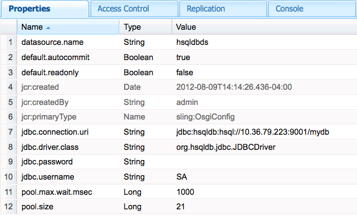

# SQL 데이터베이스에 연결{#connecting-to-sql-databases}

CQ 애플리케이션이 데이터와 상호 작용할 수 있도록 외부 SQL 데이터베이스에 액세스합니다.

1. [JDBC 드라이버 패키지를 내보내는 OSGi 번들을 만들거나 가져옵니다](#bundling-the-jdbc-database-driver).
1. [JDBC 데이터 소스 풀 공급자를 구성합니다](#configuring-the-jdbc-connection-pool-service).
1. [데이터 소스 개체를 가져와 코드에 연결을 만듭니다](#connecting-to-the-database).

## JDBC 데이터베이스 드라이버 번들로 묶기 {#bundling-the-jdbc-database-driver}

일부 데이터베이스 공급업체는 OSGi 번들에 JDBC 드라이버를 제공합니다(예: [MySQL](https://www.mysql.com/downloads/connector/j/)). 데이터베이스의 JDBC 드라이버를 OSGi 번들로 사용할 수 없는 경우 드라이버 JAR를 가져와서 OSGi 번들로 래핑합니다. 번들은 데이터베이스 서버와 상호 작용하는 데 필요한 패키지를 내보내야 합니다. 번들은 참조하는 패키지를 가져와야 합니다.

다음 예에서는 Maven](https://felix.apache.org/site/apache-felix-maven-bundle-plugin-bnd.html)용 [번들 플러그인을 사용하여 OSGi 번들의 HSQLDB 드라이버를 래핑합니다. POM은 플러그인에 종속성으로 식별되는 hsqldb.jar 파일을 포함하도록 지시합니다. 모든 org.hsqldb 패키지가 내보내집니다.

이 플러그인은 가져올 패키지를 자동으로 결정하고 번들의 MANIFEST.MF 파일에 나열합니다. CQ 서버에서 패키지를 사용할 수 없는 경우 설치 시 번들이 시작되지 않습니다. 다음과 같은 두 가지 가능한 솔루션이 있습니다.

* 패키지가 선택 사항임을 POM에 표시합니다. JDBC 연결에 패키지 멤버가 실제로 필요하지 않은 경우 이 솔루션을 사용합니다. 다음 예제와 같이 Import-Package 요소를 사용하여 선택적 패키지를 지정합니다.

   `<Import-Package>org.jboss.*;resolution:=optional,*</Import-Package>`
* 패키지를 내보내는 OSGi 번들의 패키지가 포함된 JAR 파일을 둘러싸서 번들을 배포합니다. 이 솔루션은 코드 실행 중에 패키지 멤버가 필요할 때 사용합니다.

소스 코드에 대한 지식을 통해 사용할 솔루션을 결정할 수 있습니다. 솔루션을 검증하기 위해 솔루션 중 하나를 시도하고 테스트를 수행할 수도 있습니다.

### hsqldb.jar {#pom-that-bundles-hsqldb-jar}을 번들로 제공하는 POM

```xml
<project xmlns="https://maven.apache.org/POM/4.0.0"
  xmlns:xsi="https://www.w3.org/2001/XMLSchema-instance"
  xsi:schemaLocation="https://maven.apache.org/POM/4.0.0 https://maven.apache.org/xsd/maven-4.0.0.xsd">
  <modelVersion>4.0.0</modelVersion>

  <groupId>com.adobe.example.myapp</groupId>
  <artifactId>hsqldb-jdbc-driver-bundle</artifactId>
  <version>0.0.1-SNAPSHOT</version>
  <name>wrapper-bundle-hsqldb-driver</name>
  <url>www.adobe.com</url>
  <description>Exports the HSQL JDBC driver</description>
  <packaging>bundle</packaging>
  <properties>
    <project.build.sourceEncoding>UTF-8</project.build.sourceEncoding>
  </properties>
  <build>
    <plugins>
      <plugin>
        <groupId>org.apache.felix</groupId>
        <artifactId>maven-bundle-plugin</artifactId>
        <version>1.4.3</version>
        <extensions>true</extensions>
        <configuration>
         <instructions>
            <Embed-Dependency>*</Embed-Dependency>
            <_exportcontents>org.hsqldb.*</_exportcontents>
          </instructions>
        </configuration>
      </plugin>
    </plugins>
  </build>
  <dependencies>
    <dependency>
      <groupId>hsqldb</groupId>
      <artifactId>hsqldb</artifactId>
      <version>2.2.9</version>
    </dependency>
  </dependencies>
</project>
```

다음 링크를 클릭하면 일부 인기 있는 데이터베이스 제품의 다운로드 페이지가 열립니다.

* [Microsoft SQL Server](https://www.microsoft.com/en-us/download/details.aspx?displaylang=en&amp;id=11774)
* [Oracle](https://www.oracle.com/technetwork/database/features/jdbc/index-091264.html)
* [IBM DB2](https://www-01.ibm.com/support/docview.wss?uid=swg27007053)

### JDBC 접속 풀 서비스 구성 {#configuring-the-jdbc-connection-pool-service}

JDBC 드라이버를 사용하여 데이터 소스 객체를 생성하는 JDBC 접속 풀 서비스에 대한 구성을 추가합니다. 응용 프로그램 코드에서는 이 서비스를 사용하여 개체를 얻고 데이터베이스에 연결합니다.

JDBC 접속 풀( `com.day.commons.datasource.jdbcpool.JdbcPoolService`)은 팩토리 서비스입니다. 읽기 전용 또는 읽기/쓰기 액세스 등의 다른 속성을 사용하는 연결이 필요한 경우 여러 구성을 만듭니다.

CQ를 사용하여 작업하는 경우 이러한 서비스에 대한 구성 설정을 관리하는 방법에는 몇 가지가 있습니다.자세한 내용은 [OSGi](/help/sites-deploying/configuring-osgi.md) 구성을 참조하십시오.

다음 속성을 사용하여 풀링된 연결 서비스를 구성할 수 있습니다. 속성 이름은 웹 콘솔에 나타나는 대로 나열됩니다. `sling:OsgiConfig` 노드의 해당 이름이 괄호 안에 표시됩니다. HSQLDB 서버와 `mydb`의 별칭이 있는 데이터베이스에 대한 예제 값이 표시됩니다.

* JDBC 드라이버 클래스( `jdbc.driver.class`):java.sql.Driver 인터페이스를 구현하는 데 사용할 Java 클래스(예: `org.hsqldb.jdbc.JDBCDriver`). 데이터 형식은 `String`입니다.

* JDBC 연결 URI( `jdbc.connection.uri`):연결을 만드는 데 사용할 데이터베이스의 URL(예: `jdbc:hsqldb:hsql//10.36.79.223:9001/mydb`). URL의 형식은 java.sql.DriverManager 클래스의 getConnection 메서드와 함께 사용할 수 있어야 합니다. 데이터 형식은 `String`입니다.

* 사용자 이름( `jdbc.username`):데이터베이스 서버에 인증하는 데 사용할 사용자 이름입니다. 데이터 형식은 `String`입니다.

* 암호( `jdbc.password`):사용자 인증에 사용할 암호입니다. 데이터 형식은 `String`입니다.

* 유효성 검사 쿼리( `jdbc.validation.query`):연결이 성공했는지 확인하는 데 사용할 SQL 문(예: `select 1 from INFORMATION_SCHEMA.SYSTEM_USERS`). 데이터 형식은 `String`입니다.

* 기본적으로 읽기 전용(default.readonly):연결에 읽기 전용 액세스 권한을 제공하려면 이 옵션을 선택합니다. 데이터 형식은 `Boolean`입니다.
* 기본적으로 자동 커밋( `default.autocommit`):데이터베이스에 전송된 각 SQL 명령에 대해 별도의 트랜잭션을 생성하고 각 트랜잭션이 자동으로 커밋되도록 하려면 이 옵션을 선택합니다. 코드에서 트랜잭션을 명시적으로 커밋할 때는 이 옵션을 선택하지 마십시오. 데이터 형식은 `Boolean`입니다.

* 풀 크기( `pool.size`):데이터베이스에서 사용할 수 있는 동시 연결 수입니다. 데이터 형식은 `Long`입니다.

* 풀 대기( `pool.max.wait.msec`):연결 요청이 시간 초과되기 전의 시간입니다. 데이터 형식은 `Long`입니다.

* 데이터 소스 이름( `datasource.name`):이 데이터 소스의 이름입니다. 데이터 형식은 `String`입니다.

* 추가 서비스 속성( `datasource.svc.properties`):연결 URL에 추가할 이름/값 쌍 집합. 데이터 형식은 `String[]`입니다.

JDBC 접속 풀 서비스는 팩터리입니다. 따라서 `sling:OsgiConfig` 노드를 사용하여 연결 서비스를 구성하는 경우 노드 이름에 팩토리 서비스 PID 뒤에 *`-alias`*&#x200B;가 와야 합니다. 사용하는 별칭은 해당 PID에 대한 모든 구성 노드에 대해 고유해야 합니다. 예제 노드 이름은 `com.day.commons.datasource.jdbcpool.JdbcPoolService-myhsqldbpool`입니다.



### 데이터베이스 {#connecting-to-the-database}에 연결

Java 코드에서 DataSourcePool 서비스를 사용하여 만든 구성에 대해 `javax.sql.DataSource` 개체를 가져옵니다. DataSourcePool 서비스는 지정된 데이터 소스 이름에 대해 `DataSource` 개체를 반환하는 `getDataSource` 메서드를 제공합니다. 메소드 인수로 JDBC 연결 풀 구성에 대해 지정한 데이터 소스 이름(또는 `datasource.name`) 속성 값을 사용합니다.

다음 JSP 코드는 hsqldbds 데이터 소스의 인스턴스를 입수하고 간단한 SQL 쿼리를 실행하며 반환되는 결과 수를 표시합니다.

#### 데이터베이스 조회를 수행하는 JSP{#jsp-that-performs-a-database-lookup}

```java
<%@include file="/libs/foundation/global.jsp"%><%
%><%@page session="false"%><%
%><%@ page import="com.day.commons.datasource.poolservice.DataSourcePool" %><%
%><%@ page import="javax.sql.DataSource" %><%
%><%@ page import="java.sql.Connection" %><%
%><%@ page import="java.sql.SQLException" %><%
%><%@ page import="java.sql.Statement" %><%
%><%@ page import="java.sql.ResultSet"%><%
%><html>
<cq:include script="head.jsp"/>
<body>
<%DataSourcePool dspService = sling.getService(DataSourcePool.class);
  try {
     DataSource ds = (DataSource) dspService.getDataSource("hsqldbds");
     if(ds != null) {
         %><p>Obtained the datasource!</p><%
         %><%final Connection connection = ds.getConnection();
          final Statement statement = connection.createStatement();
          final ResultSet resultSet = statement.executeQuery("SELECT * from INFORMATION_SCHEMA.SYSTEM_USERS");
          int r=0;
          while(resultSet.next()){
             r=r+1;
          }
          resultSet.close();
          %><p>Number of results: <%=r%></p><%
      }
   }catch (Exception e) {
        %><p>error! <%=e.getMessage()%></p><%
    }
%></body>
</html>
```

>[!NOTE]
>
>데이터 원본을 찾을 수 없어 getDataSource 메서드에서 예외가 발생하는 경우 연결 풀 서비스 구성이 올바른지 확인하십시오. 속성 이름, 값 및 데이터 유형을 확인합니다.


>[!NOTE]
>
>DataSourcePool을 OSGi 번들에 주입하는 방법을 알아보려면 [DataSourcePool 서비스를 Adobe Experience Manager OSGi 번들](https://helpx.adobe.com/experience-manager/using/datasourcepool.html)에 삽입하기를 참조하십시오.

