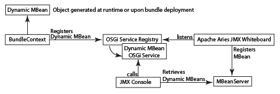

# JMX 콘솔과 서비스 통합{#integrating-services-with-the-jmx-console}

JMX 콘솔을 사용하여 서비스를 관리하기 위해 MBean을 만들고 배포합니다. 서비스 속성 및 작업을 노출하여 관리 작업을 수행할 수 있습니다.

JMX 콘솔 사용에 대한 자세한 내용은 [JMX 콘솔을 사용하여 서버 리소스 모니터링](/help/sites-administering/jmx-console.md)을(를) 참조하십시오.

## Felix 및 CQ5의 JMX 프레임워크 {#the-jmx-framework-in-felix-and-cq}

Apache Felix 플랫폼에서 MBean을 OSGi 서비스로 배포합니다. MBean 서비스가 OSGi 서비스 레지스트리에 등록되면 Aries JMX 화이트보드 모듈은 MBean 서버에 MBean을 자동으로 등록합니다. 그러면 공개 속성과 작업을 표시하는 JMX 콘솔에서 MBean을 사용할 수 있습니다.



## CQ5 및 CRX용 MBean 만들기 {#creating-mbeans-for-cq-and-crx}

CQ5 또는 CRX 리소스를 관리하기 위해 만드는 MBean은 javax.management.DynamicMBean 인터페이스를 기반으로 합니다. 이러한 구성 요소를 만들려면 JMX 사양에 명시된 일반적인 디자인 패턴을 따릅니다.

* get, set, is 메서드를 비롯한 관리 인터페이스를 만들고 특성을 정의하는 방법과 작업을 정의하는 다른 방법을 제공합니다.
* 구현 클래스를 만듭니다. 클래스는 DynamicMBean을 구현하거나 DynamicMBean의 구현 클래스를 확장해야 합니다.
* 표준 명명 규칙에 따라 구현 클래스의 이름이 MBean 접미사를 가진 인터페이스 이름되도록 합니다.

인터페이스는 관리 인터페이스를 정의하는 것 외에도 OSGi 서비스 인터페이스를 정의합니다. 구현 클래스는 OSGi 서비스를 구현합니다.

### 주석을 사용하여 MBean 정보 {#using-annotations-to-provide-mbean-information} 제공

[com.adobe.granite.jmx.annotation](https://helpx.adobe.com/experience-manager/6-5/sites/developing/using/reference-materials/javadoc/com/adobe/granite/jmx/annotation/package-summary.html) 패키지는 JMX 콘솔에 MBean 메타데이터를 쉽게 제공하기 위한 여러 주석 및 클래스를 제공합니다. MBean의 MBeanInfo 객체에 직접 정보를 추가하는 대신 이러한 주석과 클래스를 사용할 수 있습니다.

**주석**

관리 인터페이스에 주석을 추가하여 MBean 메타데이터를 지정합니다. 배포된 각 구현 클래스에 대한 정보가 JMX 콘솔에 표시됩니다. 다음 주석을 사용할 수 있습니다(자세한 내용은 [com.adobe.granite.jmx.annotation JavaDocs](https://helpx.adobe.com/experience-manager/6-5/sites/developing/using/reference-materials/javadoc/com/adobe/granite/jmx/annotation/package-summary.html) 참조).

* **설명:** MBean 클래스 또는 메서드에 대한 설명을 제공합니다. 클래스 선언에 사용될 경우 MBean의 JMX 콘솔 페이지에 설명이 나타납니다. 메서드에서 사용할 때 설명서는 해당 특성 또는 작업에 대해 텍스트 위로 가리키기 텍스트로 표시됩니다.
* **영향:** 방법의 영향. 유효한 매개 변수 값은 [javax.management.MBeanOperationInfo](https://docs.oracle.com/javase/1.5.0/docs/api/javax/management/MBeanOperationInfo.html)에 의해 정의된 필드입니다.

* **이름:** 작업 매개 변수에 대해 표시할 이름을 지정합니다. 이 주석을 사용하여 인터페이스에 사용되는 메서드 매개 변수의 실제 이름을 재정의합니다.
* **OpenTypeInfo:** JMX 콘솔에서 복합 데이터 또는 테이블 형식 데이터를 나타내는 데 사용할 클래스를 지정합니다. 열린 MBean과 함께 사용
* **TabularTypeInfo:** 표 형식의 데이터를 나타내는 데 사용되는 클래스에 주석을 추가하는 데 사용됩니다.

**클래스**

인터페이스에 추가하는 주석을 사용하는 동적 MBean을 만들기 위한 클래스가 제공됩니다.

* **AnnotatedStandardMBean:** 주석 메타데이터가 포함된 JMX 콘솔을 자동으로 제공하는 javax.management.StandardMBean 클래스의 하위 클래스입니다.
* **OpenAnnotatedStandardMBean:** OpenTypeInfo 주석을 사용하는 Open Beans를 만들기 위한 AnnotatedStandardMBean 클래스의 하위 클래스입니다.

### MBeans {#developing-mbeans} 개발

일반적으로 MBean은 관리하려는 OSGi 서비스의 반영입니다. Felix 플랫폼에서는 다른 Java 서버 플랫폼에 배포할 때와 마찬가지로 MBean을 만듭니다. 주요 차이점은 주석을 사용하여 MBean 정보를 지정할 수 있다는 것입니다.

* 관리 인터페이스:getter, setter 및 is 메서드를 사용하여 속성을 정의합니다. 다른 공개 방법을 사용하여 작업을 정의합니다. 주석을 사용하여 BeanInfo 객체의 메타데이터를 제공합니다.
* MBean 클래스:관리 인터페이스를 구현합니다. 인터페이스에서 주석을 처리하도록 AnnotatedStandardMBean 클래스를 확장합니다.

다음 예제는 CRX 저장소에 대한 정보를 제공합니다. 이 인터페이스는 설명 주석을 사용하여 JMX 콘솔에 대한 정보를 제공합니다.

#### 관리 인터페이스 {#management-interface}

```java
package com.adobe.example.myapp;

import com.adobe.granite.jmx.annotation.Description;

@Description("Example MBean that exposes repository properties.")
public interface ExampleMBean {

    @Description("The name of the repository.")
    String getRepositoryName();

    @Description("The vendor of the repository.")
    String   getRepositoryVendor();

    @Description("The URL of repository vendor.")
    String getVendorUrl();
}
```

구현 클래스는 SlingRepository 서비스를 사용하여 CRX 저장소에 대한 정보를 검색합니다.

#### MBean 구현 클래스 {#mbean-implementation-class}

```java
package com.adobe.example.myapp;

import org.apache.felix.scr.annotations.*;
import org.apache.sling.jcr.api.SlingRepository;

import com.adobe.granite.jmx.annotation.AnnotatedStandardMBean;

import javax.management.*;

public class ExampleMBeanImpl extends AnnotatedStandardMBean implements ExampleMBean {

    @Reference(cardinality = ReferenceCardinality.OPTIONAL_UNARY)
    private SlingRepository repository;

    public ExampleMBeanImpl() throws NotCompliantMBeanException {
        super(ExampleMBean.class);
    }

    public String getRepositoryName() {
        return repository.getDescriptor("jcr.repository.name");
    }

    public String getRepositoryVendor() {
        return repository.getDescriptor("jcr.repository.vendor");
    }

    public String getVendorUrl() {
        return repository.getDescriptor("jcr.repository.vendor.url");
    }
}
```

다음 그래픽은 JMX 콘솔에서 이 MBean의 페이지를 보여줍니다.


### MBeans {#registering-mbeans} 등록

MBean을 OSGi 서비스로 등록하면 MBean 서버에 자동으로 등록됩니다. CQ5에 MBean을 설치하려면 번들에 포함시키고 다른 OSGi 서비스와 마찬가지로 MBean 서비스를 내보냅니다.

OSGi 관련 메타데이터 외에도 MBean 서버에 MBean을 등록하는 데 Aries JMX 화이트보드 모듈에서 필요한 메타데이터를 제공해야 합니다.

* **DynamicMBean 인터페이스의 이름:** MBean 서비스가  `javax.management.DynamicMBea`n 인터페이스를 구현함을 선언합니다. 이 선언은 서비스가 MBean 서비스임을 Aries JMX 화이트보드 모듈에 알립니다.

* **MBean 도메인 및 키 속성:** On Felix는 MBean의 OSGi 서비스의 속성으로 이 정보를 제공합니다. 이는 일반적으로 `javax.management.ObjectName` 개체의 MBean 서버에 제공하는 정보와 같습니다.

MBean이 단일 서비스를 반영하는 경우 단일 MBean 서비스 인스턴스만 필요합니다. 이 경우 Felix SCR Maven 플러그인을 사용하는 경우 MBean 구현 클래스에 Apache Felix Service Component Runtime(SCR) 주석을 사용하여 JMX 관련 메타 데이터를 지정할 수 있습니다. 여러 MBean 인스턴스를 인스턴스화하기 위해 MBean의 OSGi 서비스 등록을 수행하는 다른 클래스를 만들 수 있습니다. 이 경우 JMX 관련 메타데이터는 런타임에 생성됩니다.

**단일 MBean**

디자인 시 모든 속성과 작업을 정의할 수 있는 MBean은 MBean 구현 클래스의 SCR 주석을 사용하여 배포할 수 있습니다. 다음 예에서 `Service` 주석의 `value` 속성은 서비스가 `DynamicMBean` 인터페이스를 구현한다고 선언합니다. `Property` 주석의 `name` 속성은 JMX 도메인 및 키 속성을 지정합니다.

#### SCR 주석이 있는 MBean 구현 클래스 {#mbean-implementation-class-with-scr-annotations}

```java
package com.adobe.example.myapp;

import org.apache.felix.scr.annotations.*;
import org.apache.sling.jcr.api.SlingRepository;

import com.adobe.granite.jmx.annotation.AnnotatedStandardMBean;

import javax.management.*;

@Component(immediate = true)
@Property(name = "jmx.objectname", value="com.adobe.example:type=CRX")
@Service(value = DynamicMBean.class)
public class ExampleMBeanImpl extends AnnotatedStandardMBean implements ExampleMBean {

    @Reference(cardinality = ReferenceCardinality.OPTIONAL_UNARY)
    private SlingRepository repository;

    public ExampleMBeanImpl() throws NotCompliantMBeanException {
        super(ExampleMBean.class);
    }

    public String getRepositoryName() {
        return repository.getDescriptor("jcr.repository.name");
    }

    public String getRepositoryVendor() {
        return repository.getDescriptor("jcr.repository.vendor");
    }

    public String getVendorUrl() {
        return repository.getDescriptor("jcr.repository.vendor.url");
    }
}
```

**여러 MBean 서비스 인스턴스**

관리되는 서비스의 여러 인스턴스를 관리하려면 해당 MBean 서비스의 여러 인스턴스를 만듭니다. 또한 관리 인스턴스가 시작되거나 중지되면 MBean 서비스 인스턴스를 만들거나 제거해야 합니다. 런타임에 MBean 서비스를 인스턴스화하고 서비스 라이프사이클을 관리할 수 있는 MBean 관리자 클래스를 만들 수 있습니다.

BundleContext를 사용하여 MBean을 OSGi 서비스로 등록합니다. BundleContext.registerService 메서드의 인수로 사용하는 Dictionary 객체에 JMX 관련 정보를 포함합니다.

다음 코드 예제에서는 ExampleMBean 서비스가 프로그래밍 방식으로 등록됩니다. componentContext 객체는 BundleContext에 대한 액세스를 제공하는 ComponentContext입니다.

#### 코드 조각:프로그래머틱 MBean 서비스 등록 {#code-snippet-programmatic-mbean-service-registration}

```java
Dictionary mbeanProps = new Hashtable();
mbeanProps.put("jmx.objectname", "com.adobe.example:type=CRX");
ExampleMBeanImpl mbean = new ExampleMBeanImpl();
ServiceRegistration serviceregistration =
            componentContext.getBundleContext().registerService(DynamicMBean.class.getName(), mbean, mbeanProps);
```

다음 섹션의 예제 MBean은 자세한 내용을 제공합니다.

MBean 서비스 관리자는 서비스 구성을 저장소에 저장할 때 유용합니다. 관리자는 서비스 정보를 검색하고 이를 사용하여 해당 MBean을 구성하고 만들 수 있습니다. 관리자 클래스는 저장소 변경 이벤트를 수신하고 그에 따라 MBean 서비스를 업데이트할 수도 있습니다.

## 예:JMX {#example-monitoring-workflow-models-using-jmx}을(를) 사용하여 워크플로우 모델 모니터링

이 예제의 MBean은 저장소에 저장된 CQ5 Workflow 모델에 대한 정보를 제공합니다. MBean 관리자 클래스는 저장소에 저장되어 런타임에 OSGi 서비스를 등록하는 Workflow 모델을 기반으로 MBean을 만듭니다. 이 예는 다음 멤버를 포함하는 단일 번들로 구성됩니다.

* WorkflowMBean:관리 인터페이스.
* WorkflowMBeanImpl:MBean 구현 클래스입니다.
* WorkflowMBeanManager:MBean 관리자 클래스의 인터페이스입니다.
* WorkflowMBeanManagerImpl:MBean 관리자의 구현 클래스입니다.

**참고:** 단순하게 이 예제의 코드는 throw된 예외에 대해 로깅 또는 반응하지 않습니다.

WorkflowMBeanManagerImpl에는 구성 요소 활성화 방법이 포함되어 있습니다. 구성 요소가 활성화되면 메서드는 다음 작업을 수행합니다.

* 번들의 BundleContext를 가져옵니다.
* 저장소를 쿼리하여 기존 워크플로우 모델의 경로를 가져옵니다.
* 각 Workflow 모델에 대해 MBean을 만듭니다.
* OSGi 서비스 레지스트리에 MBean을 등록합니다.

MBean 메타데이터는 com.adobe.example 도메인과 함께 JMX 콘솔에 나타나고, workflow_model 유형 및 속성은 워크플로우 모델 구성 노드의 경로입니다.


### 예제 MBean {#the-example-mbean}

이 예제는 `com.day.cq.workflow.model.WorkflowModel` 인터페이스에 반영되는 MBean 인터페이스와 구현이 필요합니다. MBean은 매우 간단하므로 디자인의 구성 및 배포 측면에 집중할 수 있습니다. MBean은 단일 속성인 모델 이름을 표시합니다.

#### WorkflowMBean 인터페이스 {#workflowmbean-interface}

```java
package com.adobe.example.myapp.api;

import com.adobe.granite.jmx.annotation.Description;

@Description("Example MBean that exposes Workflow model properties.")
public interface WorkflowMBean {

 @Description("The name of the Workflow model.")
 String getModelName();
}
```

#### WorkflowMBeanImpl {#workflowmbeanimpl}

```java
package com.adobe.example.myapp.impl;

import javax.management.NotCompliantMBeanException;

import com.day.cq.workflow.model.WorkflowModel;
import com.adobe.example.myapp.api.WorkflowMBean;
import com.adobe.granite.jmx.annotation.AnnotatedStandardMBean;

public class WorkflowMBeanImpl extends AnnotatedStandardMBean implements WorkflowMBean {

 WorkflowModel model;

 protected WorkflowMBeanImpl(WorkflowModel inmodel)
   throws NotCompliantMBeanException {
  super(WorkflowMBean.class);
  model=inmodel;
 }

 public String getModelName() {
  return model.getTitle();
 }
}
```

### MBean 관리자 예 {#the-example-mbean-manager}

WorkflowMBeanManager 서비스에는 WorkflowMBean 서비스를 만드는 구성 요소 활성화 방법이 포함되어 있습니다. 서비스 구현에는 다음 방법이 포함됩니다.

* 활성화:구성 요소 활성화 프로그램. WorkflowModel 구성 노드를 읽을 JCR 세션을 만듭니다. 모델 구성이 저장되는 루트 노드는 정적 필드에 정의됩니다. 구성 노드의 이름은 정적 필드에도 정의됩니다. 이 메서드는 노드 모델 경로를 가져오고 모델 WorkflowMBeans를 만드는 다른 메서드를 호출합니다.
* getModelIds:루트 노드 아래의 저장소를 순회하고 각 모델 노드의 경로를 검색합니다.
* makeMBean:모델 경로를 사용하여 WorkflowModel 개체를 만들고 WorkflowMBean을 만들고 해당 OSGi 서비스를 등록합니다.

>[!NOTE]
>
>WorkflowMBeanManager 구현은 구성 요소가 활성화될 때 존재하는 모델 구성에 대한 MBean 서비스만 만듭니다. 보다 강력한 구현은 새 모델 구성 및 기존 모델 구성의 변경 또는 삭제와 관련된 저장소 이벤트를 수신합니다. 변경 사항이 발생하면 관리자는 해당 WorkflowMBean 서비스를 생성, 수정 또는 제거할 수 있습니다.


#### WorkflowMBeanManager 인터페이스 {#workflowmbeanmanager-interface}

```java
package com.adobe.example.myapp.api;

public interface WorkflowMBeanManager {

}
```

#### WorkflowMBeanManagerImpl {#workflowmbeanmanagerimpl}

```java
package com.adobe.example.myapp.impl;

import java.util.*;

import org.apache.felix.scr.annotations.*;

import javax.jcr.Session;
import javax.jcr.Node;
import javax.jcr.NodeIterator;
import javax.jcr.RepositoryException;
import javax.management.ObjectName;

import org.apache.sling.jcr.api.SlingRepository;
import org.osgi.framework.ServiceRegistration;
import org.osgi.service.component.ComponentContext;

import org.slf4j.Logger;
import org.slf4j.LoggerFactory;

import com.day.cq.workflow.WorkflowService;
import com.day.cq.workflow.WorkflowSession;
import com.adobe.example.myapp.api.WorkflowMBean;
import com.adobe.example.myapp.api.WorkflowMBeanManager;

/**Instantiates and registers WorkflowMBean services */
@Component(immediate=true)
@Service(value=WorkflowMBeanManager.class)
public class WorkflowMBeanManagerImpl implements WorkflowMBeanManager {
 //The ComponentContext provides access to the BundleContext
 private ComponentContext componentContext;

 //Use the SlingRepository service to read model nodes
 @Reference
        private SlingRepository repository = null;

 //Use the WorkflowService service to create WorkflowModel objects
 @Reference
 private WorkflowService workflowservice = null;

  private Session session;

         //Details about model nodes
  private static final String MODEL_ROOT ="/etc/workflow/models";
  private static final String MODEL_NODE = "model";

  private Set<String> modelIds = new HashSet<String>();

        //Storage for ServiceRegistrations for MBean services
  private Collection<ServiceRegistration> mbeanRegistrations= new Vector<ServiceRegistration>(0,1);

 @Activate
        protected void activate(ComponentContext ctx) {
             //Traverse the repository and load the model nodes
             try {
                   session = repository.loginAdministrative(null);
                   // load and store model node paths
                   if (session.nodeExists(MODEL_ROOT)) {
                          getModelIds(session.getNode(MODEL_ROOT));
                   }
                   //Create MBeans for each model
                   for(String modid: modelIds){
                    makeMBean(modid);
                    }
             }catch(Exception e){ }
          }

        /**
         * Add JMX domain and key properties to a collection
         * Instantiate a WorkflowModel and its WorkflowMBeanImpl object
         * Register the MBean OSGi service
         */
 private void makeMBean(String modelId) {
             // create MBean for the model
             try {
                 Dictionary<String, String> mbeanProps = new Hashtable<String, String>();
                 //These properties appear on the JMX Console home page
                 mbeanProps.put("jmx.objectname", "com.adobe.example:type=workflow_model,id=" + ObjectName.quote(modelId));
                 WorkflowSession wfsession = workflowservice.getWorkflowSession(session);
                 WorkflowMBeanImpl mbean = new WorkflowMBeanImpl(wfsession.getModel(modelId));

                ServiceRegistration serviceregistration = componentContext.getBundleContext().registerService(WorkflowMBean.class.getName(), mbean, mbeanProps);
                //Store the ServiceRegistration objects for deactivation
                mbeanRegistrations.add(serviceregistration);
             } catch (Throwable t) {}
         }

        /**
         * Traverses the repository branch below a given Node. Stores the path of each model node.
         */
 private void getModelIds(Node node) throws RepositoryException {
  try{
                     NodeIterator iter = node.getNodes();
                     while (iter.hasNext()) {
                           Node n = iter.nextNode();
                           //Look for "jcr:content" nodes
                           if (n.getName().equals("jcr:content")) {
                                //get the path of the model node and save it
                                if(n.hasNode(MODEL_NODE)){
                                      modelIds.add(n.getNode(MODEL_NODE).getPath());
                                 }
                           } else{
                                   //Scan child nodes
                                   getModelIds(n);
                           }
                       }
  }catch(Exception e){ }
       }

        /**
         * Log out of the JCR session and unregister WorkflowMBean services
         */
        @Deactivate
        protected void deactivate() {
          session.logout();
          session=null;
          for(ServiceRegistration sr:mbeanRegistrations){
         sr.unregister();
          }
        }
}
```

### 예제 MBean {#the-pom-file-for-the-example-mbean}에 대한 POM 파일

다음 XML 코드를 복사하여 프로젝트 pom.xml 파일에 붙여넣어 구성 요소 번들을 빌드할 수 있습니다. POM은 몇 가지 필수 플러그인 및 종속성을 참조합니다.

**플러그인:**

* Apache Maven Compiler Plugin:소스 코드에서 Java 클래스를 컴파일합니다.
* Apache Felix Maven Bundle 플러그인:번들과 매니페스트를 만듭니다.
* Apache Felix Maven SCR Plugin:구성 요소 설명자 파일을 만들고 서비스 구성 요소 매니페스트 헤더를 구성합니다.

**참고:** 작성 시, maven scr 플러그인은 Eclipse용 m2e 플러그인과 호환되지 않습니다. ([펠릭스 버그 3170](https://issues.apache.org/jira/browse/FELIX-3170) 참조) Eclipse IDE를 사용하려면 Maven을 설치하고 명령줄 인터페이스를 사용하여 빌드를 수행합니다.

#### POM 파일 {#example-pom-file} 예

```xml
<project xmlns="https://maven.apache.org/POM/4.0.0"
  xmlns:xsi="https://www.w3.org/2001/XMLSchema-instance"
  xsi:schemaLocation="https://maven.apache.org/POM/4.0.0 https://maven.apache.org/xsd/maven-4.0.0.xsd">
  <modelVersion>4.0.0</modelVersion>
  <groupId>com.adobe.example.myapp</groupId>
  <artifactId>workflow-mbean</artifactId>
  <version>0.0.2-SNAPSHOT</version>
  <name>mbean-simple</name>
  <url>www.adobe.com</url>
  <description>A simple MBean</description>
  <packaging>bundle</packaging>
    <properties>
        <project.build.sourceEncoding>UTF-8</project.build.sourceEncoding>
    </properties>
    <build>
        <plugins>
        <plugin>
            <groupId>org.apache.maven.plugins</groupId>
            <artifactId>maven-compiler-plugin</artifactId>
            <configuration>
                <source>1.5</source>
                <target>1.5</target>
            </configuration>
        </plugin>
            <plugin>
                <groupId>org.apache.felix</groupId>
                <artifactId>maven-scr-plugin</artifactId>
                <version>1.7.2</version>
                <executions>
                    <execution>
                        <id>generate-scr-scrdescriptor</id>
              <goals>
                 <goal>scr</goal>
              </goals>
            </execution>
         </executions>
            </plugin>
             <plugin>
            <groupId>org.apache.felix</groupId>
            <artifactId>maven-bundle-plugin</artifactId>
            <version>1.4.3</version>
            <extensions>true</extensions>
            <configuration>
                <instructions>
                    <Export-Package>com.adobe.example.myapp.*;version=${project.version}</Export-Package>
                </instructions>
            </configuration>
        </plugin>
        </plugins>
    </build>
    <dependencies>
        <dependency>
            <groupId>org.apache.felix</groupId>
            <artifactId>org.apache.felix.scr.annotations</artifactId>
            <version>1.6.0</version>
            <scope>provided</scope>
        </dependency>
         <dependency>
            <groupId>org.apache.sling</groupId>
            <artifactId>org.apache.sling.api</artifactId>
            <version>2.0.8</version>
            <scope>provided</scope>
        </dependency>
         <dependency>
            <groupId>org.apache.felix</groupId>
            <artifactId>org.apache.felix.scr</artifactId>
            <version>1.6.1-R1236132</version>
            <scope>provided</scope>
        </dependency>
        <dependency>
            <groupId>org.apache.sling</groupId>
            <artifactId>org.apache.sling.jcr.api</artifactId>
            <version>2.0.4</version>
        </dependency>
        <dependency>
            <groupId>com.adobe.granite</groupId>
            <artifactId>com.adobe.granite.jmx</artifactId>
            <version>0.1.6</version>
            <scope>provided</scope>
        </dependency>
        <dependency>
       <groupId>com.day.cq.wcm</groupId>
       <artifactId>cq-wcm-mobile-api</artifactId>
       <version>5.5.2</version>
       <scope>provided</scope>
      </dependency>
      <dependency>
       <groupId>com.day.cq.workflow</groupId>
       <artifactId>cq-workflow-api</artifactId>
       <version>5.5.0</version>
       <scope>provided</scope>
      </dependency>
      <dependency>
       <groupId>javax.jcr</groupId>
       <artifactId>jcr</artifactId>
       <version>2.0</version>
       <scope>provided</scope>
      </dependency>
      <dependency>
                <groupId>org.slf4j</groupId>
  <artifactId>slf4j-api</artifactId>
  <version>1.6.4</version>
  <scope>provided</scope>
 </dependency>
    </dependencies>
</project>
```

공개 Adobe 리포지토리를 사용하려면 다음 프로필을 즐겨찾기 설정 파일에 추가합니다.

#### 마벤 프로필 {#maven-profile}

```xml
<profile>
    <id>adobe-public</id>
    <activation>
         <activeByDefault>false</activeByDefault>
    </activation>
    <properties>
         <releaseRepository-Id>adobe-public-releases</releaseRepository-Id>
         <releaseRepository-Name>Adobe Public Releases</releaseRepository-Name>
         <releaseRepository-URL>https://repo.adobe.com/nexus/content/groups/public</releaseRepository-URL>
    </properties>
    <repositories>
         <repository>
             <id>adobe-public-releases</id>
             <name>Adobe Basel Public Repository</name>
             <url>https://repo.adobe.com/nexus/content/groups/public</url>
             <releases>
                 <enabled>true</enabled>
                 <updatePolicy>never</updatePolicy>
             </releases>
             <snapshots>
                 <enabled>false</enabled>
             </snapshots>
         </repository>
     </repositories>
     <pluginRepositories>
         <pluginRepository>
             <id>adobe-public-releases</id>
             <name>Adobe Basel Public Repository</name>
             <url>https://repo.adobe.com/nexus/content/groups/public</url>
             <releases>
                 <enabled>true</enabled>
                 <updatePolicy>never</updatePolicy>
             </releases>
             <snapshots>
                 <enabled>false</enabled>
             </snapshots>
         </pluginRepository>
     </pluginRepositories>
</profile>
```
