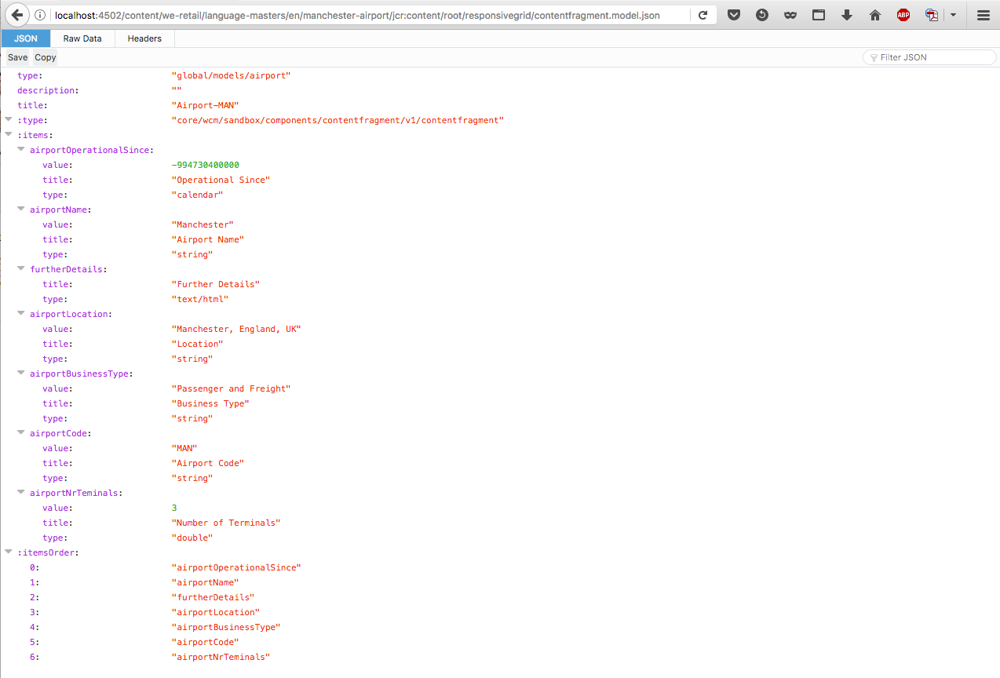

# 콘텐츠 서비스용 JSON 내보내기{#json-exporter-for-content-services}

AEM Content Services는 웹 페이지에 중점을 둔 수준에서 AEM 내/에서 컨텐츠 설명 및 전달을 일반화하기 위해 고안되었습니다.

모든 클라이언트가 사용할 수 있는 표준화된 방법을 사용하여 기존 AEM 웹 페이지가 아닌 채널에 컨텐츠를 배달합니다. 이러한 채널에는 다음이 포함될 수 있습니다.

* [단일 페이지 애플리케이션](spa-walkthrough.md)
* 기본 모바일 애플리케이션
* AEM 외부에 있는 기타 채널 및 터치 포인트

구조화된 콘텐츠를 사용하는 콘텐츠 조각을 사용하면 JSON 내보내기 도구를 사용하여 (y) AEM 페이지의 콘텐츠를 JSON 데이터 모델 형식으로 전달하여 콘텐츠 서비스를 제공할 수 있습니다. 그런 다음 사용자 자신의 응용 프로그램에서 사용할 수 있습니다.

>[!NOTE]
>
>여기에 설명된 기능은 핵심 구성 요소의 [릴리스 1.1.0 이후 모든 핵심 구성 요소에 사용할 수 있습니다](https://docs.adobe.com/content/docs/en/core-components/v1.html).

## 컨텐츠 조각 핵심 구성 요소를 포함하는 JSON 내보내기 {#json-exporter-with-content-fragment-core-components}

AEM JSON 내보내기 도구를 사용하여 (y) AEM 페이지의 콘텐츠를 JSON 데이터 모델 형식으로 제공할 수 있습니다. 그런 다음 사용자 자신의 응용 프로그램에서 사용할 수 있습니다.

AEM 내에서 선택기 `model` 및 `.json` 확장을 사용하여 배달을 수행합니다.

`.model.json`

1. 예를 들어 다음과 같은 URL입니다.

   ```shell
   http://localhost:4502/content/we-retail/language-masters/en.model.json
   ```

1. 다음과 같은 컨텐츠를 제공합니다.

   

구조화된 컨텐츠 조각을 구체적으로 타깃팅하여 컨텐츠를 전달할 수도 있습니다.

이 작업은 조각(를 통해)의 전체 경로를 사용하여 `jcr:content`수행됩니다. 예를 들어

`.../jcr:content/root/responsivegrid/contentfragment.model.json`

페이지에는 단일 컨텐츠 조각 또는 다양한 유형의 여러 구성 요소가 포함될 수 있습니다. 목록 구성 요소와 같은 메커니즘을 사용하여 관련 컨텐츠를 자동으로 검색할 수도 있습니다.

* 예를 들어 다음과 같은 URL입니다.

   ```shell
   http://localhost:4502/content/we-retail/language-masters/en/manchester-airport/jcr:content/root/responsivegrid/contentfragment.model.json
   ```

* 다음과 같은 컨텐츠를 제공합니다.

   

   >[!NOTE]
   >
   >자신의 구성 요소를 [조정하여](/help/sites-developing/json-exporter-components.md) 이 데이터에 액세스하고 사용할 수 있습니다.

   >[!NOTE]
   >
   >표준 구현은 아니지만 [여러 개의 선택기가 지원되지만](json-exporter-components.md#multiple-selectors) 첫 번째 `model` 선택기가 되어야 합니다.

### 추가 정보 {#further-information}

참고 항목:

* 자산 HTTP API

   * [자산 HTTP API](/help/assets/mac-api-assets.md)

* Sling Models:

   * [Sling Models - 130부터 리소스 유형과 모델 클래스 연결](https://sling.apache.org/documentation/bundles/models.html#associating-a-model-class-with-a-resource-type-since-130)

* JSON이 있는 AEM:

   * [JSON 형식으로 페이지 정보 얻기](/help/sites-developing/pageinfo.md)

## 관련 설명서 {#related-documentation}

자세한 내용은 다음을 참조하십시오.

* 자산 [사용 안내서의 컨텐츠 조각 항목](https://helpx.adobe.com/experience-manager/6-4/assets/user-guide.html?topic=/experience-manager/6-4/assets/morehelp/content-fragments.ug.js)

* [콘텐츠 조각 모델](/help/assets/content-fragments-models.md)
* [컨텐츠 조각으로 작성](/help/sites-authoring/content-fragments.md)
* [구성 요소에 대해 JSON 내보내기 활성화](/help/sites-developing/json-exporter-components.md)

* [핵심 구성 요소](https://docs.adobe.com/content/help/ko-KR/experience-manager-core-components/using/introduction.html) 및 [컨텐츠 조각 구성 요소](https://helpx.adobe.com/experience-manager/core-components/using/content-fragment-component.html)

