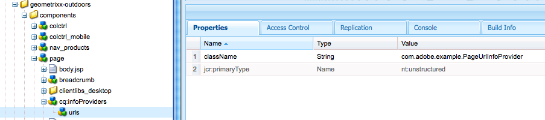

# JSON 형식으로 페이지 정보 얻기{#obtaining-page-information-in-json-format}

페이지 정보를 얻으려면 페이지 메타데이터를 JSON 형식으로 얻기 위해 PageInfo 서블릿에 요청을 보냅니다.

PageInfo 서블릿은 저장소의 리소스에 대한 정보를 반환합니다. 서블릿은 URL `https://<server>:<port>/libs/wcm/core/content/pageinfo.json`에 바인딩되고 `path` 매개 변수를 사용하여 리소스를 식별합니다. 다음 예제 URL은 `/content/we-retail/us/en` 노드에 대한 정보를 반환합니다.

```shell
http://localhost:4502/libs/wcm/core/content/pageinfo.json?path=/content/we-retail/us/en
```

>[!NOTE]
>
>일반적인 AEM 웹 페이지가 아닌 채널에 컨텐츠를 전달하려면 JSON 형식의 페이지 정보가 필요한 경우:
>
>* SPA(Single Page Applications)
>* 기본 모바일 애플리케이션
>* AEM 외부 다른 채널 및 터치 지점

>
>
콘텐츠 서비스용 [JSON 내보내기](/help/sites-developing/json-exporter.md) 문서를 참조하십시오.

## 페이지 정보 공급자 {#page-information-providers}

페이지 구성 요소는 페이지 메타데이터를 생성하는 하나 이상의 `com.day.cq.wcm.api.PageInfoProvider` 서비스와 연결할 수 있습니다. PageInfo 서블릿은 각 PageInfoProvider 서비스를 호출하고 메타데이터를 집계합니다.

1. HTTP 클라이언트는 페이지의 URL을 포함하는 PageInfo 서블릿으로 요청을 보냅니다.
1. PageInfo 서블릿은 페이지를 렌더링하는 구성 요소를 검색합니다.
1. PageInfo 서블릿은 구성 요소와 연관된 각 PageInfoProvider를 호출합니다.
1. 이 서블릿은 각 PageInfoProvider가 반환하는 메타데이터를 집계하고 JSON 객체의 HTTP 응답에 메타데이터를 추가합니다.


>[!NOTE]
>
>PageInfoProviders와 유사하게, ListInfoProviders를 사용하여 JSON 형식의 정보 목록을 업데이트합니다. ([웹 사이트 관리 콘솔 사용자 지정](/help/sites-developing/customizing-siteadmin.md)을 참조하십시오.)

## 기본 페이지 정보 공급자 {#default-page-information-providers}

`/libs/foundation/components/page` 구성 요소는 다음 PageInfoProvider 서비스와 연결되어 있습니다.

* **기본 페이지 상태 공급자:** 페이지가 잠겼는지 여부, 페이지가 활성 워크플로의 페이로드인지 여부, 페이지에 사용할 수 있는 워크플로우와 같은 페이지 상태에 대한 정보입니다.
* **Live Relationship Info Provider: 페이지가 파란색 인쇄물에 포함되어 있는지 여부 및 Live Copy인지 여부 등 MSM(다중 사이트 관리)과 관련된** 정보입니다.
* **컨텐츠 언어 서블릿:** 현재 페이지의 언어 및 페이지를 사용할 수 있는 각 언어에 대한 정보입니다.
* **워크플로우 상태 공급자:** 페이지가 페이로드로 되어 있는 실행 중인 워크플로우에 대한 상태 정보입니다.
* **워크플로우 패키지 정보 공급자:** 저장소에 저장된 각 워크플로우 패키지에 대한 정보 및 각 패키지에 현재 리소스가 포함되어 있는지 여부.
* **에뮬레이터 정보 공급자:** 이 리소스에 사용할 수 있는 모바일 장치 에뮬레이터에 대한 정보입니다. 페이지 구성 요소가 모바일 페이지를 렌더링하지 않으면 사용할 수 있는 에뮬레이터가 없습니다.
* **주석 정보 공급자:** 페이지에 있는 주석에 대한 정보입니다.

예를 들어 PageInfo 서블릿은 `/content/we-retail/us/en` 노드에 대해 다음 JSON 응답을 반환합니다.

```
{
   "status":{
      "path":"/content/we-retail/us/en",
      "isLocked":false,
      "lockOwner":"",
      "canUnlock":false,
      "lastModified":1467202845038,
      "lastModifiedBy":"admin",
      "timeUntilValid":0,
      "onTime":0,
      "offTime":0,
      "replication":{
         "numQueued":0
      },
      "isDesignable":true,
      "isDeveloper":true
   },
   "isPage":true,
   "pageResourceType":"weretail/components/structure/page",
   "enableFragmentIdentifier":false,
   "workflow":{
      "isRunning":false
   },
   "workflows":{
      "wcm":{
         "models":[
            {
               "wid":"/etc/workflow/models/dam/adddamsize/jcr:content/model",
               "label":"Add Asset Size",
               "label_xss":"Add Asset Size"
            },
            {
               "wid":"/etc/workflow/models/ac-newsletter-workflow-simple/jcr:content/model",
               "label":"Approve for Adobe Campaign",
               "label_xss":"Approve for Adobe Campaign"
            },
            {
               "wid":"/etc/workflow/models/dam/dam-autotag-assets/jcr:content/model",
               "label":"DAM Smart Tag Assets",
               "label_xss":"DAM Smart Tag Assets"
            },
            {
               "wid":"/etc/workflow/models/dam/update_asset/jcr:content/model",
               "label":"DAM Update Asset",
               "label_xss":"DAM Update Asset"
            },
            {
               "wid":"/etc/workflow/models/cloudservices/DTM_bundle_download/jcr:content/model",
               "label":"Default DTM Bundle Download",
               "label_xss":"Default DTM Bundle Download"
            },
            {
               "wid":"/etc/workflow/models/dam/dam_download_asset/jcr:content/model",
               "label":"Download Asset",
               "label_xss":"Download Asset"
            },
            {
               "wid":"/etc/workflow/models/dam/dynamic-media-video-thumbnail-replacement/jcr:content/model",
               "label":"Dynamic Media Video Thumbnail Replacement",
               "label_xss":"Dynamic Media Video Thumbnail Replacement"
            },
            {
               "wid":"/etc/workflow/models/dam/dynamic-media-video-user-uploaded-thumbnail/jcr:content/model",
               "label":"Dynamic Media Video User Uploaded Thumbnail Process",
               "label_xss":"Dynamic Media Video User Uploaded Thumbnail Process"
            },
            {
               "wid":"/etc/workflow/models/projects/approval_workflow/jcr:content/model",
               "label":"Project Approval Workflow",
               "label_xss":"Project Approval Workflow"
            },
            {
               "wid":"/etc/workflow/models/publish_example/jcr:content/model",
               "label":"Publish Example",
               "label_xss":"Publish Example"
            },
            {
               "wid":"/etc/workflow/models/publish_to_campaign/jcr:content/model",
               "label":"Publish to Adobe Campaign",
               "label_xss":"Publish to Adobe Campaign"
            },
            {
               "wid":"/etc/workflow/models/s7dam/request_to_publish_to_youtube/jcr:content/model",
               "label":"Publish to YouTube",
               "label_xss":"Publish to YouTube"
            },
            {
               "wid":"/etc/workflow/models/projects/request_copy/jcr:content/model",
               "label":"Request Copy",
               "label_xss":"Request Copy"
            },
            {
               "wid":"/etc/workflow/models/request_for_activation/jcr:content/model",
               "label":"Request for Activation",
               "label_xss":"Request for Activation"
            },
            {
               "wid":"/etc/workflow/models/request_for_deactivation/jcr:content/model",
               "label":"Request for Deactivation",
               "label_xss":"Request for Deactivation"
            },
            {
               "wid":"/etc/workflow/models/request_for_deletion/jcr:content/model",
               "label":"Request for Deletion",
               "label_xss":"Request for Deletion"
            },
            {
               "wid":"/etc/workflow/models/request_to_complete_move_operation/jcr:content/model",
               "label":"Request to complete Move operation",
               "label_xss":"Request to complete Move operation"
            },
            {
               "wid":"/etc/workflow/models/screens-update-asset/jcr:content/model",
               "label":"Screens Update Asset",
               "label_xss":"Screens Update Asset"
            },
            {
               "wid":"/etc/workflow/models/s7dam/request_to_remove_from_youtube/jcr:content/model",
               "label":"Unpublish from YouTube",
               "label_xss":"Unpublish from YouTube"
            },
            {
               "wid":"/etc/workflow/models/wcm-translation/create_language_copy/jcr:content/model",
               "label":"WCM: Create Language Copy",
               "label_xss":"WCM: Create Language Copy"
            },
            {
               "wid":"/etc/workflow/models/wcm-translation/prepare_translation_project/jcr:content/model",
               "label":"WCM: Prepare Translation Project",
               "label_xss":"WCM: Prepare Translation Project"
            },
            {
               "wid":"/etc/workflow/models/wcm-translation/translate-i18n-dictionary/jcr:content/model",
               "label":"WCM: Prepare and Translate I18n-Dictionary",
               "label_xss":"WCM: Prepare and Translate I18n-Dictionary"
            },
            {
               "wid":"/etc/workflow/models/wcm-translation/sync_translation_job/jcr:content/model",
               "label":"WCM: Sync Translation Job",
               "label_xss":"WCM: Sync Translation Job"
            },
            {
               "wid":"/etc/workflow/models/wcm-translation/update_language_copy/jcr:content/model",
               "label":"WCM: Update Language Copy",
               "label_xss":"WCM: Update Language Copy"
            }
         ]
      },
      "translation":{
         "models":[
            {
               "wid":"/etc/workflow/models/dam/adddamsize/jcr:content/model",
               "label":"Add Asset Size",
               "label_xss":"Add Asset Size"
            },
            {
               "wid":"/etc/workflow/models/ac-newsletter-workflow-simple/jcr:content/model",
               "label":"Approve for Adobe Campaign",
               "label_xss":"Approve for Adobe Campaign"
            },
            {
               "wid":"/etc/workflow/models/dam/dam-autotag-assets/jcr:content/model",
               "label":"DAM Smart Tag Assets",
               "label_xss":"DAM Smart Tag Assets"
            },
            {
               "wid":"/etc/workflow/models/cloudservices/DTM_bundle_download/jcr:content/model",
               "label":"Default DTM Bundle Download",
               "label_xss":"Default DTM Bundle Download"
            },
            {
               "wid":"/etc/workflow/models/dam/dam_download_asset/jcr:content/model",
               "label":"Download Asset",
               "label_xss":"Download Asset"
            },
            {
               "wid":"/etc/workflow/models/dam/dynamic-media-video-thumbnail-replacement/jcr:content/model",
               "label":"Dynamic Media Video Thumbnail Replacement",
               "label_xss":"Dynamic Media Video Thumbnail Replacement"
            },
            {
               "wid":"/etc/workflow/models/dam/dynamic-media-video-user-uploaded-thumbnail/jcr:content/model",
               "label":"Dynamic Media Video User Uploaded Thumbnail Process",
               "label_xss":"Dynamic Media Video User Uploaded Thumbnail Process"
            },
            {
               "wid":"/etc/workflow/models/projects/approval_workflow/jcr:content/model",
               "label":"Project Approval Workflow",
               "label_xss":"Project Approval Workflow"
            },
            {
               "wid":"/etc/workflow/models/publish_to_campaign/jcr:content/model",
               "label":"Publish to Adobe Campaign",
               "label_xss":"Publish to Adobe Campaign"
            },
            {
               "wid":"/etc/workflow/models/s7dam/request_to_publish_to_youtube/jcr:content/model",
               "label":"Publish to YouTube",
               "label_xss":"Publish to YouTube"
            },
            {
               "wid":"/etc/workflow/models/projects/request_copy/jcr:content/model",
               "label":"Request Copy",
               "label_xss":"Request Copy"
            },
            {
               "wid":"/etc/workflow/models/request_for_deletion/jcr:content/model",
               "label":"Request for Deletion",
               "label_xss":"Request for Deletion"
            },
            {
               "wid":"/etc/workflow/models/request_to_complete_move_operation/jcr:content/model",
               "label":"Request to complete Move operation",
               "label_xss":"Request to complete Move operation"
            },
            {
               "wid":"/etc/workflow/models/screens-update-asset/jcr:content/model",
               "label":"Screens Update Asset",
               "label_xss":"Screens Update Asset"
            },
            {
               "wid":"/etc/workflow/models/translation/jcr:content/model",
               "label":"Translation Prepare",
               "label_xss":"Translation Prepare"
            },
            {
               "wid":"/etc/workflow/models/s7dam/request_to_remove_from_youtube/jcr:content/model",
               "label":"Unpublish from YouTube",
               "label_xss":"Unpublish from YouTube"
            }
         ]
      }
   },
   "translation":{

   },
   "design":{
      "path":"/conf/we-retail/settings/wcm/templates/hero-page/policies",
      "lastModified":0
   },
   "componentsRef":"/libs/wcm/core/content/components.1497341312569.json",
   "editableTemplate":"/conf/we-retail/settings/wcm/templates/hero-page",
   "msm":{
      "msm:isLiveCopy":true,
      "msm:isInBlueprint":false,
      "msm:isSource":false
   },
   "launches":{
      "isLaunch":false,
      "isInLaunch":false
   },
   "language":"en",
   "languages":{
      "rows":[
         {
            "path":"/content/we-retail/us/en",
            "exists":true,
            "hasContent":true,
            "lastModified":0,
            "iso":"en",
            "country":"gb",
            "language":"English"
         },
         {
            "path":"/content/we-retail/us/es",
            "exists":true,
            "hasContent":true,
            "lastModified":0,
            "iso":"es",
            "country":"es",
            "language":"Spanish"
         }
      ]
   },
   "workflowInfo":{
      "isRunning":false
   },
   "workflowPackageInfo":{
      "workflowPackages":[

      ],
      "selectedWorkflowPackages":[

      ],
      "runningSelectedWorkflowPackages":[

      ]
   },
   "emulators":{
      "groups":{
         "responsive":{
            "title":"Responsive Devices",
            "description":"The devices in this group are able to display a website built using responsive design patterns.",
            "path":"/etc/mobile/groups/responsive",
            "galaxy5":{
               "text":"Galaxy S5",
               "action":"start",
               "path":"/libs/wcm/mobile/components/emulators/galaxy5",
               "canRotate":true,
               "hasTouchScrolling":true,
               "contentCssPath":"/etc/mobile/groups/responsive/static.css",
               "width":1080,
               "height":1920,
               "device-pixel-ratio":3
            },
            "ipad":{
               "text":"iPad",
               "action":"start",
               "path":"/libs/wcm/mobile/components/emulators/ios/ipad",
               "canRotate":true,
               "hasTouchScrolling":true,
               "contentCssPath":"/etc/mobile/groups/responsive/static.css",
               "width":768,
               "height":1024,
               "device-pixel-ratio":1
            },
            "iphone5":{
               "text":"iPhone 5",
               "action":"start",
               "path":"/libs/wcm/mobile/components/emulators/ios/iphone5",
               "canRotate":true,
               "hasTouchScrolling":true,
               "contentCssPath":"/etc/mobile/groups/responsive/static.css",
               "width":640,
               "height":1136,
               "device-pixel-ratio":2
            },
            "iphone6":{
               "text":"iPhone 6",
               "action":"start",
               "path":"/libs/wcm/mobile/components/emulators/ios/iphone6",
               "canRotate":true,
               "hasTouchScrolling":true,
               "contentCssPath":"/etc/mobile/groups/responsive/static.css",
               "width":750,
               "height":1334,
               "device-pixel-ratio":2
            },
            "iphone4":{
               "text":"iPhone 4",
               "action":"start",
               "path":"/libs/wcm/mobile/components/emulators/ios/iphone4",
               "canRotate":true,
               "hasTouchScrolling":true,
               "contentCssPath":"/etc/mobile/groups/responsive/static.css",
               "width":640,
               "height":960,
               "device-pixel-ratio":2
            },
            "iphone6plus":{
               "text":"iPhone 6 Plus",
               "action":"start",
               "path":"/libs/wcm/mobile/components/emulators/ios/iphone6plus",
               "canRotate":true,
               "hasTouchScrolling":true,
               "contentCssPath":"/etc/mobile/groups/responsive/static.css",
               "width":1080,
               "height":1920,
               "device-pixel-ratio":2.6
            },
            "nexuss":{
               "text":"Nexus S",
               "action":"start",
               "path":"/libs/wcm/mobile/components/emulators/nexuss",
               "canRotate":true,
               "hasTouchScrolling":true,
               "contentCssPath":"/etc/mobile/groups/responsive/static.css",
               "width":320,
               "height":533,
               "device-pixel-ratio":1
            }
         }
      }
   },
   "annotations":[

   ],
   "permissions":{
      "modify":true,
      "replicate":true,
      "read":true,
      "create":true,
      "delete":true,
      "acl_read":true,
      "acl_edit":true
   },
   "isTargetable":"true",
   "responsive":{
      "breakpoints":{
         "phone":{
            "width":650,
            "title":"Smaller Screen"
         },
         "tablet":{
            "width":1200,
            "title":"Tablet"
         }
      }
   }
}
```

## 워크플로 패키지 정보 필터링 {#filtering-workflow-package-information}

원하는 워크플로 패키지에 대한 정보만 반환하도록 CQ WCM 워크플로 패키지 정보 공급자 서비스를 구성합니다. 기본적으로 워크플로우 패키지 정보 공급자 서비스는 저장소의 모든 워크플로우 패키지에 대한 정보를 반환합니다. 워크플로 패키지의 하위 집합을 반복하면 서버 리소스가 더 적게 사용됩니다.

>[!NOTE]
>
>사이드 킥의 워크플로우 탭은 PageInfo 서블릿을 사용하여 워크플로우 패키지 목록을 가져옵니다. 목록에서 현재 페이지를 추가할 패키지를 선택할 수 있습니다. 만든 필터는 이 목록에 영향을 줍니다.


서비스의 ID는 `com.day.cq.wcm.workflow.impl.WorkflowPackageInfoProvider`입니다. 필터를 만들려면 `workflowpackageinfoprovider.filter` 속성 값을 지정합니다.

속성 값 앞에 + 또는 - 문자가 추가되고 패키지 경로가 추가됩니다.

* 경로는 워크플로 패키지의 루트 노드의 경로입니다. 경로는 FileVault 구문을 사용합니다.
* 패키지를 포함하려면 + 접두어를 사용합니다.
* 패키지를 제외하려면 - 접두사를 사용합니다.

서비스는 모든 필터의 누적 결과를 적용합니다. 예를 들어 다음 필터 값은 Editions 폴더에 있는 것을 제외한 모든 워크플로 패키지를 제외합니다.

```
-/etc/workflow/packages(/.*)?
+/etc/workflow/packages/Editions(/.&ast;)?
```

>[!NOTE]
>
>AEM으로 작업할 때는 이러한 서비스에 대한 구성 설정을 관리하는 방법이 몇 가지 있습니다. 자세한 내용은 [OSGi](/help/sites-deploying/configuring-osgi.md) 구성을 참조하십시오.

예를 들어 CRXDE Lite을 사용하여 서비스를 구성하려면:

1. CRXDE Lite([http://localhost:4502/crx/de](http://localhost:4502/crx/de))를 엽니다.
1. 응용 프로그램의 구성 폴더에서 노드를 만듭니다.

   * 이름: `com.day.cq.wcm.workflow.impl.WorkflowPackageInfoProvider`
   * 유형: `sling:OsgiConfig`

1. 노드를 선택하고 속성을 추가합니다.

   * 이름: `workflowpackageinfoprovider.filter`
   * 유형: `String[]`
   * 값:올바른 형식을 사용하는 워크플로 패키지의 경로입니다.

1. 모두 저장을 클릭합니다.

프로젝트 소스에서 서비스를 구성하려면:

1. 프로젝트 소스에서 AEM 응용 프로그램의 구성 폴더를 찾거나 만듭니다.

   예를 들어 Content Package Maven Plugin의 다중 모듈 원형 유형을 사용하여 프로젝트를 만든 경우 폴더 경로는 `<projectroot>/content/src/ for example content/src/main/content/jcr_root/apps/<appname>/config`입니다.
1. 구성 폴더에서 com.day.cq.wcm.workflow.impl.WorkflowPackageInfoProvider.xml이라는 텍스트 파일을 만듭니다.
1. 파일에 다음 텍스트를 복사합니다.

   ```
   <?xml version="1.0" encoding="UTF-8"?>
    <jcr:root xmlns:sling="https://sling.apache.org/jcr/sling/1.0"
    xmlns:jcr="https://www.jcp.org/jcr/1.0"
    jcr:primaryType="sling:OsgiConfig"
    workflowpackageinfoprovider.filter="[]"/>
   ```

1. `workflowpackageinfoprovider.filter` 속성을 둘러싸는 대괄호(`[]`) 안에 다음 예제와 유사한 필터 값의 쉼표로 구분된 목록을 입력합니다.

   `workflowpackageinfoprovider.filter="[-/etc/workflow/packages(/.*)?,+/etc/workflow/packages/Editions(/.*)?]"/>`

1. 파일을 저장합니다.

## 페이지 정보 공급자 만들기 {#creating-a-page-information-provider}

사용자 지정 페이지 정보 공급자 서비스를 만들어 응용 프로그램에서 쉽게 얻을 수 있는 페이지 메타데이터를 추가합니다.

1. `com.day.cq.wcm.api.PageInfoProvider` 인터페이스를 구현합니다.
1. 클래스를 번들로 묶어서 OSGi 서비스로 배포합니다.
1. 애플리케이션에서 페이지 구성 요소를 만듭니다. `sling:resourceSuperType` 속성의 값으로 `foundation/components/page`을 사용합니다.

1. `cq:infoProviders` 구성 요소 노드 아래에 노드를 추가합니다.
1. `cq:infoProviders` 노드 아래에 PageInfoProvider 서비스의 노드를 추가합니다. 노드의 이름을 지정할 수 있습니다.
1. PageInfoProvider 노드에 다음 속성을 추가합니다.

   * 이름:className
   * 유형:문자열
   * 값:PageInfoProvider 서비스의 PID입니다.

응용 프로그램 페이지 구성 요소를 `sling:resourceType`으로 사용하는 리소스의 경우 PageInfo 서블릿은 기본 PageInfoProvider 메타데이터 외에도 사용자 지정 PageInfoProvider 메타데이터를 반환합니다.

### PageInfoProvider 구현 예 {#example-pageinfoprovider-implementation}

다음 Java 클래스는 [PageInfoProvider](https://helpx.adobe.com/experience-manager/6-5/sites/developing/using/reference-materials/javadoc/index.html)를 구현하고 현재 페이지 리소스의 게시된 URL을 반환합니다.

```java
package com.adobe.example;

import org.apache.felix.scr.annotations.Component;
import org.apache.felix.scr.annotations.Properties;
import org.apache.felix.scr.annotations.Property;
import org.apache.felix.scr.annotations.ReferenceCardinality;
import org.apache.felix.scr.annotations.Service;
import org.apache.felix.scr.annotations.Reference;

import org.apache.sling.api.SlingHttpServletRequest;
import org.apache.sling.api.resource.Resource;
import org.apache.sling.api.resource.ResourceResolver;

import org.apache.sling.commons.json.JSONException;
import org.apache.sling.commons.json.JSONObject;

import com.day.cq.wcm.api.Page;
import com.day.cq.wcm.api.PageInfoProvider;

@Component(metatype = false)
@Properties({
 @Property(name="service.description", value="Returns the public URL of a resource.")
})
@Service
public class PageUrlInfoProvider implements PageInfoProvider {

 @Reference(cardinality = ReferenceCardinality.OPTIONAL_UNARY)
 private com.day.cq.commons.Externalizer externalizer;

 private String fetchExternalUrl(ResourceResolver rr, String path) {
  return externalizer.publishLink(rr, path);
 }

 public void updatePageInfo(SlingHttpServletRequest request, JSONObject info, Resource resource)
   throws JSONException {

  Page page = resource.adaptTo(Page.class);
  JSONObject urlinfo = new JSONObject();
  urlinfo.put("publishURL", fetchExternalUrl(null,page.getPath()));
  info.put("URLs",urlinfo);
 }
}
```

다음 예는 CRXDE Lite에서 PageUrlInfoProvider 서비스를 사용하도록 구성된 페이지 구성 요소를 보여 줍니다.



PageUrlInfoProvider 서비스는 `/content/we-retail/us/en` 노드에 대해 다음 데이터를 반환합니다.

```xml
"URLs": {
    "publishURL": "http://localhost:4503/content/we-retail/us/en"
}
```

