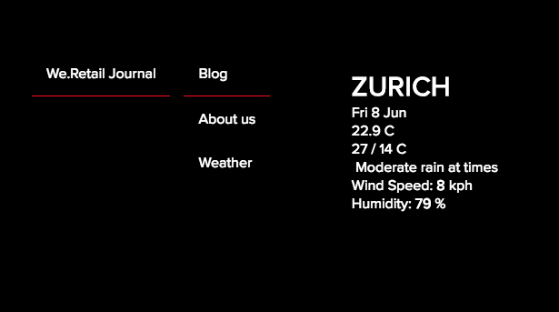

# SPA에 대한 React 구성 요소 구현{#implementing-a-react-component-for-spa}

SPA(단일 페이지 애플리케이션)는 웹 사이트 사용자에게 훌륭한 경험을 제공할 수 있습니다. 개발자는 SPA 프레임워크을 사용하여 사이트를 작성하려고 하며 작성자는 SPA 프레임워크을 사용하여 작성된 사이트의 AEM 내에서 컨텐츠를 원활하게 편집하려고 합니다.

SPA 작성 기능은 AEM 내에서 SPA을 지원하는 포괄적인 솔루션을 제공합니다. 이 문서에서는 AEM SPA 편집기와 함께 사용하기 위해 기존의 간단한 React 구성 요소를 적용하는 방법에 대한 예를 제공합니다.

>[!NOTE]
>
>SPA 편집기는 SPA 프레임워크 기반 클라이언트측 렌더링(예: React 또는 Angular)이 필요한 프로젝트에 권장되는 솔루션입니다.

## 소개 {#introduction}

AEM에 필요하고 SPA과 SPA 편집기 간에 설정된 간단하고 가벼운 계약 덕분에, 기존 Javascript 애플리케이션을 가져와서 AEM에서 SPA과 함께 사용할 수 있도록 적용하는 것은 매우 간단합니다.

이 문서에서는 We.Retail 저널 샘플 SPA에 있는 날씨 구성 요소의 예를 보여줍니다.

당신은 [AEM용 SPA 애플리케이션의 구조](/help/sites-developing/spa-getting-started-react.md) 이 문서를 읽기 전에

>[!CAUTION]
>이 문서에서는 [We.Retail 저널 앱](https://github.com/Adobe-Marketing-Cloud/aem-sample-we-retail-journal) 를 사용하십시오. 프로젝트 작업에 사용해서는 안 됩니다.
>
>모든 AEM 프로젝트는 [AEM 프로젝트 원형](https://experienceleague.adobe.com/docs/experience-manager-core-components/using/developing/archetype/overview.html): React 또는 Angular을 사용하여 SPA 프로젝트를 지원하고 SPA SDK를 활용합니다.

## 날씨 구성 요소 {#the-weather-component}

날씨 구성 요소는 We.Retail 저널 앱의 왼쪽 상단에 있습니다. 정의된 위치의 현재 날씨를 표시하여 날씨 데이터를 동적으로 가져옵니다.

### 날씨 위젯 사용 {#using-the-weather-widget}


SPA 편집기에서 SPA의 컨텐츠를 작성할 때 날씨 구성 요소는 도구 모음이 포함된 다른 AEM 구성 요소로 표시되며 편집 가능합니다.


도시는 다른 AEM 구성 요소와 마찬가지로 대화 상자에서 업데이트할 수 있습니다.


변경 사항은 계속 유지되며 구성 요소는 새로운 날씨 데이터를 사용하여 자동으로 업데이트됩니다.



### 날씨 구성 요소 구현 {#weather-component-implementation}

날씨 구성 요소는 실제로 [React Open Weather](https://www.npmjs.com/package/react-open-weather): We.Retail Journal 샘플 SPA 애플리케이션 내에서 구성 요소로 작동하도록 개조되었습니다.

다음은 React Open Weather 구성 요소의 사용에 대한 NPM 설명서의 코드 조각입니다.

 

사용자 지정된 날씨 구성 요소의 코드 검토( `Weather.js`)을 만들 수 있습니다.

* **16호선**: 필요에 따라 React Open Weather 위젯이 로드됩니다.
* **46호선**: 다음 `MapTo` 함수는 이 React 구성 요소를 해당 AEM 구성 요소에 연결하여 SPA 편집기에서 편집할 수 있습니다.

* **22-29호선**: 다음 `EditConfig` 가 정의되며, 도시가 채워졌는지 확인하고, 비어 있으면 값을 정의합니다.

* **31-44호선**: 날씨 구성 요소는 `Component` 클래스 및 는 React Open Weather 구성 요소에 대한 NPM 사용 설명서에 정의된 대로 필요한 데이터를 제공하고 구성 요소를 렌더링합니다.

```javascript
/*~~~~~~~~~~~~~~~~~~~~~~~~~~~~~~~~~~~~~~~~~~~~~~~~~~~~~~~~~~~~~~~~~~~~~~~~~~~~~~
 ~ Copyright 2018 Adobe Systems Incorporated
 ~
 ~ Licensed under the Apache License, Version 2.0 (the "License");
 ~ you may not use this file except in compliance with the License.
 ~ You may obtain a copy of the License at
 ~
 ~     https://www.apache.org/licenses/LICENSE-2.0
 ~
 ~ Unless required by applicable law or agreed to in writing, software
 ~ distributed under the License is distributed on an "AS IS" BASIS,
 ~ WITHOUT WARRANTIES OR CONDITIONS OF ANY KIND, either express or implied.
 ~ See the License for the specific language governing permissions and
 ~ limitations under the License.
 ~~~~~~~~~~~~~~~~~~~~~~~~~~~~~~~~~~~~~~~~~~~~~~~~~~~~~~~~~~~~~~~~~~~~~~~~~~~~~*/
import React, {Component} from 'react';
import ReactWeather from 'react-open-weather';
import {MapTo} from '@adobe/aem-react-editable-components';

require('./Weather.css');

const WeatherEditConfig = {

    emptyLabel: 'Weather',

    isEmpty: function() {
        return !this.props || !this.props.cq_model || !this.props.cq_model.city || this.props.cq_model.city.trim().length < 1;
    }
};

class Weather extends Component {

    render() {
        let apiKey = "12345678901234567890";
        let city;

        if (this.props.cq_model) {
            city = this.props.cq_model.city;
            return <ReactWeather key={'react-weather' + Date.now()} forecast="today" apikey={apiKey} type="city" city={city} />
        }

        return null;
    }
}

MapTo('we-retail-journal/global/components/weather')(Weather, WeatherEditConfig);
```

백엔드 구성 요소가 이미 있어야 하지만, 프런트 엔드 개발자는 We.Retail Journal SPA에서 코딩 작업이 거의 없는 React Open Weather 구성 요소를 활용할 수 있습니다.

## 다음 단계 {#next-step}

SPA for AEM 개발에 대한 자세한 내용은 문서를 참조하십시오 [SPA for AEM 개발](/help/sites-developing/spa-architecture.md).
