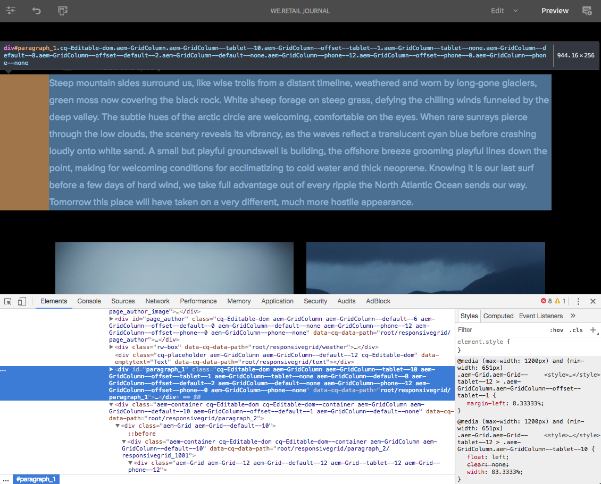

# SPA 소개 및 연습{#spa-introduction-and-walkthrough}

단일 페이지 애플리케이션(SPA)을 통해 웹 사이트 사용자에게 매력적인 경험을 제공할 수 있습니다. 개발자는 SPA 프레임워크를 사용하여 사이트를 구축하고자 하며 작성자는 이러한 프레임워크를 사용하여 구축한 사이트에 대해 AEM 내에서 컨텐츠를 원활하게 편집하고자 합니다.

SPA Editor는 AEM 내의 SPA를 지원하는 포괄적인 솔루션을 제공합니다. 이 문서에서는 저작에 대한 기본 SPA 응용 프로그램을 사용하는 과정을 소개하고 기본 AEM SPA 편집기와 관련된 방법을 설명합니다.

>[!NOTE]
>
>SPA 편집기는 SPA 프레임워크 기반의 클라이언트측 렌더링(예: 반응 또는 각도)이 필요한 프로젝트에 권장되는 솔루션입니다.

## 소개 {#introduction}

### 아티클 목표 {#article-objective}

이 문서에서는 간단한 SPA 애플리케이션을 사용하여 기본적인 컨텐츠 편집을 시연함으로써 SPA 편집기를 연습하기 전에 SPA의 기본 개념을 소개하고 있습니다. 그런 다음 페이지 구성 및 SPA 응용 프로그램이 AEM SPA 편집기와 관련되고 상호 작용하는 방식을 자세히 살펴봅니다.

이 소개 및 연습의 목적은 AEM 개발자에게 SPA가 연관성 있는 이유, SPA가 일반적으로 작동하는 방식, AEM SPA 편집기에서 SPA를 처리하는 방식, 표준 AEM 애플리케이션과 어떻게 다른지 시연하는 것입니다.

이 연습은 표준 AEM 기능과 샘플 We.Retail 저널 앱을 기반으로 합니다. 다음 요구 사항을 충족해야 합니다.

* [AEM 버전 6.4(서비스 팩 2 이상)
   ](/help/release-notes/sp-release-notes.md)
* [여기에서 GitHub에서 사용할 수 있는 샘플 We.Retail Journal 앱을 설치합니다.](https://github.com/Adobe-Marketing-Cloud/aem-sample-we-retail-journal)

### SPA 소개 {#what-is-a-spa}

단일 페이지 애플리케이션(SPA)은 클라이언트 측에서 렌더링되고 주로 Javascript를 기반으로 한다는 점에서 기존 페이지와 다르며 Ajax 호출에서 데이터를 로드하고 페이지를 동적으로 업데이트하는 데 사용합니다. 대부분의 또는 모든 컨텐츠는 페이지와의 사용자 상호 작용을 기반으로 필요에 따라 비동기식으로 로드된 추가 리소스와 함께 단일 페이지 로드에서 한 번 검색됩니다.

이를 통해 페이지 새로 고침이 필요하지 않으며, 사용자에게 매끄럽고 빠르며 기본 앱 경험과 같은 경험을 제공할 수 있습니다.

프런트 엔드 개발자는 AEM SPA 편집기를 사용하여 AEM 사이트에 통합할 수 있는 SPA를 만들 수 있으므로 컨텐츠 작성자가 다른 AEM 컨텐츠와 마찬가지로 SPA 컨텐츠를 손쉽게 편집할 수 있습니다.

### SPA를 사용해야 하는 이유 {#why-a-spa}

SPA는 기본 애플리케이션과 유사하게 보다 빠르고 유연하게 작동함으로써 웹 페이지 방문자뿐만 아니라 SPA의 작동 방식 때문에 마케터와 개발자에게도 매력적인 환경이 됩니다.


**방문자 수**

* 방문자는 컨텐츠와 상호 작용할 때 원래와 같은 경험을 원합니다.
* 페이지가 더 빠를수록 변환이 더 많이 발생할 가능성이 높다는 명확한 데이터가 있습니다.

**마케터**

* 마케터는 방문자가 컨텐츠에 완전히 매료되도록 유도할 수 있는 풍부한 네이티브 경험을 제공하고자 합니다.
* 개인화를 통해 이러한 경험을 보다 매력적인 컨텐츠로 만들 수 있습니다.

**개발자**

* 개발자는 컨텐츠와 프레젠테이션에 대한 걱정을 명확하게 구분해야 합니다.
* 시스템을 깔끔하게 분리하면 독립적인 프런트 엔드 개발을 위해 보다 확장 가능하고 확장 가능합니다.

### SPA는 어떻게 작동합니까? {#how-does-a-spa-work}

SPA의 기본 아이디어는 서버 호출로 인한 지연을 최소화하여 SPA가 기본 애플리케이션의 응답성에 접근하도록 서버에 대한 호출과 의존도를 줄이는 것입니다.

기존의 순차적 웹 페이지에서는 즉시 페이지에 필요한 데이터만 로드됩니다. 즉, 방문자가 다른 페이지로 이동할 때 추가 리소스를 위해 서버가 호출됩니다. 방문자가 페이지의 요소와 상호 작용하므로 추가 호출이 필요할 수 있습니다. 페이지가 방문자의 요청을 따라가야 하므로 이러한 여러 개의 호출은 지연이나 지연을 일으킬 수 있습니다.


보다 유동적인 경험을 위해 방문자가 모바일, 기본 앱에서 기대하는 대로 접근하면 SPA는 방문자가 처음 로드될 때 필요한 모든 데이터를 로드합니다. 처음에는 시간이 조금 더 오래 걸릴 수 있지만 이 경우 추가 서버 호출이 필요하지 않습니다.

클라이언트 쪽에서 렌더링하면 페이지 요소가 더 빠르게 반응하고 방문자가 페이지와의 상호 작용이 즉시 발생합니다. 필요한 추가 데이터는 페이지 속도를 최대화하기 위해 비동기식으로 호출됩니다.

>[!NOTE]
>
>AEM에서 SPA가 작동하는 방법에 대한 자세한 내용은 AEM에서 SPA [시작하기 문서를 참조하십시오](/help/sites-developing/spa-getting-started-react.md).
>
>SPA Editor의 디자인, 아키텍처 및 기술 워크플로우에 대한 자세한 내용은 SPA Editor [Overview 문서를 참조하십시오](/help/sites-developing/spa-overview.md).

## SPA를 사용한 컨텐츠 편집 경험 {#content-editing-experience-with-spa}

AEM SPA 편집기를 활용하기 위해 SPA를 빌드하면 컨텐츠 작성자는 컨텐츠를 편집하고 만들 때 아무런 차이도 느끼지 않습니다. 일반적인 AEM 기능을 사용할 수 있으며 작성자의 워크플로우를 변경할 필요가 없습니다.

>[!NOTE]
>
>이 연습은 표준 AEM 기능과 샘플 We.Retail 저널 앱을 기반으로 합니다. 다음 요구 사항을 충족해야 합니다.
>
>* [AEM 버전 6.4(서비스 팩 2)](/help/release-notes/sp-release-notes.md)
>* [여기에서 GitHub에서 사용할 수 있는 샘플 We.Retail Journal 앱을 설치합니다.](https://github.com/Adobe-Marketing-Cloud/aem-sample-we-retail-journal)
>


1. AEM에서 We.Retail 저널 앱을 편집합니다.

   `https://localhost:4502/editor.html/content/we-retail-journal/react.html`

   

1. 제목 구성 요소를 선택하면 다른 구성 요소에 대해 도구 모음이 표시됩니다. **편집**&#x200B;을 선택하십시오.

   

1. AEM 내에서 컨텐츠를 정상으로 편집하고 변경 사항이 지속됨을 확인합니다.

   

   >[!NOTE]
   >즉석 텍스트 [편집기 및 SPA에](spa-overview.md#requirements-limitations) 대한 자세한 내용은 SPA 편집기 개요를 참조하십시오.

1. 자산 브라우저를 사용하여 새 이미지를 이미지 구성 요소로 드래그하여 놓습니다.

   

1. 변경 사항이 지속됩니다.

   

페이지에서 추가 구성 요소 드래그 앤 드롭, 구성 요소 재배치 및 레이아웃 수정과 같은 추가 저작 도구는 비SPA 애플리케이션에서처럼 지원됩니다.

>[!NOTE]
>
>SPA 편집기는 애플리케이션의 DOM을 수정하지 않습니다. DOM은 SPA 자체에서 담당하고 있습니다.
>
>이 방법을 확인하려면 이 아티클 SPA 앱 및 AEM [SPA 편집기의 다음 섹션을 계속 진행합니다](/help/sites-developing/spa-walkthrough.md#spa-apps-and-the-aem-spa-editor).

## SPA 앱 및 AEM SPA 편집기 {#spa-apps-and-the-aem-spa-editor}

SPA가 최종 사용자에 대해 동작하는 방식을 경험하고 SPA 페이지를 검사하면 AEM의 SPA 편집기에서 SAP 앱이 작동하는 방식을 보다 잘 이해할 수 있습니다.

### SPA 애플리케이션 사용 {#using-an-spa-application}

1. We.Retail 저널 응용 프로그램을 게시 서버에서 로드하거나 페이지 **편집기의 페이지 정보** **** 메뉴에서 게시됨으로보기 옵션을 사용합니다.

   `/content/we-retail-journal/react.html`

   

   하위 페이지, 날씨 위젯 및 아티클로의 탐색 등 페이지 구조를 확인합니다.

1. 메뉴를 사용하여 하위 페이지로 이동하고 새로 고칠 필요 없이 페이지가 즉시 로드되는지 확인합니다.

   

1. 브라우저의 내장된 개발자 도구를 열고 하위 페이지를 탐색할 때 네트워크 활동을 모니터링합니다.

   

   앱에서 페이지로 이동할 때 트래픽이 거의 없습니다. 페이지가 다시 로드되지 않고 새 이미지만 요청됩니다.

   SPA는 컨텐츠 및 라우팅을 전적으로 클라이언트측에서 관리합니다.

하위 페이지를 탐색할 때 페이지가 다시 로드되지 않으면 어떻게 로드됩니까?

다음 섹션인 [SPA 애플리케이션](/help/sites-developing/spa-walkthrough.md#loading-an-spa-application)로드에서는 SPA 로딩 역학 및 컨텐츠를 동기적으로 그리고 비동기적으로 로드하는 방법을 자세히 살펴봅니다.

### SPA 애플리케이션 로드 {#loading-an-spa-application}

1. 아직 로드되지 않은 경우 게시 서버에서 또는 페이지 편집기의 페이지 정보 **** 메뉴에서 게시로 보기 옵션을 사용하여 We.Retail **저널 애플리케이션을** 로드합니다.

   `/content/we-retail-journal/react.html`

   

1. 브라우저의 기본 제공 도구를 사용하여 페이지의 소스를 봅니다.
1. 소스의 컨텐츠는 극히 제한되어 있습니다.

   ```
   <!DOCTYPE HTML>
   <html lang="en-CH">
       <head>
       <meta charset="UTF-8">
       <title>We.Retail Journal</title>
   
       <meta name="template" content="we-retail-react-template"/>
   
   <link rel="stylesheet" href="/etc.clientlibs/we-retail-journal/react/clientlibs/we-retail-journal-react.css" type="text/css">
   
   <link rel="stylesheet" href="/libs/wcm/foundation/components/page/responsive.css" type="text/css">
   
   </head>
       <body class="page basicpage">
   
   <div id="page"></div>
   
   <script type="text/javascript" src="/etc.clientlibs/we-retail-journal/react/clientlibs/we-retail-journal-react.js"></script>
   
       </body>
   </html>
   ```

   페이지의 본문 내에 컨텐츠가 없습니다. 주로 스타일 시트 및 React 스크립트에 대한 호출로 구성됩니다 `we-retail-journal-react.js`.

   React 스크립트는 이 애플리케이션의 기본 드라이버이며 모든 컨텐츠를 렌더링할 책임이 있습니다.

1. 브라우저에 내장된 툴을 사용하여 페이지를 검사합니다. DOM이 완전히 로드되어 있는 컨텐츠를 확인합니다.

   

1. 검사기의 네트워크 탭으로 전환하여 페이지를 다시 로드합니다.

   이미지 요청을 무시하면 페이지에 대해 로드된 기본 리소스는 페이지 자체, CSS, React Javascript, 해당 종속성 및 페이지의 JSON 데이터입니다.

   

1. 새 `react.model.json` 탭에서 을 로드합니다.

   `/content/we-retail-journal/react.model.json`

   

   AEM SPA 편집기는 AEM [Content](/help/assets/content-fragments.md) Services를 활용하여 페이지의 전체 컨텐츠를 JSON 모델로 전달합니다.

   Sling Models는 특정 인터페이스를 구현하여 SPA에 필요한 정보를 제공합니다. JSON 데이터 전달은 각 구성 요소(페이지, 단락, 구성 요소 등)로 아래쪽으로 위임됩니다.

   각 구성 요소는 표시되는 내용과 렌더링되는 방식을 선택합니다(HTL과 서버측 또는 반응과 클라이언트측). 물론 이 문서는 React를 사용한 클라이언트측 렌더링에 중점을 둡니다.

1. 또한 모델은 페이지를 함께 그룹화하여 동기적으로 로드되도록 할 수 있으므로 필요한 페이지 다시 로드 수가 줄어듭니다.

   We.Retail 저널의 예에서, `home``blog`, `aboutus` 및 페이지는 방문자가 일반적으로 모든 페이지를 방문하므로 동기식으로 로드됩니다. 그러나 방문자가 페이지를 방문할 가능성이 적으므로 `weather` 페이지가 비동기식으로 로드됩니다.

   이 동작은 필수가 아니며 완전히 정의할 수 있습니다.

   

1. 이러한 동작의 차이점을 보려면 페이지를 다시 로드하고 관리자의 네트워크 활동을 지웁니다. 페이지 메뉴에서 블로그 및 Adobe 정보 페이지로 이동하여 보고된 네트워크 활동이 없음을 확인합니다.

   날씨 페이지로 이동하여 해당 페이지가 비동기식으로 `weather.model.json` 호출되는지 확인합니다.

   

### SPA 편집기와의 인터랙션 {#interaction-with-the-spa-editor}

샘플 We.Retail Journal 응용 프로그램을 사용하면 앱이 어떻게 동작하고 게시될 때 로드되는지를 명확히 알 수 있습니다. 이는 JSON 컨텐츠 전달을 위한 컨텐츠 서비스뿐만 아니라 리소스를 비동기 로딩할 수 있도록 활용하는 것입니다.

또한 컨텐츠 작성자의 경우 AEM 내에서 SPA 편집기를 사용하여 컨텐츠를 원활하게 만들 수 있습니다.

다음 섹션에서는 SPA 편집기가 SPA 내의 구성 요소를 AEM 구성 요소에 연결하여 이러한 완벽한 편집 환경을 제공할 수 있도록 하는 계약을 살펴봅니다.

1. We.Retail 저널 애플리케이션을 편집기에서 로드하고 미리 보기 **모드로 전환합니다** .

   `https://localhost:4502/editor.html/content/we-retail-journal/react.html`

1. 브라우저의 내장된 개발자 도구를 사용하여 페이지의 컨텐츠를 검사합니다. 선택 도구를 사용하여 페이지에서 편집 가능한 구성 요소를 선택하고 요소 세부 사항을 봅니다.

   구성 요소에는 새 데이터 속성이 `data-cq-data-path`있습니다.

   

   예

   `data-cq-data-path="root/responsivegrid/paragraph_1`

   이 경로를 사용하면 각 구성 요소의 편집 컨텍스트 구성 객체를 검색하고 연결할 수 있습니다.

   편집자가 SPA 내에서 이 구성 요소를 편집 가능한 구성 요소로 인식하는 데 필요한 유일한 마크업 속성입니다. 이 속성을 기반으로 SPA 편집기는 구성 요소와 연관된 편집 가능한 구성을 결정하므로 올바른 프레임, 도구 모음 등이 표시됩니다. 가 로드되었습니다.

   자리 표시자를 표시하고 에셋을 드래그 앤 드롭 기능을 위해 일부 특정 클래스 이름도 추가됩니다.

   >[!NOTE]
   >
   >이것은 AEM에서 서버 측에서 렌더링한 페이지의 동작의 변화로서, 여기서 각 편집 가능한 구성 요소에 대해 삽입된 `cq` 요소가 있습니다.
   >
   >
   >SPA에서 이 방법을 사용하면 사용자 정의 요소를 주입할 필요가 없으며 추가 데이터 속성만 사용할 수 있으므로 프런트 엔드 개발자에게 마크업이 더 간편해집니다.

## 다음 단계 {#next-steps}

이제 AEM의 SPA 편집 경험과 SPA 편집기와 SPA의 관계를 이해하셨으므로 SPA가 어떻게 구축되는지 자세히 살펴볼 수 있습니다.

* [AEM에서 SPA](/help/sites-developing/spa-getting-started-react.md) 시작하기를 통해 AEM의 SPA 편집기로 기본 SPA가 빌드되는 방법을 보여 줍니다
* [SPA 편집기](/help/sites-developing/spa-overview.md) 개요는 AEM과 SPA 간의 통신 모델에 대해 자세히 설명합니다.
* [AEM용 SPA를](/help/sites-developing/spa-architecture.md) 개발하는 방법은 프런트 엔드 개발자가 AEM용 SPA를 개발하는 방법과 AEM의 아키텍처와 SPA가 어떻게 상호작용하는지에 대해 설명합니다.
