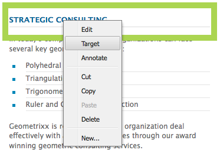

# 타깃팅된 컨텐츠를 위한 개발{#developing-for-targeted-content}

이 섹션에서는 컨텐츠 타깃팅에 사용할 구성 요소를 개발하는 방법에 대해 설명합니다.

* Adobe Target과의 연결에 대한 자세한 내용은 [Adobe Target과 통합](/help/sites-administering/target.md)을 참조하십시오.
* 타깃팅된 컨텐츠 작성에 대한 자세한 내용은 [타깃팅 모드를 사용하여 타깃팅된 컨텐츠 작성](/help/sites-authoring/content-targeting-touch.md)을 참조하십시오.

>[!NOTE]
>
>AEM 작성자의 구성 요소를 타깃팅하면 구성 요소는 캠페인을 등록하고, 오퍼를 설정하고, Adobe Target 세그먼트를 가져오기 위해 Adobe Target에 일련의 서버측 호출을 만듭니다(구성된 경우). AEM에서 Adobe Target으로 게시한 서버측 호출은 없습니다.

## 페이지 {#enabling-targeting-with-adobe-target-on-your-pages}에서 Adobe Target으로 타깃팅 활성화

Adobe Target과 상호 작용하는 페이지에서 타깃팅된 구성 요소를 사용하려면 &lt;head> 요소에 특정 클라이언트측 코드를 포함시키십시오.

### 헤드 섹션 {#the-head-section}

다음 코드 블록을 페이지의 &lt;head> 섹션에 모두 추가합니다.

```xml
<!--/* Include Context Hub */-->
<sly data-sly-resource="${'contexthub' @ resourceType='granite/contexthub/components/contexthub'}"/>
```

```xml
<cq:include script="/libs/cq/cloudserviceconfigs/components/servicelibs/servicelibs.jsp"/>
```

이 코드는 필요한 분석 javascript 개체를 추가하고 웹 사이트와 연결된 클라우드 서비스 라이브러리를 로드합니다. Target 서비스의 경우 라이브러리는 `/libs/cq/analytics/components/testandtarget/headlibs.jsp`을 통해 로드됩니다.

로드된 라이브러리 세트는 Target 구성에 사용되는 대상 클라이언트 라이브러리(mbox.js 또는 at.js)의 유형에 따라 다릅니다.

**기본 mbox.js**

```
<script type="text/javascript" src="/libs/cq/foundation/testandtarget/parameters.js"></script>
 <script type="text/javascript" src="/libs/cq/foundation/testandtarget/mbox.js"></script>
 <script type="text/javascript" src="/libs/cq/foundation/personalization/integrations/commons.js"></script>
 <script type="text/javascript" src="/libs/cq/foundation/testandtarget/util.js"></script>
 <script type="text/javascript" src="/libs/cq/foundation/testandtarget/init.js"></script>
```

**사용자 지정 mbox.js의 경우**

```
<script type="text/javascript" src="/etc/cloudservices/testandtarget/<CLIENT-CODE>/_jcr_content/public/mbox.js"></script>
        <script type="text/javascript" src="/libs/cq/foundation/testandtarget/parameters.js"></script>
 <script type="text/javascript" src="/libs/cq/foundation/personalization/integrations/commons.js"></script>
 <script type="text/javascript" src="/libs/cq/foundation/testandtarget/util.js"></script>
 <script type="text/javascript" src="/libs/cq/foundation/testandtarget/init.js"></script>
```

**at.js용**

```
<script type="text/javascript" src="/libs/cq/foundation/testandtarget/parameters.js"></script>
 <script type="text/javascript" src="/libs/cq/foundation/testandtarget/atjs-integration.js"></script>
 <script type="text/javascript" src="/libs/cq/foundation/testandtarget/atjs.js"></script>
```

>[!NOTE]
>
>제품과 함께 제공된 `at.js` 버전만 지원됩니다. 제품과 함께 제공되는 `at.js` 버전은 다음 위치의 `at.js` 파일을 보면 얻을 수 있습니다.
>
>**/libs/cq/testandtarget/clientlibs/testandtarget/atjs/source/at.js**.

**사용자 지정 at.js의 경우**

```
<script type="text/javascript" src="/etc/cloudservices/testandtarget/<CLIENT-CODE>/_jcr_content/public/at.js"></script>
    <script type="text/javascript" src="/libs/cq/foundation/testandtarget/parameters.js"></script>
 <script type="text/javascript" src="/libs/cq/foundation/testandtarget/atjs-integration.js"></script>
```

클라이언트 측의 Target 기능은 `CQ_Analytics.TestTarget` 개체에서 관리합니다. 따라서 페이지에 다음 예와 같은 일부 init 코드가 포함됩니다.

```
<script type="text/javascript">
            if ( !window.CQ_Analytics ) {
                window.CQ_Analytics = {};
            }
            if ( !CQ_Analytics.TestTarget ) {
                CQ_Analytics.TestTarget = {};
            }
            CQ_Analytics.TestTarget.clientCode = 'my_client_code';
        </script>
      ...

    <div class="cloudservice testandtarget">
  <script type="text/javascript">
  CQ_Analytics.TestTarget.maxProfileParams = 11;

  if (CQ_Analytics.CCM) {
   if (CQ_Analytics.CCM.areStoresInitialized) {
    CQ_Analytics.TestTarget.registerMboxUpdateCalls();
   } else {
    CQ_Analytics.CCM.addListener("storesinitialize", function (e) {
     CQ_Analytics.TestTarget.registerMboxUpdateCalls();
    });
   }
  } else {
   // client context not there, still register calls
   CQ_Analytics.TestTarget.registerMboxUpdateCalls();
  }
  </script>
 </div>
```

JSP는 필요한 분석 javascript 개체 및 참조를 클라이언트측 javascript 라이브러리에 추가합니다. testandtarget.js 파일에는 mbox.js 함수가 들어 있습니다. 스크립트가 생성하는 HTML은 다음 예와 유사합니다.

```xml
<script type="text/javascript">
        if ( !window.CQ_Analytics ) {
            window.CQ_Analytics = {};
        }
        if ( !CQ_Analytics.TestTarget ) {
            CQ_Analytics.TestTarget = {};
        }
        CQ_Analytics.TestTarget.clientCode = 'MyClientCode';
</script>
<link rel="stylesheet" href="/etc/clientlibs/foundation/testandtarget/testandtarget.css" type="text/css">
<script type="text/javascript" src="/etc/clientlibs/foundation/testandtarget/testandtarget.js"></script>
<script type="text/javascript" src="/etc/clientlibs/foundation/testandtarget/init.js"></script>
```

#### 본문 섹션(시작) {#the-body-section-start}

&lt;body> 태그 바로 다음에 다음 코드를 추가하여 클라이언트 컨텍스트 기능을 페이지에 추가합니다.

```xml
<cq:include path="clientcontext" resourceType="cq/personalization/components/clientcontext"/>
```

#### 본문 섹션(끝) {#the-body-section-end}

&lt;/body> 종료 태그 바로 앞에 다음 코드를 추가합니다.

```xml
<cq:include path="cloudservices" resourceType="cq/cloudserviceconfigs/components/servicecomponents"/>
```

이 구성 요소의 JSP 스크립트는 Target javascript API에 대한 호출을 생성하고 기타 필요한 구성을 구현합니다. 스크립트가 생성하는 HTML은 다음 예와 유사합니다.

```xml
<div class="servicecomponents cloudservices">
  <div class="cloudservice testandtarget">
    <script type="text/javascript">
      CQ_Analytics.TestTarget.maxProfileParams = 11;
      CQ_Analytics.CCM.addListener("storesinitialize", function(e) {
        CQ_Analytics.TestTarget.registerMboxUpdateCalls();
      });
    </script>
    <div id="cq-analytics-texthint" style="background:white; padding:0 10px; display:none;">
      <h3 class="cq-texthint-placeholder">Component clientcontext is missing or misplaced.</h3>
    </div>
    <script type="text/javascript">
      $CQ(function(){
      if( CQ_Analytics &&
          CQ_Analytics.ClientContextMgr &&
          !CQ_Analytics.ClientContextMgr.isConfigLoaded )
        {
          $CQ("#cq-analytics-texthint").show();
        }
      });
    </script>
  </div>
</div>
```

### 사용자 정의 Target 라이브러리 파일 {#using-a-custom-target-library-file} 사용

>[!NOTE]
>
>DTM 또는 다른 대상 마케팅 시스템을 사용하지 않는 경우 사용자 지정 대상 라이브러리 파일을 사용할 수 있습니다.

>[!NOTE]
>
>기본적으로 mbox는 숨겨지며 mboxDefault 클래스는 이 동작을 결정합니다. mbox를 숨기면 교환되기 전에 방문자에게 기본 컨텐츠가 표시되지 않습니다.그러나 mbox를 숨기면 감지된 성능에 영향을 줍니다.

mbox를 만드는 데 사용되는 기본 mbox.js 파일은 /etc/clientlibs/foundation/testandtarget/mbox/source/mbox.js에 있습니다. 고객 mbox.js 파일을 사용하려면 Target 클라우드 구성에 파일을 추가합니다. 파일을 추가하려면 파일 시스템에서 mbox.js 파일을 사용할 수 있어야 합니다.

예를 들어 [Marketing Cloud ID 서비스](https://docs.adobe.com/content/help/en/id-service/using/home.html)를 사용하려면 테넌트를 기반으로 하는 `imsOrgID` 변수에 올바른 값을 포함하도록 mbox.js를 다운로드해야 합니다. 이 변수는 Marketing Cloud ID 서비스와 통합하는 데 필요합니다. 자세한 내용은 [Adobe Analytics을 Adobe Target](https://docs.adobe.com/content/help/en/target/using/integrate/a4t/a4t.html)의 보고 소스로 사용하고 [구현하기 전에 ](https://docs.adobe.com/content/help/en/target/using/integrate/a4t/before-implement.html)를 참조하십시오.

>[!NOTE]
>
>사용자 지정 mbox가 Target 구성에 정의된 경우 모든 사람이 게시 서버의 **/etc/cloudservices**&#x200B;에 대한 읽기 권한을 가져야 합니다. 이 액세스 권한이 없으면 게시 웹 사이트에서 mbox.js 파일을 로드하면 404 오류가 발생합니다.

1. CQ **도구** 페이지로 이동하고 **Cloud Services**&#x200B;을 선택합니다. ([https://localhost:4502/libs/cq/core/content/tools/cloudservices.html](https://localhost:4502/libs/cq/core/content/tools/cloudservices.html))
1. 트리에서 Adobe Target을 선택하고 구성 목록에서 Target 구성을 두 번 클릭합니다.
1. 구성 페이지에서 편집을 클릭합니다.
1. 사용자 지정 mbox.js 속성에 대해 찾아보기를 클릭하고 파일을 선택합니다.
1. 변경 사항을 적용하려면 Adobe Target 계정의 암호를 입력하고 [Target에 다시 연결]을 클릭한 다음 연결이 성공하면 [확인]을 클릭합니다. 그런 다음 구성 요소 편집 대화 상자에서 확인을 클릭합니다.

Target 구성에는 사용자 지정 mbox.js 파일인 [페이지의 헤드 섹션](/help/sites-developing/target.md#p-the-head-section-p)에 있는 필수 코드가 포함되어 있으며 testandtarget.js 라이브러리에 대한 참조가 아니라 클라이언트 라이브러리 프레임워크에 파일이 추가됩니다.

## 구성 요소 {#disabling-the-target-command-for-components}에 대한 Target 명령 비활성화

대부분의 구성 요소는 컨텍스트 메뉴의 Target 명령을 사용하여 타깃팅된 구성 요소로 변환할 수 있습니다.



컨텍스트 메뉴에서 Target 명령을 제거하려면 구성 요소의 cq:editConfig 노드에 다음 속성을 추가합니다.

* 이름:cq:disableTargeting
* Type: Boolean
* 값:True

예를 들어 Geometrixx 데모 사이트 페이지의 제목 구성 요소에 대한 타깃팅을 비활성화하려면 속성을 /apps/geometrixx/components/title/cq:editConfig 노드에 추가합니다.


## 주문 확인 정보를 Adobe Target {#sending-order-confirmation-information-to-adobe-target}에 전송

>[!NOTE]
>
>DTM을 사용하지 않는 경우 주문 확인을 Adobe Target에 보냅니다.

웹 사이트의 성능을 추적하려면 주문 확인 페이지에서 Adobe Target으로 구매 정보를 보내십시오. (Adobe Target 문서에서 [orderConfirmPage mbox](https://docs.adobe.com/content/help/en/dtm/implementing/target/configure-target/mboxes/order-confirmation-mbox.html) 만들기 참조) Adobe Target은 MBox 이름이 `orderConfirmPage`인 경우 mbox 데이터를 주문 확인 데이터로 인식하고 다음과 같은 특정 매개 변수 이름을 사용합니다.

* productPurchasedId:구매한 제품을 식별하는 ID 목록입니다.
* orderId:주문의 ID.
* orderTotal:총 구매 금액.

mbox를 만드는 렌더링된 HTML 페이지의 코드는 다음 예와 유사합니다.

```xml
<script type="text/javascript">
     mboxCreate('orderConfirmPage',
     'productPurchasedId=product1 product2 product3',
     'orderId=order1234',
     'orderTotal=24.54');
</script>
```

각 매개 변수의 값은 각 순서에 따라 다릅니다. 따라서 구매 속성을 기반으로 코드를 생성하는 구성 요소가 필요합니다. CQ [eCommerce Integration Framework](/help/sites-administering/ecommerce.md)를 사용하면 제품 카탈로그와 통합하고 장바구니 및 체크아웃 페이지를 구현할 수 있습니다.

방문자가 제품을 구입할 때 Geometrixx Outdoors 샘플에 다음 확인 페이지가 표시됩니다.


구성 요소의 JSP 스크립트에 대한 다음 코드는 장바구니의 속성에 액세스한 다음 mbox를 만들기 위한 코드를 인쇄합니다.

```java
<%--

  confirmationmbox component.

--%><%
%><%@include file="/libs/foundation/global.jsp"%><%
%><%@page session="false"
          import="com.adobe.cq.commerce.api.CommerceService,
                  com.adobe.cq.commerce.api.CommerceSession,
                  com.adobe.cq.commerce.common.PriceFilter,
                  com.adobe.cq.commerce.api.Product,
                  java.util.List, java.util.Iterator"%><%

/* obtain the CommerceSession object */
CommerceService commerceservice = resource.adaptTo(CommerceService.class);
CommerceSession session = commerceservice.login(slingRequest, slingResponse);

/* obtain the cart items */
List<CommerceSession.CartEntry> entries = session.getCartEntries();
Iterator<CommerceSession.CartEntry> cartiterator = entries.iterator();

/* iterate the items and get the product IDs */
String productIDs = new String();
while(cartiterator.hasNext()){
 CommerceSession.CartEntry entry = cartiterator.next();
 productIDs = productIDs + entry.getProduct().getSKU();
    if (cartiterator.hasNext()) productIDs = productIDs + ", ";
}

/* get the cart price and orderID */
String total = session.getCartPrice(new PriceFilter("CART", "PRE_TAX"));
String orderID = session.getOrderId();

%><div class="mboxDefault"></div>
<script type="text/javascript">
     mboxCreate('orderConfirmPage',
     'productPurchasedId=<%= productIDs %>',
     'orderId=<%= orderID %>',
     'orderTotal=<%= total %>');
</script>
```

구성 요소가 이전 예의 체크아웃 페이지에 포함되는 경우 페이지 소스에는 mbox를 만드는 다음 스크립트가 포함됩니다.

```
<div class="mboxDefault"></div>
<script type="text/javascript">

     mboxCreate('orderConfirmPage',
     'productPurchasedId=47638-S, 46587',
     'orderId=d03cb015-c30f-4bae-ab12-1d62b4d105ca',
     'orderTotal=US$677.00');

</script>
```

## Target 구성 요소 {#understanding-the-target-component} 이해

Target 구성 요소를 사용하면 작성자가 CQ 컨텐츠 구성 요소에서 동적 mbox를 만들 수 있습니다. ([콘텐츠 타깃팅](/help/sites-authoring/content-targeting-touch.md)을 참조하십시오.) Target 구성 요소는 /libs/cq/personalization/components/target에 있습니다.

target.jsp 스크립트는 페이지 속성에 액세스하여 구성 요소에 사용할 타깃팅 엔진을 결정한 다음 적절한 스크립트를 실행합니다.

* Adobe Target:/libs/cq/personalization/components/target/engine_tnt.jsp
* [Adobe Target(AT.JS 포함](/help/sites-administering/target.md):/libs/cq/personalization/components/target/engine_atjs.jsp
* [Adobe Campaign](/help/sites-authoring/target-adobe-campaign.md):/libs/cq/personalization/components/target/engine_cq_campaign.jsp
* 클라이언트측 규칙/ContextHub:/libs/cq/personalization/components/target/engine_cq.jsp

### mbox 만들기 {#the-creation-of-mboxes}

>[!NOTE]
>
>기본적으로 mbox는 숨겨지며 mboxDefault 클래스는 이 동작을 결정합니다. mbox를 숨기면 교환되기 전에 방문자에게 기본 컨텐츠가 표시되지 않습니다.그러나 mbox를 숨기면 감지된 성능에 영향을 줍니다.

Adobe Target이 컨텐츠 타깃팅을 실행하는 경우 engine_tnt.jsp 스크립트는 타깃팅된 경험의 컨텐츠를 포함하는 mbox를 생성합니다.

* Adobe Target API에서 요구하는 대로 `mboxDefault` 클래스의 `div` 요소를 추가합니다.

* `div` 요소 내에 mbox 컨텐츠(타깃팅된 경험의 컨텐츠)를 추가합니다.

`mboxDefault` div 요소 다음에 mbox를 만드는 javascript가 삽입됩니다.

* mbox 이름, ID 및 위치는 구성 요소의 저장소 경로를 기반으로 합니다.
* 이 스크립트는 클라이언트 컨텍스트 매개 변수 이름과 값을 가져옵니다.
* mbox.js 및 기타 클라이언트 라이브러리가 mbox를 만들기 위해 정의하는 함수에 대한 호출이 수행됩니다.

#### 콘텐츠 타깃팅용 클라이언트 라이브러리 {#client-libraries-for-content-targeting}

다음은 사용 가능한 clientlib 범주입니다.

* testandtarget.mbox
* testandtarget.init
* testandtarget.util
* testandtarget.atjs
* testandtarget.atjs-integration
