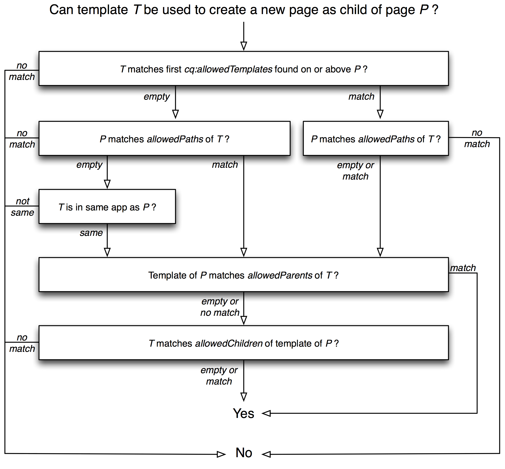

# 템플릿{#templates}

템플릿은 AEM의 다양한 지점에서 사용됩니다.

* [페이지를 만들 때 템플릿](#templates-pages);을 선택해야 합니다.새 페이지의 기초로 사용됩니다. 템플릿은 결과 페이지의 구조, 초기 컨텐츠 및 사용할 수 있는 [구성 요소](/help/sites-authoring/default-components.md)(디자인 속성)를 정의합니다.

* [컨텐츠 조각을 만드는 경우 템플릿](#templates-content-fragments)을 선택해야 합니다. 이 템플릿은 구조, 초기 요소 및 변형을 정의합니다.

다음 템플릿은 자세히 다룹니다.

* [페이지 템플릿 - 편집 가능](/help/sites-developing/page-templates-editable.md)
* [페이지 템플릿 - 정적](/help/sites-developing/page-templates-static.md)
* [컨텐츠 조각 템플릿](/help/sites-developing/content-fragment-templates.md)
* [적응형 템플릿 렌더링](/help/sites-developing/templates-adaptive-rendering.md)

## 템플릿 - 페이지 {#templates-pages}

AEM은 이제 페이지 작성을 위한 두 가지 기본 유형의 템플릿을 제공합니다.

>[!NOTE]
>
>템플릿을 사용하여 [새 페이지 만들기](/help/sites-authoring/managing-pages.md#creating-a-new-page)에는 페이지 작성자에게 보이는 차이점과 사용 중인 템플릿 유형을 알 수 없습니다.

### 편집 가능한 템플릿 {#editable-templates}

편집 가능한 템플릿은 이제 AEM으로 개발하기 위한 우수 사례로 간주됩니다.

편집 가능한 템플릿의 이점:

* 작성자가 [만든](/help/sites-authoring/templates.md#creating-a-new-template-template-author) 및 [편집한](/help/sites-authoring/templates.md#editing-a-template-structure-template-author)일 수 있습니다.

* 템플릿으로 만든 모든 페이지에 대해 다음을 정의할 수 있도록 하기 위해 도입되었습니다.

   * 구조
   * 초기 컨텐츠
   * 컨텐츠 정책

* 새 페이지가 만들어지면 페이지와 템플릿 간에 동적 연결이 유지됩니다.즉, 템플릿 구조에 대한 변경 사항은 해당 템플릿으로 만든 페이지에 반영됩니다(초기 컨텐츠에 대한 변경 사항은 반영되지 않음).
* 템플릿 편집기에서 편집한 컨텐츠 정책을 사용하여 디자인 속성을 유지합니다(페이지 편집기 내에서 디자인 모드를 사용하지 않음).
* `/conf` 아래에 저장됨
* 자세한 내용은 [편집 가능한 템플릿](/help/sites-developing/page-templates-editable.md)을 참조하십시오.

>[!NOTE]
>
>AEM 커뮤니티 아티클은 편집 가능한 템플릿으로 Experience Manager 사이트를 개발하는 방법에 대해 설명합니다. [편집 가능한 템플릿을 사용하여 Adobe Experience Manager 6.5 웹 사이트 만들기](https://helpx.adobe.com/experience-manager/using/first_aem64_website.html)를 참조하십시오.

### 정적 템플릿 {#static-templates}

정적 템플릿:

* 개발자가 정의하고 구성해야 합니다.
* AEM의 원래 템플릿 설정이며 여러 버전에서 사용할 수 있습니다.
* 정적 템플릿은 만들 페이지와 동일한 구조를 갖지만 실제 컨텐츠가 없는 노드 계층 구조입니다.
* 새 페이지를 만들기 위해 복사되며, 그 후에는 동적 연결이 없습니다.
* 디자인 속성을 유지하려면 [디자인 모드](/help/sites-authoring/default-components-designmode.md)를 사용합니다.
* `/apps` 아래에 저장됨
* 자세한 내용은 [정적 템플릿](/help/sites-developing/page-templates-static.md)을 참조하십시오.

>[!NOTE]
>
>AEM 6.5부터 정적 템플릿의 사용은 우수 사례로 간주되지 않습니다. 편집 가능한 템플릿을 대신 사용하십시오.
>
>[AEM ](modernization-tools.md) Modernizationtools를 사용하면 정적 템플릿을 편집 가능한 템플릿으로 마이그레이션할 수 있습니다.

### 템플릿 가용성 {#template-availability}

>[!CAUTION]
>
>AEM은 **사이트**&#x200B;에서 허용되는 템플릿을 제어하는 여러 속성을 제공합니다. 그러나 이러한 규칙을 결합하면 추적과 관리가 어려운 매우 복잡한 규칙이 만들어질 수 있습니다.
>
>따라서 Adobe은 다음을 정의하여 간단하게 시작할 것을 권장합니다.
>
>* `cq:allowedTemplates` 속성만
   >
   >
* 사이트 루트에서만
>
>
예를 보려면 We.Retail:`/content/we-retail/jcr:content`
>
>속성 `allowedPaths`, `allowedParents` 및 `allowedChildren`도 템플릿에 배치하여 보다 정교한 규칙을 정의할 수 있습니다. 그러나 가능한 경우, 허용되는 템플릿을 추가로 제한할 필요가 있는 경우 사이트의 하위 섹션에서 *속성을 더 정의하는 것이 훨씬 간단합니다.*`cq:allowedTemplates`
>
>또 다른 이점은 **페이지 속성**&#x200B;의 **고급** 탭에서 작성자가 `cq:allowedTemplates` 속성을 업데이트할 수 있다는 것입니다. 다른 템플릿 속성은 (표준) UI를 사용하여 업데이트할 수 없으므로 변경 사항에 대한 규칙과 코드 배포를 유지하기 위해 개발자가 필요합니다.

사이트 관리 인터페이스에서 새 페이지를 만들 때 사용 가능한 템플릿 목록은 새 페이지의 위치 및 각 템플릿에 지정된 배치 제한에 따라 달라집니다.

다음 속성은 `T` 템플릿을 페이지 `P`의 자식으로 배치할 새 페이지에 사용할 수 있는지 여부를 결정합니다. 이러한 각 속성은 0개 이상의 정규 표현식을 포함하는 다중 값 문자열로서, 경로 일치 시 사용됩니다.

* `P`의 `jcr:content` 하위 노드의 `cq:allowedTemplates` 속성 또는 `P`의 상위 노드입니다.

* `T`의 `allowedPaths` 속성입니다.

* `T`의 `allowedParents` 속성입니다.

* `P` 템플릿의 `allowedChildren` 속성입니다.

평가는 다음과 같이 작동합니다.

* `P`로 시작하는 페이지 계층 구조의 오름차순으로 시작하는 동안 비어 있지 않은 첫 번째 `cq:allowedTemplates` 속성이 `T`의 경로와 일치합니다. 값이 일치하지 않으면 `T`이(가) 거부됩니다.

* `T`에 비어 있지 않은 `allowedPaths` 속성이 있지만 값이 `P` 경로와 일치하지 않으면 `T`이(가) 거부됩니다.

* 위의 두 속성이 모두 비어 있거나 존재하지 않는 경우 `T`은(는) `P`과(와) 동일한 응용 프로그램에 속하지 않는 한 거부됩니다. `T` 는  `P` if와 동일한 응용 프로그램에 속하며, 경로의 두 번째 수준 이름 `T` 이 경로의 두 번째 수준 이름과 같은 경우에만  `P`속합니다. 예를 들어 템플릿 `/apps/geometrixx/templates/foo`은(는) 페이지 `/content/geometrixx`과(와) 동일한 애플리케이션에 속합니다.

* `T`에 비어 있지 않은 `allowedParents` 속성이 있지만 값이 `P` 경로와 일치하지 않으면 `T`이(가) 거부됩니다.

* `P` 템플릿에 비어 있지 않은 `allowedChildren` 속성이 있지만 값이 `T` 경로와 일치하지 않으면 `T`이(가) 거부됩니다.

* 다른 모든 경우에는 `T`이(가) 허용됩니다.

다음 다이어그램은 템플릿 평가 프로세스를 보여 줍니다.

#### 하위 페이지 {#limiting-templates-used-in-child-pages}에 사용된 템플릿 제한

지정된 페이지 아래에 하위 페이지를 만드는 데 사용할 수 있는 템플릿을 제한하려면 페이지의 `jcr:content` 노드의 `cq:allowedTemplates` 속성을 사용하여 하위 페이지로 허용할 템플릿 목록을 지정합니다. 목록의 각 값은 허용되는 하위 페이지에 대한 템플릿의 절대 경로여야 합니다(예: `/apps/geometrixx/templates/contentpage`).

템플릿의 `jcr:content` 노드에서 `cq:allowedTemplates` 속성을 사용하여 이 템플릿을 사용하는 새로 만든 모든 페이지에 이 구성이 적용되도록 할 수 있습니다.

템플릿 계층 구조와 같은 추가 제약 조건을 추가하려면 템플릿에서 `allowedParents/allowedChildren` 속성을 사용할 수 있습니다. 그런 다음 템플릿에서 만든 페이지를 T 템플릿으로 만든 페이지의 부모/자식으로 명시적으로 지정할 수 있습니다.

## 템플릿 - 컨텐츠 조각 {#templates-content-fragments}

자세한 내용은 [컨텐츠 조각 템플릿](/help/sites-developing/content-fragment-templates.md)을 참조하십시오.
