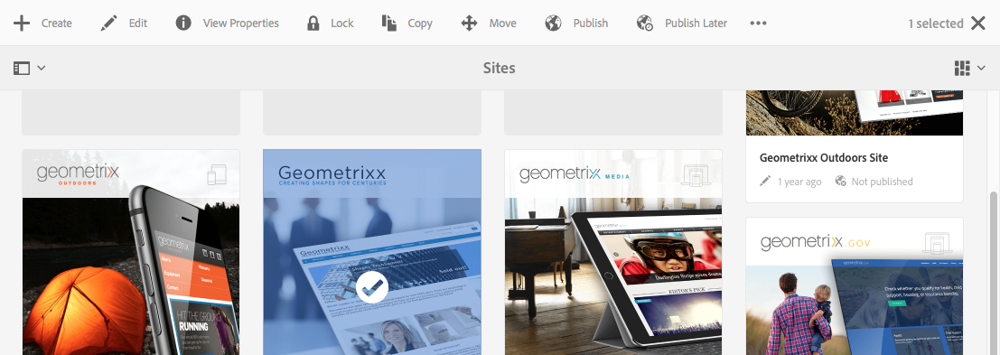
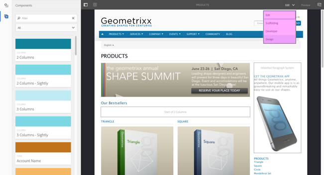

# AEM 터치 지원 UI의 구조{#structure-of-the-aem-touch-enabled-ui}

AEM 터치 지원 UI에는 몇 가지 기본 원칙이 있으며 몇 가지 주요 요소가 있습니다.

## 콘솔 {#consoles}

### 기본 레이아웃 및 크기 조정 {#basic-layout-and-resizing}

두 가지 스타일 Adobe을 만드는 대신 모든 화면과 장치에 맞는 하나의 스타일을 사용하기로 결정한 UI는 모바일 및 데스크톱 장치 모두를 위한 도구입니다.

모든 모듈은 동일한 기본 레이아웃을 사용합니다. AEM에서는 다음과 같이 볼 수 있습니다.

레이아웃은 응답형 디자인 스타일을 준수하며 사용 중인 장치/창의 크기에 맞게 자동으로 조정됩니다.

예를 들어 해상도가 1024px(모바일 장치) 아래로 내려가면 디스플레이가 그에 따라 조정됩니다.

### 헤더 막대 {#header-bar}

헤더 막대에 다음과 같은 전역 요소가 표시됩니다.

* 로고 및 현재 사용 중인 특정 제품/솔루션;aem의 경우 전역 탐색에 대한 링크가
* 검색
* 도움말 리소스 액세스 아이콘
* 다른 솔루션에 액세스하기 위한 아이콘
* 대기 중인 알림 또는 받은 편지함 항목의 표시기(및 액세스)
* 프로필 관리에 대한 링크와 함께 사용자 아이콘

### 도구 모음 {#toolbar}

이것은 아래 페이지의 보기 또는 자산을 제어하는 것과 관련된 위치 및 표면 도구에 상황에 맞는 것입니다. 도구 모음은 제품별로 다르지만 요소에 공통성이 있습니다.

어떤 위치에서든 도구 모음에는 현재 사용 가능한 작업이 표시됩니다.

또한 리소스가 현재 선택되었는지 여부에 따라 달라집니다.

### 왼쪽 레일 {#left-rail}

왼쪽 레일은 필요에 따라 열거나 숨길 수 있습니다.

* **타임라인**
* **참조**
* **필터**

기본값은 **Content Only**(레일 숨김)입니다.

## 페이지 작성 {#page-authoring}

페이지를 작성할 때 구조적 영역은 다음과 같습니다.

### 내용 프레임 {#content-frame}

페이지 컨텐츠는 컨텐츠 프레임에서 렌더링됩니다. 컨텐츠 프레임은 편집기와 완전히 독립되어 CSS 또는 javascript로 인해 충돌이 발생하지 않습니다.

내용 프레임은 창 오른쪽 도구 모음 아래에 있습니다.

### 편집기 프레임 {#editor-frame}

편집자 프레임은 편집 기능을 인식합니다.

편집기 프레임은 모든 *페이지 작성 요소*&#x200B;에 대한 컨테이너(추상)입니다. 컨텐츠 프레임 위에 있으며 다음을 포함합니다.

* 상단 도구 모음
* 사이드 패널
* 모든 오버레이
* 기타 페이지 작성 요소예를 들어, 구성 요소 도구 모음

### 사이드 패널 {#side-panel}

여기에는 자산 및 구성 요소를 선택할 수 있는 두 개의 기본 탭이 포함되어 있습니다.여기에서 드래그하여 페이지로 놓을 수 있습니다.

사이드 패널은 기본적으로 숨겨집니다. 이 옵션을 선택하면 왼쪽 측면에 표시될 수도 있고, 전체 창을 덮기 위해 옆으로 밀릴 수도 있습니다(창 크기가 1024px 미만인 경우).예를 들어, 모바일 장치에서)와 같습니다.

### 사이드 패널 - 자산 {#side-panel-assets}

자산 탭에서 자산 범위에서 선택할 수 있습니다. 특정 용어에 대해 필터링하거나 그룹을 선택할 수도 있습니다.

### 사이드 패널 - 자산 그룹 {#side-panel-asset-groups}

자산 탭에 특정 자산 그룹을 선택하는 데 사용할 수 있는 드롭다운이 있습니다.

### 사이드 패널 - 구성 요소 {#side-panel-components}

구성 요소 탭에서 구성 요소 범위에서 선택할 수 있습니다. 특정 용어에 대해 필터링하거나 그룹을 선택할 수도 있습니다.

### 오버레이 {#overlays}

이러한 오버레이는 컨텐츠 프레임을 오버레이하며 [layers](#layer)에서 구성 요소 및 해당 컨텐츠와 상호 작용(완전히 투명하게)하는 방법에 대한 메커니즘을 실현합니다.

오버레이는 컨텐츠 프레임에 해당 구성 요소를 오버레이하지만 다른 모든 페이지 제작 요소와 함께 편집기 프레임에서 라이브됩니다.

### 레이어 {#layer}

A layer is an independent bundle of functionality that can be activated to:

* 페이지의 다른 보기 제공
* 페이지 조작 및/또는 상호 작용 허용

레이어는 개별 구성 요소에 대한 특정 작업이 아닌 전체 페이지에 대해 정교한 기능을 제공합니다.

AEM에는 페이지 작성을 위해 이미 구현된 여러 레이어가 포함되어 있습니다.예를 들어 편집, 미리 보기, 주석 달기 등이 포함됩니다.

>[!NOTE]
>
>레이어는 사용자의 페이지 컨텐츠 보기 및 상호 작용에 영향을 주는 강력한 개념입니다. 레이어를 개발할 때는 레이어를 종료한 후 깔끔하게 정리해야 합니다.

### 레이어 전환기 {#layer-switcher}

레이어 전환기를 사용하면 사용할 레이어를 선택할 수 있습니다. 닫히면 현재 사용 중인 레이어를 나타냅니다.

레이어 전환기는 도구 모음(창 상단, 편집기 프레임 내)에서 드롭다운으로 사용할 수 있습니다.

### 구성 요소 도구 모음 {#component-toolbar}

구성 요소의 각 인스턴스는 클릭할 때(한 번 또는 느린 두 번 클릭) 해당 도구 모음이 표시됩니다. 도구 모음에는 페이지의 구성 요소 인스턴스(편집 가능)에 사용할 수 있는 특정 작업(예: 복사, 붙여넣기, 편집기)이 포함되어 있습니다.

사용 가능한 공간에 따라 구성 요소 도구 모음이 해당 구성 요소의 위쪽 또는 아래쪽, 오른쪽 모서리에 배치됩니다.

## 추가 정보 {#further-information}

터치 지원 UI에 대한 개념에 대한 자세한 내용은 [AEM 터치 지원 UI의 개념](/help/sites-developing/touch-ui-concepts.md) 아티클을 참조하십시오.

자세한 기술 정보는 터치 지원 페이지 편집기의 [JS 설명서 세트](https://helpx.adobe.com/experience-manager/6-5/sites/developing/using/reference-materials/jsdoc/ui-touch/editor-core/index.html)를 참조하십시오.

