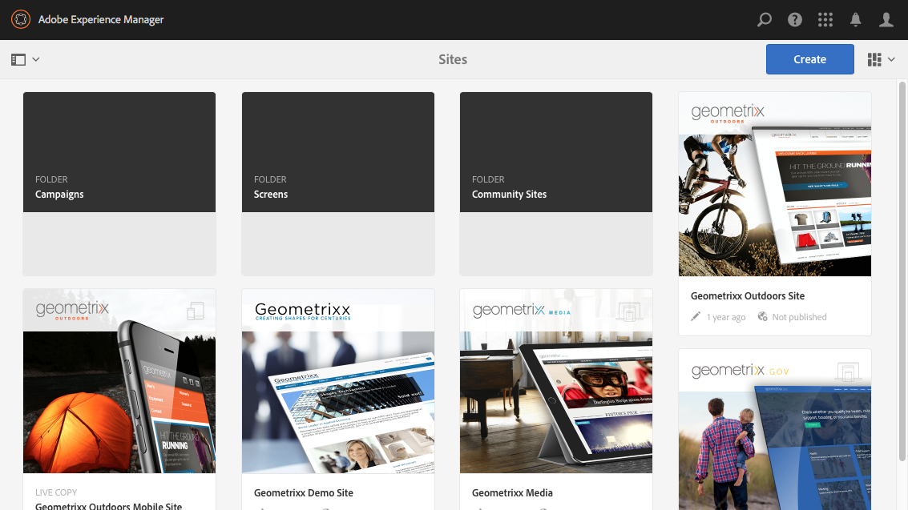

# AEM 터치 지원 UI의 구조{#structure-of-the-aem-touch-enabled-ui}

AEM 터치 지원 UI에는 몇 가지 기본 원칙이 있으며, 다음과 같은 몇 가지 주요 요소로 구성됩니다.

## 콘솔 {#consoles}

### 기본 레이아웃 및 크기 조정 {#basic-layout-and-resizing}

두 가지 스타일 Adobe을 만들지 않고 모바일 및 데스크톱 장치 모두에 대해 UI는 모든 화면 및 장치에 작동하는 하나의 스타일을 사용하기로 결정했습니다.

모든 모듈은 동일한 기본 레이아웃을 사용합니다. AEM에서는 다음과 같이 볼 수 있습니다.

레이아웃은 응답형 디자인 스타일을 준수하며 사용 중인 장치/창의 크기에 맞게 조정됩니다.

예를 들어 해상도가 1024px(모바일 장치에서와 같이) 미만이면 디스플레이가 그에 따라 조정됩니다.

### 헤더 막대 {#header-bar}

헤더 막대는 다음을 포함한 글로벌 요소를 보여줍니다.

* 현재 사용 중인 로고 및 특정 제품/솔루션AEM용 전역 탐색에 대한 링크도 형성합니다
* 검색
* 도움말 리소스 액세스 아이콘
* 다른 솔루션 액세스를 위한 아이콘
* 대기 중인 경고 또는 받은 편지함 항목의 지표(및 액세스)
* 프로필 관리에 대한 링크와 함께 사용자 아이콘

### 도구 모음 {#toolbar}

이것은 아래 페이지에서 보기 또는 자산을 제어하는 것과 관련된 위치 및 서피스 도구와 컨텍스트입니다. 도구 모음은 제품별로 다르지만 요소에 공통성이 있습니다.

어떤 위치로든 도구 모음에는 현재 사용 가능한 작업이 표시됩니다.

또한 리소스가 현재 선택되어 있는지 여부에 따라 달라집니다.

### 왼쪽 레일 {#left-rail}

왼쪽 레일은 필요에 따라 열고 숨길 수 있습니다.

* **타임라인**
* **참조**
* **필터**

기본값은 **컨텐츠 전용**(레일 숨김)입니다.

## 페이지 작성 {#page-authoring}

페이지를 작성할 때 구조적 영역은 다음과 같습니다.

### 컨텐츠 프레임 {#content-frame}

페이지 컨텐츠가 컨텐츠 프레임에 렌더링됩니다. 컨텐츠 프레임은 편집기와 완전히 독립적입니다. CSS 또는 Javascript로 인해 충돌이 발생하지 않도록 합니다.

컨텐츠 프레임은 창의 오른쪽 섹션, 도구 모음 아래에 있습니다.

### 편집기 프레임 {#editor-frame}

편집기 프레임은 편집 기능을 실현합니다.

편집기 프레임은 모든 *페이지 작성 요소*&#x200B;에 대한 컨테이너(추상)입니다. 컨텐츠 프레임 위에 있으며 다음을 포함합니다.

* 상단 도구 모음
* 사이드 패널
* 모든 오버레이
* 다른 페이지 작성 요소예를 들어 구성 요소 도구 모음

### 사이드 패널 {#side-panel}

여기에는 자산 및 구성 요소를 선택할 수 있는 두 개의 기본 탭이 있습니다.여기에서 드래그하여 페이지로 놓을 수 있습니다.

사이드 패널은 기본적으로 숨겨집니다. 선택한 경우 왼쪽 또는 전체 창을 덮도록 슬라이딩됩니다(창 크기가 1024px보다 작은 경우).예: 모바일 장치).

### 사이드 패널 - 자산 {#side-panel-assets}

자산 탭의 자산 범위에서 선택할 수 있습니다. 특정 용어를 필터링하거나 그룹을 선택할 수도 있습니다.

### 사이드 패널 - 자산 그룹 {#side-panel-asset-groups}

자산 탭에 특정 자산 그룹을 선택하는 데 사용할 수 있는 드롭다운이 있습니다.

### 사이드 패널 - 구성 요소 {#side-panel-components}

구성 요소 탭의 구성 요소 범위에서 선택할 수 있습니다. 특정 용어를 필터링하거나 그룹을 선택할 수도 있습니다.

### 오버레이 {#overlays}

이러한 오버레이는 컨텐츠 프레임을 오버레이하고 [레이어](#layer)에서 사용하여 구성 요소 및 해당 컨텐츠와 상호 작용(완전히 투명하게)할 수 있는 방법의 메커니즘을 실현합니다.

오버레이는 실제로 컨텐츠 프레임에 적절한 구성 요소를 오버레이하지만, 다른 모든 페이지 작성 요소와 함께 편집기 프레임에서 라이브로 표시됩니다.

### 레이어 {#layer}

계층은 다음과 같이 활성화할 수 있는 기능의 독립적인 번들입니다.

* 페이지의 다른 보기를 제공합니다
* 페이지를 조작하거나 상호 작용할 수 있도록 허용

레이어는 개별 구성 요소에 대한 특정 작업과 대조적으로 전체 페이지에 정교한 기능을 제공합니다.

AEM에는 페이지 작성을 위해 이미 구현된 몇 개의 레이어가 포함되어 있습니다.예를 들어, 편집, 미리 보기, 주석 달기 등이 있습니다.

>[!NOTE]
>
>레이어는 사용자의 페이지 컨텐츠 보기 및 상호 작용에 영향을 주는 강력한 개념입니다. 자체 레이어를 개발할 때는 레이어를 종료할 때 레이어가 정리되도록 해야 합니다.

### 레이어 전환기 {#layer-switcher}

레이어 전환기를 사용하면 사용할 레이어를 선택할 수 있습니다. 닫으면 현재 사용 중인 레이어를 나타냅니다.

레이어 전환기는 도구 모음(창 상단, 편집기 프레임 내)에서 드롭다운으로 사용할 수 있습니다.

### 구성 요소 도구 모음 {#component-toolbar}

구성 요소의 각 인스턴스는 클릭하면(한 번 또는 느리게 두 번 클릭) 해당 도구 모음이 표시됩니다. 도구 모음에는 페이지의 구성 요소 인스턴스(편집 가능)에 사용할 수 있는 특정 작업(예: 복사, 붙여넣기, 열기 편집기)이 포함되어 있습니다.

사용 가능한 공간에 따라 구성 요소 도구 모음이 해당 구성 요소의 맨 위 또는 맨 아래, 오른쪽 모서리에 배치됩니다.

## 추가 정보 {#further-information}

터치 지원 UI에 대한 개념에 대한 자세한 내용은 [AEM 터치 지원 UI의 개념](/help/sites-developing/touch-ui-concepts.md) 문서를 참조하십시오.

자세한 기술 정보는 터치 지원 페이지 편집기의 [JS 설명서 세트](https://helpx.adobe.com/experience-manager/6-5/sites/developing/using/reference-materials/jsdoc/ui-touch/editor-core/index.html)를 참조하십시오.
