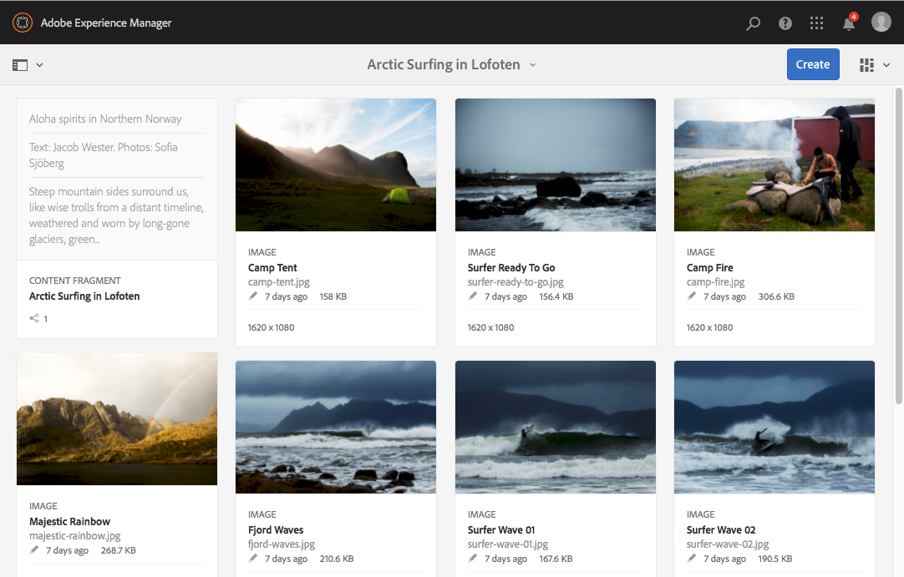
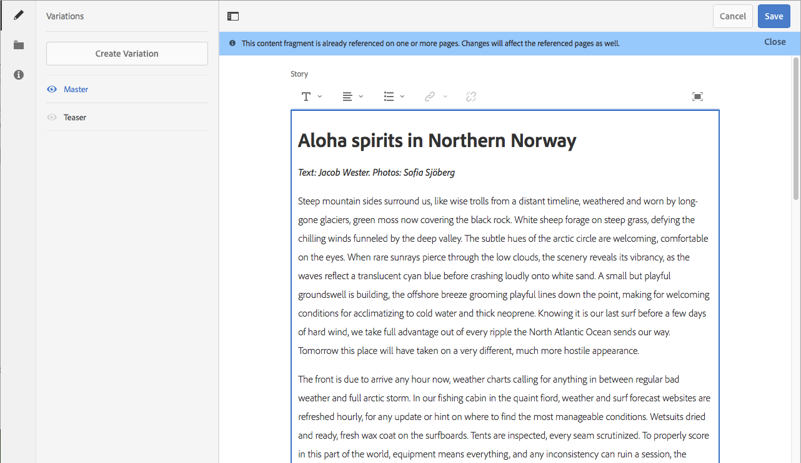

# We.Retail에서 컨텐츠 조각 시험 사용{#trying-out-content-fragments-in-we-retail}

변형(채널별로 가능)과 함께 콘텐츠 조각을 사용하여 채널 중립적인 콘텐츠를 만들 수 있습니다. **We.Retail** (AEM의 기본 인스턴스에서 사용할 수 있는 경우) 조각을 제공합니다 **로포텐의 북극 서핑** 기본 샘플로서 사용할 수 있습니다. 이것은 다음을 보여줍니다.

* Adobe Experience Manager (AEM) content fragments are [created and managed as page-independent assets](/help/assets/content-fragments/content-fragments.md). 변형(채널별로 가능)과 함께 이 조각을 사용하여 채널 중립적인 콘텐츠를 만들 수 있습니다.

   * 자세한 내용은 [We.Retail에서 컨텐츠 조각 자산을 찾을 위치](#where-to-find-content-fragments-in-we-retail)

* 그러면 다음 작업을 수행할 수 있습니다 [작성 시 이러한 조각 및 해당 변형을 사용합니다](/help/sites-authoring/content-fragments.md) 컨텐츠 페이지를 보여줍니다.

   * 자세한 내용은 [We.Retail에서 컨텐츠 조각을 사용하는 위치](#where-content-fragments-are-used-in-we-retail)

컨텐츠 조각 만들기, 관리, 사용 및 개발에 대한 전체 설명서는 다음과 같습니다.

* 자세한 내용은 [추가 정보](#further-information)

>[!NOTE]
>
>**콘텐츠 조각** 및 **[경험 조각](/help/sites-authoring/experience-fragments.md)**&#x200B;은 AEM 내의 다양한 기능입니다.
>
>* **콘텐츠 조각**&#x200B;은 편집 가능한 콘텐츠이며, 주로 텍스트나 관련 이미지입니다. 또한 디자인과 레이아웃이 없는 순수 콘텐츠입니다.
>* **경험 조각**&#x200B;은 전체적으로 배치된 컨텐츠, 즉 웹 페이지 조각입니다.
>
>경험 조각은 콘텐츠 조각 형태로 콘텐츠를 포함할 수 있지만 반대로는 불가능합니다.

## We.Retail에서 컨텐츠 조각을 찾을 위치 {#where-to-find-content-fragments-in-we-retail}

We.Retail에는 몇 가지 샘플 컨텐츠 조각이 있습니다. 을 통해 이동 **자산**, **파일**, **We.Retail**, **영어**, **경험**.

다음과 같습니다 **로포텐의 북극 서핑**, 관련 시각적 자산과 함께 조각:

* 을 통해 탐색 **자산**, **파일**, **We.Retail**, **영어**, **경험**, **로포텐의 아르틱 서핑**:

   * [http://localhost:4502/assets.html/content/dam/we-retail/en/experiences/arctic-surfing-in-lofoten](http://localhost:4502/assets.html/content/dam/we-retail/en/experiences/arctic-surfing-in-lofoten)

을(를) 선택하고 편집할 수 있습니다 **로포텐의 북극 서핑** 조각:

* [http://localhost:4502/editor.html/content/dam/we-retail/en/experiences/arctic-surfing-in-lofoten/arctic-surfing-in-lofoten](http://localhost:4502/editor.html/content/dam/we-retail/en/experiences/arctic-surfing-in-lofoten/arctic-surfing-in-lofoten)

여기에서 다음을 수행할 수 있습니다 [편집 및 관리](/help/assets/content-fragments/content-fragments.md) 탭을 사용하여 조각(왼쪽 패널):

<!--  ASSET does not exist-->

* **[변형](/help/assets/content-fragments/content-fragments-variations.md)** 포함 [Markdown](/help/assets/content-fragments/content-fragments-markdown.md)
* **[관련 컨텐츠](/help/assets/content-fragments/content-fragments-assoc-content.md)**
* **[메타데이터](/help/assets/content-fragments/content-fragments-metadata.md)**

## We.Retail에서 컨텐츠 조각을 사용하는 위치 {#where-content-fragments-are-used-in-we-retail}

예시 [컨텐츠 조각으로 페이지 작성](/help/sites-authoring/content-fragments.md) 아래에 다음과 같은 몇 가지 예제 페이지가 제공됩니다.

* [http://localhost:4502/sites.html/content/we-retail/language-masters/en/experience](http://localhost:4502/sites.html/content/we-retail/language-masters/en/experience)

예: **로포텐의 북극 서핑** 컨텐츠 조각은 사이트 페이지에서 참조됩니다.

* 을 통해 탐색 **Sites**, **We.Retail**, **언어 마스터**, **영어**, **경험**. 그런 다음 엽니다. **로포텐의 북극 서핑** 편집할 때:

   * [http://localhost:4502/editor.html/content/we-retail/language-masters/en/experience/arctic-surfing-in-lofoten.html](http://localhost:4502/editor.html/content/we-retail/language-masters/en/experience/arctic-surfing-in-lofoten.html)

## 추가 정보 {#further-information}

자세한 내용은 다음을 참조하십시오.

* [콘텐츠 조각을 사용하여 작업](/help/assets/content-fragments/content-fragments.md)

   * 컨텐츠 조각 자산을 생성, 편집 및 관리하는 방법을 알아봅니다.

* [컨텐츠 조각으로 페이지 작성](/help/sites-authoring/content-fragments.md)

   * 페이지를 작성할 때 컨텐츠 조각을 사용합니다.

* [AEM 개발 - 컨텐츠 조각용 구성 요소](/help/sites-developing/components-content-fragments.md)

   * 컨텐츠 조각용 구성 요소에 대한 개요입니다.

* [컨텐츠 조각 개발 및 확장](/help/sites-developing/customizing-content-fragments.md)

   * 컨텐츠 조각을 개발하고 확장하는 데 도움이 되는 정보입니다.
