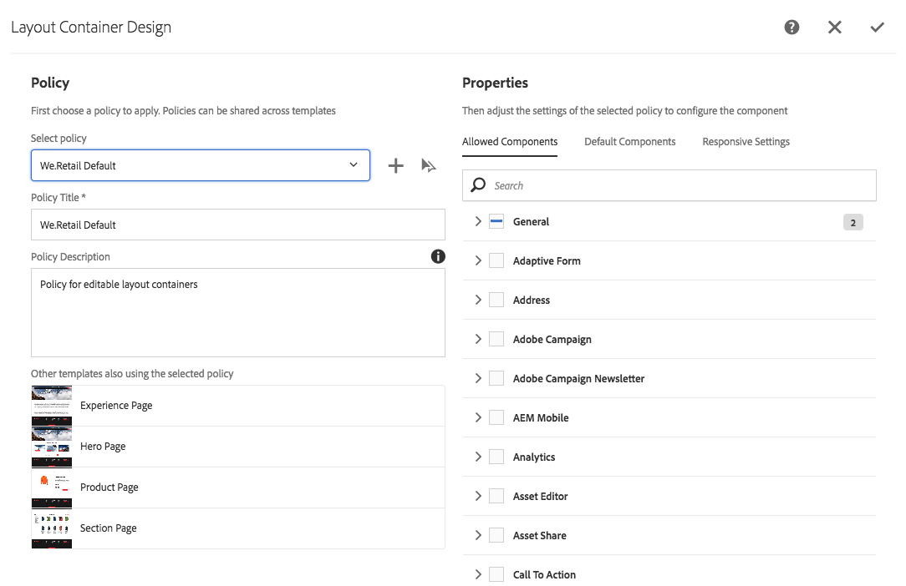

# We.Retail에서 편집 가능한 템플릿 시험 사용{#trying-out-editable-templates-in-we-retail}

편집 가능한 템플릿을 사용하면 템플릿을 만들고 유지 관리하는 작업이 더 이상 개발자 전용 작업이 아닙니다. 템플릿 작성자라고 하는 파워 유저 유형은 이제 템플릿을 만들 수 있습니다. 개발자는 여전히 환경을 설정하고, 클라이언트 라이브러리를 작성하고, 사용할 구성 요소를 작성해야 하지만, 이러한 기본 사항이 지정되면 템플릿 작성자가 개발 프로젝트 없이도 템플릿을 유연하게 작성하고 구성할 수 있습니다.

We.Retail의 모든 페이지는 편집 가능한 템플릿을 기반으로 하므로 개발자가 아닌 사용자가 템플릿을 조정하고 사용자 정의할 수 있습니다.

## {#trying-it-out} 밖에서 시도

1. 언어 마스터 분기의 장비 페이지를 편집합니다.

   http://localhost:4502/editor.html/content/we-retail/language-masters/kr/equipment.html

1. 모드 선택기는 더 이상 디자인 모드를 제공하지 않습니다. We.Retail의 모든 페이지는 편집 가능한 템플릿을 기반으로 하며, 템플릿 편집기에서 편집해야 하는 편집 가능한 템플릿의 디자인을 변경해 줍니다.
1. **페이지 정보** 메뉴에서 **템플릿 편집**&#x200B;을 선택합니다.
1. 이제 메인 페이지 템플릿을 편집하고 있습니다.

   페이지의 구조 모드에서 템플릿의 구조를 수정할 수 있습니다. 여기에는 레이아웃 컨테이너에서 허용되는 구성 요소 등이 포함됩니다.

   

1. 레이아웃 컨테이너에 대한 정책을 구성하여 컨테이너에서 허용되는 구성 요소를 정의합니다.

   정책은 디자인 구성에 해당합니다.

   

1. 레이아웃 컨테이너의 디자인 대화 상자에서

   * 기존 정책을 선택하거나 컨테이너에 대한 새 정책을 만듭니다.
   * 컨테이너에서 허용되는 구성 요소 선택
   * 자산을 컨테이너로 드래그할 때 배치할 기본 구성 요소를 정의합니다.

   

1. 템플릿 편집기에서 레이아웃 컨테이너 내의 텍스트 구성 요소의 정책을 편집할 수 있습니다.

   이를 통해 다음을 수행할 수 있습니다.

   * 기존 정책을 선택하거나 컨테이너에 대한 새 정책을 만듭니다.
   * 페이지 작성자가

      * 허용되는 붙여넣기 소스
      * 서식 옵션
      * 허용되는 단락 스타일
      * 허용되는 특수 문자

   핵심 구성 요소를 기반으로 하는 많은 구성 요소는 편집 가능한 템플릿을 통해 구성 요소 수준에서 옵션 구성을 허용하므로 개발자에 의한 사용자 정의 필요성을 제거합니다.

   

1. 템플릿 편집기로 돌아가 모드 선택기를 사용하여 **초기 컨텐츠** 모드로 변경하여 페이지에 필요한 컨텐츠를 정의할 수 있습니다.

   **레이아웃** 모드는 일반 페이지에 있는 것처럼 사용하여 템플릿의 레이아웃을 정의할 수 있습니다.

## 추가 정보 {#more-information}

자세한 내용은 작성 문서 [페이지 템플릿 만들기](/help/sites-authoring/templates.md) 또는 개발자 문서 페이지 [템플릿 - 편집 가능 템플릿에 대한 자세한 기술 정보는 ](/help/sites-developing/page-templates-editable.md)을 참조하십시오.

[핵심 구성 요소](/help/sites-developing/we-retail-core-components.md)를 조사할 수도 있습니다. 핵심 구성 요소의 기능에 대한 개요와 개발자 문서 [핵심 구성 요소 개발](https://helpx.adobe.com/experience-manager/core-components/using/developing.html)에 대한 개요는 제작 문서 [핵심 구성 요소](https://docs.adobe.com/content/help/ko-KR/experience-manager-core-components/using/introduction.html)를 참조하십시오.

