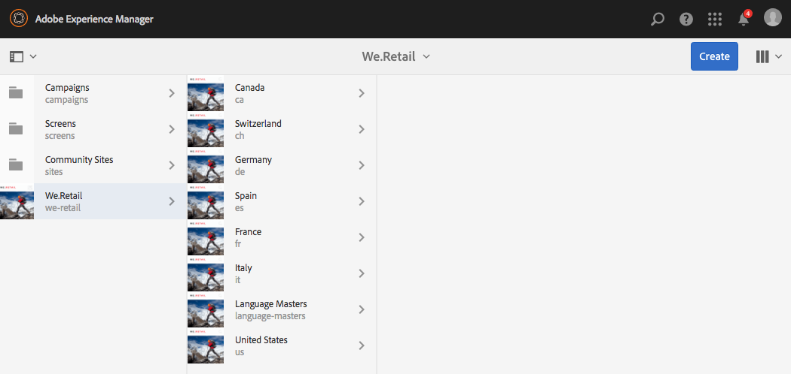

# We.Retail에서 세계화된 사이트 구조 시험 사용{#trying-out-the-globalized-site-structure-in-we-retail}

We.Retail은 국가별 웹 사이트에 라이브 복사할 수 있는 언어 마스터를 제공하는 전역 사이트 구조로 빌드되었습니다. 모든 것이 기본 설정되어 있으므로 이 구조와 기본 제공 번역 기능을 실험해 볼 수 있습니다.

## 시험 사용 {#trying-it-out}

1. 에서 사이트 콘솔을 엽니다. **전역 탐색 > 사이트**.
1. 열 보기(아직 활성화되지 않은 경우)로 전환하고 We.Retail을 선택합니다. 언어 기본과 함께 스위스, 미국, 프랑스 등이 있는 예제 국가 구조를 참고하십시오.

   

1. 스위스를 선택하고 해당 국가의 언어에 대한 언어 뿌리를 확인합니다. 아직 이러한 루트 아래에 컨텐츠가 없습니다.

   

1. 목록 보기로 전환하여 해당 국가의 언어 사본이 모두 라이브 카피인지 확인합니다.

   

1. 열 보기로 돌아가서 언어 기본을 클릭하고 콘텐츠가 있는 언어 마스터 루트를 확인합니다. 영어에만 콘텐츠가 있습니다.

   We.Retail에는 번역된 컨텐츠가 제공되지 않지만 번역 서비스를 시연할 수 있도록 구조와 구성이 마련되어 있습니다.

   

1. 영어 기본을 선택한 상태에서 **참조** 사이트 콘솔에서 레일 을 참조하고 다음을 선택합니다. **언어 복사**.

   

1. 다음 옆에 있는 확인란을 선택합니다. **언어 복사** 레이블을 지정하여 모든 언어 사본을 선택합니다. 다음에서 **언어 사본 업데이트** 레일의 섹션에서 다음 옵션을 선택합니다. **새 번역 프로젝트 만들기**. 프로젝트의 이름을 입력하고 **업데이트**.

   

1. 프로젝트는 각 언어 번역에 대해 생성됩니다. 아래에서 해당 항목 보기 **탐색 > 프로젝트**.

   

1. 번역 프로젝트의 세부 정보를 보려면 독일어를 클릭하십시오. 상태는 입니다. **초안**. Microsoft®의 번역 서비스로 번역을 시작하려면 옆에 있는 V자형 화살표를 클릭합니다. **번역 작업** 제목 및 선택 **시작**.

   

1. 번역 프로젝트가 시작됩니다. 세부 정보를 보려면 번역 작업 이라는 레이블이 지정된 카드 하단의 생략 부호를 클릭합니다. 상태가 있는 페이지 **검토 준비됨** 이미 번역 서비스에서 번역했습니다.

   

1. 목록에서 페이지 중 하나를 선택한 다음 **사이트에서 미리 보기** 도구 모음에서 번역된 페이지를 페이지 편집기에서 엽니다.

   

>[!NOTE]
>
>이 절차에서는 Microsoft® 기계 번역과의 내장된 통합을 보여 주었습니다. 사용 [AEM 번역 통합 프레임워크](/help/sites-administering/translation.md)를 여러 표준 번역 서비스와 통합하여 AEM 번역을 오케스트레이션할 수 있습니다.

## 추가 정보 {#further-information}

자세한 내용은 작성 문서를 참조하십시오 [다국어 사이트를 위한 콘텐츠 번역](/help/sites-administering/translation.md) 전체 기술 세부 정보.
