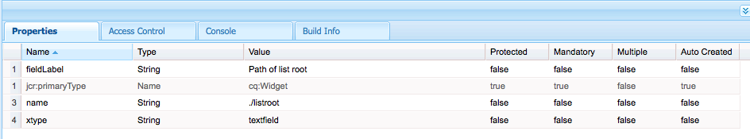
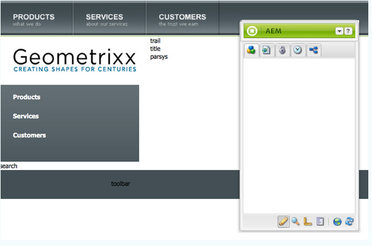

# 완벽한 기능을 갖춘 웹 사이트(JSP){#create-a-fully-featured-website-jsp} 만들기

>[!NOTE]
>
>이 문서에서는 JSP를 사용하여 클래식 UI를 기반으로 웹 사이트를 만드는 방법에 대해 설명합니다. Adobe은 문서 [AEM Sites 개발 시작](/help/sites-developing/getting-started.md)에 자세히 설명된 대로 웹 사이트에 최신 AEM 기술을 활용할 것을 권장합니다.

이 자습서에서는 Adobe Experience Manager(AEM)을 사용하여 모든 기능을 갖춘 웹 사이트를 만들 수 있습니다. 웹 사이트는 일반 웹 사이트를 기반으로 하며 주로 웹 개발자를 대상으로 합니다. 모든 개발은 작성자 환경 내에서 수행됩니다.

이 자습서에서는 다음 방법을 설명합니다.

1. AEM 설치
1. 액세스 CRXDE Lite(개발 환경).
1. CRXDE Lite에서 프로젝트 구조를 설정합니다.
1. 컨텐츠 페이지를 만드는 기준으로 사용되는 템플릿, 구성 요소 및 스크립트를 만듭니다.
1. 웹 사이트의 루트 페이지를 만든 다음 컨텐츠 페이지를 만듭니다.
1. 페이지에 사용할 다음 구성 요소를 만듭니다.

   * 위쪽 탐색
   * 하위 목록
   * 로고
   * 이미지
   * 텍스트 이미지
   * 검색

1. 다양한 기본 구성 요소를 포함합니다.

모든 단계를 수행한 후에는 페이지가 다음과 같이 표시됩니다.


**최종 결과 다운로드**

연습을 수행하지 않고 튜토리얼을 따라 하려면 website-1.0.zip을 다운로드합니다. 이 파일은 이 자습서의 결과를 포함하는 AEM 컨텐츠 패키지입니다. 작성자 인스턴스에 패키지를 설치하려면 [패키지 관리자](/help/sites-administering/package-manager.md)를 사용하십시오.

**참고: 이 패키지** 를 설치하면 이 자습서를 사용하여 만든 제작 인스턴스의 모든 리소스를 덮어씁니다.

웹 사이트 컨텐츠 패키지

[파일 가져오기](assets/website-1_0.zip)

## Adobe Experience Manager {#installing-adobe-experience-manager} 설치

웹 사이트 개발을 위한 AEM 인스턴스를 설치하려면 작성자 및 게시 인스턴스](/help/sites-deploying/deploy.md#author-and-publish-installs)와 함께 [배포 환경을 설정하는 지침을 따르거나 [일반 설치](/help/sites-deploying/deploy.md#default-local-install)를 수행하십시오. 일반 설치에는 AEM Quickstart JAR 파일을 다운로드하고, license.properties 파일을 JAR 파일과 동일한 디렉토리에 배치하고, JAR 파일을 두 번 클릭해야 합니다.

AEM을 설치한 후 시작 페이지의 CRXDE Lite 링크를 클릭하여 CRXDE Lite 개발 환경에 액세스합니다.


>[!NOTE]
>
>기본 포트를 사용하여 로컬로 설치되는 AEM 제작 인스턴스의 CRXDE Lite URL은 [https://localhost:4502/crx/de/](https://localhost:4502/crx/de/)입니다.

### CRXDE Lite {#setting-up-the-project-structure-in-crxde-lite}에서 프로젝트 구조 설정

CRXDE Lite을 사용하여 저장소에서 mywebsite 응용 프로그램 구조를 만듭니다.

1. CRXDE Lite의 왼쪽에 있는 트리에서 **`/apps`** 폴더를 마우스 오른쪽 단추로 클릭하고 **만들기** > **만들기** **폴더**&#x200B;을 클릭합니다. **폴더 만들기** 대화 상자에서 폴더 이름으로 `mywebsite`를 입력하고 **확인**&#x200B;을 클릭합니다.
1. **`/apps/mywebsite`** 폴더를 마우스 오른쪽 단추로 클릭하고 **만들기** > **폴더 만들기**&#x200B;를 클릭합니다. **폴더 만들기** 대화 상자에서 폴더 이름으로 `components`를 입력하고 **확인**&#x200B;을 클릭합니다.
1. **`/apps/mywebsite`** 폴더를 마우스 오른쪽 단추로 클릭하고 **만들기** > **폴더 만들기**&#x200B;를 클릭합니다. **폴더 만들기** 대화 상자에서 폴더 이름으로 `templates`를 입력하고 **확인**&#x200B;을 클릭합니다.

   이제 트리의 구조가 다음과 같이 표시됩니다.

   

1. **모두 저장**&#x200B;을 클릭합니다.

### 디자인 {#setting-up-the-design} 설정

이 섹션에서는 디자이너 도구를 사용하여 응용 프로그램의 디자인을 만듭니다. 이 디자인에서는 웹 사이트에 대한 CSS 및 이미지 리소스를 제공합니다.

>[!NOTE]
>
>다음 링크를 클릭하여 mywebsite.zip을 다운로드합니다. 아카이브는 디자인에 사용할 static.css 및 이미지 파일을 포함합니다.

정적.css 파일 및 이미지 샘플

[파일 가져오기](assets/mywebsite.zip)

1. AEM 시작 페이지에서 **도구**&#x200B;를 클릭합니다. ([https://localhost:4502/libs/cq/core/content/welcome.html](https://localhost:4502/libs/cq/core/content/welcome.html))

   

1. 폴더 트리에서 **디자인** 폴더를 선택한 다음 **새로 만들기** > **새 페이지**&#x200B;를 클릭합니다. 제목으로 `mywebsite`을 입력하고 **만들기**&#x200B;를 클릭합니다.

1. mywebsite 항목이 표에 나타나지 않으면 트리 또는 테이블을 새로 고칩니다.

1. [https://localhost:4502](/help/sites-administering/webdav-access.md) 의 URL에 대한 WebDAVaccess를 사용하여 다운로드한 mywebsite.zip 파일의 샘플  `static.css` 파일과  `images` 폴더를  `/etc/designs/mywebsite` 폴더로 복사합니다.

   

### 컨텐트 페이지 템플릿, 구성 요소 및 스크립트 만들기 {#creating-the-contentpage-template-component-and-script}

이 섹션에서 다음을 만듭니다.

* 예제 웹 사이트에서 컨텐츠 페이지를 만드는 데 사용할 컨텐트 페이지 템플릿
* 컨텐츠 페이지를 렌더링하는 데 사용할 컨텐츠 페이지 구성 요소
* 컨텐츠 페이지 스크립트

#### 컨텐트 페이지 템플릿 만들기 {#creating-the-contentpage-template}

사이트의 웹 페이지의 기초로 사용할 템플릿을 만듭니다.

템플릿은 새 페이지의 기본 컨텐츠를 정의합니다. 복잡한 웹 사이트에서는 여러 가지 템플릿을 사용하여 사이트에서 다양한 유형의 페이지를 만들 수 있습니다. 이 연습에서는 모든 페이지가 하나의 간단한 템플릿을 기반으로 합니다.

1. CRXDE Lite의 폴더 트리에서 `/apps/mywebsite/templates`을 마우스 오른쪽 단추로 클릭하고 **만들기** > **템플릿 만들기**&#x200B;를 클릭합니다.

1. 템플릿 만들기 대화 상자에서 다음 값을 입력한 다음 **다음**&#x200B;을 클릭합니다.

   * **레이블**:contentpage
   * **제목**:내 웹 사이트 컨텐츠 페이지 템플릿
   * **설명**:내 웹 사이트 컨텐츠 페이지 템플릿입니다.
   * **리소스 유형:** mywebsite/components/contentpage

   등급 속성에 기본값을 사용합니다.

   

   리소스 유형은 페이지를 렌더링하는 구성 요소를 식별합니다. 이 경우 콘텐츠 페이지 템플릿을 사용하여 만든 모든 페이지는 `mywebsite/components/contentpage` 구성 요소로 렌더링됩니다.

1. 이 템플릿을 사용할 수 있는 페이지의 경로를 지정하려면 더하기 단추를 클릭하고 나타나는 텍스트 상자에 `/content(/.*)?`을 입력합니다. 그런 다음 **다음**&#x200B;을 클릭합니다.

   

   허용되는 경로 속성의 값은 *정규식입니다.* 표현식과 일치하는 경로가 있는 페이지는 템플릿을 사용할 수 있습니다. 이 경우 정규 표현식은 **/content** 폴더의 경로와 모든 하위 페이지의 경로와 일치합니다.

   작성자가 /content 아래에 페이지를 만들면 사용할 수 있는 템플릿 목록에 **contentpage** 템플릿이 나타납니다.

1. **허용되는 상위** 및 **허용되는 하위** 패널에서 **다음**&#x200B;을 클릭하고 **확인**&#x200B;을 클릭합니다. CRXDE Lite에서 **모두 저장**&#x200B;을 클릭합니다.

   

#### 컨텐트 페이지 구성 요소 {#creating-the-contentpage-component} 만들기

컨텐츠를 정의하고 콘텐츠 페이지 템플릿을 사용하는 페이지를 렌더링하는 *component*&#x200B;를 만듭니다. 구성 요소의 위치는 컨텐츠 페이지 템플릿의 리소스 유형 속성 값과 일치해야 합니다.

1. CRXDE Lite에서 `/apps/mywebsite/components`을 마우스 오른쪽 단추로 클릭하고 **만들기** > **구성 요소**&#x200B;를 클릭합니다.
1. **구성 요소 만들기** 대화 상자에서 다음 속성 값을 입력합니다.

   * **레이블**:contentpage
   * **제목**:내 웹 사이트 컨텐츠 페이지 구성 요소
   * **설명**:내 웹 사이트 컨텐츠 페이지 구성 요소입니다.

   

   새 구성 요소의 위치는 `/apps/mywebsite/components/contentpage`입니다. 이 경로는 컨텐트 페이지 템플릿의 리소스 유형(경로의 초기 **`/apps/`** 부분을 제외한)과 일치합니다.

   이러한 통신은 템플릿을 구성 요소에 연결하며 웹 사이트의 올바른 기능에 매우 중요합니다.

1. 대화 상자의 허용되는 하위 패널이 나타날 때까지 **다음**&#x200B;을 클릭한 다음 **확인**&#x200B;을 클릭합니다. CRXDE Lite에서 **모두 저장**&#x200B;을 클릭합니다.

   이제 구조가 다음과 같이 표시됩니다.

   

#### 컨텐트 페이지 구성 요소 스크립트 개발 {#developing-the-contentpage-component-script}

페이지 컨텐츠를 정의하는 코드를 contentpage.jsp 스크립트에 추가합니다.

1. CRXDE Lite에서 `/apps/mywebsite/components/contentpage`의 `contentpage.jsp` 파일을 엽니다. 이 파일에는 기본적으로 다음 코드가 포함되어 있습니다.

   ```java
   <%--
   
     My Website Content Page Component component.
   
     This is My Website Content Page Component.
   
   --%><%
   %><%@include file="/libs/foundation/global.jsp"%><%
   %><%@page session="false" %><%
   %><%
       /* TODO add you code here */
   %>
   ```

1. 다음 코드를 복사하고 기본 코드 뒤에 contentpage.jsp에 붙여 넣습니다.

   ```java
   <%@ page language="java" contentType="text/html; charset=ISO-8859-1"
       pageEncoding="ISO-8859-1"%>
   <!DOCTYPE html PUBLIC "-//W3C//DTD HTML 4.01 Transitional//EN"
   "https://www.w3.org/TR/html4/loose.dtd">
   <html>
   <head>
   <meta http-equiv="Content-Type" content="text/html; charset=ISO-8859-1">
   <title>My title</title>
   </head>
   <body>
   <div>My body</div>
   </body>
   </html>
   ```

1. **모두 저장**&#x200B;을 클릭하여 변경 내용을 저장합니다.

### 웹 사이트 페이지 및 컨텐츠 페이지 만들기 {#creating-your-website-page-and-content-pages}

이 섹션에서는 모두 컨텐트 페이지 템플릿을 사용하는 다음 페이지를 만듭니다.내 웹 사이트, 영어, 제품, 서비스 및 고객

1. AEM 시작 페이지([https://localhost:4502/libs/cq/core/content/welcome.html](https://localhost:4502/libs/cq/core/content/welcome.html))에서 웹 사이트를 클릭합니다.

   

1. 폴더 트리에서 **웹 사이트** 폴더를 선택한 다음 **새로 만들기** > **새 페이지**&#x200B;를 클릭합니다.
1. **페이지 만들기** 창에서 다음을 입력합니다.

   * 제목: `My Website`
   * 이름: `mywebsite`
   * `My Website Content Page Template` 선택

   

1. **만들기**&#x200B;를 클릭합니다. 폴더 트리에서 **/Websites/My Website** 페이지를 선택하고 **New** > **New Page**&#x200B;를 클릭합니다.
1. 페이지 만들기 대화 상자에서 다음 속성 값을 입력한 다음 만들기를 클릭합니다.

   * 제목:영어
   * 이름:en
   * 내 웹 사이트 컨텐츠 페이지 템플릿 선택

1. 폴더 트리에서 **/Websites/My Website/English** 페이지를 선택하고 **New** **New Page**&#x200B;를 클릭합니다.
1. **페이지 만들기** 대화 상자에서 다음 속성 값을 입력한 다음 **만들기**&#x200B;를 클릭합니다.

   * 제목:제품
   * 내 웹 사이트 컨텐츠 페이지 템플릿 선택

1. 폴더 트리에서 **/Websites/My Website/English** 페이지를 선택하고 **New** > **New Page**&#x200B;를 클릭합니다.
1. **페이지 만들기** 대화 상자에서 다음 속성 값을 입력한 다음 **만들기**&#x200B;를 클릭합니다.

   * 제목:서비스
   * 내 웹 사이트 컨텐츠 페이지 템플릿 선택

1. 폴더 트리에서 **/Websites/My Website/English** 페이지를 선택하고 **New** > **New Page**&#x200B;를 클릭합니다.
1. **페이지 만들기** 대화 상자에서 다음 속성 값을 입력한 다음 **만들기**&#x200B;를 클릭합니다.

   * 제목:고객
   * 내 웹 사이트 컨텐츠 페이지 템플릿 선택

   구조는 다음과 같습니다.

   

1. 페이지를 mywebsite 디자인에 연결하려면 CRXDE Lite에서 `/content/mywebsite/en/jcr:content` 노드를 선택합니다. 속성 탭에서 새 속성에 대해 다음 값을 입력한 다음 추가를 클릭합니다.

   * 이름:cq:designPath
   * 유형:문자열
   * 값:/etc/designs/mywebsite

   

1. 새 웹 브라우저 탭 또는 창에서 [https://localhost:4502/content/mywebsite/en/products.html](https://localhost:4502/content/mywebsite/en/products.html)을(를) 열어 제품 페이지를 확인합니다.

   

### 컨텐츠 페이지 스크립트 개선{#enhancing-the-contentpage-script}

이 섹션에서는 AEM foundation 구성 요소 스크립트를 사용하여 컨텐츠 페이지 스크립트를 향상시키고 자체 스크립트를 작성하는 방법을 설명합니다.

**Products** 페이지는 다음과 같이 표시됩니다.


#### 기초 페이지 스크립트 사용 {#using-the-foundation-page-scripts}

이 연습에서는 상위 유형이 AEM 페이지 구성 요소되도록 페이지 구성 요소를 구성합니다. 구성 요소는 상위 유형의 기능을 상속하므로 페이지 컨텐츠는 페이지 구성 요소의 스크립트 및 속성을 상속받습니다.

예를 들어 구성 요소 JSP 코드에서 상위 유형 구성 요소가 제공하는 스크립트를 구성 요소에 포함된 것처럼 참조할 수 있습니다.

1. CRXDE Lite에서 `/apps/mywebsite/components/contentpage` 노드에 속성을 추가합니다.

   1. `/apps/mywebsite/components/contentpage` 노드를 선택합니다.
   1. 속성 탭 하단에서 다음 속성 값을 입력한 다음 추가를 클릭합니다.

      * **이름:** sling:resourceSuperType
      * **유형:** 문자열
      * **값:** foundation/components/page
   1. 모두 저장을 클릭합니다.


1. `/apps/mywebsite/components/contentpage` 아래의 `contentpage.jsp` 파일을 열고 기존 코드를 다음 코드로 바꿉니다.

   ```xml
   <%@include file="/libs/foundation/global.jsp"%><%
   %><%@page session="false" contentType="text/html; charset=utf-8" %><%
   %><!DOCTYPE HTML PUBLIC "-//W3C//DTD HTML 4.01//EN" "https://www.w3.org/TR/html4/strict.dtd">
   <html>
   <cq:include script="head.jsp"/>
   <cq:include script="body.jsp"/>
   </html>
   ```

1. 변경 내용을 저장합니다.
1. 브라우저에서 제품 페이지를 다시 로드합니다. 다음과 같습니다.

   

   페이지 소스를 열어 head.jsp 및 body.jsp 스크립트가 생성한 javascript 및 HTML 요소를 확인합니다. 페이지를 열 때 다음 스크립트 조각이 사이드킥을 엽니다.

   ```java
   CQ.WCM.launchSidekick("/content/mywebsite/en/products",
               {propsDialog: "/libs/foundation/components/page/dialog",
                  locked: false locked: false
                });
   ```

#### 자체 스크립트 사용 {#using-your-own-scripts}

이 섹션에서는 페이지 본문의 일부를 생성하는 여러 스크립트를 만듭니다. 그런 다음 pageContent 구성 요소에서 body.jsp 파일을 만들어 AEM Page 구성 요소의 body.jsp를 재정의합니다. body.jsp 파일에 페이지 본문의 다른 부분을 생성하는 스크립트를 포함합니다.

**팁: 구성 요소** 에 구성 요소의 상위 유형에서 파일과 동일한 이름과 상대 위치를 가진 파일이 포함되어 있으면 이를  *오버레이라고 합니다*.

1. CRXDE Lite에서 `/apps/mywebsite/components/contentpage` 아래에 `left.jsp` 파일을 만듭니다.

   1. 노드 `/apps/mywebsite/components/contentpage`을 마우스 오른쪽 단추로 클릭한 다음 **Create **Then **파일 만들기**&#x200B;를 선택합니다.

   1. 창에 `left.jsp`을 **이름**&#x200B;으로 입력하고 **확인**&#x200B;을 클릭합니다.

1. 기존 컨텐츠를 제거하고 다음 코드로 바꾸려면 `left.jsp` 파일을 편집합니다.

   ```java
   <%@include file="/libs/foundation/global.jsp"%><%
   %><div class="left">
   <div>logo</div>
   <div>newslist</div>
   <div>search</div>
   </div>
   ```

1. 변경 사항을 저장합니다.
1. CRXDE Lite에서 `/apps/mywebsite/components/contentpage` 아래에 `center.jsp` 파일을 만듭니다.

   1. 노드 `/apps/mywebsite/components/contentpage`을(를) 마우스 오른쪽 단추로 클릭하고 **만들기**&#x200B;를 선택한 다음 **파일 만들기**&#x200B;를 선택합니다.

   1. 대화 상자에서 `center.jsp`을 **이름**&#x200B;으로 입력하고 **확인**&#x200B;을 클릭합니다.

1. 기존 컨텐츠를 제거하고 다음 코드로 바꾸려면 `center.jsp` 파일을 편집합니다.

   ```java
   <%@include file="/libs/foundation/global.jsp"%><%
   %><div class="center">
   <div>trail</div>
   <div>title</div>
   <div>parsys</div>
   </div>
   ```

1. 변경 사항을 저장합니다.
1. CRXDE Lite에서 `/apps/mywebsite/components/contentpage` 아래에 `right.jsp` 파일을 만듭니다.

   1. 노드 `/apps/mywebsite/components/contentpage`을(를) 마우스 오른쪽 단추로 클릭하고 **만들기**&#x200B;를 선택한 다음 **파일 만들기**&#x200B;를 선택합니다.

   1. 대화 상자에서 `right.jsp`을 **이름**&#x200B;으로 입력하고 **확인**&#x200B;을 클릭합니다.

1. 기존 컨텐츠를 제거하고 다음 코드로 바꾸려면 `right.jsp` 파일을 편집합니다.

   ```java
   <%@include file="/libs/foundation/global.jsp"%><%
   %><div class="right">
   <div>iparsys</div>
   </div>
   ```

1. 변경 사항을 저장합니다.
1. CRXDE Lite에서 `/apps/mywebsite/components/contentpage` 아래에 `body.jsp` 파일을 만듭니다.
1. 기존 컨텐츠를 제거하고 다음 코드로 바꾸려면 `body.jsp` 파일을 편집합니다.

   ```java
   <%@include file="/libs/foundation/global.jsp"%><%
   %><body>
   <div id="CQ">
   <div class="topnav">topnav</div>
   <div class="content">
   <cq:include script="left.jsp" />
   <cq:include script="center.jsp" />
   <cq:include script="right.jsp" />
   </div>
   <div class="footer">
   <div class="toolbar">toolbar</div>
   </div>
   </div>
   </body>
   ```

1. 변경 사항을 저장합니다.
1. 브라우저에서 제품 페이지를 다시 로드합니다. 다음과 같습니다.

   

### 위쪽 탐색 구성 요소 만들기 {#creating-the-top-navigation-component}

이 섹션에서는 편리한 탐색을 위해 웹 사이트의 모든 최상위 페이지에 대한 링크를 표시하는 구성 요소를 만듭니다. 이 구성 요소 컨텐츠는 컨텐트 페이지 템플릿을 사용하여 만든 모든 페이지의 맨 위에 나타납니다.

위쪽 탐색 구성 요소(위쪽 탐색 구성 요소)의 첫 번째 버전에서는 탐색 항목이 텍스트 링크만 됩니다. 두 번째 버전에서는 이미지 탐색 링크가 있는 topnav를 구현했습니다.

위쪽 탐색은 다음과 같습니다.


#### 위쪽 탐색 구성 요소 만들기 {#creating-the-top-navigation-component-1}

1. CRXDE Lite에서 `/apps/mywebsite/components`을 마우스 오른쪽 단추로 클릭하고 **만들기**&#x200B;를 선택한 다음 **구성 요소 만들기**&#x200B;를 선택합니다.
1. **구성 요소 만들기** 창에서 다음을 입력합니다.

   * **레이블**: `topnav`

   * **제목**: `My Top Navigation Component`

   * **설명**: `This is My Top Navigation Component`

1. **OK**&#x200B;을 클릭하는 마지막 창에 도착할 때까지 **다음**&#x200B;을 클릭합니다. 변경 내용을 저장합니다.

#### 텍스트 링크 {#creating-the-top-navigation-script-with-textual-links}를 사용하여 위쪽 탐색 스크립트 만들기

하위 페이지에 대한 텍스트 링크를 생성하려면 렌더링 스크립트를 topnav에 추가합니다.

1. CRXDE Lite에서 `/apps/mywebsite/components/topnav` 아래의 `topnav.jsp` 파일을 엽니다.
1. 다음 코드를 복사하여 붙여 넣어 해당 코드를 교체합니다.

   ```xml
   <%@include file="/libs/foundation/global.jsp"%><%
   %><%@ page import="java.util.Iterator,
           com.day.text.Text,
           com.day.cq.wcm.api.PageFilter, com.day.cq.wcm.api.Page" %><%
       /* get starting point of navigation */
       Page navRootPage = currentPage.getAbsoluteParent(2);
       if (navRootPage == null && currentPage != null) {
       navRootPage = currentPage;
       }
       if (navRootPage != null) {
           Iterator<Page> children = navRootPage.listChildren(new PageFilter(request));
           while (children.hasNext()) {
               Page child = children.next();
               %><a href="<%= child.getPath() %>.html"><%=child.getTitle() %></a><%
           }
       }
   %>
   ```

#### 컨텐트 페이지 구성 요소 {#including-top-navigation-in-the-contentpage-component}에 위쪽 탐색 포함

컨텐트 페이지 구성 요소에 상위 탐색을 포함하려면

1. CRXDE Lite에서 `/apps/mywebsite/components/contentpage`에서 `body.jsp`을 열고 다음을 바꿉니다.

   ```xml
   <div class="topnav">topnav</div>
   ```

   with:

   ```xml
   <cq:include path="topnav" resourceType="mywebsite/components/topnav" />
   ```

1. 변경 사항을 저장합니다.
1. 브라우저에서 제품 페이지를 다시 로드합니다. 위쪽 탐색은 다음과 같이 표시됩니다.

   

#### 자막이 있는 페이지 향상 {#enhancing-pages-with-subtitles}

페이지 구성 요소는 페이지에 자막을 제공할 수 있는 속성을 정의합니다. 페이지 컨텐츠에 대한 정보를 제공하는 자막을 추가합니다.

1. 브라우저에서 **제품** 페이지를 엽니다.
1. 사이드 킥의 **페이지** 탭에서 **페이지 속성**&#x200B;을 클릭합니다.
1. 대화 상자의 기본 탭에서 **더 많은 제목 및 설명,**&#x200B;을 확장하고 **자막** 속성에 대해 **작업**&#x200B;을 입력합니다. **확인**&#x200B;을 클릭합니다.
1. 서비스&#x200B;**에 대한 부제목**&#x200B;을 **서비스** 페이지에 추가하려면 이전 단계를 반복합니다.
1. 이전 단계를 반복하여 신뢰 부제 **을(를)**&#x200B;고객&#x200B;**페이지에 추가합니다.**

   **팁:** CRXDE Lite에서 /content/mywebsite/en/products/jcr:content 노드를 선택하여 자막 속성이 추가되었음을 확인합니다.

#### 이미지 링크 {#enhance-top-navigation-by-using-image-links}를 사용하여 위쪽 탐색 향상

탐색 컨트롤에 하이퍼텍스트 대신 이미지 링크를 사용하도록 topnav 구성 요소의 렌더링 스크립트를 개선합니다. 이미지에는 링크 대상의 제목과 부제가 포함됩니다.

이 연습에서는 [Sling 요청 처리](/help/sites-developing/the-basics.md#sling-request-processing)를 보여 줍니다. topnav.jsp 스크립트는 페이지 탐색 링크에 사용할 이미지를 동적으로 생성하는 스크립트를 호출하도록 수정되었습니다. 이 실습에서는 이미지 소스 파일의 URL을 구문 분석하여 이미지를 렌더링하는 데 사용할 스크립트를 결정합니다.

예를 들어 제품 페이지에 대한 이미지 링크의 소스는 https://localhost:4502/content/mywebsite/en/products.navimage.png일 수 있습니다. Sling은 이 URL을 구문 분석하여 리소스 유형 및 리소스를 렌더링하는 데 사용할 스크립트를 결정합니다.

1. Sling은 리소스 경로를 `/content/mwebysite/en/products.png.`으로 결정합니다.
1. Sling은 `/content/mywebsite/en/products` 노드로 이 경로와 일치합니다.
1. Sling은 이 노드의 `sling:resourceType`을 `mywebsite/components/contentpage`으로 결정합니다.

1. Sling은 URL 선택기( `navimage`) 및 파일 이름 확장자( `png`)와 가장 잘 일치하는 스크립트를 이 구성 요소에서 찾습니다.

이 연습에서 Sling은 이러한 URL을 사용자가 만든 /apps/mywebsite/components/contentpage/navimage.png.java 스크립트에 연결합니다.

1. CRXDE Lite에서 `/apps/mywebsite/components/topnav.`앵커 요소의 내용 찾기(14줄)에서 `topnav.jsp`을 엽니다.

   ```xml
   <%=child.getTitle() %>
   ```

1. 앵커 컨텐츠를 다음 코드로 바꿉니다.

   ```xml
   " src="<%= child.getPath() %>.navimage.png">
   ```

1. 변경 사항을 저장합니다.
1. `/apps/mywebsite/components/contentpage` 노드를 마우스 오른쪽 단추로 클릭하고 **만들기** > **파일 만들기**&#x200B;를 클릭합니다.
1. **파일 만들기** 창의 **이름**&#x200B;에 `navimage.png.java`를 입력합니다.

   .java 파일 이름 확장자는 Sling에 Apache Sling 스크립팅 Java 지원을 사용하여 스크립트를 컴파일하고 서블릿을 만들어야 함을 나타냅니다.

1. 다음 코드를 `navimage.png.java.`에 복사합니다. 코드는 AbstractImageServlet 클래스를 확장합니다.

   * [AbstractImageServlet](https://helpx.adobe.com/experience-manager/6-5/sites/developing/using/reference-materials/javadoc/com/day/cq/wcm/commons/AbstractImageServlet.html) 은 현재 리소스의 속성을 저장하는 ImageContext 개체를 만듭니다.
   * 리소스의 상위 페이지가 ImageContext 개체에서 추출됩니다. 그런 다음 페이지 제목과 부제목을 가져옵니다.
   * [ImageHelperis ](https://helpx.adobe.com/experience-manager/6-5/sites/developing/using/reference-materials/javadoc/com/day/cq/commons/ImageHelper.html) used to generate the image from the navimage_bg.jpg file of the site design, the page title and the page subtitle.

   ```java
   package apps.mywebsite.components.contentpage;
   
   import java.awt.Color;
   import java.awt.Paint;
   import java.awt.geom.Rectangle2D;
   
   import java.io.IOException;
   import javax.jcr.RepositoryException;
   
   import com.day.cq.wcm.api.Page;
   import com.day.cq.wcm.api.PageManager;
   import com.day.cq.wcm.api.components.Component;
   import com.day.cq.wcm.api.designer.Designer;
   
   import com.day.cq.commons.SlingRepositoryException;
   import com.day.cq.wcm.commons.WCMUtils;
   import com.day.cq.wcm.commons.AbstractImageServlet;
   import com.day.cq.commons.ImageHelper;
   
   import com.day.image.Font;
   import com.day.image.Layer;
   
   import org.apache.sling.api.SlingHttpServletRequest;
   import org.apache.sling.api.SlingHttpServletResponse;
   import org.apache.sling.api.resource.Resource;
   import org.apache.sling.api.servlets.SlingSafeMethodsServlet;
   
   /**
     * Renders the navigation image
     */
   public class navimage_png extends AbstractImageServlet {
   
         protected Layer createLayer(ImageContext ctx)
                throws RepositoryException, IOException {
            PageManager pageManager = ctx.resolver.adaptTo(PageManager.class);
            Page currentPage = pageManager.getContainingPage(ctx.resource);
   
            /* constants for image appearance */
            int scale = 6;
            int paddingX = 24;
            int paddingY = 24;
            Color bgColor = new Color(0x004a565c, true);
   
            /* obtain the page title */
            String title = currentPage.getTitle();
            if (title == null) {
                title = currentPage.getName();
            }
   
            /* format the title text */
            title = title.toUpperCase();
            Paint titleColor = Color.WHITE;
            Font titleFont = new Font("Myriad Pro", 10 * scale, Font.BOLD);
            int titleBase = 10 * scale;
   
            /* obtain and format the page subtitle */
            String subtitle = currentPage.getProperties().get("subtitle", "");
            Paint subtitleColor = new Color(0xffa9afb1, true);
            Font subTitleFont = new Font("Tahoma", 7);
            int subTitleBase = 20;
   
            /* create a layer that contains the background image from the mywebsite design */
            Designer dg = ctx.resolver.adaptTo(Designer.class);
            String imgPath = new String(dg.getDesignPath(currentPage)+"/images/navimage_bg.jpg");
            Layer bg = ImageHelper.createLayer(ctx.resolver.resolve(imgPath));
   
            /* draw the title text (4 times bigger) */
            Rectangle2D titleExtent = titleFont.getTextExtent(0, 0, 0, 0, title, Font.ALIGN_LEFT, 0, 0);
            Rectangle2D subtitleExtent = subTitleFont.getTextExtent(0, 0, 0, 0, subtitle, Font.ALIGN_LEFT, 0, 0);
   
            /* ensure subtitleExtent is wide enough */
            if ( subtitle.length() > 0 ) {
                int titleWidth = (int)titleExtent.getWidth() / scale;
                if ( subtitleExtent.getWidth() > titleWidth && subtitleExtent.getWidth() + 2 * paddingX >
    bg.getWidth() ) {
                    int charWidth = (int)subtitleExtent.getWidth() / subtitle.length();
                    int maxWidth = (bg.getWidth() > titleWidth + 2  * paddingX ? bg.getWidth() - 2 * paddingX : titleWidth);
                    int len = (maxWidth - ( 2 * charWidth) ) / charWidth;
                    subtitle = subtitle.substring(0, len) + "...";
                    subtitleExtent = subTitleFont.getTextExtent(0, 0, 0, 0, subtitle, Font.ALIGN_LEFT, 0, 0);
                }
            }
            int width = Math.max((int) titleExtent.getWidth(), (int) subtitleExtent.getWidth());
           /* create the text layer */
            Layer text = new Layer(width, (int) titleExtent.getHeight() + 40, new Color(0x01ffffff, true));
            text.setPaint(titleColor);
            text.drawText(0, titleBase, 0, 0, title, titleFont, Font.ALIGN_LEFT | Font.ALIGN_BASE, 0, 0);
            text.resize(text.getWidth() / scale, text.getHeight() / scale);
            text.setX(0);
            text.setY(0);
   
            if (subtitle.length() > 0) {
                /* draw the subtitle normal sized */
                text.setPaint(subtitleColor);
                text.drawText(0, subTitleBase, 0, 0, subtitle, subTitleFont, Font.ALIGN_LEFT | Font.ALIGN_BASE, 0, 0);
            }
   
            /* merge the image and text layers */
            text.setY(paddingY);
            text.setX(paddingX);
            text.setBackgroundColor(bgColor);
   
            int bgWidth = bg.getWidth();
            if ( text.getWidth() + 2 * paddingX > bgWidth ) {
                bgWidth = text.getWidth() + 2 * paddingX;
                bg.resize(bgWidth, bg.getHeight());
            }
            bg.merge(text);
   
            return bg;
        }
    }
   ```

1. 변경 사항을 저장합니다.
1. 브라우저에서 제품 페이지를 다시 로드합니다. 이제 위쪽 탐색이 다음과 같이 표시됩니다.

   

### 목록 하위 구성 요소 {#creating-the-list-children-component} 만들기

페이지 제목, 설명 및 날짜(예: 제품 페이지)를 포함하는 페이지 링크 목록을 생성하는 목록 하위 구성 요소를 만듭니다. 링크는 현재 페이지의 하위 페이지 또는 구성 요소 대화 상자에 지정된 루트 페이지의 하위 페이지를 대상으로 합니다.


#### 제품 페이지 {#creating-product-pages} 만들기

제품 페이지 아래에 있는 두 페이지를 만듭니다. 각 페이지에 대해 두 개의 특정 제품을 설명하는 제목, 설명 및 날짜를 설정합니다.

1. 웹 사이트 페이지의 폴더 트리에서 웹 사이트/내 웹 사이트/영어/제품 항목을 선택하고 새로 만들기 > 새 페이지를 클릭합니다.
1. 대화 상자에 다음 속성 값을 입력한 다음 만들기를 클릭합니다.

   * 제목:제품 1.
   * 이름:product1.
   * 내 웹 사이트 컨텐츠 페이지 템플릿 선택

1. 다음 속성 값을 사용하여 제품 아래에 다른 페이지를 만듭니다.

   * 제목:제품 2
   * 이름:product2
   * 내 웹 사이트 컨텐츠 페이지 템플릿 선택

1. CRXDE Lite에서 제품 1 페이지의 설명 및 날짜를 설정합니다.

   1. `/content/mywebsite/en/products/product1/jcr:content` 노드를 선택합니다.
   1. **속성** 탭에서 다음 값을 입력합니다.

      * 이름: `jcr:description`
      * 유형: `String`
      * 값: `This is a description of the Product 1!.`
   1. **추가**&#x200B;를 클릭합니다.
   1. **속성** 탭에서 다음 값을 사용하여 다른 속성을 만듭니다.

      * 이름:date
      * 유형:문자열
      * 값:2008년 02월 14일
      * 추가를 클릭합니다.
   1. 모두 저장을 클릭합니다.


1. CRXDE Lite에서 제품 2 페이지의 설명 및 날짜를 설정합니다.

   1. /content/mywebsite/en/products/product2/jcr:content 노드를 선택합니다.
   1. **속성** 탭에서 다음 값을 입력합니다.

      * 이름:jcr:description
      * 유형:문자열
      * 값:제품 2!에 대한 설명입니다.
   1. **추가**&#x200B;를 클릭합니다.
   1. 동일한 텍스트 상자에서 이전 값을 다음 값으로 바꿉니다.

      * 이름:date
      * 유형:문자열
      * 값:2012년 05월 11일
      * 추가를 클릭합니다.
   1. 모두 저장을 클릭합니다.


#### 목록 하위 구성 요소 {#creating-the-list-children-component-1} 만들기

listchildren 구성 요소를 만들려면:

1. CRXDE Lite에서 `/apps/mywebsite/components`을 마우스 오른쪽 단추로 클릭하고 **만들기**&#x200B;를 선택한 다음 **구성 요소 만들기**&#x200B;를 선택합니다.
1. 대화 상자에서 다음 속성 값을 입력한 다음 다음을 클릭합니다.

   * 레이블:listchildren.
   * 제목:내 Listchildren 구성 요소를 참조하십시오.
   * 설명:내 목록 구성 요소입니다.

1. [허용되는 하위] 패널이 나타날 때까지 다음을 계속 클릭한 다음 확인을 클릭합니다.

#### 목록 하위 스크립트 만들기 {#creating-the-list-children-script}

listchildren 구성 요소에 대한 스크립트를 개발합니다.

1. CRXDE Lite에서 `/apps/mywebsite/components/listchildren` 아래의 `listchildren.jsp` 파일을 엽니다.
1. 기본 코드를 다음 코드로 바꿉니다.

   ```xml
   <%@include file="/libs/foundation/global.jsp"%><%
   %><%@ page import="java.util.Iterator,
            com.day.cq.wcm.api.PageFilter"%><%
        /* Create a new Page object using the path of the current page */
         String listroot = properties.get("listroot", currentPage.getPath());
        Page rootPage = pageManager.getPage(listroot);
        /* iterate through the child pages and gather properties */
        if (rootPage != null) {
            Iterator<Page> children = rootPage.listChildren(new PageFilter(request));
            while (children.hasNext()) {
                Page child = children.next();
                String title = child.getTitle() == null ? child.getName() : child.getTitle();
                String date = child.getProperties().get("date","");
                %><div class="item">
                <a href="<%= child.getPath() %>.html"><b><%= title %></b></a>
                <span><%= date %></code><br>
                <%= child.getProperties().get("jcr:description","") %><br>
                </div><%
            }
        }
    %>
   ```

1. 변경 사항을 저장합니다.

#### 하위 목록 대화 상자 만들기 {#creating-the-list-children-dialog}

listchildren 구성 요소 속성을 구성하는 데 사용되는 대화 상자를 만듭니다.

1. listchildren 구성 요소 아래에 대화 상자 노드를 만듭니다.

   1. CRXDE Lite에서 `/apps/mywebsite/components/listchildren`노드를 마우스 오른쪽 단추로 클릭하고 **만들기** > **대화 상자 만들기**&#x200B;를 클릭합니다.

   1. 대화 상자에서 다음 속성 값을 입력하고 확인을 클릭합니다

      * **레이블**: `dialog`

      * **제목**: `Edit Component` 확인을  **클릭합니다**.

   

   다음 속성 사용:

   

1. `/apps/mywebsite/components/listchildren/dialog/items/items/tab1` 노드를 선택합니다.
1. 속성 탭에서 **title** 속성의 값을 `List Children`로 변경합니다.

   

1. tab1 노드를 선택하고 만들기 > 노드 만들기를 클릭하고 다음 속성 값을 입력한 후 확인을 클릭합니다.

   * 이름:항목
   * 유형:cq:WidgetCollection

   

1. 다음 속성 값을 사용하여 항목 노드 아래에 노드를 만듭니다.

   * 이름:목록 루트
   * 유형:cq:Widget

   

1. 목록 루트 노드에 대한 속성을 추가하여 텍스트 필드로 구성합니다. 다음 표의 각 행은 속성을 나타냅니다. 완료되면 모두 저장을 클릭합니다.

   | 이름 | 유형 | 값 |
   |---|---|---|
   | fieldLabel | 문자열 | 목록 루트의 경로 |
   | 이름 | 문자열 | ./listroot |
   | xtype | 문자열 | 텍스트 필드 |

   

#### 컨텐트 페이지 구성 요소 {#including-list-children-in-the-contentpage-component}에 목록 하위 포함

컨텐트 페이지 구성 요소에 listchildren 구성 요소를 포함하려면 다음과 같이 하십시오.

1. CRXDE Lite에서 `/apps/mywebsite/components/contentpage` 아래의 `left.jsp` 파일을 열고 다음 코드(4줄)를 찾습니다.

   ```xml
   <div>newslist</div>
   ```

1. 코드를 다음 코드로 바꿉니다.

   ```xml
   <cq:include path="newslist" resourceType="mywebsite/components/listchildren" />
   ```

1. 변경 사항을 저장합니다.

#### 페이지 {#viewing-list-children-in-a-page}에서 목록 하위 보기

이 구성 요소의 전체 작업을 보려면 제품 페이지를 참조하십시오.

* 상위 페이지(&quot;목록 루트 경로&quot;)가 정의되지 않은 경우입니다.
* 상위 페이지(&quot;목록 루트 경로&quot;)가 정의된 경우

1. 브라우저에서 제품 페이지를 다시 로드합니다. listchildren 구성 요소는 다음과 같이 표시됩니다.

   

1. 

1. 목록 루트의 경로로 다음을 입력합니다.`/content/mywebsite/en`. 확인을 클릭합니다. 이제 페이지의 listchildren 구성 요소는 다음과 같이 표시됩니다.

   

### 로고 구성 요소 {#creating-the-logo-component} 만들기

회사 로고를 표시하고 사이트의 홈 페이지에 대한 링크를 제공하는 구성 요소를 만듭니다. 구성 요소에는 속성 값이 사이트 디자인(/etc/designs/mywebsite)에 저장되도록 디자인 모드 대화 상자가 포함되어 있습니다.

* 속성 값은 디자인을 사용하는 페이지에 추가되는 구성 요소의 모든 인스턴스에 적용됩니다.
* 속성은 디자인을 사용하는 페이지에 있는 구성 요소의 인스턴스를 사용하여 구성할 수 있습니다.

디자인 모드 대화 상자에는 이미지 및 링크 경로를 설정하는 속성이 포함되어 있습니다. 로고 구성 요소는 웹 사이트의 모든 페이지의 왼쪽 상단에 배치됩니다.

다음과 같습니다.


>[!NOTE]
>
>Adobe Experience Manager은 더 많은 기능이 포함된 로고 구성 요소( `/libs/foundation/components/logo`)를 제공합니다.

#### 로고 구성 요소 노드 {#creating-the-logo-component-node} 만들기

로고 구성 요소를 만들려면 다음 단계를 수행하십시오.

1. CRXDE Lite에서 /apps/mywebsite/components를 마우스 오른쪽 단추로 클릭하고 **만들기**&#x200B;를 선택한 다음 **구성 요소 만들기**&#x200B;를 선택합니다.
1. 구성 요소 만들기 대화 상자에서 다음 속성 값을 입력한 다음 다음을 클릭합니다.

   * 레이블: `logo`.
   * 제목: `My Logo Component`.
   * 설명: `This is My Logo Component`.

1. 대화 상자의 최종 패널에 도달할 때까지 다음을 클릭한 다음 **확인**&#x200B;을 클릭합니다.

#### 로고 스크립트 만들기 {#creating-the-logo-script}

이 섹션에서는 홈 페이지에 대한 링크가 있는 로고 이미지를 표시하는 스크립트를 만드는 방법을 설명합니다.

1. CRXDE Lite에서 `/apps/mywebsite/components/logo` 아래의 `logo.jsp` 파일을 엽니다.
1. 다음 코드는 사이트 홈 페이지에 대한 링크를 만들고 로고 이미지에 참조를 추가합니다. 코드를 `logo.jsp`에 복사합니다.

   ```xml
   <%@include file="/libs/foundation/global.jsp"%><%
   %><%@ page import="com.day.text.Text,
                      com.day.cq.wcm.foundation.Image,
                      com.day.cq.commons.Doctype" %><%
       /* obtain the path for home */
       long absParent = currentStyle.get("absParent", 2L);
       String home = Text.getAbsoluteParent(currentPage.getPath(), (int) absParent);
       /* obtain the image */
       Resource res = currentStyle.getDefiningResource("imageReference");
       if (res == null) {
           res = currentStyle.getDefiningResource("image");
       }
       /* if no image use text link, otherwise draw the image */
       %>
   <a href="<%= home %>.html"><%
       if (res == null) {
           %>Home<%
       } else {
           Image img = new Image(res);
           img.setItemName(Image.NN_FILE, "image");
           img.setItemName(Image.PN_REFERENCE, "imageReference");
           img.setSelector("img");
           img.setDoctype(Doctype.fromRequest(request));
           img.setAlt("Home");
           img.draw(out);
       }
       %></a>
   ```

1. 변경 사항을 저장합니다.

#### 로고 디자인 대화 상자 만들기 {#creating-the-logo-design-dialog}

디자인 모드에서 로고 구성 요소를 구성하기 위한 대화 상자를 만듭니다. 디자인 모드 대화 상자 노드의 이름은 `design_dialog`이어야 합니다.

1. 로고 구성 요소 아래에 대화 상자 노드를 만듭니다.

   1. `/apps/mywebsite/components/logo` 노드를 마우스 오른쪽 단추로 클릭하고 **만들기** > **대화 상자 만들기**&#x200B;를 클릭합니다.

   1. 다음 속성 값을 입력한 다음 확인을 클릭합니다.

      * **레이블:** `design_dialog`

      * **제목:** `Logo (Design)`

1. design_dialog 분기의 tab1 노드를 마우스 오른쪽 단추로 클릭하고 삭제를 클릭합니다. 모두 저장을 클릭합니다.
1. `design_dialog/items/items`노드 아래에서 `cq:Widget` 유형의 `img`이라는 이름의 새 노드를 만듭니다. 다음 속성을 추가한 다음 모두 저장을 클릭합니다.

   | 이름 | 유형 | 값 |
   |---|---|---|
   | fileNameParameter | 문자열 | ./imageName |
   | fileReferenceParameter | 문자열 | ./imageReference |
   | 이름 | 문자열 | ./이미지 |
   | 제목 | 문자열 | 이미지 |
   | xtype | 문자열 | html5smartimage |

   

#### 로고 렌더링 스크립트 만들기 {#creating-the-logo-render-script}

로고 이미지를 검색하여 페이지에 쓰는 스크립트를 만듭니다.

1. 로고 구성 요소 노드를 마우스 오른쪽 단추로 클릭하고 만들기 > 파일 만들기를 클릭하여 img.GET.java라는 스크립트 파일을 만듭니다.
1. 파일을 열고 다음 코드를 파일에 복사한 다음 [모두 저장]을 클릭합니다.

```java
package apps.mywebsite.components.logo;

import java.io.IOException;
import java.io.InputStream;

import javax.jcr.RepositoryException;
import javax.jcr.Property;
import javax.servlet.http.HttpServletResponse;

import com.day.cq.wcm.foundation.Image;
import com.day.cq.wcm.commons.RequestHelper;
import com.day.cq.wcm.commons.WCMUtils;
import com.day.cq.wcm.commons.AbstractImageServlet;
import com.day.cq.commons.SlingRepositoryException;
import com.day.image.Layer;
import org.apache.commons.io.IOUtils;
import org.apache.sling.api.SlingHttpServletRequest;
import org.apache.sling.api.SlingHttpServletResponse;
import org.apache.sling.api.resource.Resource;
import org.apache.sling.api.resource.ValueMap;
import org.apache.sling.api.servlets.SlingSafeMethodsServlet;

/**
 * Renders an image
 */
public class img_GET extends AbstractImageServlet {

    protected Layer createLayer(ImageContext c)
            throws RepositoryException, IOException {
        /* don't create the layer yet. handle everything later */
        return null;
    }

    protected void writeLayer(SlingHttpServletRequest req,
                              SlingHttpServletResponse resp,
                              ImageContext c, Layer layer)
            throws IOException, RepositoryException {

        Image image = new Image(c.resource);
        image.setItemName(Image.NN_FILE, "image");
        image.setItemName(Image.PN_REFERENCE, "imageReference");
        if (!image.hasContent()) {
            resp.sendError(HttpServletResponse.SC_NOT_FOUND);
            return;
        }
        /* get pure layer */
        layer = image.getLayer(false, false, false);

        /* do not re-encode layer, just spool */
        Property data = image.getData();
        InputStream in = data.getStream();
        resp.setContentLength((int) data.getLength());
        String contentType = image.getMimeType();
        if (contentType.equals("application/octet-stream")) {
            contentType=c.requestImageType;
        }
        resp.setContentType(contentType);
        IOUtils.copy(in, resp.getOutputStream());
        in.close();

        resp.flushBuffer();
    }
}
```

#### Contentpage 구성 요소 {#adding-the-logo-component-to-the-contentpage-component}에 로고 구성 요소 추가

1. CRXDE Lite에서 `/apps/mywebsite/components/contentpage file` 아래의 `left.jsp`을 열고 다음 코드 줄을 찾습니다.

   ```xml
   <div>logo</div>
   ```

1. 해당 코드를 다음 코드 줄로 바꿉니다.

   ```xml
   <cq:include path="logo" resourceType="mywebsite/components/logo" />
   ```

1. 변경 사항을 저장합니다.
1. 브라우저에서 제품 페이지를 다시 로드합니다. 로고는 다음과 같이 보이지만 현재 기본 링크만 표시됩니다.

   

#### 페이지 {#setting-the-logo-image-in-a-page}에서 로고 이미지 설정

이 섹션에서는 디자인 모드 대화 상자를 사용하여 이미지를 로고로 설정하는 방법을 설명합니다.

1. 브라우저에서 제품 페이지가 열리면 사이드 킥의 하단에 있는 디자인 버튼을 클릭하여 디자인 모드로 전환합니다.

   

1. 로고 디자인 막대에서 편집을 클릭하여 대화 상자를 사용하여 로고 구성 요소의 설정을 편집합니다.
1. 대화 상자에서 [이미지] 탭의 패널을 클릭하고 mywebsite.zip 파일에서 추출한 logo.png 이미지를 찾아 [확인]을 클릭합니다.

   

1. 사이드 킥의 제목 표시줄에서 삼각형을 클릭하여 편집 모드로 돌아갑니다.

   

1. CRXDE Lite에서 다음 노드로 이동하여 저장된 속성 값을 확인합니다.

   `/etc/designs/mywebsite/jcr:content/contentpage/logo`

### 탐색 표시 구성 요소 {#including-the-breadcrumb-component} 포함

이 섹션에서는 기본 구성 요소 중 하나인 탐색 표시(트레일) 구성 요소를 포함합니다.

1. CRXDE Lite에서 `/apps/mywebsite/components/contentpage`으로 이동하여 `center.jsp` 파일을 열고 다음을 바꿉니다.

   ```java
   <div>trail</div>
   ```

   with:

   ```xml
   <cq:include path="trail" resourceType="foundation/components/breadcrumb" />
   ```

1. 변경 사항을 저장합니다.
1. 브라우저에서 **제품 1** 페이지를 다시 로드하십시오. 트레일 구성 요소는 다음과 같습니다.

   

### 제목 구성 요소 {#including-the-title-component} 포함

이 섹션에서는 기본 구성 요소 중 하나인 제목 구성 요소를 포함합니다.

1. CRXDE Lite에서 `/apps/mywebsite/components/contentpage`으로 이동하여 `center.jsp` 파일을 열고 다음을 바꿉니다.

   ```xml
   <div>title</div>
   ```

   with:

   ```xml
   <cq:include path="title" resourceType="foundation/components/title" />
   ```

1. 변경 사항을 저장합니다.
1. 브라우저에서 제품 페이지를 다시 로드합니다. 제목 구성 요소는 다음과 같습니다.

   

   **참고**:편집 모드에서 다른 제목과 유형/크기를 설정할 수 있습니다.

### 단락 시스템 구성 요소 포함 {#including-the-paragraph-system-component}

단락 시스템(parsys)은 단락 목록을 관리할 때 웹 사이트의 중요한 부분입니다. 작성자가 페이지에 단락 구성 요소를 추가하고 구조를 제공합니다.

컨텐트 페이지 구성 요소에 parsys 구성 요소(기본 구성 요소 중 하나)를 추가합니다.

1. CRXDE Lite에서 `/apps/mywebsite/components/contentpage`으로 이동하여 `center.jsp` 파일을 열고 다음 코드 줄을 찾습니다.

   ```xml
   <div>parsys</div>
   ```

1. 해당 코드 행을 다음 코드로 바꾼 다음 변경 내용을 저장합니다.

   ```xml
   <cq:include path="par" resourceType="foundation/components/parsys" />
   ```

1. 브라우저에서 제품 페이지를 새로 고칩니다. 이제 parsys 구성 요소가 있으며 다음과 같습니다.

   

### 이미지 구성 요소 {#creating-the-image-component} 만들기

단락 시스템에 이미지를 표시하는 구성 요소를 만듭니다. 시간을 절약하기 위해 이미지 구성 요소는 일부 속성 변경 사항이 있는 로고 구성 요소의 복사본으로 만들어집니다.

>[!NOTE]
>
>Adobe Experience Manager은 보다 완벽한 기능을 갖춘 이미지 구성 요소( `/libs/foundation/components/image`)를 제공합니다.

#### 이미지 구성 요소 {#creating-the-image-component-1} 만들기

1. `/apps/mywebsite/components/logo` 노드를 마우스 오른쪽 단추로 클릭하고 복사를 클릭합니다.
1. `/apps/mywebsite/components` 노드를 마우스 오른쪽 단추로 클릭하고 붙여넣기를 클릭합니다.
1. `Copy of logo` 노드를 마우스 오른쪽 단추로 클릭하고 이름 변경을 클릭하고 기존 텍스트를 삭제하고 `image`를 입력합니다.

1. `image` 구성 요소 노드를 선택하고 다음 속성 값을 변경합니다.

   * `jcr:title:` 내 이미지 구성 요소를 참조하십시오.
   * `jcr:description`:내 이미지 구성 요소입니다.

1. 다음 속성 값을 사용하여 `image` 노드에 속성을 추가합니다.

   * 이름:componentGroup
   * 유형:문자열
   * 값:MyWebsite

1. `image` 노드 아래에서 `design_dialog` 노드의 이름을 `dialog`로 변경합니다.

1. `logo.jsp`의 이름을 `image.jsp.`(으)로 변경합니다.

1. img.GET.java를 열고 패키지를 `apps.mywebsite.components.image`으로 변경합니다.


#### 이미지 스크립트 만들기 {#creating-the-image-script}

이 섹션에서는 이미지 스크립트를 만드는 방법을 설명합니다.

1. 열기 `/apps/mywebsite/components/image/` `image.jsp`
1. 기존 코드를 다음 코드로 바꾼 다음 변경 내용을 저장합니다.

   ```xml
   <%@include file="/libs/foundation/global.jsp"%><%
   %><%@ page import="com.day.cq.commons.Doctype,
                       com.day.cq.wcm.foundation.Image,
                       com.day.cq.wcm.api.components.DropTarget,
                       com.day.cq.wcm.api.components.EditConfig,
                       com.day.cq.wcm.commons.WCMUtils" %><%
    /* global.jsp provides access to the current resource through the resource object */
           Image img = new Image(resource);
           img.setItemName(Image.NN_FILE, "image");
           img.setItemName(Image.PN_REFERENCE, "imageReference");
           img.setSelector("img");
           img.setDoctype(Doctype.fromRequest(request));
           img.setAlt("Home");
           img.draw(out); %>
   ```

1. 변경 사항을 저장합니다.

#### 이미지 cq:editConfig 노드 {#creating-the-image-cq-editconfig-node} 만들기

`cq:editConfig` 노드 유형을 사용하면 속성을 편집할 때 구성 요소의 특정 동작을 구성할 수 있습니다.

이 섹션에서는 cq:editConfig 노드를 사용하여 Content Finder에서 자산을 이미지 구성 요소로 끌 수 있도록 합니다.

1. CRXDE Lite의 /apps/mywebsite/components/image 노드에서 다음과 같이 새 노드를 만듭니다.

   * 이름:cq:editConfig.
   * 유형:cq:EditConfig.

1. cq:editConfig 노드 아래에서 다음과 같이 새 노드를 만듭니다.

   * 이름:cq:dropTargets.
   * 유형:cq:DropTargetConfig.

1. cq:dropTargets 노드 아래에서 다음과 같이 새 노드를 만듭니다.

   * 이름:image.
   * 유형:nt:unstructured.

1. CRXDE에서 속성을 다음과 같이 설정합니다.

| 이름 | 유형 | 값 |
|---|---|---|
| 동의 | 문자열 | image/(gif) | jpeg | png) |
| 그룹 | 문자열 | media |
| propertyName | 문자열 | ./imageReference |


#### 아이콘 {#adding-the-icon} 추가

이 섹션에서는 사이드킥에 표시될 때 이미지 구성 요소 옆에 표시될 아이콘을 추가합니다.

1. CRXDE Lite에서 `/libs/foundation/components/image/icon.png` 파일을 마우스 오른쪽 단추로 클릭하고 **복사를 선택합니다.**
1. `/apps/mywebsite/components/image` 노드를 마우스 오른쪽 단추로 클릭하고 **붙여넣기**&#x200B;를 클릭한 다음 **모두 저장**&#x200B;을 클릭합니다.

#### 이미지 구성 요소 사용 {#using-the-image-component}

이 섹션에서는 **제품** 페이지를 보고 이미지 구성 요소를 단락 시스템에 추가합니다.

1. 브라우저에서 **Products** 페이지를 다시 로드하십시오.
1. 사이드 킥에서 **디자인 모드** 아이콘을 클릭합니다.
1. 편집 버튼을 클릭하여 단락 디자인 대화 상자를 편집합니다.
1. 대화 상자에서 **허용된 구성 요소**&#x200B;의 목록이 표시됩니다.**MyWebsite**&#x200B;로 이동하여 **내 이미지 구성 요소**&#x200B;를 선택하고 **확인을 클릭합니다.**
1. **편집 모드로 돌아갑니다.**
1. parsys 프레임을 두 번 클릭합니다(**구성 요소나 자산을 여기로 드래그하십시오**). **새 구성 요소 삽입** 및 **사이드 킥이** 선택기는 다음과 같습니다.

   

### 도구 모음 구성 요소 {#including-the-toolbar-component} 포함

이 섹션에서는 기본 구성 요소 중 하나인 도구 모음 구성 요소를 포함합니다.

디자인 모드와 편집 모드에서 여러 가지 옵션이 있습니다.

1. CRXDE Lite에서 `/apps/mywebsite/components/contentpage`으로 이동하여 `body.jsp` 파일을 열고 다음 코드를 찾습니다.

   ```java
   <div class="toolbar">toolbar</div>
   ```

1. 해당 코드를 다음 코드로 바꾼 다음 변경 내용을 저장합니다.

   ```java
   <cq:include path="toolbar" resourceType="foundation/components/toolbar"/>
   ```

1. AEM 웹 사이트 페이지의 폴더 트리에서 웹 사이트/내 웹 사이트/영어를 선택한 다음 새로 만들기 > 새 페이지를 클릭합니다. 다음 속성 값을 지정하고 만들기를 클릭합니다.

   * 제목:도구 모음
   * 내 웹 사이트 컨텐츠 페이지 템플릿 선택

1. 페이지 목록에서 도구 모음 페이지를 마우스 오른쪽 단추로 클릭하고 속성을 클릭합니다. [탐색 시 숨기기]를 선택하고 [확인]을 클릭합니다.

   탐색 시 숨기기 옵션을 사용하면 탐색 구성 요소(예: 탐색 도구 모음 및 목록 모음)에 페이지가 표시되지 않습니다.

1. 도구 모음에서 다음 페이지를 만듭니다.

   * 연락처
   * 피드백
   * 로그인
   * 검색

1. 브라우저에서 제품 페이지를 다시 로드합니다. 다음과 같습니다.

   

### 검색 구성 요소 {#creating-the-search-component} 만들기

이 섹션에서는 웹 사이트에서 컨텐츠를 검색할 구성 요소를 만듭니다. 이 검색 구성 요소는 페이지의 단락 시스템(예: 전문 검색 결과 페이지)에 배치할 수 있습니다.

검색 입력 상자는 **영어** 페이지에서 다음과 같이 표시됩니다.


#### 검색 구성 요소 {#creating-the-search-component-1} 만들기

1. CRXDE Lite에서 `/apps/mywebsite/components`을 마우스 오른쪽 단추로 클릭하고 **만들기**&#x200B;를 선택한 다음 **구성 요소 만들기**&#x200B;를 선택합니다.
1. 대화 상자를 사용하여 구성 요소를 구성합니다.

   1. 첫 번째 패널에서 다음 속성 값을 지정합니다.

      * 레이블:검색
      * 제목:내 검색 구성 요소
      * 설명:내 검색 구성 요소입니다.
      * 그룹:MyWebsite
   1. 다음을 클릭하고 다음을 다시 클릭합니다.
   1. 허용되는 상위 패널에서 + 단추를 클릭하고 `*/parsys`을 입력합니다.
   1. 다음을 클릭한 다음 확인을 클릭합니다.


1. 모두 저장을 클릭합니다.
1. 다음 노드를 복사하여 apps/mywebsite/components/search 노드에 붙여넣습니다.

   * `/libs/foundation/components/search/dialog`
   * `` `/libs/foundation/components/search/i18n`

   * `/libs/foundation/components/search/icon.png`

1. 모두 저장을 클릭합니다.

#### 검색 스크립트 만들기 {#creating-the-search-script}

이 섹션에서는 검색 스크립트를 만드는 방법에 대해 설명합니다.

1. `/apps/mywebsite/components/search/search.jsp` 파일을 엽니다.
1. 다음 코드를 `search.jsp`에 복사합니다.

   ```java
   <%@ page import="com.day.cq.wcm.foundation.Search,com.day.cq.tagging.TagManager" %>
   <%@include file="/libs/foundation/global.jsp" %><%
   %><cq:setContentBundle/><%
       Search search = new Search(slingRequest);
   
       String searchIn = (String) properties.get("searchIn");
       String requestSearchPath = request.getParameter("path");
       if (searchIn != null) {
           /* only allow the "path" request parameter to be used if it
            is within the searchIn path configured */
           if (requestSearchPath != null && requestSearchPath.startsWith(searchIn)) {
               search.setSearchIn(requestSearchPath);
           } else {
               search.setSearchIn(searchIn);
           }
       } else if (requestSearchPath != null) {
           search.setSearchIn(requestSearchPath);
       }
   
       pageContext.setAttribute("search", search);
       TagManager tm = resourceResolver.adaptTo(TagManager.class);
   %><c:set var="trends" value="${search.trends}"/><%
   %><center>
     <form action="${currentPage.path}.html">
       <input size="41" maxlength="2048" name="q" value="${fn:escapeXml(search.query)}"/>
       <input value="<fmt:message key="searchButtonText"/>" type="submit" />
     </form>
   </center>
   <br/>
   <c:set var="result" value="${search.result}"/>
   <c:choose>
     <c:when test="${empty result && empty search.query}">
     </c:when>
     <c:when test="${empty result.hits}">
       <c:if test="${result.spellcheck != null}">
         <p><fmt:message key="spellcheckText"/> <a href="<c:url value="${currentPage.path}.html"><c:param name="q" value="${result.spellcheck}"/></c:url>"><b><c:out value="${result.spellcheck}"/></b></a></p>
       </c:if>
       <fmt:message key="noResultsText">
         <fmt:param value="${fn:escapeXml(search.query)}"/>
       </fmt:message>
     </c:when>
     <c:otherwise>
       <p class="searchmeta">Results ${result.startIndex + 1} - ${result.startIndex + fn:length(result.hits)} of ${result.totalMatches} for <b>${fn:escapeXml(search.query)}</b>. (${result.executionTime} seconds)</p>
      <br/>
   
     <div class="searchresults">
       <div class="results">
         <c:forEach var="hit" items="${result.hits}" varStatus="status">
           <div class="hit">
           <a href="${hit.URL}">${hit.title}</a>
           <div class="excerpt">${hit.excerpt}</div>
          <div class="hiturl"> ${hit.URL}<c:if test="${!empty hit.properties['cq:lastModified']}"> - <c:catch><fmt:formatDate value="${hit.properties['cq:lastModified'].time}" dateStyle="medium"/></c:catch></c:if> - <a href="${hit.similarURL}"><fmt:message key="similarPagesText"/></a>
           </div></div>
         </c:forEach>
       </div>
         <br/>
   
        <div class="searchRight">
             <c:if test="${fn:length(trends.queries) > 0}">
                 <p><fmt:message key="searchTrendsText"/></p>
                 <div class="searchTrends">
                     <c:forEach var="query" items="${trends.queries}">
                         <a href="<c:url value="${currentPage.path}.html"><c:param name="q" value="${query.query}"/></c:url>"><span style="font-size:${query.size}px"><c:out value="${query.query}"/></code></a>
                     </c:forEach>
                 </div>
             </c:if>
             <c:if test="${result.facets.languages.containsHit}">
                 <p>Languages</p>
                 <c:forEach var="bucket" items="${result.facets.languages.buckets}">
                     <c:set var="bucketValue" value="${bucket.value}"/>
                     <c:set var="label" value='<%= new java.util.Locale((String) pageContext.getAttribute("bucketValue")).getDisplayLanguage(request.getLocale()) %>'/>
                     <c:choose>
                         <c:when test="${param.language != null}">${label} (${bucket.count}) - <a href="<cq:requestURL><cq:removeParam name="language"/></cq:requestURL>">remove filter</a></c:when>
                         <c:otherwise><a title="filter results" href="<cq:requestURL><cq:addParam name="language" value="${bucket.value}"/></cq:requestURL>">${label} (${bucket.count})</a></c:otherwise>
                     </c:choose><br/>
                 </c:forEach>
             </c:if>
             <c:if test="${result.facets.tags.containsHit}">
                 <p>Tags</p>
                 <c:forEach var="bucket" items="${result.facets.tags.buckets}">
                     <c:set var="bucketValue" value="${bucket.value}"/>
                     <c:set var="tag" value="<%= tm.resolve((String) pageContext.getAttribute("bucketValue")) %>"/>
                     <c:if test="${tag != null}">
                         <c:set var="label" value="${tag.title}"/>
                         <c:choose>
                             <c:when test="<%= request.getParameter("tag") != null && java.util.Arrays.asList(request.getParameterValues("tag")).contains(pageContext.getAttribute("bucketValue")) %>">${label} (${bucket.count}) - <a href="<cq:requestURL><cq:removeParam name="tag" value="${bucket.value}"/></cq:requestURL>">remove filter</a></c:when>
                             <c:otherwise><a title="filter results" href="<cq:requestURL><cq:addParam name="tag" value="${bucket.value}"/></cq:requestURL>">${label} (${bucket.count})</a></c:otherwise>
                         </c:choose><br/>
                     </c:if>
                 </c:forEach>
             </c:if>
             <c:if test="${result.facets.mimeTypes.containsHit}">
                 <jsp:useBean id="fileTypes" class="com.day.cq.wcm.foundation.FileTypes"/>
                 <p>File types</p>
                 <c:forEach var="bucket" items="${result.facets.mimeTypes.buckets}">
                     <c:set var="bucketValue" value="${bucket.value}"/>
                     <c:set var="label" value="${fileTypes[bucket.value]}"/>
                     <c:choose>
                         <c:when test="<%= request.getParameter("mimeType") != null && java.util.Arrays.asList(request.getParameterValues("mimeType")).contains(pageContext.getAttribute("bucketValue")) %>">${label} (${bucket.count}) - <a href="<cq:requestURL><cq:removeParam name="mimeType" value="${bucket.value}"/></cq:requestURL>">remove filter</a></c:when>
                         <c:otherwise><a title="filter results" href="<cq:requestURL><cq:addParam name="mimeType" value="${bucket.value}"/></cq:requestURL>">${label} (${bucket.count})</a></c:otherwise>
                     </c:choose><br/>
                 </c:forEach>
             </c:if>
             <c:if test="${result.facets.lastModified.containsHit}">
                 <p>Last Modified</p>
                 <c:forEach var="bucket" items="${result.facets.lastModified.buckets}">
                     <c:choose>
                         <c:when test="${param.from == bucket.from && param.to == bucket.to}">${bucket.value} (${bucket.count}) - <a href="<cq:requestURL><cq:removeParam name="from"/><cq:removeParam name="to"/></cq:requestURL>">remove filter</a></c:when>
                         <c:otherwise><a title="filter results" href="<cq:requestURL><cq:removeParam name="from"/><cq:removeParam name="to"/><c:if test="${bucket.from != null}"><cq:addParam name="from" value="${bucket.from}"/></c:if><c:if test="${bucket.to != null}"><cq:addParam name="to" value="${bucket.to}"/></c:if></cq:requestURL>">${bucket.value} (${bucket.count})</a></c:otherwise>
                     </c:choose><br/>
                 </c:forEach>
             </c:if>
   
         <c:if test="${fn:length(search.relatedQueries) > 0}">
   
          <br/><br/><div class="related">
           <fmt:message key="relatedSearchesText"/>
           <c:forEach var="rq" items="${search.relatedQueries}">
               <a href="${currentPage.path}.html?q=${rq}"><c:out value="${rq}"/></a>
           </c:forEach></div>
         </c:if>
         </div>
   
         <c:if test="${fn:length(result.resultPages) > 1}">
           <div class="pagination">
               <fmt:message key="resultPagesText"/>
           <c:if test="${result.previousPage != null}">
             <a href="${result.previousPage.URL}"><fmt:message key="previousText"/></a>
           </c:if>
           <c:forEach var="page" items="${result.resultPages}">
             <c:choose>
               <c:when test="${page.currentPage}">${page.index + 1}</c:when>
               <c:otherwise>
                 <a href="${page.URL}">${page.index + 1}</a>
               </c:otherwise>
             </c:choose>
           </c:forEach>
           <c:if test="${result.nextPage != null}">
             <a href="${result.nextPage.URL}"><fmt:message key="nextText"/></a>
           </c:if>
           </div>
         </c:if>
         </div>
   
     </c:otherwise>
   </c:choose>
   ```

1. 변경 사항을 저장합니다.

#### 컨텐트 페이지 구성 요소 {#including-a-search-box-in-the-contentpage-component}에 검색 상자 포함

컨텐츠 페이지의 왼쪽 섹션에 검색 입력 상자를 포함하려면 다음과 같이 하십시오.

1. CRXDE Lite에서 `/apps/mywebsite/components/contentpage` 아래의 `left.jsp` 파일을 열고 다음 코드(2줄)를 찾습니다.

   ```xml
   %><div class="left">
   ```

1. 해당 줄 앞에 **라는 코드를 삽입합니다.**

   ```java
   %><%@ page import="com.day.text.Text"%><%
   %><% String docroot = currentDesign.getPath();
   String home = Text.getAbsoluteParent(currentPage.getPath(), 2);%><%
   ```

1. 다음 코드 줄을 찾습니다.

   ```xml
   <div>search</div>
   ```

1. 해당 코드를 다음 코드로 바꾼 다음 변경 내용을 저장합니다.

   ```java
   <div class="form_1">
        <form class="geo" action="<%= home %>/toolbar/search.html" id="form" >
             <p>
                  <input class="geo" type="text" name="q"><br>
                  <a href="<%= home %>/toolbar/search.html" class="link_1">advanced search</a>
             </p>
        </form>
   </div>
   ```

1. 브라우저에서 제품 페이지를 다시 로드합니다. 검색 구성 요소는 다음과 같습니다.

   

#### 검색 페이지에 검색 구성 요소 포함 {#including-the-search-component-in-the-search-page}

이 섹션에서 검색 구성 요소를 단락 시스템에 추가합니다.

1. 브라우저에서 검색 페이지를 엽니다.
1. 사이드 킥에서 디자인 모드 아이콘을 클릭합니다.
1. 단락 블록 디자인(검색 제목 아래)에서 편집을 클릭합니다.
1. 대화 상자에서 **내 웹 사이트** 그룹으로 스크롤 다운한 후 **내 검색 구성 요소**&#x200B;를 선택하고 **확인**&#x200B;을 클릭합니다.
1. 사이드 킥에서 삼각형을 클릭하여 편집 모드로 돌아갑니다.
1. 사이드 킥의 내 검색 구성 요소를 parsys 프레임으로 드래그합니다. 다음과 같습니다.

   

1. 제품 페이지로 이동합니다. 입력 상자에서 고객을 검색하고 Enter 키를 누릅니다. 검색 페이지로 리디렉션됩니다. 미리 보기 모드로 전환:출력은 다음과 유사한 형식입니다.

   

### Iparsys 구성 요소 {#including-the-iparsys-component} 포함

이 섹션에서는 기본 구성 요소 중 하나인 상속 단락 시스템(iparsys) 구성 요소를 포함합니다. 이 구성 요소를 사용하면 상위 페이지에서 단락 구조를 만들고 하위 페이지가 단락을 상속하도록 할 수 있습니다.

이 구성 요소의 경우 편집 모드와 디자인 모드 모두에서 여러 매개 변수를 설정할 수 있습니다.

1. CRXDE Lite에서 `/apps/mywebsite/components/contentpage`으로 이동하여 `right.jsp` 파일을 열고 다음을 바꿉니다.

   ```java
   <div>iparsys</div>
   ```

   with:

   ```java
   <cq:include path="rightpar" resourceType="foundation/components/iparsys" />
   ```

1. 변경 사항을 저장합니다.
1. 브라우저에서** 제품** 페이지를 다시 로드합니다. 전체 페이지는 다음과 같이 표시됩니다.

   
