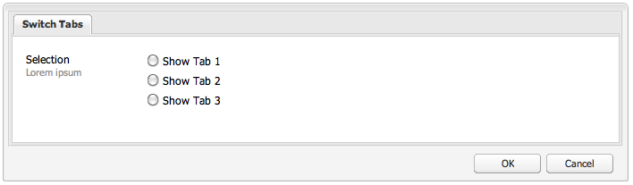

# 위젯 사용 및 확장(클래식 UI){#using-and-extending-widgets-classic-ui}

>[!NOTE]
>
>이 페이지에서는 AEM 6.4에서 더 이상 사용되지 않는 클래식 UI 내의 위젯 사용에 대해 설명합니다.
>
>Adobe은 최신 버전을 사용할 것을 권장합니다. [터치 지원 UI](/help/sites-developing/touch-ui-concepts.md) 기준 [Coral UI](/help/sites-developing/touch-ui-concepts.md#coral-ui) 및 [Granite UI](/help/sites-developing/touch-ui-concepts.md#granite-ui-foundation-components).

Adobe Experience Manager(AEM) 웹 기반 인터페이스는 AJAX 및 기타 최신 브라우저 기술을 사용하여 웹 페이지에서 작성자가 컨텐츠를 바로 WYSIWYG로 편집하고 형식을 지정할 수 있도록 합니다.

AEM은 [ExtJS](https://www.sencha.com/) 위젯 라이브러리는 가장 중요한 모든 브라우저에서 작동하며 데스크탑 수준의 UI 경험을 생성할 수 있는 고도로 연마된 사용자 인터페이스 요소를 제공합니다.

이러한 위젯은 AEM 내에 포함되며, AEM 자체에서 사용할 수 있을 뿐만 아니라 AEM을 사용하여 빌드된 모든 웹 사이트에서 사용할 수 있습니다.

AEM에서 사용 가능한 모든 위젯에 대한 전체 참조는 다음을 참조하십시오. [위젯 API 설명서](https://developer.adobe.com/experience-manager/reference-materials/6-5/widgets-api/index.html) 또는 [기존 xtype 목록](/help/sites-developing/xtypes.md). 또한 ExtJS 프레임워크를 사용하는 방법을 보여 주는 많은 예제도 [센차](https://examples.sencha.com/extjs/7.6.0/) 사이트, 프레임워크 소유자.

이 페이지에서는 위젯 사용 및 확장 방법에 대한 통찰력을 제공합니다. 이 섹션에서는 다음 방법을 먼저 설명합니다. [페이지에 클라이언트측 코드 포함](#including-the-client-sided-code-in-a-page). 그런 다음 몇 가지 기본 사용 및 확장을 설명하기 위해 만들어진 몇 가지 샘플 구성 요소에 대해 설명합니다. 이러한 구성 요소는 **ExtJS 위젯 사용** 패키지 켜기 **패키지 공유**.

이 패키지에는 다음과 같은 예가 포함됩니다.

* [기본 대화 상자](#basic-dialogs) 기본 위젯으로 빌드되어 있습니다.
* [동적 대화 상자](#dynamic-dialogs) 기본 위젯과 사용자 지정된 JavaScript 논리를 사용하여 빌드합니다.
* 대화 상자 기준 [사용자 정의 위젯](#custom-widgets).
* A [트리 패널](#tree-overview) 지정된 경로 아래에 JCR 트리를 표시합니다.
* A [격자 패널](#grid-overview) 데이터를 표 형식으로 표시합니다.

>[!NOTE]
>
>Adobe Experience Manager의 클래식 UI는 [ExtJS 3.4.0](https://extjs.cachefly.net/ext-3.4.0/docs/).

## 페이지에 클라이언트측 코드 포함 {#including-the-client-sided-code-in-a-page}

클라이언트측 JavaScript 및 스타일 시트 코드는 클라이언트 라이브러리에 배치해야 합니다.

클라이언트 라이브러리를 만들려면 다음을 수행하십시오.

1. 아래에 노드 만들기 `/apps/<project>` 다음 속성을 사용합니다.

   * name=&quot;clientlib&quot;
   * jcr:mixinTypes=&quot;[혼합:잠금 가능]&quot;
   * jcr:primaryType=&quot;cq:ClientLibraryFolder&quot;
   * sling:resourceType=&quot;widgets/clientlib&quot;
   * categories=&quot;[&lt;category-name>]&quot;
   * dependencies=&quot;[cq.widgets]&quot;

   `Note: <category-name> is the name of the custom library (for example, "cq.extjstraining") and is used to include the library on the page.`

1. 아래 `clientlib` 만들기 `css` 및 `js` 폴더(nt:folder).

1. 아래 `clientlib` 만들기 `css.txt` 및 `js.txt` 파일(nt:files). 이러한 .txt 파일에는 라이브러리에 포함된 파일이 나열됩니다.

1. 편집 `js.txt`: 다음으로 시작해야 합니다. &#39; `#base=js`&#39; 뒤에 CQ 클라이언트 라이브러리 서비스에서 집계한 파일 목록이 옵니다. 예:

   ```
   #base=js
    components.js
    exercises.js
    CustomWidget.js
    CustomBrowseField.js
    InsertTextPlugin.js
   ```

1. 편집 `css.txt`: 다음으로 시작해야 합니다. &#39; `#base=css`&#39; 뒤에 CQ 클라이언트 라이브러리 서비스에서 집계한 파일 목록이 옵니다. 예:

   ```
   #base=css
    components.css
   ```

1. 아래 `js` 폴더에 라이브러리에 속하는 JavaScript 파일을 배치합니다.

1. 아래 `css` 폴더, 위치 `.css` css 파일에서 사용하는 파일 및 리소스(예: `my_icon.png`).

>[!NOTE]
>
>이전에 설명한 스타일 시트의 처리는 선택 사항입니다.

페이지 구성 요소 jsp에 클라이언트 라이브러리를 포함하려면 다음을 수행하십시오.

* JavaScript 코드와 스타일 시트를 모두 포함하려면 다음을 수행하십시오.
  `<ui:includeClientLib categories="<category-name1>, <category-name2>, ..."/>`
위치 `<category-nameX>` 는 클라이언트측 라이브러리의 이름입니다.

* JavaScript 코드만 포함하려면 다음을 수행하십시오.
  `<ui:includeClientLib js="<category-name>"/>`

자세한 내용은 의 설명을 참조하십시오 [&lt;ui:includeclientlib>](/help/sites-developing/taglib.md#lt-ui-includeclientlib) 태그에 가깝게 배치하십시오.

때때로 클라이언트 라이브러리는 작성자 모드 에서만 사용할 수 있으며 게시 모드에서 제외 해야 합니다. 다음과 같이 달성할 수 있습니다.

```xml
    if (WCMMode.fromRequest(request) != WCMMode.DISABLED) {
        %><ui:includeClientLib categories="cq.collab.blog"/><%
    }
```

### 샘플이 있는 시작 {#getting-started-with-the-samples}

이 페이지의 자습서를 따르려면 패키지를 설치하십시오 **ExtJS 위젯 사용** 로컬 AEM 인스턴스에서 을 만들고 구성 요소가 포함된 샘플 페이지를 만듭니다. 이렇게 하려면 다음을 수행합니다.

1. AEM 인스턴스에서 이라는 패키지를 다운로드합니다 **ExtJS 위젯 사용(v01)** 패키지 공유에서 패키지를 다운로드하여 설치합니다. 프로젝트를 생성합니다. `extjstraining` 아래 `/apps` 저장소에서 입니다.
1. 스크립트(js) 및 스타일 시트(css)가 포함된 클라이언트 라이브러리를 Geometrixx 페이지 jsp의 head 태그에 포함합니다. 의 새 페이지에 샘플 구성 요소를 포함하려 합니다. **Geometrixx** 분기: **CRXDE Lite** 파일 열기 `/apps/geometrixx/components/page/headlibs.jsp` 및 추가 `cq.extjstraining` 기존 범주 `<ui:includeClientLib>` 태그는 다음과 같습니다.
   `%><ui:includeClientLib categories="apps.geometrixx-main, cq.extjstraining"/><%`
1. 에서 페이지 만들기 **Geometrixx** 아래 분기 `/content/geometrixx/en/products` 호출합니다. **ExtJS 위젯 사용**.
1. 디자인 모드로 전환하고 라는 그룹의 모든 구성 요소를 추가합니다. **ExtJS 위젯 사용** Geometrixx 디자인
1. 그룹의 구성 요소인 편집 모드로 돌아갑니다. **ExtJS 위젯 사용** Sidekick에서 사용할 수 있습니다.

>[!NOTE]
>
>이 페이지의 예는 더 이상 AEM과 함께 제공되지 않고 We.Retail로 대체된 Geometrixx 샘플 콘텐츠를 기반으로 합니다. 다음을 참조하십시오. [We.Retail 참조 구현](/help/sites-developing/we-retail.md#we-retail-geometrixx) Geometrixx 다운로드 및 설치 방법에 대해 알아보십시오.

### 기본 대화 상자 {#basic-dialogs}

대화 상자는 일반적으로 콘텐츠를 편집하는 데 사용되지만 정보를 표시할 수도 있습니다. 전체 대화 상자를 쉽게 볼 수 있는 방법은 json 형식으로 해당 표현에 액세스하는 것입니다. 이렇게 하려면 브라우저가 다음을 수행하도록 지정합니다.

`https://localhost:4502/<path-to-dialog>.-1.json`

의 첫 번째 구성 요소 **ExtJS 위젯 사용** Sidekick의 그룹이 호출됩니다. **1. 대화 상자 기본 사항** 또한 맞춤형 JavaScript 논리를 사용하지 않고 기본 위젯으로 빌드된 4개의 기본 대화 상자를 포함합니다. 대화 상자는 아래에 저장됩니다. `/apps/extjstraining/components/dialogbasics`. 기본 대화 상자는 다음과 같습니다.

* 전체 대화 상자( `full` node): 세 개의 탭이 있는 창이 표시되며, 각 탭에는 두 개의 텍스트 필드가 있습니다.
* 단일 패널 대화 상자( `singlepanel` node): 두 개의 텍스트 필드가 있는 탭이 한 개 있는 창이 표시됩니다.
* 다중 패널 대화 상자( `multipanel` node): 전체 대화 상자와 표시되지만 다르게 빌드됩니다.
* 디자인 대화 상자( `design` node): 두 개의 탭이 있는 창이 표시됩니다. 첫 번째 탭에는 텍스트 필드, 드롭다운 메뉴 및 축소 가능한 텍스트 영역이 있습니다. 두 번째 탭에는 4개의 텍스트 필드로 이루어진 필드 세트와 2개의 텍스트 필드로 이루어진 축소 가능한 필드 세트가 있습니다.

포함 **1. 대화 상자 기본 사항** 샘플 페이지의 구성 요소:

1. 추가 **1. 대화 상자 기본 사항** 구성 요소를 샘플 페이지에 추가 **ExtJS 위젯 사용** 의 탭 **Sidekick**.
1. 구성 요소에 제목, 일부 텍스트 및 **속성** 링크를 클릭합니다. 링크를 선택하면 저장소에 저장된 단락의 속성이 표시됩니다. 속성을 숨기려면 링크를 다시 선택합니다.

구성 요소는 다음과 같이 표시됩니다.


#### 예제 1: 전체 대화 상자 {#example-full-dialog}

다음 **전체** 대화 상자에 세 개의 탭이 있는 창이 표시되며, 각 탭에는 두 개의 텍스트 필드가 있습니다. 기본 대화 상자입니다. **대화 상자 기본 사항** 구성 요소. 특징은 다음과 같습니다.

* 노드에 의해 정의됨: 노드 유형 = `cq:Dialog`, xtype = ` [dialog](/help/sites-developing/xtypes.md#dialog)`.
* 세 개의 탭을 표시합니다(노드 유형 = `cq:Panel`).
* 각 탭에는 두 개의 텍스트 필드가 있습니다(노드 유형 = `cq:Widget`, xtype = ` [textfield](/help/sites-developing/xtypes.md#textfield)`).
* 은 노드에 의해 정의됩니다.
  `/apps/extjstraining/components/dialogbasics/full`
* 은(는) 다음을 요청하여 JSON 형식으로 렌더링됩니다.
  `https://localhost:4502/apps/extjstraining/components/dialogbasics/full.-1.json`

대화 상자가 다음과 같이 표시됩니다.


#### 예제 2: 단일 패널 대화 상자 {#example-single-panel-dialog}

다음 **단일 패널** 대화 상자에 두 개의 텍스트 필드가 있는 탭이 한 개 있는 창이 표시됩니다. 특징은 다음과 같습니다.

* 탭 하나를 표시합니다(노드 유형 = `cq:Dialog`, xtype = ` [panel](/help/sites-developing/xtypes.md#panel)`)
* 탭에는 두 개의 텍스트 필드가 있습니다(노드 유형 = `cq:Widget`, xtype = ` [textfield](/help/sites-developing/xtypes.md#textfield)`)
* 은 노드에 의해 정의됩니다.
  `/apps/extjstraining/components/dialogbasics/singlepanel`
* 은(는) 다음을 요청하여 json 형식으로 렌더링됩니다.
  `https://localhost:4502/apps/extjstraining/components/dialogbasics/singlepanel.-1.json`
* 한 가지 이점 **전체 대화 상자** 더 적은 구성이 필요합니까?
* 권장 사용: 정보를 표시하거나 일부 필드만 있는 간단한 대화 상자의 경우.

단일 패널 대화 상자를 사용하려면 다음을 수행합니다.

1. 대화 상자 바꾸기 **대화 상자 기본 사항** 이 포함된 구성 요소 **단일 패널** 대화 상자:
   1. 위치 **CRXDE Lite**, 노드를 삭제합니다. `/apps/extjstraining/components/dialogbasics/dialog`
   1. 클릭 **모두 저장** 변경 내용을 저장합니다.
   1. 노드를 복사합니다. `/apps/extjstraining/components/dialogbasics/singlepanel`
   1. 복사한 노드를 아래에 붙여넣습니다. `/apps/extjstraining/components/dialogbasics`
   1. 노드를 선택합니다. `/apps/extjstraining/components/dialogbasics/Copy of singlepanel`이름 바꾸기 `dialog`.
1. 구성 요소를 편집합니다. 대화 상자는 다음과 같이 표시됩니다.


#### 예제 3: 다중 패널 대화 상자 {#example-multi-panel-dialog}

다음 **다중 패널** 대화 상자의 디스플레이는 **전체** 대화 상자, 하지만 다르게 빌드됩니다. 특징은 다음과 같습니다.

* 노드로 정의됩니다(노드 유형 = `cq:Dialog`, xtype = ` [tabpanel](/help/sites-developing/xtypes.md#tabpanel)`).
* 세 개의 탭을 표시합니다(노드 유형 = `cq:Panel`).
* 각 탭에는 두 개의 textfields (노드 유형 = `cq:Widget` , xtype = ` [textfield](/help/sites-developing/xtypes.md#textfield)` )가 있습니다.
* 는 노드에서 정의 됩니다.
  `/apps/extjstraining/components/dialogbasics/multipanel`
* 은(는) 다음을 요청하여 json 형식으로 렌더링됩니다.
  `https://localhost:4502/apps/extjstraining/components/dialogbasics/multipanel.-1.json`
* 한 가지 이점 **전체 대화 상자** 그것은 단순한 구조를 가지고 있다는 것이다.
* 권장 사용: 다중 탭 대화 상자의 경우.

[다중 패널] 대화 상자를 사용하려면 다음을 수행합니다.

1. 대화 상자 바꾸기 **대화 상자 기본 사항** 이 포함된 구성 요소 **다중 패널** 대화 상자: 다음에 대해 설명된 단계 수행 [예제 2: 단일 패널 대화 상자](#example-single-panel-dialog)
1. 구성 요소를 편집합니다. 대화 상자는 다음과 같이 표시됩니다.


#### 예제 4: 리치 대화 상자 {#example-rich-dialog}

다음 **리치** 대화 상자에 두 개의 탭이 있는 창이 표시됩니다. 첫 번째 탭에는 텍스트 필드, 드롭다운 메뉴 및 축소 가능한 텍스트 영역이 있습니다. 두 번째 탭에는 4개의 텍스트 필드로 이루어진 필드 세트와 2개의 텍스트 필드로 이루어진 축소 가능한 필드 세트가 있습니다. 특징은 다음과 같습니다.

* 노드로 정의됩니다(노드 유형 = `cq:Dialog`, xtype = ` [dialog](/help/sites-developing/xtypes.md#dialog)`).
* 두 개의 탭을 표시합니다(노드 유형 = `cq:Panel`).
* 첫 번째 탭에는 ` [dialogfieldset](/help/sites-developing/xtypes.md#dialogfieldset)` 이 포함된 위젯 ` [textfield](/help/sites-developing/xtypes.md#textfield)` 및 a ` [selection](/help/sites-developing/xtypes.md#selection)` 세 가지 옵션이 있고 축소 가능한 위젯 ` [dialogfieldset](/help/sites-developing/xtypes.md#dialogfieldset)` 포함 ` [textarea](/help/sites-developing/xtypes.md#textarea)` 위젯.
* 두 번째 탭에는 ` [dialogfieldset](/help/sites-developing/xtypes.md#dialogfieldset)` 4가 포함된 위젯 ` [textfield](/help/sites-developing/xtypes.md#textfield)` 위젯 및 축소 가능 `dialogfieldset` (2) ` [textfield](/help/sites-developing/xtypes.md#textfield)` 위젯.
* 은 노드에 의해 정의됩니다.
  `/apps/extjstraining/components/dialogbasics/rich`
* 은(는) 다음을 요청하여 json 형식으로 렌더링됩니다.
  `https://localhost:4502/apps/extjstraining/components/dialogbasics/rich.-1.json`

을(를) 사용하려면 **리치** 대화 상자:

1. 대화 상자 바꾸기 **대화 상자 기본 사항** 이 포함된 구성 요소 **리치** 대화 상자: 다음에 대해 설명된 단계 수행 [예제 2: 단일 패널 대화 상자](#example-single-panel-dialog)
1. 구성 요소를 편집합니다. 대화 상자는 다음과 같이 표시됩니다.

 

### 동적 대화 상자 {#dynamic-dialogs}

의 두 번째 구성 요소 **ExtJS 위젯 사용** Sidekick의 그룹이 호출됩니다. **2. 동적 대화 상자** 및 에는 기본 위젯과 함께 빌드된 3개의 동적 대화 상자가 포함되어 있습니다. **사용자 지정된 JavaScript 논리 사용**. 대화 상자는 아래에 저장됩니다. `/apps/extjstraining/components/dynamicdialogs`. 동적 대화 상자는 다음과 같습니다.

* 탭 전환 대화 상자( `switchtabs` node): 두 개의 탭이 있는 창이 표시됩니다. 첫 번째 탭에는 세 가지 옵션이 있는 라디오 선택 항목이 있습니다. 옵션을 선택하면 해당 옵션과 관련된 탭이 표시됩니다. 두 번째 탭에는 두 개의 텍스트 필드가 있습니다.
* 임의 대화 상자( `arbitrary` node): 탭이 한 개인 창이 표시됩니다. 탭에는 에셋을 삭제하거나 업로드할 수 있는 필드와 포함 페이지에 대한 일부 정보 및 에셋을 참조하는 경우 에셋에 대한 정보를 표시하는 필드가 있습니다.
* 필드 전환 대화 상자( `togglefield` node): 탭이 한 개인 창이 표시됩니다. 탭에는 확인란이 있습니다. 확인란이 선택되어 있으면 두 개의 텍스트 필드가 있는 필드 세트가 표시됩니다.

다음을 포함시키려면 **2. 동적 대화 상자** 샘플 페이지의 구성 요소:

1. 추가 **2. 동적 대화 상자** 구성 요소를 샘플 페이지에 추가 **ExtJS 위젯 사용** 의 탭 **Sidekick**.
1. 구성 요소에 제목, 일부 텍스트 및 **속성** 링크를 클릭합니다. 링크를 선택하면 저장소에 저장된 단락의 속성이 표시됩니다. 속성을 숨기려면 링크를 다시 선택합니다.

구성 요소는 다음과 같이 표시됩니다.


#### 예제 1: 탭 전환 대화 상자 {#example-switch-tabs-dialog}

다음 **탭 전환** 대화 상자에 두 개의 탭이 있는 창이 표시됩니다. 첫 번째 탭에는 세 가지 옵션이 있는 라디오 선택 항목이 있습니다. 옵션을 선택하면 해당 옵션과 관련된 탭이 표시됩니다. 두 번째 탭에는 두 개의 텍스트 필드가 있습니다.

주요 특징은 다음과 같습니다.

* 노드로 정의됩니다(노드 유형 = `cq:Dialog`, xtype = ` [dialog](/help/sites-developing/xtypes.md#dialog)`).
* 두 개의 탭을 표시합니다(노드 유형 = `cq:Panel`): 하나의 선택 탭이며, 두 번째 탭은 첫 번째 탭의 선택 사항에 따라 달라집니다(세 가지 옵션).
* 3개의 선택적 탭 있음(노드 유형 = `cq:Panel`), 각 텍스트 필드에는 두 개의 텍스트 필드가 있습니다(노드 유형 = `cq:Widget`, xtype = ` [textfield](/help/sites-developing/xtypes.md#textfield)`). 한 번에 하나의 선택 탭만 표시됩니다.
* 다음에 의해 정의됩니다. `switchtabs` 노드 위치:
  `/apps/extjstraining/components/dynamicdialogs/switchtabs`
* 은(는) 다음을 요청하여 json 형식으로 렌더링됩니다.
  `https://localhost:4502/apps/extjstraining/components/dynamicdialogs/switchtabs.-1.json`

논리는 다음과 같이 이벤트 리스너와 JavaScript 코드를 통해 구현됩니다.

* 대화 상자 노드에는 &quot; `beforeshow`&quot;대화 상자가 표시되기 전에 모든 선택 사항 탭을 숨기는 리스너:
  `beforeshow="function(dialog){Ejst.x2.manageTabs(dialog.items.get(0));}"`
  `dialog.items.get(0)` 다음 가져오기 `tabpanel` 에는 선택 패널 및 세 개의 선택 패널이 포함되어 있습니다.
* 다음 `Ejst.x2` 개체가에 정의되어 있습니다. `exercises.js` 파일 위치:
  `/apps/extjstraining/clientlib/js/exercises.js`
* 다음에서 `Ejst.x2.manageTabs()` 메서드, 값 `index` 는 -1이며, 모든 선택 탭이 숨겨집니다(1~3 사이).
* 선택 탭에는 대화 상자가 로드될 때 선택한 탭을 표시하는 두 개의 리스너가 있습니다(&quot; `loadcontent`&quot;이벤트) 및 선택 내용이 변경될 때 선택한 탭을 표시하는 이벤트(&quot; `selectionchanged`&quot;이벤트):
  `loadcontent="function(field,rec,path){Ejst.x2.showTab(field);}"`
  `selectionchanged="function(field,value){Ejst.x2.showTab(field);}"`
* 의 경우 `Ejst.x2.showTab()` 메서드,
  `field.findParentByType('tabpanel')` 다음 가져오기 `tabpanel` 모든 탭( `field` 선택 위젯 표시)
  `field.getValue()` 선택 항목의 값을 가져옵니다(예: tab2).
  `Ejst.x2.manageTabs()` 선택한 탭을 표시합니다.
* 각 선택적 탭에는 &quot;&quot;에서 탭을 숨기는 수신기가 있습니다. `render`&quot;이벤트:
  `render="function(tab){Ejst.x2.hideTab(tab);}"`
* 의 경우 `Ejst.x2.hideTab()` 메서드,
  `tabPanel` 은(는) `tabpanel` 모든 탭을 포함하는
  `index` 는 선택 사항인 탭의 색인입니다.
  `tabPanel.hideTabStripItem(index)` 탭를 숨깁니다.

다음과 같이 표시됩니다.



#### 예제 2: 임의의 대화 상자 {#example-arbitrary-dialog}

종종 대화 상자에 기본 구성 요소의 콘텐츠가 표시됩니다. 여기에 설명된 대화 상자, **임의** 대화 상자, 다른 구성 요소에서 콘텐츠를 가져옵니다.

다음 **임의** 대화 상자에 탭이 하나인 창이 표시됩니다. 탭에는 에셋을 삭제하거나 업로드하는 필드와 포함된 페이지에 대한 일부 정보와 에셋을 참조한 경우 에셋에 대한 정보를 표시하는 두 개의 필드가 있습니다.

주요 특징은 다음과 같습니다.

* 노드로 정의됩니다(노드 유형 = `cq:Dialog`, xtype = ` [dialog](/help/sites-developing/xtypes.md#dialog)`).
* 1개 표시 `tabpanel` 위젯(노드 유형 = `cq:Widget`, xtype = ` [tabpanel](/help/sites-developing/xtypes.md#tabpanel)`) 하나의 패널(노드 유형 = `cq:Panel`)
* 패널에는 smartfile 위젯이 있습니다(노드 유형 = `cq:Widget`, xtype = ` [smartfile](/help/sites-developing/xtypes.md#smartfile)`) 및 ownerdraw 위젯(노드 유형 = `cq:Widget`, xtype = ` [ownerdraw](/help/sites-developing/xtypes.md#ownerdraw)`)
* 다음에 의해 정의됩니다. `arbitrary` 노드 위치:
  `/apps/extjstraining/components/dynamicdialogs/arbitrary`
* 은(는) 다음을 요청하여 json 형식으로 렌더링됩니다.
  `https://localhost:4502/apps/extjstraining/components/dynamicdialogs/arbitrary.-1.json`

논리는 다음과 같이 이벤트 리스너와 JavaScript 코드를 통해 구현됩니다.

* 다음 `ownerdraw` 위젯에 &quot; `loadcontent`구성 요소가 포함된 페이지에 대한 정보를 표시하는 리스너 즉, 콘텐츠가 로드될 때 smartfile 위젯에서 참조하는 자산입니다.
  `loadcontent="function(field,rec,path){Ejst.x2.showInfo(field,rec,path);}"`
  `field` 이(가) (으)로 설정됨 `ownerdraw` 오브젝트
  `path` 구성 요소의 콘텐츠 경로로 설정됩니다(예: `/content/geometrixx/en/products/triangle/ui-tutorial/jcr:content/par/dynamicdialogs`)
* 다음 `Ejst.x2` 개체가에 정의되어 있습니다. `exercises.js` 파일 위치:
  `/apps/extjstraining/clientlib/js/exercises.js`
* 의 경우 `Ejst.x2.showInfo()` 메서드,
  `pagePath` 는 구성 요소가 포함된 페이지의 경로입니다.
  `pageInfo` 페이지 속성을 json 형식으로 나타냅니다.
  `reference` 는 참조된 자산의 경로입니다.
  `metadata` 자산의 메타데이터를 json 형식으로 나타냅니다.
  `ownerdraw.getEl().update(html);` 대화 상자에 생성된 html 표시

을(를) 사용하려면 **임의** 대화 상자:

1. 임의 **대화 상자를 사용 하** 여 동적 대화 상자 **구성 요소의 대화 상자** 를 바꾸기 합니다.
예제 2: 단일 패널 대화 상자에 대해 [ 설명 하는 단계 팔로우.](#example-single-panel-dialog)
1. 구성 요소 편집: 대화 상자가 다음과 같이 표시 됩니다.


#### 예제 3: 필드 전환 대화 상자 {#example-toggle-fields-dialog}

다음 **필드 전환** 대화 상자에 탭이 하나인 창이 표시됩니다. 탭에 확인란이 있습니다. 선택 하면 두 개의 텍스트 필드가 있는 필드 집합이 표시 됩니다.

주요 특징은 다음과 같습니다.

* 은 노드 (노드 유형 = `cq:Dialog` , xtype = ` [dialog](/help/sites-developing/xtypes.md#dialog)` )로 정의 됩니다.
* `tabpanel`하나의 widget (노드 유형 = `cq:Widget` , xtype = ` [tabpanel](/help/sites-developing/xtypes.md#textpanel)` )을 하나의 패널 (노드 유형 = `cq:Panel` )으로 표시 합니다.
* 이 패널에는 선택/체크 상자 위젯 (노드 유형 = `cq:Widget` , xtype = ` [selection](/help/sites-developing/xtypes.md#selection)` , type = ` [checkbox](/help/sites-developing/xtypes.md#checkbox)` )이 있으며, 기본적으로 숨김 되는 축소 가능한 dialogfieldset fieldset widget (노드 type = `cq:Widget` , xtype = ` [dialogfieldset](/help/sites-developing/xtypes.md#dialogfieldset)` )은 두 개의 textfield widget (노드 유형 = `cq:Widget` , xtype = ` [textfield](/help/sites-developing/xtypes.md#textfield)` )이 있습니다.
* 다음에 의해 정의됩니다. `togglefields` 노드 위치:
  `/apps/extjstraining/components/dynamicdialogs/togglefields`
* 은(는) 다음을 요청하여 json 형식으로 렌더링됩니다.
  `https://localhost:4502/apps/extjstraining/components/dynamicdialogs/togglefields.-1.json`

논리는 다음과 같이 이벤트 리스너와 JavaScript 코드를 통해 구현됩니다.

* 선택 탭에는 두 개의 리스너가 있습니다. 하나는 콘텐츠가 로드될 때 대화 상자 세트를 보여 줍니다(&quot;) `loadcontent`&quot;이벤트) 및 선택 내용이 변경될 때 대화 상자 필드 세트를 보여 주는 이벤트(&quot; `selectionchanged`&quot;이벤트):
  `loadcontent="function(field,rec,path){Ejst.x2.toggleFieldSet(field);}"`
  `selectionchanged="function(field,value){Ejst.x2.toggleFieldSet(field);}"`
* 다음 `Ejst.x2` 개체가에 정의되어 있습니다. `exercises.js` 파일 위치:
  `/apps/extjstraining/clientlib/js/exercises.js`
* 의 경우 `Ejst.x2.toggleFieldSet()` 메서드,
  `box` 은 선택 객체입니다.
  `panel` 은 선택 항목 및 대화 상자 필드 세트 위젯이 포함된 패널입니다.
  `fieldSet` 는 대화 상자 필드 집합 개체입니다.
  `show` 은 선택 항목의 값(true 또는 false)이며, 를 기반으로 합니다. `show`&#39; 대화 상자 필드 집합이 표시되거나 표시되지 않음

을(를) 사용하려면 **필드 전환** 대화 상자에서 다음을 수행합니다.

1. 대화 상자 바꾸기 **동적 대화 상자** 이 포함된 구성 요소 **필드 전환** 대화 상자: 다음에 대해 설명된 단계 수행 [예제 2: 단일 패널 대화 상자](#example-single-panel-dialog)
1. 구성 요소를 편집합니다. 대화 상자는 다음과 같이 표시됩니다.


### 사용자 정의 위젯 {#custom-widgets}

AEM과 함께 제공되는 기본 위젯은 대부분의 사용 사례를 다룹니다. 하지만 프로젝트별 요구 사항을 충족하기 위해 사용자 정의 위젯을 만들어야 하는 경우가 있습니다. 기존 위젯을 확장하여 사용자 정의 위젯을 만들 수 있습니다. 이러한 사용자 지정을 시작하는 데 도움이 되도록 **`Using ExtJS Widgets`** 패키지에는 세 개의 서로 다른 사용자 정의 위젯을 사용하는 세 개의 대화 상자가 포함되어 있습니다.

* 다중 필드 대화 상자( `multifield` node)가 탭 하나가 있는 창을 표시합니다. 탭에는 두 개의 필드가 있는 사용자 지정된 다중 필드 위젯이 있습니다. 두 개의 옵션이 있는 드롭다운 메뉴와 텍스트 필드입니다. 기본 제공 `multifield` 위젯(텍스트 필드만 있음)에는 의 모든 기능이 포함됩니다. `multifield` 위젯.
* 트리 찾아보기 대화 상자( `treebrowse` node)에는 경로 찾아보기 위젯이 포함된 탭이 있는 창이 표시됩니다. 화살표를 클릭하면 계층을 찾아보고 항목을 선택할 수 있는 창이 열립니다. 그런 다음 항목의 경로가 경로 필드에 추가되고 대화 상자를 닫아도 유지됩니다.
* 리치 텍스트 편집기 플러그인 기반 대화 상자( `rteplugin` 사용자 지정 단추를 서식 있는 텍스트 편집기에 추가하여 일부 사용자 지정 텍스트를 기본 텍스트에 삽입하는 노드입니다. 이 템플릿은 `richtext` 위젯(RTE) 및 RTE 플러그인 메커니즘을 통해 추가된 사용자 정의 기능.

사용자 정의 위젯 및 플러그인은 이라는 구성 요소에 포함됩니다. **3. 사용자 정의 위젯** / **ExtJS 위젯 사용** 패키지. 이 구성 요소를 샘플 페이지에 포함하려면 다음 작업을 수행하십시오.

1. 3을 **추가 합니다. 사이드 킥** 에 있는 탭의 **Extjs widget** 에서 **샘플 페이지에 대 한 사용자 지정 위젯** 구성 요소입니다.
1. 구성 요소는 제목, 일부 텍스트 및 링크 속성 **을 클릭할** 때 저장소에 저장 된 단락의 속성을 표시 합니다. 다시 클릭하면 속성이 숨겨집니다.
구성 요소는 다음과 같이 표시됩니다.


#### 예제 1: 사용자 정의 다중 필드 위젯 {#example-custom-multifield-widget}

다음 **사용자 지정 다중 필드** 위젯 기반 대화 상자에 탭이 하나인 창이 표시됩니다. 탭에는 하나의 필드가 있는 표준 위젯과 달리 두 개의 필드, 즉 두 개의 옵션이 있는 드롭다운 메뉴와 텍스트 필드가 있는 사용자 정의된 다중 필드 위젯이 있습니다.

다음 **사용자 지정 다중 필드** 위젯 기반 대화 상자:

* 노드로 정의됩니다(노드 유형 = `cq:Dialog`, xtype = ` [dialog](/help/sites-developing/xtypes.md#dialog)`).
* 1개 표시 `tabpanel` 위젯(노드 유형 = `cq:Widget`, xtype = ` [tabpanel](/help/sites-developing/xtypes.md#tabpanel)`) 패널 포함(노드 유형 = `cq:Widget`, xtype = ` [panel](/help/sites-developing/xtypes.md#panel)`).
* 패널에 `multifield` 위젯(노드 유형 = `cq:Widget`, xtype = ` [multifield](/help/sites-developing/xtypes.md#multifield)`).
* 다음 `multifield` 위젯에 필드 구성이 있습니다(노드 유형 = `nt:unstructured`, xtype = `ejstcustom`, optionsProvider = `Ejst.x3.provideOptions`사용자 지정 xtype &#39;을(를) 기반으로 하는 `ejstcustom`&#39;:
   * &#39; `fieldconfig`&#39;는 의 구성 옵션입니다. ` [CQ.form.MultiField](https://developer.adobe.com/experience-manager/reference-materials/6-5/widgets-api/index.html?class=CQ.form.MultiField)` 개체.
   * &#39; `optionsProvider`&#39;는 의 구성입니다. `ejstcustom` 위젯. 로 설정됩니다. `Ejst.x3.provideOptions` 다음에서 정의된 메서드: `exercises.js` 위치:
     `/apps/extjstraining/clientlib/js/exercises.js`
두 개의 옵션을 반환합니다.
* 다음에 의해 정의됩니다. `multifield` 노드 위치:
  `/apps/extjstraining/components/customwidgets/multifield`
* 은(는) 다음을 요청하여 json 형식으로 렌더링됩니다.
  `https://localhost:4502/apps/extjstraining/components/customwidgets/multifield.-1.json`

사용자 정의 `multifield` 위젯(xtype = `ejstcustom`):

* 는 이라는 JavaScript 개체입니다. `Ejst.CustomWidget`
* 다음에 정의됨 `CustomWidget.js` JavaScript 파일 위치:
  `/apps/extjstraining/clientlib/js/CustomWidget.js`
* 를 확장합니다. ` [CQ.form.CompositeField](https://developer.adobe.com/experience-manager/reference-materials/6-5/widgets-api/index.html?class=CQ.form.CompositeField)` 위젯.
* 에는 세 개의 필드가 있습니다. `hiddenField` (텍스트 필드), `allowField` (콤보 상자), `otherField` (텍스트 필드)
* 재정의 `CQ.Ext.Component#initComponent` 세 필드를 추가하려면:
   * `allowField` 다음 값: [CQ.form.Selection](https://developer.adobe.com/experience-manager/reference-materials/6-5/widgets-api/index.html?class=CQ.form.Selection) &#39;select&#39; 형식의 개체입니다. optionsProvider는 대화 상자에 정의된 CustomWidget의 optionsProvider 구성으로 인스턴스화된 Selection 개체의 구성입니다.
   * `otherField` 다음 값: [CQ.Ext.form.TextField](https://developer.adobe.com/experience-manager/reference-materials/6-5/widgets-api/index.html?class=CQ.Ext.form.TextField) 오브젝트
* 포맷를 사용 하 여 CustomWidget의 값을 설정 하 고 검색 하는 CompositeField ](https://developer.adobe.com/experience-manager/reference-materials/6-5/widgets-api/index.html?class=CQ.form.CompositeField) 메서드 `setValue` , `getValue` 및 `getRawValue` [ 을 무시 합니다.
  `<allowField value>/<otherField value>, for example: 'Bla1/hello'`
* 자신을 &#39; `ejstcustom` &#39; xtype:
  `CQ.Ext.reg('ejstcustom', Ejst.CustomWidget);`

다음 **사용자 지정 다중 필드** 위젯 기반 대화 상자는 다음과 같이 표시됩니다.


#### 예제 2: 사용자 지정 `Treebrowse` 위젯 {#example-custom-treebrowse-widget}

[사용자 지정 **`Treebrowse`** 위젯 기반] 대화 상자에는 사용자 지정 경로 찾아보기 위젯이 포함 된 하나의 탭 있는 창이 표시 됩니다. 화살표를 선택 하면 계층를 탐색 하 고 항목을 선택할 수 있는 창이 열립니다. 그런 다음 항목의 경로가 경로 필드에 추가 되 고 대화 상자가 닫히면 유지 됩니다.

사용자 지정 `treebrowse` 대화 상자:

* 은 노드 (노드 유형 = `cq:Dialog` , xtype = ` [dialog](/help/sites-developing/xtypes.md#dialog)` )로 정의 됩니다.
* 1개 표시 `tabpanel` 위젯(노드 유형 = `cq:Widget`, xtype = ` [tabpanel](/help/sites-developing/xtypes.md#tabpanel)`) 패널 포함(노드 유형 = `cq:Widget`, xtype = ` [panel](/help/sites-developing/xtypes.md#panel)`).
* 패널에 사용자 정의 위젯이 있습니다(노드 유형 = `cq:Widget`, xtype = `ejstbrowse`)
* 다음에 의해 정의됩니다. `treebrowse` 노드 위치:
  `/apps/extjstraining/components/customwidgets/treebrowse`
* 은(는) 다음을 요청하여 json 형식으로 렌더링됩니다.
  `https://localhost:4502/apps/extjstraining/components/customwidgets/treebrowse.-1.json`

사용자 지정 트리 찾아보기 위젯(xtype = `ejstbrowse`):

* 는 이라는 JavaScript 개체입니다. `Ejst.CustomWidget`
* 다음에 정의됨 `CustomBrowseField.js` JavaScript 파일 위치:
  `/apps/extjstraining/clientlib/js/CustomBrowseField.js`
* 확장 ` [CQ.Ext.form.TriggerField](https://developer.adobe.com/experience-manager/reference-materials/6-5/widgets-api/index.html?class=CQ.Ext.form.TriggerField)`.
* 라는 찾아보기 창을 정의합니다. `browseWindow`.
* 재정의 ` [CQ.Ext.form.TriggerField](https://developer.adobe.com/experience-manager/reference-materials/6-5/widgets-api/index.html?class=CQ.Ext.form.TriggerField)#onTriggerClick` 화살표를 클릭할 때 찾아보기 창을 표시합니다.
* 다음을 정의합니다. [CQ.Ext.tree.TreePanel](https://developer.adobe.com/experience-manager/reference-materials/6-5/widgets-api/index.html?class=CQ.Ext.tree.TreePanel) 개체:
   * 에 등록된 서블릿을 호출하여 데이터를 가져옵니다. `/bin/wcm/siteadmin/tree.json`.
   * 루트: &quot; `apps/extjstraining`&quot;.
* 다음을 정의합니다. `window` 개체( ` [CQ.Ext.Window](https://developer.adobe.com/experience-manager/reference-materials/6-5/widgets-api/index.html?class=CQ.Ext.Window)`):
   * 사전 정의된 패널을 기반으로 합니다.
   * 다음 포함 **확인** 선택한 패스의 값을 설정하고 패널을 숨기는 단추입니다.
* 창문이 아래에 고정되어 있습니다. **경로** 필드.
* 선택한 경로가 검색 필드에서 다음 창으로 전달됩니다. `show` 이벤트.
* 자신을 &#39;(으)로 등록 `ejstbrowse`&#39; xtype:
  `CQ.Ext.reg('ejstbrowse', Ejst.CustomBrowseField);`

을(를) 사용하려면 **사용자 지정 트리 찾아보기** 위젯 기반 대화 상자:

1. 대화 상자 바꾸기 **사용자 정의 위젯** 이 포함된 구성 요소 **사용자 지정 트리 찾아보기** 대화 상자: 다음에 대해 설명된 단계 수행 [예제 2: 단일 패널 대화 상자](#example-single-panel-dialog)
1. 구성 요소를 편집합니다. 대화 상자는 다음과 같이 표시됩니다.


#### 예제 3: 리치 텍스트 편집기(RTE) 플러그인 {#example-rich-text-editor-rte-plug-in}

**리치 텍스트 편집기 (RTE) 플러그인** 기반 대화 상자는 사용자 지정 버튼을 사용 하 여 대괄호 내에 일부 사용자 지정 텍스트를 삽입 하는 리치 텍스트 편집기 기반 대화 상자입니다. 예를 들어 특정 경로에 정의 된 텍스트를 추가 하기 위해이 예에서 구현 되지 않은 일부 서버측 논리로 사용자 지정 텍스트를 구문 분석할 수 있습니다.

**RTE 플러그인** 기반 대화 상자:

* 는 rteplugin 노드에 의해 다음 위치에서 정의됩니다.
  `/apps/extjstraining/components/customwidgets/rteplugin`
* 은(는) 다음을 요청하여 json 형식으로 렌더링됩니다.
  `https://localhost:4502/apps/extjstraining/components/customwidgets/rteplugin.-1.json`
* 다음 `rtePlugins` 노드에 하위 노드가 있음 `inserttext` (노드 유형 = `nt:unstructured`) 플러그인의 이름을 딴 것입니다. 라는 속성이 있습니다. `features` 는 RTE가 사용할 수 있는 플러그인 기능을 정의합니다.

RTE 플러그인:

* 는 이라는 JavaScript 개체입니다. `Ejst.InsertTextPlugin`
* 다음에 정의됨 `InsertTextPlugin.js` JavaScript 파일 위치:
  `/apps/extjstraining/clientlib/js/InsertTextPlugin.js`
* 를 확장합니다. ` [CQ.form.rte.plugins.Plugin](https://developer.adobe.com/experience-manager/reference-materials/6-5/widgets-api/index.html?class=CQ.form.rte.plugins.Plugin)` 개체.
* 다음 메서드는 ` [CQ.form.rte.plugins.Plugin](https://developer.adobe.com/experience-manager/reference-materials/6-5/widgets-api/index.html?class=CQ.form.rte.plugins.Plugin)` 및 가 구현 플러그인에서 재정의됩니다.
   * `getFeatures()` 플러그인이 사용할 수 있도록 하는 모든 기능의 배열을 반환합니다.
   * `initializeUI()` 새 버튼을 RTE 도구 모음에 추가합니다.
   * `notifyPluginConfig()` 단추를 마우스로 가리키면 제목과 텍스트가 표시됩니다.
   * `execute()` 단추를 클릭하고 플러그인 작업을 수행할 때 이 호출됩니다. 포함할 텍스트를 정의하는 데 사용되는 창을 표시합니다.
* `insertText()` 해당 대화 상자 개체를 사용하여 텍스트를 삽입합니다. `Ejst.InsertTextPlugin.Dialog` 이후에 를 참조하십시오.
* `executeInsertText()` 은(는) 다음에 의해 호출됩니다. `apply()` 다음 경우에 트리거되는 대화 상자의 메서드 **확인** 버튼을 클릭합니다.
* 자신을 &#39;(으)로 등록 `inserttext`&#39; 플러그인:
  `CQ.form.rte.plugins.PluginRegistry.register("inserttext", Ejst.InsertTextPlugin);`
* 다음 `Ejst.InsertTextPlugin.Dialog` 객체는 플러그인 버튼을 클릭할 때 열리는 대화 상자를 정의합니다. 대화 상자는 패널, 양식, 텍스트 필드 및 두 개의 버튼(**확인** 및 **취소**).

을(를) 사용하려면 **리치 텍스트 편집기(RTE) 플러그인** 기반 대화 상자:

1. 대화 상자 바꾸기 **사용자 정의 위젯** 이 포함된 구성 요소 **리치 텍스트 편집기(RTE) 플러그인** 기반 대화 상자: 다음에 대해 설명된 단계 수행 [예제 2: 단일 패널 대화 상자](#example-single-panel-dialog)
1. 구성 요소를 편집합니다.
1. 오른쪽(네 개의 화살표가 있는 아이콘)의 마지막 아이콘을 클릭합니다. 경로를 입력하고 클릭 **확인**: 대괄호 안에 경로가 표시됩니다([ ]).
1. 클릭 **확인** 리치 텍스트 편집기를 닫습니다.

리치 텍스트 편집기 (RTE) 플러그인 **기반 대화 상자는** 다음과 같이 표시 됩니다.


>[!NOTE]
>
>이 예는 논리의 클라이언트측 부분을 구현 하는 방법만 표시 합니다. 자리 표시자 ( *[텍스트]* )는 서버측에서 명시적으로 구문 분석 됩니다 (예: 구성 요소 JSP).

### 트리 개요 {#tree-overview}

` [CQ.Ext.tree.TreePanel](https://developer.adobe.com/experience-manager/reference-materials/6-5/widgets-api/index.html?class=CQ.Ext.tree.TreePanel)`기본 제공 개체는 트리 구조에 대 한 트리 구조적 UI 표현-구조화된 데이터를 제공 합니다. 사용 중인 ExtJS Widget 패키지에 **포함 된 트리 개요 구성 요소는 개체를 사용 `TreePanel` 하 여 지정 된 경로 아래에 jcr 트리를 표시 하는 방법을** 보여줍니다. 창 자체를 도킹/도킹 해제할 수 있습니다. 이 예에서는 창 논리가 태그 사이 &lt;script> 에 jsp 구성 요소에 포함 되어 있습니다.

샘플 페이지에 트리 개요 **구성 요소를 포함** 하려면 다음을 수행 하십시오.

1. 4를 **추가 합니다. 트리 개요** 구성 요소는 사이드 킥 **에서** 탭 사용 하는 **extjs widget** 의 샘플 페이지.
1. 구성 요소가 표시 됩니다.
   * 텍스트가 포함된 제목
   * a **속성** 링크: 저장소에 저장된 단락의 속성을 표시하려면 클릭합니다. 속성을 숨기려면 다시 클릭합니다.
   * 확장할 수 있는 저장소의 트리 표현이 있는 부동 창입니다.

구성 요소는 다음과 같이 표시됩니다.


트리 개요 구성 요소:

* 다음에서 정의됩니다.
  `/apps/extjstraining/components/treeoverview`

* 대화 상자에서 창 크기를 설정하고 창을 고정 또는 고정 해제할 수 있습니다(아래 세부 사항 참조).

구성 요소 jsp:

* 저장소에서 너비, 높이 및 도킹된 속성을 검색합니다.
* 트리 개요 데이터 형식에 대한 일부 텍스트를 표시합니다.
* JavaScript 태그 사이의 구성 요소 jsp에 창 논리를 임베드합니다.
* 다음에서 정의됩니다.
  `apps/extjstraining/components/treeoverview/content.jsp`

구성 요소 jsp에 포함된 JavaScript 코드:

* 다음을 정의합니다. `tree` 페이지에서 트리 창을 검색하려고 시도하는 개체입니다.
* 트리를 표시하는 창이 없으면 `treePanel` ([CQ.Ext.tree.TreePanel](https://developer.adobe.com/experience-manager/reference-materials/6-5/widgets-api/index.html?class=CQ.Ext.tree.TreePanel))이 만들어집니다.
   * `treePanel` 창을 만드는 데 사용되는 데이터를 포함합니다.
   * 다음 위치에 등록된 서블릿을 호출하여 데이터를 검색합니다.
     `/bin/wcm/siteadmin/tree.json`
* 다음 `beforeload` listener는 선택한 노드가 로드되었는지 확인합니다.
* 다음 `root` 개체가 경로를 설정합니다. `apps/extjstraining` 트리 루트로 사용됩니다.
* `tree` ( ` [CQ.Ext.Window](https://developer.adobe.com/experience-manager/reference-materials/6-5/widgets-api/index.html?class=CQ.Ext.Window)`)은 사전 정의된 값을 기준으로 설정됩니다 `treePanel`, 및 에는 다음이 표시됩니다.
  `tree.show();`
* 창이 있으면 저장소에서 검색한 너비, 높이 및 도킹된 속성에 따라 표시됩니다.

구성 요소 대화 상자:

* 트리 개요 창의 크기(너비 및 높이)를 설정하는 두 개의 필드와 창을 고정/고정 해제할 한 개의 필드가 있는 한 개의 탭을 표시합니다
* 노드로 정의됩니다(노드 유형 = `cq:Dialog`, xtype = ` [panel](/help/sites-developing/xtypes.md#panel)`).
* 패널에 크기 조절 필드 위젯 이 있습니다(노드 유형 = `cq:Widget`, xtype = ` [sizefield](/help/sites-developing/xtypes.md#sizefield)`) 및 선택 위젯(노드 유형 = `cq:Widget`, xtype = ` [selection](/help/sites-developing/xtypes.md#selection)`, 유형 = `radio`) 두 가지 옵션 사용(true/false)
* 대화 상자 노드에서 정의됩니다.
  `/apps/extjstraining/components/treeoverview/dialog`
* 은(는) 다음을 요청하여 json 형식으로 렌더링됩니다.
  `https://localhost:4502/apps/extjstraining/components/treeoverview/dialog.-1.json`
* 다음과 같이 표시됩니다.


### 격자 개요 {#grid-overview}

그리드 패널은 데이터를 행과 열의 테이블 형식으로 나타냅니다. 이는 다음과 같이 구성됩니다.

* 저장소 : 데이터 레코드(행)를 포함하는 모델입니다.
* 열 모델 : 열 구성.
* 보기 : 사용자 인터페이스를 캡슐화합니다.
* 선택 모델 : 선택 비헤이비어

에 포함된 격자 개요 구성 요소 **ExtJS 위젯 사용** 패키지는 데이터를 표 형식으로 표시하는 방법을 보여 줍니다.

* 예제 1은 정적 데이터를 사용합니다.
* 예제 2는 저장소에서 검색한 데이터를 사용합니다.

표 개요 구성 요소를 샘플 페이지에 포함하려면 다음을 수행하십시오.

1. 추가 **5. 격자 개요** 구성 요소를 샘플 페이지에 추가 **ExtJS 위젯 사용** 의 탭 **Sidekick**.
1. 구성 요소가 표시됩니다.
   * 텍스트가 있는 제목
   * a **속성** 링크: 저장소에 저장된 단락의 속성을 표시하려면 클릭합니다. 속성을 숨기려면 다시 클릭합니다.
   * 테이블 형식의 데이터가 포함된 부동 창입니다.

구성 요소는 다음과 같이 표시됩니다.


#### 예제 1: 기본 그리드 {#example-default-grid}

기본 버전의 [그리드 개요 **] 구성 요소는** 정적 데이터가 포함 된 창을 표 형식 포맷에 표시 합니다. 이 예에서 논리는 구성 요소에 다음과 같은 두 가지 방식으로 포함 됩니다.

* 일반 논리는 태그 사이 &lt;script> 에서 정의 됩니다.
* 특정 논리는 별도의 .js 파일에서 사용할 수 있으며 jsp에 연결 됩니다. 이 설정을 사용 하면 원하는 &lt;script> 태그를 주석으로 처리 하 여 두 논리 (정적/동적) 간에 전환할 수 있습니다.

그리드 개요 구성 요소:

* 다음 위치에서 정의 됩니다.
  `/apps/extjstraining/components/gridoverview`
* 대화 상자에서 창의 크기를 설정 하 고 창을 도킹 하거나 도킹 해제할 수 있습니다.

구성 요소 jsp:

* 저장소에서 너비, 높이 및 도킹 된 속성을 검색 합니다.
* 표 개요 데이터 포맷에 대 한 소개로 일부 텍스트를 표시 합니다.
* GridPanel 개체를 정의하는 JavaScript 코드를 참조합니다.
  `<script type="text/javascript" src="/apps/extjstraining/components/gridoverview/defaultgrid.js"></script>`
  `defaultgrid.js` 는 일부 정적 데이터를 GridPanel 객체의 기반으로 정의합니다.
* GridPanel 객체를 사용하는 Window 객체를 정의하는 JavaScript 태그 사이에 JavaScript 코드를 임베드합니다.
* 다음에서 정의됩니다.
  `apps/extjstraining/components/gridoverview/content.jsp`

구성 요소 jsp에 포함된 JavaScript 코드:

* 다음을 정의합니다 `grid` 페이지에서 창 구성 요소를 검색하려고 하면 개체가 발생합니다.
  `var grid = CQ.Ext.getCmp("<%= node.getName() %>-grid");`
* If `grid` 존재하지 않음, a [CQ.Ext.grid.GridPanel](https://developer.adobe.com/experience-manager/reference-materials/6-5/widgets-api/index.html?class=CQ.Ext.grid.GridPanel) 개체( `gridPanel`)는 를 호출하여 정의됩니다. `getGridPanel()` 메서드(아래 참조). 이 메서드는에 정의되어 있습니다. `defaultgrid.js`.
* `grid` 다음 값: ` [CQ.Ext.Window](https://developer.adobe.com/experience-manager/reference-materials/6-5/widgets-api/index.html?class=CQ.Ext.Window)` 객체(사전 정의된 GridPanel을 기반으로 함)가 표시됩니다. `grid.show();`
* If `grid` 존재하는 경우 저장소에서 검색한 너비, 높이 및 도킹된 속성에 따라 표시됩니다.

JavaScript 파일( `defaultgrid.js`구성 요소 jsp에서 참조된 )는 `getGridPanel()` jsp에 포함된 스크립트에 의해 호출되고 ` [CQ.Ext.grid.GridPanel](https://developer.adobe.com/experience-manager/reference-materials/6-5/widgets-api/index.html?class=CQ.Ext.grid.GridPanel)` 정적 데이터를 기반으로 하는 개체입니다. 논리는 다음과 같습니다.

* `myData` 는 5개의 열과 4개의 행으로 이루어진 표로 형식이 지정된 정적 데이터의 배열입니다.
* `store` 다음 값: `CQ.Ext.data.Store` 을 사용하는 오브젝트 `myData`.
* `store` 이(가) 메모리에 로드됨:
  `store.load();`
* `gridPanel` 다음 값: ` [CQ.Ext.grid.GridPanel](https://developer.adobe.com/experience-manager/reference-materials/6-5/widgets-api/index.html?class=CQ.Ext.grid.GridPanel)` 을 사용하는 오브젝트 `store`:
   * 열 너비는 항상 재비례합니다.
     `forceFit: true`
   * 한 번에 하나의 행만 선택할 수 있습니다.
     `singleSelect:true`

#### 예제 2: 참조 검색 그리드 {#example-reference-search-grid}

패키지를 설치할 때 `content.jsp` / **격자 개요** 구성 요소는 정적 데이터를 기반으로 하는 그리드를 표시합니다. 다음과 같은 특성을 가진 격자선을 표시하도록 컴포넌트를 수정할 수 있습니다.

* 3개의 열이 있습니다.
* 서블릿을 호출하여 저장소에서 검색한 데이터를 기반으로 합니다.
* 마지막 열의 셀을 편집할 수 있습니다. 값은 다음에서 유지됩니다. `test` 속성은 첫 번째 열에 표시된 경로에 의해 정의된 노드 아래에 있습니다.

앞 단원에서 설명한 대로 Window 개체는 ` [CQ.Ext.grid.GridPanel](https://developer.adobe.com/experience-manager/reference-materials/6-5/widgets-api/index.html?class=CQ.Ext.grid.GridPanel)` 를 호출하여 개체 `getGridPanel()` 에 정의된 메서드 `defaultgrid.js` 파일 위치: `/apps/extjstraining/components/gridoverview/defaultgrid.js`. **그리드 개요**구성 요소는 `getGridPanel()` 메서드, 다음에 정의됨 `referencesearch.js` 파일 위치: `/apps/extjstraining/components/gridoverview/referencesearch.js`. 구성 요소 jsp에서 참조되는 .js 파일을 전환함으로써 그리드는 저장소에서 검색된 데이터를 기반으로 합니다.

구성 요소 jsp에서 참조되는 .js 파일 전환:

1. 위치 **CRXDE Lite**, `content.jsp` 구성 요소의 파일에서 다음을 포함하는 줄을 주석 처리합니다. `defaultgrid.js` 다음과 같이 표시되도록 합니다.
   `<!-- script type="text/javascript" src="/apps/extjstraining/components/gridoverview/defaultgrid.js"></script-->`
1. 을 포함하는 줄에서 주석을 제거합니다. `referencesearch.js` 다음과 같이 표시되도록 합니다.
   `<script type="text/javascript" src="/apps/extjstraining/components/gridoverview/referencesearch.js"></script>`
1. 변경 사항을 저장합니다.
1. 샘플 페이지를 새로 고칩니다.

구성 요소는 다음과 같이 표시됩니다.


구성 요소 jsp에서 참조된 JavaScript 코드( `referencesearch.js`)는 `getGridPanel()` 구성 요소 jsp에서 호출되고 ` [CQ.Ext.grid.GridPanel](https://developer.adobe.com/experience-manager/reference-materials/6-5/widgets-api/index.html?class=CQ.Ext.grid.GridPanel)` 객체에서 저장소에서 동적으로 검색한 데이터를 기반으로 합니다. 의 논리 `referencesearch.js` 는 일부 동적 데이터를 GridPanel의 기반으로 정의합니다.

* `reader` 다음 값: ` [CQ.Ext.data.JsonReader](https://developer.adobe.com/experience-manager/reference-materials/6-5/widgets-api/index.html?class=CQ.Ext.data.JsonReader)`3개 열에 대해 json 형식으로 서블릿 응답을 읽는 개체입니다.
* `cm` 다음 값: ` [CQ.Ext.grid.ColumnModel](https://developer.adobe.com/experience-manager/reference-materials/6-5/widgets-api/index.html?class=CQ.Ext.grid.ColumnModel)` 3열에 대한 개체.
&quot;Test&quot; 열 셀은 편집기로 정의된 대로 편집할 수 있습니다.
  `editor: new [CQ.Ext.form.TextField](https://developer.adobe.com/experience-manager/reference-materials/6-5/widgets-api/index.html?class=CQ.Ext.form.TextField)({})`
* 열을 정렬할 수 있습니다.
  `cm.defaultSortable = true;`
* `store` 다음 값: ` [CQ.Ext.data.GroupingStore](https://developer.adobe.com/experience-manager/reference-materials/6-5/widgets-api/index.html?class=CQ.Ext.data.GroupingStore)` 개체:
   * 에 등록된 서블릿을 호출하여 데이터를 가져옵니다. `/bin/querybuilder.json`쿼리를 필터링하는 데 사용되는 몇 가지 매개 변수와 함께
   * 다음을 기반으로 함 `reader`, 미리 정의됨
   * 표는 다음에 따라 정렬됩니다.**jcr:path**&#39; 오름차순 열
* `gridPanel` 다음 값: ` [CQ.Ext.grid.EditorGridPanel](https://developer.adobe.com/experience-manager/reference-materials/6-5/widgets-api/index.html?class=CQ.Ext.grid.EditorGridPanel)` 편집할 수 있는 객체:
   * 사전 정의된 값을 기반으로 합니다 `store` 열 모델의 및 `cm`
   * 한 번에 하나의 행만 선택할 수 있습니다.
     `sm: new [CQ.Ext.grid.RowSelectionModel](https://developer.adobe.com/experience-manager/reference-materials/6-5/widgets-api/index.html?class=CQ.Ext.grid.RowSelectionModel)({singleSelect:true})`
   * 다음 `afteredit` 리스너는 의 셀 뒤에&#x200B;**테스트**&quot;열이 편집되었습니다.
      * 속성 &#39; `test`&quot;&quot;에 의해 정의된 경로에 있는 노드의 &quot;**jcr:path**&quot;열이 셀 값으로 저장소에 설정됩니다.
      * POST이 성공하면 값이 `store` 그렇지 않으면 거부됩니다.
