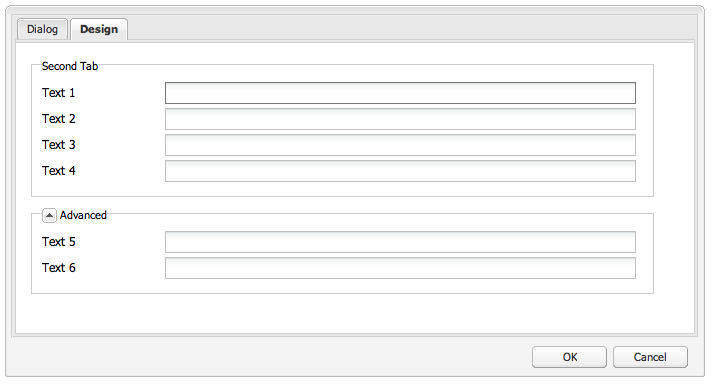

# 위젯 사용 및 확장(클래식 UI){#using-and-extending-widgets-classic-ui}

>[!NOTE]
>
>이 페이지에서는 AEM 6.4에서 더 이상 사용되지 않는 클래식 UI 내에서 위젯의 사용에 대해 설명합니다.
>
>Adobe은 최신 [터치 지원 UI](/help/sites-developing/touch-ui-concepts.md) 기준 [Coral UI](/help/sites-developing/touch-ui-concepts.md#coral-ui) 및 [Granite UI](/help/sites-developing/touch-ui-concepts.md#granite-ui-foundation-components).

Adobe Experience Manager의 웹 기반 인터페이스는 AJAX 및 기타 최신 브라우저 기술을 사용하여 작성자가 웹 페이지에서 바로 컨텐츠를 편집하고 서식을 지정할 수 있도록 합니다.

Adobe Experience Manager(AEM)은 [ExtJS](https://www.sencha.com/) 가장 중요한 모든 브라우저에서 작동하는 고도로 연마된 사용자 인터페이스 요소를 제공하고 데스크톱 급 UI 경험을 만들 수 있는 위젯 라이브러리입니다.

이러한 위젯은 AEM 내에 포함되어 있으며 AEM 자체에서 사용하는 것 외에도 AEM을 사용하여 빌드된 모든 웹 사이트에서 사용할 수 있습니다.

AEM에서 사용 가능한 모든 위젯에 대한 전체 참고는 [위젯 API 설명서](https://helpx.adobe.com/experience-manager/6-5/sites/developing/using/reference-materials/widgets-api/index.html) 또는 [기존 xtype 목록](/help/sites-developing/xtypes.md). 또한 ExtJS 프레임워크 사용 방법을 보여주는 많은 예는 [Sencha](https://www.sencha.com/products/extjs/examples/) 사이트, 프레임워크의 소유자.

이 페이지에서는 위젯을 사용하고 확장하는 방법에 대한 몇 가지 통찰력을 제공합니다. 먼저 다음 방법을 설명합니다. [페이지에 클라이언트측 코드 포함](#including-the-client-sided-code-in-a-page). 그런 다음 몇 가지 기본 사용 및 확장을 설명하기 위해 만들어진 샘플 구성 요소에 대해 설명합니다. 이러한 구성 요소는 **ExtJS 위젯 사용** 패키지 **패키지 공유**.

이 패키지에는 다음 예가 포함됩니다.

* [기본 대화 상자](#basic-dialogs) 기본 제공 위젯으로 빌드되었습니다.
* [다이내믹 대화 상자](#dynamic-dialogs) 기본 제공 위젯 및 사용자 정의된 javascript 로직을 사용하여 작성됩니다.
* 대화 상자 기준 [사용자 지정 위젯](#custom-widgets).
* A [트리 패널](#tree-overview) 지정된 경로 아래에 JCR 트리를 표시합니다.
* A [격자 패널](#grid-overview) 데이터를 테이블 형식으로 표시합니다.

>[!NOTE]
>
>Adobe Experience Manager의 클래식 UI는 [ExtJS 3.4.0](https://extjs.cachefly.net/ext-3.4.0/docs/).

## 페이지에 클라이언트측 코드 포함 {#including-the-client-sided-code-in-a-page}

클라이언트측 javascript 및 스타일시트 코드는 클라이언트 라이브러리에 배치해야 합니다.

클라이언트 라이브러리를 만들려면:

1. 아래에 노드 만들기 `/apps/<project>` 다음 속성을 사용합니다.

   * name=&quot;clientlib&quot;
   * jcr:mixinTypes=&quot;[mix:잠금 가능]&quot;
   * jcr:primaryType=&quot;cq:ClientLibraryFolder&quot;
   * sling:resourceType=&quot;widgets/clientlib&quot;
   * category=&quot;[&lt;category-name>]&quot;
   * dependencies=&quot;[cq.widgets]&quot;

   `Note: <category-name> is the name of the custom library (e.g. "cq.extjstraining") and is used to include the library on the page.`

1. 아래 `clientlib` 만들기 `css` 및 `js` 폴더(nt:folder)

1. 아래 `clientlib` 만들기 `css.txt` 및 `js.txt` 파일(nt:files). 이러한 .txt 파일은 라이브러리에 포함된 파일을 나열합니다.

1. 편집 `js.txt`: 다음으로 시작해야 합니다. `#base=js`&#39; 다음에 CQ 클라이언트 라이브러리 서비스에서 집계할 파일 목록(예:

   ```
   #base=js
    components.js
    exercises.js
    CustomWidget.js
    CustomBrowseField.js
    InsertTextPlugin.js
   ```

1. 편집 `css.txt`: 다음으로 시작해야 합니다. `#base=css`&#39; 다음에 CQ 클라이언트 라이브러리 서비스에서 집계할 파일 목록(예:

   ```
   #base=css
    components.css
   ```

1. 아래의 `js` 폴더에서 라이브러리에 속한 javascript 파일을 배치합니다.

1. 아래의 `css` 폴더, 배치 `.css` 파일 및 css 파일에서 사용하는 리소스(예: `my_icon.png`).

>[!NOTE]
>
>앞에 설명된 스타일시트의 처리는 선택 사항입니다.

페이지 구성 요소 jsp에 클라이언트 라이브러리를 포함하려면 다음을 수행하십시오.

* javascript 코드와 스타일시트를 모두 포함하려면 다음을 수행하십시오.
   `<ui:includeClientLib categories="<category-name1>, <category-name2>, ..."/>`
다음의 경우 
`<category-nameX>` 는 클라이언트측 라이브러리의 이름입니다.

* javascript 코드만 포함하려면 다음을 수행하십시오.
   `<ui:includeClientLib js="<category-name>"/>`

자세한 내용은 [&lt;ui:includeclientlib>](/help/sites-developing/taglib.md#lt-ui-includeclientlib) 태그에 가깝게 포함했습니다.

경우에 따라 클라이언트 라이브러리는 작성 모드에서만 사용할 수 있으며 게시 모드에서 제외해야 합니다. 다음과 같이 수행할 수 있습니다.

```xml
    if (WCMMode.fromRequest(request) != WCMMode.DISABLED) {
        %><ui:includeClientLib categories="cq.collab.blog"/><%
    }
```

### 샘플 시작하기 {#getting-started-with-the-samples}

이 페이지의 자습서를 따르려면 **ExtJS 위젯 사용** 로컬 AEM 인스턴스에서 구성 요소를 포함할 샘플 페이지를 만듭니다. 방법은 다음과 같습니다.

1. AEM 인스턴스에서 라는 패키지를 다운로드합니다. **ExtJS 위젯 사용(v01)** 패키지 공유에서 패키지를 설치합니다. 프로젝트를 생성합니다 `extjstraining` 아래 `/apps` 로그인합니다.
1. 스크립트(js)와 스타일시트(css)가 포함된 클라이언트 라이브러리를 geometrixx 페이지 jsp의 헤드 태그에 포함하십시오. 그러면 샘플 구성 요소가 페이지의 새 페이지에 포함됩니다 **Geometrixx** 분기: in **CRXDE Lite** 파일을 엽니다. `/apps/geometrixx/components/page/headlibs.jsp` 그리고 `cq.extjstraining` 기존 카테고리 `<ui:includeClientLib>` 태그에 다음 코드를 배치하십시오.
   `%><ui:includeClientLib categories="apps.geometrixx-main, cq.extjstraining"/><%`
1. 에서 새 페이지 만들기 **Geometrixx** 아래에 분기 `/content/geometrixx/en/products` 그것을 불러라 **ExtJS 위젯 사용**.
1. 디자인 모드로 전환하고 **ExtJS 위젯 사용** Geometrixx 설계
1. 편집 모드로 돌아갑니다. 그룹의 구성 요소 **ExtJS 위젯 사용** 사이드 킥에서 사용할 수 있습니다.

>[!NOTE]
>
>이 페이지의 예는 AEM과 함께 더 이상 제공되지 않으며 We.Retail으로 대체된 Geometrixx 샘플 컨텐츠를 기반으로 합니다. 문서를 참조하십시오 [We.Retail 참조 구현](/help/sites-developing/we-retail.md#we-retail-geometrixx) Geometrixx 다운로드 및 설치 방법에 대해 설명합니다.

### 기본 대화 상자 {#basic-dialogs}

대화 상자는 일반적으로 컨텐츠를 편집하는 데 사용되지만 정보만 표시할 수도 있습니다. 전체 대화 상자를 쉽게 볼 수 있는 방법은 json 형식으로 표시에 액세스하는 것입니다. 이렇게 하려면 브라우저를 다음 위치로 이동하십시오.

`https://localhost:4502/<path-to-dialog>.-1.json`

의 첫 번째 구성 요소 **ExtJS 위젯 사용** 사이드 킥의 그룹은 **1. 대화 상자 기본 사항** 및 에는 사용자 정의된 javascript 로직 없이 기본 위젯으로 빌드된 4개의 기본 대화 상자가 포함되어 있습니다. 대화 상자는 아래에 저장됩니다 `/apps/extjstraining/components/dialogbasics`. 기본 대화 상자는 다음과 같습니다.

* 전체 대화 상자( `full` node): 3개의 탭이 있는 창이 표시되며, 각 탭에는 2개의 텍스트 필드가 있습니다.
* 단일 패널 대화 상자( `singlepanel` node): 2개의 텍스트 필드가 있는 1개의 탭이 있는 창이 표시됩니다.
* 다중 패널 대화 상자( `multipanel` node): 전체 대화 상자와 표시되지만 다르게 작성됩니다.
* 디자인 대화 상자( `design` node): 2개의 탭이 있는 창이 표시됩니다. 첫 번째 탭에는 텍스트 필드, 드롭다운 메뉴 및 축소 가능한 텍스트 영역이 있습니다. 두 번째 탭에는 4개의 텍스트 필드가 있는 필드 세트와 2개의 텍스트 필드가 있는 축소 가능한 필드가 있습니다.

다음을 포함합니다 **1. 대화 상자 기본 사항** 샘플 페이지의 구성 요소:

1. 추가 **1. 대화 상자 기본 사항** 구성 요소를 페이지의 **ExtJS 위젯 사용** 탭에서 다음을 수행합니다. **사이드킥입니다**.
1. 구성 요소는 제목, 일부 텍스트 및 **속성** 링크: 링크를 클릭하여 저장소에 저장된 단락의 속성을 표시합니다. 속성을 숨기려면 링크를 다시 클릭합니다.

구성 요소는 다음과 같이 표시됩니다.


#### 예제 1: 전체 대화 상자 {#example-full-dialog}

다음 **전체** 대화 상자에는 세 개의 탭이 있는 창이 표시되며, 각 탭에는 두 개의 텍스트 필드가 있습니다. 이 대화 상자는 **대화 상자 기본 사항** 구성 요소. 특징은 다음과 같습니다.

* 노드에 의해 정의됩니다. 노드 유형 = `cq:Dialog`, xtype = ` [dialog](/help/sites-developing/xtypes.md#dialog)`.
* 3개의 탭을 표시합니다(노드 유형 = `cq:Panel`).
* 각 탭에는 2개의 텍스트 필드가 있습니다(노드 유형 = `cq:Widget`, xtype = ` [textfield](/help/sites-developing/xtypes.md#textfield)`).
* 노드에 의해 정의됩니다.
   `/apps/extjstraining/components/dialogbasics/full`
* 를 요청하여 JSON 형식으로 렌더링됩니다.
   `https://localhost:4502/apps/extjstraining/components/dialogbasics/full.-1.json`

대화 상자가 다음과 같이 표시됩니다.


#### 예제 2: 단일 패널 대화 상자 {#example-single-panel-dialog}

다음 **단일 패널** 대화 상자에는 두 개의 텍스트 필드가 있는 하나의 탭이 있는 창이 표시됩니다. 특징은 다음과 같습니다.

* 1개의 탭을 표시합니다(노드 유형 = `cq:Dialog`, xtype = ` [panel](/help/sites-developing/xtypes.md#panel)`)
* 탭에는 2개의 텍스트 필드가 있습니다(노드 유형 = `cq:Widget`, xtype = ` [textfield](/help/sites-developing/xtypes.md#textfield)`)
* 노드에 의해 정의됩니다.
   `/apps/extjstraining/components/dialogbasics/singlepanel`
* 를 요청하여 json 형식으로 렌더링됩니다.
   `https://localhost:4502/apps/extjstraining/components/dialogbasics/singlepanel.-1.json`
* 한 가지 이점 **전체 대화 상자** 구성이 더 적으면 됩니다.
* 권장 사용: 정보를 표시하거나 몇 개의 필드만 있는 간단한 대화 상자입니다.

단일 패널 대화 상자를 사용하려면

1. 대화 상자 바꾸기 **대화 상자 기본 사항** 구성 요소를 **단일 패널** 대화 상자:
   1. in **CRXDE Lite**, 노드를 삭제합니다. `/apps/extjstraining/components/dialogbasics/dialog`
   1. 클릭 **모두 저장** 변경 사항을 저장하려면 을 클릭합니다.
   1. 노드를 복사합니다. `/apps/extjstraining/components/dialogbasics/singlepanel`
   1. 복사된 노드를 아래에 붙여넣습니다. `/apps/extjstraining/components/dialogbasics`
   1. 노드를 선택합니다. `/apps/extjstraining/components/dialogbasics/Copy of singlepanel`이름을 바꾼 후 `dialog`.
1. 구성 요소를 편집합니다. 대화 상자는 다음과 같이 표시됩니다.


#### 예제 3: 다중 패널 대화 상자 {#example-multi-panel-dialog}

다음 **다중 패널** 대화 상자의 디스플레이는 **전체** 대화 상자는 다르게 빌드됩니다. 특징은 다음과 같습니다.

* 노드에 의해 정의됩니다(노드 유형 = `cq:Dialog`, xtype = ` [tabpanel](/help/sites-developing/xtypes.md#tabpanel)`).
* 3개의 탭을 표시합니다(노드 유형 = `cq:Panel`).
* 각 탭에는 2개의 텍스트 필드가 있습니다(노드 유형 = `cq:Widget`, xtype = ` [textfield](/help/sites-developing/xtypes.md#textfield)`).
* 노드에 의해 정의됩니다.
   `/apps/extjstraining/components/dialogbasics/multipanel`
* 를 요청하여 json 형식으로 렌더링됩니다.
   `https://localhost:4502/apps/extjstraining/components/dialogbasics/multipanel.-1.json`
* 한 가지 이점 **전체 대화 상자** 그것은 구조가 단순하다는 것입니다.
* 권장 사용: 다중 탭 대화 상자

다중 패널 대화 상자를 사용하려면

1. 대화 상자 바꾸기 **대화 상자 기본 사항** 구성 요소를 **다중 패널** 대화 상자: 다음에 설명된 단계를 수행합니다. [예제 2: 단일 패널 대화 상자](#example-single-panel-dialog)
1. 구성 요소를 편집합니다. 대화 상자는 다음과 같이 표시됩니다.


#### 예제 4: 리치 대화 상자 {#example-rich-dialog}

다음 **리치** 대화 상자에는 두 개의 탭이 있는 창이 표시됩니다. 첫 번째 탭에는 텍스트 필드, 드롭다운 메뉴 및 축소 가능한 텍스트 영역이 있습니다. 두 번째 탭에는 네 개의 텍스트 필드가 있는 필드 세트와 두 개의 텍스트 필드가 있는 축소 가능한 필드가 있습니다. 특징은 다음과 같습니다.

* 노드에 의해 정의됩니다(노드 유형 = `cq:Dialog`, xtype = ` [dialog](/help/sites-developing/xtypes.md#dialog)`).
* 2개의 탭을 표시합니다(노드 유형 = `cq:Panel`).
* 첫 번째 탭에는 ` [dialogfieldset](/help/sites-developing/xtypes.md#dialogfieldset)` 위젯 ` [textfield](/help/sites-developing/xtypes.md#textfield)` 그리고 ` [selection](/help/sites-developing/xtypes.md#selection)` 3개의 옵션이 있는 위젯 및 축소 가능한 위젯 ` [dialogfieldset](/help/sites-developing/xtypes.md#dialogfieldset)` 사용 ` [textarea](/help/sites-developing/xtypes.md#textarea)` 위젯.
* 두 번째 탭에는 ` [dialogfieldset](/help/sites-developing/xtypes.md#dialogfieldset)` 4인 위젯 ` [textfield](/help/sites-developing/xtypes.md#textfield)` 위젯 및 축소 가능 `dialogfieldset` 2개 ` [textfield](/help/sites-developing/xtypes.md#textfield)` 위젯.
* 노드에 의해 정의됩니다.
   `/apps/extjstraining/components/dialogbasics/rich`
* 를 요청하여 json 형식으로 렌더링됩니다.
   `https://localhost:4502/apps/extjstraining/components/dialogbasics/rich.-1.json`

를 사용하려면 **리치** 대화 상자:

1. 대화 상자 바꾸기 **대화 상자 기본 사항** 구성 요소를 **리치** 대화 상자: 다음에 설명된 단계를 수행합니다. [예제 2: 단일 패널 대화 상자](#example-single-panel-dialog)
1. 구성 요소를 편집합니다. 대화 상자는 다음과 같이 표시됩니다.

 

### 다이내믹 대화 상자 {#dynamic-dialogs}

의 두 번째 구성 요소 **ExtJS 위젯 사용** 사이드 킥의 그룹은 **2. 다이내믹 대화 상자** 및 에는 기본 제공 위젯과 **사용자 지정된 javascript 로직**. 대화 상자는 아래에 저장됩니다 `/apps/extjstraining/components/dynamicdialogs`. 다이내믹 대화 상자는 다음과 같습니다.

* 탭 전환 대화 상자( `switchtabs` node): 두 개의 탭이 있는 창이 표시됩니다. 첫 번째 탭에는 다음 세 가지 옵션이 있는 라디오 선택 사항이 있습니다. 옵션을 선택하면 옵션과 관련된 탭이 표시됩니다. 두 번째 탭에는 두 개의 텍스트 필드가 있습니다.
* 임의 대화 상자( `arbitrary` node): 탭이 한 개 있는 창이 표시됩니다. 탭에는 자산을 삭제하거나 업로드하는 필드와 포함 페이지에 대한 일부 정보와 자산을 참조하는 경우 자산에 대한 정보를 표시하는 필드가 있습니다.
* 필드 전환 대화 상자( `togglefield` node): 탭이 한 개 있는 창이 표시됩니다. 탭에는 다음과 같은 확인란이 있습니다. 이 필드를 선택하면 두 개의 텍스트 필드가 있는 필드 세트가 표시됩니다.

를 포함하려면 **2. 다이내믹 대화 상자** 샘플 페이지의 구성 요소:

1. 추가 **2. 다이내믹 대화 상자** 구성 요소를 페이지의 **ExtJS 위젯 사용** 탭에서 다음을 수행합니다. **사이드킥입니다**.
1. 구성 요소는 제목, 일부 텍스트 및 **속성** 링크: 저장소에 저장된 단락의 속성을 표시하려면 을(를) 클릭합니다. 속성을 숨기려면 다시 클릭합니다.

구성 요소는 다음과 같이 표시됩니다.


#### 예제 1: 탭 전환 대화 상자 {#example-switch-tabs-dialog}

다음 **탭 전환** 대화 상자에는 두 개의 탭이 있는 창이 표시됩니다. 첫 번째 탭에는 다음 세 가지 옵션이 있는 라디오 선택 사항이 있습니다. 옵션을 선택하면 옵션과 관련된 탭이 표시됩니다. 두 번째 탭에는 두 개의 텍스트 필드가 있습니다.

주요 특징은 다음과 같습니다.

* 노드에 의해 정의됩니다(노드 유형 = `cq:Dialog`, xtype = ` [dialog](/help/sites-developing/xtypes.md#dialog)`).
* 2개의 탭을 표시합니다(노드 유형 = `cq:Panel`): 1개의 선택 탭인 두 번째 탭은 첫 번째 탭(3개 옵션)의 선택 사항에 따라 다릅니다.
* 3개의 선택적 탭이 있습니다(노드 유형 = `cq:Panel`). 각각에는 두 개의 텍스트 필드가 있습니다(노드 유형 = `cq:Widget`, xtype = ` [textfield](/help/sites-developing/xtypes.md#textfield)`). 한 번에 하나의 선택적 탭만 표시됩니다.
* 는 `switchtabs` 노드 위치:
   `/apps/extjstraining/components/dynamicdialogs/switchtabs`
* 를 요청하여 json 형식으로 렌더링됩니다.
   `https://localhost:4502/apps/extjstraining/components/dynamicdialogs/switchtabs.-1.json`

로직은 다음과 같이 이벤트 리스너 및 Javascript 코드를 통해 구현됩니다.

* 대화 상자 노드에는 &quot; `beforeshow`대화 상자가 표시되기 전에 선택적 탭을 모두 숨기는 리스너:
   `beforeshow="function(dialog){Ejst.x2.manageTabs(dialog.items.get(0));}"`

   `dialog.items.get(0)` 선택 패널과 3개의 선택적 패널이 포함된 탭 패널을 가져옵니다.
* 다음 `Ejst.x2` 개체는 `exercises.js` 파일 위치:
   `/apps/extjstraining/clientlib/js/exercises.js`
* 에서 `Ejst.x2.manageTabs()` 메서드, 값 `index` -1이면 모든 선택적 탭이 숨겨집니다(1에서 3으로 이동).
* 선택 탭에는 2개의 리스너가 있습니다. 대화 상자가 로드될 때 선택한 탭을 표시하는 탭(&quot; `loadcontent`선택 영역이 변경될 때 선택한 탭을 표시하는 &quot; 이벤트&quot; 및 `selectionchanged`&quot; event):
   `loadcontent="function(field,rec,path){Ejst.x2.showTab(field);}"`

   `selectionchanged="function(field,value){Ejst.x2.showTab(field);}"`
* 에서 `Ejst.x2.showTab()` 메서드:
   `field.findParentByType('tabpanel')` 는 모든 탭이 포함된 탭 패널( `field` 선택 위젯을 나타냅니다)
   `field.getValue()` 선택 항목의 값을 가져옵니다(예: ). tab2
   `Ejst.x2.manageTabs()` 선택한 탭을 표시합니다.
* 각 선택적 탭에는 &quot;&quot;에서 탭을 숨기는 리스너가 있습니다. `render`&quot; 이벤트:
   `render="function(tab){Ejst.x2.hideTab(tab);}"`
* 에서 `Ejst.x2.hideTab()` 메서드:
   `tabPanel` 는 모든 탭을 포함하는 탭 패널입니다
   `index` 은 선택적 탭의 색인입니다
   `tabPanel.hideTabStripItem(index)` 탭을 숨깁니다.

다음과 같이 표시됩니다.


#### 예제 2: 임의 대화 상자 {#example-arbitrary-dialog}

대화 상자에 기본 구성 요소의 콘텐츠가 표시되는 경우가 많습니다. 여기에 설명된 대화 상자를 **임의** 대화 상자에서 다른 구성 요소에서 컨텐츠를 가져옵니다.

다음 **임의** 대화 상자에 탭이 한 개 있는 창이 표시됩니다. 탭에는 다음과 같은 두 개의 필드가 있습니다. 자산을 삭제하거나 업로드하는 방법과 포함된 페이지에 대한 일부 정보와 자산을 참조한 경우 자산에 대한 정보를 표시하는 것입니다.

주요 특징은 다음과 같습니다.

* 노드에 의해 정의됩니다(노드 유형 = `cq:Dialog`, xtype = ` [dialog](/help/sites-developing/xtypes.md#dialog)`).
* 1개의 탭 패널 위젯을 표시합니다(노드 유형 = `cq:Widget`, xtype = ` [tabpanel](/help/sites-developing/xtypes.md#tabpanel)`) with 1 panel (node type = ) `cq:Panel`)
* 패널에 smartfile 위젯(노드 유형 = `cq:Widget`, xtype = ` [smartfile](/help/sites-developing/xtypes.md#smartfile)`) 및 ownerdraw 위젯(노드 유형 = `cq:Widget`, xtype = ` [ownerdraw](/help/sites-developing/xtypes.md#ownerdraw)`)
* 는 `arbitrary` 노드 위치:
   `/apps/extjstraining/components/dynamicdialogs/arbitrary`
* 를 요청하여 json 형식으로 렌더링됩니다.
   `https://localhost:4502/apps/extjstraining/components/dynamicdialogs/arbitrary.-1.json`

로직은 다음과 같이 이벤트 리스너 및 Javascript 코드를 통해 구현됩니다.

* 소유자 그리기 위젯에는 &quot; `loadcontent`&quot; 컨텐츠가 로드될 때 스마트 파일 위젯에서 참조하는 자산과 구성 요소가 포함된 페이지에 대한 정보를 표시하는 수신기입니다.
   `loadcontent="function(field,rec,path){Ejst.x2.showInfo(field,rec,path);}"`

   `field` 소유자 그리기 개체로 설정되어 있습니다.
   `path` 은 구성 요소의 컨텐츠 경로(예: /content/geometrixx/en/products/triangle/ui-tutorial/jcr:content/par/dynamicdialogs)
* 다음 `Ejst.x2` 개체는 `exercises.js` 파일 위치:
   `/apps/extjstraining/clientlib/js/exercises.js`
* 에서 `Ejst.x2.showInfo()` 메서드:
   `pagePath` 은 구성 요소가 포함된 페이지의 경로입니다
   `pageInfo` 는 json 형식으로 페이지 속성을 나타냅니다.
   `reference` 는 참조된 자산의 경로입니다
   `metadata` 는 json 형식으로 자산의 메타데이터를 나타냅니다.
   `ownerdraw.getEl().update(html);` 대화 상자에 생성된 html을 표시합니다

를 사용하려면 **임의** 대화 상자:

1. 대화 상자 바꾸기 **동적 대화 상자** 구성 요소를 **임의** 대화 상자: 다음에 설명된 단계를 수행합니다. [예제 2: 단일 패널 대화 상자](#example-single-panel-dialog)
1. 구성 요소를 편집합니다. 대화 상자는 다음과 같이 표시됩니다.


#### 예제 3: 필드 전환 대화 상자 {#example-toggle-fields-dialog}

다음 **필드 전환** 대화 상자에 탭이 한 개 있는 창이 표시됩니다. 탭에는 다음과 같은 확인란이 있습니다. 이 필드를 선택하면 두 개의 텍스트 필드가 있는 필드 세트가 표시됩니다.

주요 특징은 다음과 같습니다.

* 노드에 의해 정의됩니다(노드 유형 = `cq:Dialog`, xtype = ` [dialog](/help/sites-developing/xtypes.md#dialog)`).
* 1개의 탭 패널 위젯을 표시합니다(노드 유형 = `cq:Widget`, xtype = ` [tabpanel](/help/sites-developing/xtypes.md#textpanel)`) with 1 panel (node type = ) `cq:Panel`).
* 패널에 선택/확인란 위젯(노드 유형 =)이 있습니다 `cq:Widget`, xtype = ` [selection](/help/sites-developing/xtypes.md#selection)`, 유형 = ` [checkbox](/help/sites-developing/xtypes.md#checkbox)`) 및 축소 가능한 dialogfieldset 위젯(노드 유형 = `cq:Widget`, xtype = ` [dialogfieldset](/help/sites-developing/xtypes.md#dialogfieldset)`) 기본적으로 숨겨지는 텍스트필드 위젯(노드 유형 =)이 2개 있는 `cq:Widget`, xtype = ` [textfield](/help/sites-developing/xtypes.md#textfield)`).
* 는 `togglefields` 노드 위치:
   `/apps/extjstraining/components/dynamicdialogs/togglefields`
* 를 요청하여 json 형식으로 렌더링됩니다.
   `https://localhost:4502/apps/extjstraining/components/dynamicdialogs/togglefields.-1.json`

로직은 다음과 같이 이벤트 리스너 및 Javascript 코드를 통해 구현됩니다.

* 선택 탭에는 2개의 리스너가 있습니다. 컨텐츠가 로드될 때 dialogfieldset을 표시하는 것(&quot; `loadcontent`선택 사항이 변경될 때 dialogfieldset(&quot; 이벤트) 및 dialogfieldset를 표시하는 항목 `selectionchanged`&quot; event):
   `loadcontent="function(field,rec,path){Ejst.x2.toggleFieldSet(field);}"`

   `selectionchanged="function(field,value){Ejst.x2.toggleFieldSet(field);}"`
* 다음 `Ejst.x2` 개체는 `exercises.js` 파일 위치:
   `/apps/extjstraining/clientlib/js/exercises.js`
* 에서 `Ejst.x2.toggleFieldSet()` 메서드:
   `box` 은 선택 객체입니다
   `panel` 는 선택 항목 및 대화 상자 필드세트 위젯이 포함된 패널입니다
   `fieldSet` dialogfieldset 개체입니다.
   `show` 은 &#39;을(를) 기반으로 하는 선택 값(true 또는 false)입니다. `show`&#39; dialogfieldset이 표시되거나 표시되지 않습니다.

를 사용하려면 **필드 전환** 대화 상자:

1. 대화 상자 바꾸기 **동적 대화 상자** 구성 요소를 **필드 전환** 대화 상자: 다음에 설명된 단계를 수행합니다. [예제 2: 단일 패널 대화 상자](#example-single-panel-dialog)
1. 구성 요소를 편집합니다. 대화 상자는 다음과 같이 표시됩니다.


### 사용자 지정 위젯 {#custom-widgets}

AEM과 함께 제공되는 기본 위젯은 대부분의 사용 사례를 다룹니다. 그러나 프로젝트별 요구 사항을 처리하기 위해 사용자 지정 위젯을 만들어야 하는 경우가 있을 수 있습니다. 사용자 지정 위젯은 기존 위젯을 확장하여 만들 수 있습니다. 이러한 사용자 지정을 시작하는 데 도움이 되는 **ExtJS 위젯 사용** 패키지에는 세 개의 서로 다른 사용자 지정 위젯을 사용하는 세 개의 대화 상자가 들어 있습니다.

* 다중 필드 대화 상자( `multifield` node) 한 개의 탭이 있는 창을 표시합니다. 탭에는 두 개의 필드가 있는 사용자 지정된 다중 필드 위젯이 있습니다. 두 가지 옵션과 텍스트 필드가 포함된 드롭다운 메뉴. 기본적으로 `multifield` 위젯(텍스트 필드만 있음)에는 `multifield` 위젯.
* 트리 찾아보기 대화 상자( `treebrowse` node) 경로 찾아보기 위젯이 포함된 하나의 탭이 있는 창을 표시합니다. 화살표를 클릭하면 계층을 탐색하고 항목을 선택할 수 있는 창이 열립니다. 그런 다음 항목의 경로가 경로 필드에 추가되고 대화 상자가 닫히면 유지됩니다.
* 리치 텍스트 편집기 플러그인 기반 대화 상자( `rteplugin` 노드) 사용자 지정 단추를 리치 텍스트 편집기에 추가하여 기본 텍스트에 일부 사용자 지정 텍스트를 삽입합니다. 이것은 `richtext` RTE(위젯) 및 RTE 플러그인 메커니즘을 통해 추가된 사용자 지정 기능입니다.

사용자 지정 위젯 및 플러그인은 **3. 사용자 지정 위젯** 의 **ExtJS 위젯 사용** 패키지. 샘플 페이지에 이 구성 요소를 포함하려면 다음을 수행하십시오.

1. 추가 **3. 사용자 지정 위젯** 구성 요소를 페이지의 **ExtJS 위젯 사용** 탭에서 다음을 수행합니다. **사이드킥입니다**.
1. 구성 요소에는 제목, 텍스트 및 **속성** 링크: 저장소에 저장된 단락의 속성입니다. 를 다시 클릭하면 속성이 표시되지 않습니다.
구성 요소는 다음과 같이 표시됩니다.


#### 예제 1: 사용자 지정 다중 필드 위젯 {#example-custom-multifield-widget}

다음 **사용자 지정 다중 필드** 위젯 기반 대화 상자에는 한 개의 탭이 있는 창이 표시됩니다. 탭에는 필드가 하나인 표준 위젯과 달리, 두 개의 필드가 있는 사용자 지정된 다중 필드 위젯이 있습니다. 두 가지 옵션과 텍스트 필드가 포함된 드롭다운 메뉴.

다음 **사용자 지정 다중 필드** 위젯 기반 대화 상자:

* 노드에 의해 정의됩니다(노드 유형 = `cq:Dialog`, xtype = ` [dialog](/help/sites-developing/xtypes.md#dialog)`).
* 1개의 탭 패널 위젯을 표시합니다(노드 유형 = `cq:Widget`, xtype = ` [tabpanel](/help/sites-developing/xtypes.md#tabpanel)`) 패널을 포함하는 경우(노드 유형 = `cq:Widget`, xtype = ` [panel](/help/sites-developing/xtypes.md#panel)`).
* 패널에 `multifield` 위젯(노드 유형 = `cq:Widget`, xtype = ` [multifield](/help/sites-developing/xtypes.md#multifield)`).
* 다음 `multifield` 위젯에 fieldconfig (node type = `nt:unstructured`, xtype = `ejstcustom`, optionsProvider = `Ejst.x3.provideOptions`) 사용자 지정 xtype &#39; 을 기반으로 합니다. `ejstcustom`&#39;:
   * ` `fieldconfig`&#39;은(는) ` [CQ.form.MultiField](https://helpx.adobe.com/experience-manager/6-5/sites/developing/using/reference-materials/widgets-api/index.html?class=CQ.form.MultiField)` 개체.
   * ` `optionsProvider`&#39;은(는) `ejstcustom` 위젯. 이 ID는 `Ejst.x3.provideOptions` 에 정의된 메서드 `exercises.js` at:
      `/apps/extjstraining/clientlib/js/exercises.js`
및 은 2개의 옵션을 반환합니다.
* 는 `multifield` 노드 위치:
   `/apps/extjstraining/components/customwidgets/multifield`
* 를 요청하여 json 형식으로 렌더링됩니다.
   `https://localhost:4502/apps/extjstraining/components/customwidgets/multifield.-1.json`

사용자 지정 다중 필드 위젯(xtype = `ejstcustom`):

* 라는 javascript 개체입니다 `Ejst.CustomWidget`.
* 에 정의되어 있습니다. `CustomWidget.js` javascript 파일 위치:
   `/apps/extjstraining/clientlib/js/CustomWidget.js`
* 를 확장합니다. ` [CQ.form.CompositeField](https://helpx.adobe.com/experience-manager/6-5/sites/developing/using/reference-materials/widgets-api/index.html?class=CQ.form.CompositeField)` 위젯.
* 다음 3개의 필드가 있습니다. `hiddenField` (텍스트 필드), `allowField` (ComboBox) 및 `otherField` (텍스트 필드)
* 무시 `CQ.Ext.Component#initComponent` 3개의 필드를 추가하려면
   * `allowField` is [CQ.form.Selection](https://helpx.adobe.com/experience-manager/6-5/sites/developing/using/reference-materials/widgets-api/index.html?class=CQ.form.Selection) &#39;select&#39; 유형의 개체입니다. optionsProvider는 대화 상자에 정의된 CustomWidget의 optionsProvider 구성으로 인스턴스화된 Selection 개체의 구성입니다
   * `otherField` is [CQ.Ext.form.TextField](https://helpx.adobe.com/experience-manager/6-5/sites/developing/using/reference-materials/widgets-api/index.html?class=CQ.Ext.form.TextField) 개체
* 메서드를 재정의합니다. `setValue`, `getValue` 및 `getRawValue` 의 [CQ.form.CompositeField](https://helpx.adobe.com/experience-manager/6-5/sites/developing/using/reference-materials/widgets-api/index.html?class=CQ.form.CompositeField) 형식으로 CustomWidget의 값을 설정하고 검색하려면 다음을 수행합니다.
   `<allowField value>/<otherField value>, e.g.: 'Bla1/hello'`.
* 자신을 &#39;(으)로 등록 `ejstcustom`` xtype:
   `CQ.Ext.reg('ejstcustom', Ejst.CustomWidget);`

다음 **사용자 지정 다중 필드** 위젯 기반 대화 상자는 다음과 같이 표시됩니다.


#### 예제 2: 사용자 지정 검색 위젯 {#example-custom-treebrowse-widget}

사용자 지정 **트리찾아보기** 위젯 기반 대화 상자에는 사용자 지정 경로 찾아보기 위젯이 포함된 하나의 탭이 있는 창이 표시됩니다. 화살표를 클릭하면 계층을 탐색하고 항목을 선택할 수 있는 창이 열립니다. 그런 다음 항목의 경로가 경로 필드에 추가되고 대화 상자가 닫히면 유지됩니다.

사용자 지정 트리찾아보기 대화 상자:

* 노드에 의해 정의됩니다(노드 유형 = `cq:Dialog`, xtype = ` [dialog](/help/sites-developing/xtypes.md#dialog)`).
* 1개의 탭 패널 위젯을 표시합니다(노드 유형 = `cq:Widget`, xtype = ` [tabpanel](/help/sites-developing/xtypes.md#tabpanel)`) 패널을 포함하는 경우(노드 유형 = `cq:Widget`, xtype = ` [panel](/help/sites-developing/xtypes.md#panel)`).
* 패널에 사용자 지정 위젯이 있습니다(노드 유형 = `cq:Widget`, xtype = `ejstbrowse`)
* 는 `treebrowse` 노드 위치:
   `/apps/extjstraining/components/customwidgets/treebrowse`
* 를 요청하여 json 형식으로 렌더링됩니다.
   `https://localhost:4502/apps/extjstraining/components/customwidgets/treebrowse.-1.json`

사용자 지정 트리찾아보기 위젯(xtype = `ejstbrowse`):

* 라는 javascript 개체입니다 `Ejst.CustomWidget`.
* 에 정의되어 있습니다. `CustomBrowseField.js` javascript 파일 위치:
   `/apps/extjstraining/clientlib/js/CustomBrowseField.js`
* 확장 ` [CQ.Ext.form.TriggerField](https://helpx.adobe.com/experience-manager/6-5/sites/developing/using/reference-materials/widgets-api/index.html?class=CQ.Ext.form.TriggerField)`.
* 라는 찾아보기 창을 정의합니다. `browseWindow`.
* 무시 ` [CQ.Ext.form.TriggerField](https://helpx.adobe.com/experience-manager/6-5/sites/developing/using/reference-materials/widgets-api/index.html?class=CQ.Ext.form.TriggerField)#onTriggerClick` 화살표를 클릭하면 찾아보기 창을 표시합니다.
* 을(를) 정의합니다. [CQ.Ext.tree.TreePanel](https://helpx.adobe.com/experience-manager/6-5/sites/developing/using/reference-materials/widgets-api/index.html?class=CQ.Ext.tree.TreePanel) 개체:
   * 에 등록된 서블릿을 호출하여 데이터를 가져옵니다 `/bin/wcm/siteadmin/tree.json`.
   * 루트는 &quot; 입니다. `apps/extjstraining`&quot;.
* 을(를) 정의합니다. `window` 개체 ( ` [CQ.Ext.Window](https://helpx.adobe.com/experience-manager/6-5/sites/developing/using/reference-materials/widgets-api/index.html?class=CQ.Ext.Window)`):
   * 사전 정의된 패널 기반.
   * 다음 포함 **확인** 선택한 경로의 값을 설정하고 패널을 숨기는 단추입니다.
* 창문이 아래쪽에 고정되어 있다 **경로** 필드.
* 선택한 경로가 찾아보기 필드에서 창의 창으로 전달됩니다 `show` 이벤트.
* 자신을 &#39;(으)로 등록 `ejstbrowse`` xtype:
   `CQ.Ext.reg('ejstbrowse', Ejst.CustomBrowseField);`

를 사용하려면 **사용자 지정 트리찾아보기** 위젯 기반 대화 상자:

1. 대화 상자 바꾸기 **사용자 지정 위젯** 구성 요소를 **사용자 지정 트리찾아보기** 대화 상자: 다음에 설명된 단계를 수행합니다. [예제 2: 단일 패널 대화 상자](#example-single-panel-dialog)
1. 구성 요소를 편집합니다. 대화 상자는 다음과 같이 표시됩니다.


#### 예제 3: 리치 텍스트 편집기(RTE) 플러그인 {#example-rich-text-editor-rte-plug-in}

다음 **리치 텍스트 편집기(RTE) 플러그인** 기반 대화 상자는 대괄호 안에 사용자 지정 텍스트를 삽입할 수 있는 사용자 지정 단추가 있는 리치 텍스트 편집기 기반 대화 상자입니다. 사용자 지정 텍스트는 일부 서버측 논리(이 예에서 구현되지 않음)에서 구문 분석할 수 있습니다. 예를 들어 지정된 경로에 정의된 일부 텍스트를 추가할 수 있습니다.

다음 **RTE 플러그인** 기반 대화 상자:

* 은 다음에 있는 rteplugin 노드에 의해 정의됩니다.
   `/apps/extjstraining/components/customwidgets/rteplugin`
* 를 요청하여 json 형식으로 렌더링됩니다.
   `https://localhost:4502/apps/extjstraining/components/customwidgets/rteplugin.-1.json`
* 다음 `rtePlugins` 노드에 하위 노드가 있습니다. `inserttext` (노드 유형 = `nt:unstructured`) 플러그인의 이름을 따라 이름이 지정됩니다. 이 속성에는 `features`는 RTE에서 사용할 수 있는 플러그인 기능 중 하나를 정의합니다.

RTE 플러그인:

* 라는 javascript 개체입니다 `Ejst.InsertTextPlugin`.
* 에 정의되어 있습니다. `InsertTextPlugin.js` javascript 파일 위치:
   `/apps/extjstraining/clientlib/js/InsertTextPlugin.js`
* 를 확장합니다. ` [CQ.form.rte.plugins.Plugin](https://helpx.adobe.com/experience-manager/6-5/sites/developing/using/reference-materials/widgets-api/index.html?class=CQ.form.rte.plugins.Plugin)` 개체.
* 다음 메서드는 ` [CQ.form.rte.plugins.Plugin](https://helpx.adobe.com/experience-manager/6-5/sites/developing/using/reference-materials/widgets-api/index.html?class=CQ.form.rte.plugins.Plugin)` 개체 및 는 구현 플러그인에서 재정의됩니다.
   * `getFeatures()` 플러그인을 사용할 수 있는 모든 기능의 배열을 반환합니다.
   * `initializeUI()` 새 단추를 RTE 도구 모음에 추가합니다.
   * `notifyPluginConfig()` 단추를 마우스로 가리키면 제목과 텍스트가 표시됩니다.
   * `execute()` 버튼을 클릭하고 플러그인 작업을 수행하면 가 호출됩니다. 포함할 텍스트를 정의하는 데 사용되는 창이 표시됩니다.
* `insertText()` 해당 대화 상자 개체를 사용하여 텍스트를 삽입합니다 `Ejst.InsertTextPlugin.Dialog` (나중에 참조).
* `executeInsertText()` 는 `apply()` 대화 상자의 메서드로서, **확인** 버튼을 클릭합니다.
* 자신을 &#39;(으)로 등록 `inserttext`&#39; 플러그인:
   `CQ.form.rte.plugins.PluginRegistry.register("inserttext", Ejst.InsertTextPlugin);`
* a `Ejst.InsertTextPlugin.Dialog` 개체는 플러그인 단추를 클릭할 때 열리는 대화 상자를 정의합니다. 대화 상자는 패널, 양식, 텍스트 필드 및 2개의 단추로 구성됩니다(**확인** 및 **취소**).

를 사용하려면 **리치 텍스트 편집기(RTE) 플러그인** 기반 대화 상자:

1. 대화 상자 바꾸기 **사용자 지정 위젯** 구성 요소를 **리치 텍스트 편집기(RTE) 플러그인** 기반 대화 상자: 다음에 설명된 단계를 수행합니다. [예제 2: 단일 패널 대화 상자](#example-single-panel-dialog)
1. 구성 요소를 편집합니다.
1. 오른쪽에 있는 마지막 아이콘(화살표 4개가 있는 아이콘)을 클릭합니다. 경로를 입력하고 를 클릭합니다. **확인**: 패스는 대괄호([ ]).
1. 클릭 **확인** 리치 텍스트 편집기를 닫습니다.

다음 **리치 텍스트 편집기(RTE) 플러그인** 기본 대화 상자는 다음과 같이 표시됩니다.


>[!NOTE]
>
>이 예는 로직의 클라이언트측 부분을 구현하는 방법만 보여줍니다. 자리 표시자(*[텍스트]*)를 서버 측에서 명시적으로 구문 분석해야 합니다(예: 구성 요소 JSP).

### 트리 개요 {#tree-overview}

즉시 사용 가능한 ` [CQ.Ext.tree.TreePanel](https://helpx.adobe.com/experience-manager/6-5/sites/developing/using/reference-materials/widgets-api/index.html?class=CQ.Ext.tree.TreePanel)` 개체는 트리 구조화된 데이터의 트리 구조 UI 표현을 제공합니다. 에 포함된 트리 개요 구성 요소 **ExtJS 위젯 사용** 패키지는 `TreePanel` 지정된 경로 아래에 JCR 트리를 표시하는 개체입니다. 창 자체는 도킹/도킹 해제할 수 있습니다. 이 예제에서 창 논리는 구성 요소 jsp 사이에 포함됩니다 &lt;script>&lt;/script> 태그 사이에 Analytics JavaScript 코드를 배치했습니다.

를 포함하려면 **트리 개요** 구성 요소를 샘플 페이지에 추가합니다.

1. 추가 **4. 트리 개요** 구성 요소를 페이지의 **ExtJS 위젯 사용** 탭에서 다음을 수행합니다. **사이드킥입니다**.
1. 구성 요소가 표시됩니다.
   * 텍스트가 있는 제목
   * a **속성** 링크: 저장소에 저장된 단락의 속성을 표시하려면 을(를) 클릭합니다. 속성을 숨기려면 다시 클릭합니다.
   * 리포지토리의 트리 표현이 있는 부동 창이며 확장할 수 있습니다.

구성 요소는 다음과 같이 표시됩니다.


트리 개요 구성 요소:

* 다음에서 정의됩니다.
   `/apps/extjstraining/components/treeoverview`

* 이 대화 상자에서는 창 크기를 설정하고 창을 도킹/도킹 해제할 수 있습니다(아래 세부 정보 참조).

구성 요소 jsp:

* 저장소에서 너비, 높이 및 도킹 속성을 검색합니다.
* 트리 개요 데이터 형식에 대한 텍스트를 표시합니다.
* javascript 태그 사이에 구성 요소 jsp에 창 논리를 포함합니다.
* 다음에서 정의됩니다.
   `apps/extjstraining/components/treeoverview/content.jsp`

구성 요소 jsp에 포함된 Javascript 코드:

* 을(를) 정의합니다. `tree` 페이지에서 트리 창을 검색하려고 하여 개체를 만듭니다.
* 트리를 표시하는 창이 없으면 `treePanel` ([CQ.Ext.tree.TreePanel](https://helpx.adobe.com/experience-manager/6-5/sites/developing/using/reference-materials/widgets-api/index.html?class=CQ.Ext.tree.TreePanel))가 만들어집니다.
   * `treePanel` 창을 만드는 데 사용되는 데이터가 포함되어 있습니다.
   * 데이터는 다음에 등록된 서블릿을 호출하여 검색됩니다.
      `/bin/wcm/siteadmin/tree.json`
* 다음 `beforeload` 리스너는 클릭한 노드가 로드되었는지 확인합니다.
* 다음 `root` 개체가 경로를 설정합니다. `apps/extjstraining` 를 트리 루트로 지정합니다.
* `tree` ( ` [CQ.Ext.Window](https://helpx.adobe.com/experience-manager/6-5/sites/developing/using/reference-materials/widgets-api/index.html?class=CQ.Ext.Window)`)은 사전 정의된 를 기반으로 설정됩니다 `treePanel`, 및에 표시됩니다.
   `tree.show();`
* 창이 이미 있으면 저장소에서 검색된 너비, 높이 및 도킹 속성에 따라 표시됩니다.

구성 요소 대화 상자:

* 2개의 필드가 있는 1개의 탭을 표시하여 트리 개요 창의 크기(너비 및 높이)와 창의 도킹/도킹 해제할 1개의 필드를 표시합니다
* 노드에 의해 정의됩니다(노드 유형 = `cq:Dialog`, xtype = ` [panel](/help/sites-developing/xtypes.md#panel)`).
* 패널에 크기 필드 위젯(노드 유형 =)이 있습니다 `cq:Widget`, xtype = ` [sizefield](/help/sites-developing/xtypes.md#sizefield)`) 및 선택 위젯(노드 유형 = `cq:Widget`, xtype = ` [selection](/help/sites-developing/xtypes.md#selection)`, 유형 = `radio`). 옵션 2개(true/false)
* 다음 위치의 대화 상자 노드에 의해 정의됩니다.
   `/apps/extjstraining/components/treeoverview/dialog`
* 를 요청하여 json 형식으로 렌더링됩니다.
   `https://localhost:4502/apps/extjstraining/components/treeoverview/dialog.-1.json`
* 다음과 같이 표시됩니다.


### 그리드 개요 {#grid-overview}

그리드 패널은 테이블 형식의 행 및 열 형식으로 데이터를 나타냅니다. 다음과 같이 구성됩니다.

* 스토어 : 데이터 레코드(행)를 포함하는 모델.
* 열 모델 : 열 구성입니다.
* 보기 : 사용자 인터페이스를 캡슐화합니다.
* 선택 모델 : 선택 동작입니다.

에 포함된 그리드 개요 구성 요소 **ExtJS 위젯 사용** 패키지는 데이터를 테이블 형식으로 표시하는 방법을 보여 줍니다.

* 예제 1은 정적 데이터를 사용합니다.
* 예제 2는 저장소에서 검색된 데이터를 사용합니다.

샘플 페이지에 그리드 개요 구성 요소를 포함하려면 다음을 수행하십시오.

1. 추가 **5. 그리드 개요** 구성 요소를 페이지의 **ExtJS 위젯 사용** 탭에서 다음을 수행합니다. **사이드킥입니다**.
1. 구성 요소가 표시됩니다.
   * 텍스트가 있는 제목
   * a **속성** 링크: 저장소에 저장된 단락의 속성을 표시하려면 을(를) 클릭합니다. 속성을 숨기려면 다시 클릭합니다.
   * 데이터를 테이블 형식으로 포함하는 부동 창.

구성 요소는 다음과 같이 표시됩니다.


#### 예제 1: 기본 그리드 {#example-default-grid}

기본 버전에서는 **그리드 개요** 구성 요소는 정적 데이터가 있는 창을 테이블 형식으로 표시합니다. 이 예에서 논리는 다음 두 가지 방법으로 구성 요소 jsp에 포함됩니다.

* 제네릭 로직은 다음 사이에 정의됩니다 &lt;script>&lt;/script> 태그
* 특정 로직은 별도의 .js 파일에서 사용할 수 있으며 jsp에서 연결되어 있습니다. This setup enables to easily switch between the two logic (static/dynamic) by commenting the desired &lt;script> tags.

그리드 개요 구성 요소:

* 다음에서 정의됩니다.
   `/apps/extjstraining/components/gridoverview`
* 이 대화 상자에서는 창 크기를 설정하고 창을 도킹/도킹 해제할 수 있습니다.

구성 요소 jsp:

* 저장소에서 너비, 높이 및 도킹 속성을 검색합니다.
* 일부 텍스트를 그리드 개요 데이터 형식의 소개로 표시합니다.
* GridPanel 개체를 정의하는 javascript 코드를 참조합니다.
   `<script type="text/javascript" src="/apps/extjstraining/components/gridoverview/defaultgrid.js"></script>`

   `defaultgrid.js` 에서는 일부 정적 데이터를 GridPanel 개체의 기반으로 정의합니다.
* GridPanel 개체를 사용하는 Window 개체를 정의하는 Javascript 태그 사이에 Javascript 코드를 포함합니다.
* 다음에서 정의됩니다.
   `apps/extjstraining/components/gridoverview/content.jsp`

구성 요소 jsp에 포함된 Javascript 코드:

* 을(를) 정의합니다 `grid` 페이지에서 창 구성 요소를 검색하여 객체를 검색합니다.
   `var grid = CQ.Ext.getCmp("<%= node.getName() %>-grid");`
* If `grid` 존재하지 않음, [CQ.Ext.grid.GridPanel](https://helpx.adobe.com/experience-manager/6-5/sites/developing/using/reference-materials/widgets-api/index.html?class=CQ.Ext.grid.GridPanel) 개체 ( `gridPanel`)은 를 호출하여 정의됩니다. `getGridPanel()` 메서드(아래 참조). 이 메서드는 `defaultgrid.js`.
* `grid` is ` [CQ.Ext.Window](https://helpx.adobe.com/experience-manager/6-5/sites/developing/using/reference-materials/widgets-api/index.html?class=CQ.Ext.Window)` 미리 정의된 GridPanel을 기반으로 하며 다음 항목이 표시됩니다. `grid.show();`
* If `grid` 이미 존재하는 경우 저장소에서 검색한 너비, 높이 및 도킹 속성에 따라 표시됩니다.

Javascript 파일( `defaultgrid.js`) 구성 요소 jsp에서 참조되는 는 `getGridPanel()` JSP에 포함된 스크립트에 의해 호출되고 ` [CQ.Ext.grid.GridPanel](https://helpx.adobe.com/experience-manager/6-5/sites/developing/using/reference-materials/widgets-api/index.html?class=CQ.Ext.grid.GridPanel)` 정적 데이터를 기반으로 하는 객체입니다. 논리는 다음과 같습니다.

* `myData` 는 5열 및 4행 표로 형식이 지정된 정적 데이터의 배열입니다.
* `store` is `CQ.Ext.data.Store` 사용하는 개체 `myData`.
* `store` 는 메모리에 로드됩니다.
   `store.load();`
* `gridPanel` is ` [CQ.Ext.grid.GridPanel](https://helpx.adobe.com/experience-manager/6-5/sites/developing/using/reference-materials/widgets-api/index.html?class=CQ.Ext.grid.GridPanel)` 사용하는 개체 `store`:
   * 열 너비는 항상 다시 조정됩니다.
      `forceFit: true`
   * 한 번에 한 행만 선택할 수 있습니다.
      `singleSelect:true`

#### 예제 2: 참조 검색 그리드 {#example-reference-search-grid}

패키지를 설치하면 `content.jsp` 의 **그리드 개요** 구성 요소는 정적 데이터를 기반으로 하는 그리드를 표시합니다. 다음 특성을 사용하여 격자를 표시하도록 구성 요소를 수정할 수 있습니다.

* 3개의 열이 있습니다.
* 서블릿을 호출하여 저장소에서 검색한 데이터를 기반으로 합니다.
* 마지막 열의 셀을 편집할 수 있습니다. 값은 `test` 첫 번째 열에 표시된 경로에 정의된 노드 아래의 속성입니다.

이전 섹션에 설명된 대로 창 개체는 ` [CQ.Ext.grid.GridPanel](https://helpx.adobe.com/experience-manager/6-5/sites/developing/using/reference-materials/widgets-api/index.html?class=CQ.Ext.grid.GridPanel)` 를 호출하여 개체를 `getGridPanel()` 에 정의된 메서드 `defaultgrid.js` 파일 위치 `/apps/extjstraining/components/gridoverview/defaultgrid.js`. **그리드 개요 **구성 요소는 을 위한 다른 구현을 제공합니다 `getGridPanel()` 메서드에서 정의됨 `referencesearch.js` 파일 위치 `/apps/extjstraining/components/gridoverview/referencesearch.js`. 구성 요소 jsp에서 참조되는 .js 파일을 전환하면 그리드는 저장소에서 검색한 데이터를 기반으로 합니다.

구성 요소 jsp에서 참조되는 .js 파일을 전환합니다.

1. in **CRXDE Lite**&#x200B;에서 `content.jsp` 구성 요소의 파일에서 `defaultgrid.js` 다음과 같이 표시되도록 합니다.
   `<!-- script type="text/javascript" src="/apps/extjstraining/components/gridoverview/defaultgrid.js"></script-->`
1. 를 포함하는 행에서 주석 제거 `referencesearch.js` 다음과 같이 표시되도록 합니다.
   `<script type="text/javascript" src="/apps/extjstraining/components/gridoverview/referencesearch.js"></script>`
1. 변경 사항을 저장합니다.
1. 샘플 페이지를 새로 고칩니다.

구성 요소는 다음과 같이 표시됩니다.


구성 요소 jsp( `referencesearch.js`)은 을 정의합니다 `getGridPanel()` 구성 요소 jsp에서 호출된 메서드를 반환하고 ` [CQ.Ext.grid.GridPanel](https://helpx.adobe.com/experience-manager/6-5/sites/developing/using/reference-materials/widgets-api/index.html?class=CQ.Ext.grid.GridPanel)` 객체이며 저장소에서 동적으로 검색되는 데이터를 기반으로 합니다. 의 논리 `referencesearch.js` 에서는 일부 동적 데이터를 GridPanel의 기반으로 정의합니다.

* `reader` is ` [CQ.Ext.data.JsonReader](https://helpx.adobe.com/experience-manager/6-5/sites/developing/using/reference-materials/widgets-api/index.html?class=CQ.Ext.data.JsonReader)`3개 열에 대해 json 형식으로 서블릿 응답을 읽는 개체입니다.
* `cm` is ` [CQ.Ext.grid.ColumnModel](https://helpx.adobe.com/experience-manager/6-5/sites/developing/using/reference-materials/widgets-api/index.html?class=CQ.Ext.grid.ColumnModel)` 3열 객체입니다.
&quot;테스트&quot; 열 셀은 편집기로 정의된 대로 편집할 수 있습니다.
   `editor: new [CQ.Ext.form.TextField](https://helpx.adobe.com/experience-manager/6-5/sites/developing/using/reference-materials/widgets-api/index.html?class=CQ.Ext.form.TextField)({})`
* 열은 정렬 가능한 열:
   `cm.defaultSortable = true;`
* `store` is ` [CQ.Ext.data.GroupingStore](https://helpx.adobe.com/experience-manager/6-5/sites/developing/using/reference-materials/widgets-api/index.html?class=CQ.Ext.data.GroupingStore)` 개체:
   * 그러면 &quot;에 등록된 서블릿을 호출하여 데이터를 가져옵니다. `/bin/querybuilder.json`&quot; 쿼리를 필터링하는 데 사용되는 몇 가지 매개 변수와 함께
   * 이 방법은 `reader`, 미리 정의됨
   * 테이블은 &#39;**jcr:path**&#39; 열 오름차순
* `gridPanel` is ` [CQ.Ext.grid.EditorGridPanel](https://helpx.adobe.com/experience-manager/6-5/sites/developing/using/reference-materials/widgets-api/index.html?class=CQ.Ext.grid.EditorGridPanel)` 편집할 수 있는 객체:
   * 사전 정의된 `store` 열 모델에서 `cm`
   * 한 번에 한 행만 선택할 수 있습니다.
      `sm: new [CQ.Ext.grid.RowSelectionModel](https://helpx.adobe.com/experience-manager/6-5/sites/developing/using/reference-materials/widgets-api/index.html?class=CQ.Ext.grid.RowSelectionModel)({singleSelect:true})`
   * a `afteredit` 리스너는 &quot;**테스트**&quot; 열이 편집되었습니다.
      * &#39; 속성 `test`&quot;**jcr:path**&quot; 열은 셀의 값으로 리포지토리에 설정됩니다
      * POST이 성공하면 값이 `store` 객체, 그렇지 않으면 거부됨
