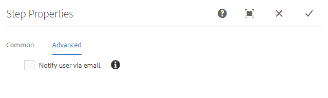
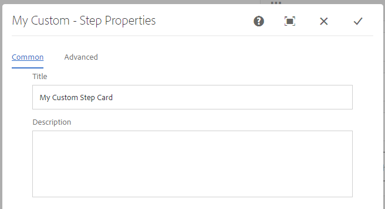
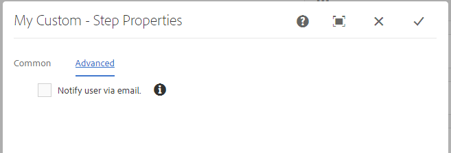

# 워크플로우 기능 확장{#extending-workflow-functionality}

이 항목에서는 워크플로우에 대한 사용자 정의 단계 구성 요소를 개발하는 방법, 워크플로우와 프로그래밍 방식으로 상호 작용하는 방법에 대해 설명합니다.

사용자 지정 워크플로우 단계를 만드는 작업에는 다음 활동이 포함됩니다.

* 워크플로우 단계 구성 요소를 개발합니다.
* OSGi 서비스 또는 ECMA 스크립트로 단계 기능을 구현합니다.

프로그램 및 스크립트[에서 사용자의 워크플로우와 상호 작용할 수도 있습니다.](/help/sites-developing/workflows-program-interaction.md)

## 워크플로우 단계 구성 요소 - 기본 사항 {#workflow-step-components-the-basics}

워크플로우 단계 구성 요소는 워크플로우 모델을 생성할 때 단계의 모양과 동작을 정의합니다.

* 워크플로우 사이드 킥의 카테고리 및 단계 이름.
* 워크플로우 모델의 단계 모양
* 구성 요소 속성을 구성하기 위한 편집 대화 상자
* 런타임 시 실행되는 서비스 또는 스크립트입니다.

[모든 구성 요소](/help/sites-developing/components.md)와 마찬가지로 워크플로 단계 구성 요소는 `sling:resourceSuperType` 속성에 지정된 구성 요소에서 상속됩니다. 다음 다이어그램은 모든 워크플로우 단계 구성 요소의 기초가 되는 `cq:component` 노드의 계층을 보여줍니다. 다이어그램에는 사용자 지정 단계 구성 요소를 개발하기 위한 가장 일반적인(및 기본) 시작점이므로, **프로세스 단계**, **참가자 단계** 및 **동적 참가자 단계 단계** 구성 요소도 포함됩니다.


>[!CAUTION]
>
>***은(는) `/libs` 경로에서 아무 것도 변경하지 않아야 합니다.***
>
>이는 다음 번에 인스턴스를 업그레이드할 때 `/libs`의 콘텐트가 덮어쓰기되기 때문입니다(핫픽스 또는 기능 팩을 적용할 때 덮어쓰기 될 수 있음).
>
>구성 및 기타 변경에 대해 권장되는 방법은 다음과 같습니다.
>
>1. 필요한 항목을 다시 만듭니다(즉, `/apps` 아래의 `/libs`에 존재하는 항목).
>2. `/apps` 내에서 변경


`/libs/cq/workflow/components/model/step` 구성 요소는 모두 다음 항목을 상속받는 **프로세스 단계**, **참가자 단계** 및 **동적 참가자 단계**&#x200B;의 가장 일반적인 상위 항목입니다.

* `step.jsp`

   `step.jsp` 스크립트는 모델에 추가될 때 단계 구성 요소의 제목을 렌더링합니다.

   

* [cq:dialog](/help/sites-developing/developing-components.md#creating-and-configuring-a-dialog)

   다음 탭이 있는 대화 상자

   * **일반**:for editing the title and description.
   * **고급**:을 참조하십시오.

    

   >[!NOTE]
   >
   >단계 구성 요소의 편집 대화 상자의 탭이 이 기본 모양과 일치하지 않는 경우 단계 구성 요소에는 상속된 이러한 탭을 무시하는 스크립트, 노드 속성 또는 대화 상자 탭이 정의되어 있습니다.

### ECMA 스크립트 {#ecma-scripts}

ECMA 스크립트 내에서 다음 객체를 사용할 수 있습니다(단계 유형에 따라 다름).

* [WorkItem](https://helpx.adobe.com/experience-manager/6-5/sites/developing/using/reference-materials/javadoc/com/day/cq/workflow/exec/WorkItem.html) Item
* [워크플로우 ](https://helpx.adobe.com/experience-manager/6-5/sites/developing/using/reference-materials/javadoc/com/day/cq/workflow/WorkflowSession.html) 세션 워크플로우
* [Workflow](https://helpx.adobe.com/experience-manager/6-5/sites/developing/using/reference-materials/javadoc/com/day/cq/workflow/exec/WorkflowData.html) DataworkflowData
* `args`:배열에 프로세스 인수를 추가합니다.

* `sling`:다른 osgi 서비스에 액세스하기 위해.
* `jcrSession`

### MetaDataMaps {#metadatamaps}

워크플로우 메타데이터를 사용하여 워크플로우 수명 동안 필요한 정보를 유지할 수 있습니다. 워크플로우 단계의 일반적인 요구 사항은 향후 워크플로우에서 사용할 데이터를 유지하거나 지속적인 데이터를 가져오는 것입니다.

MetaDataMap 개체 유형에는 세 가지가 있습니다. - `Workflow`, `WorkflowData` 및 `WorkItem` 개체입니다. 메타데이터가 저장되어 있는 목적에 모두 동일합니다.

WorkItem에는 해당 작업 항목(예: 단계)이 실행되는 동안에만 사용할 수 있는 고유한 MetaDataMap이 있습니다.

`Workflow` 및 `WorkflowData` 메타데이터 앱 모두 전체 워크플로우에 공유됩니다. 이러한 경우 `WorkflowData` 메타데이터 맵만 사용하는 것이 좋습니다.

## 사용자 지정 워크플로우 단계 구성 요소 만들기 {#creating-custom-workflow-step-components}

워크플로 단계 구성 요소는 다른 구성 요소](/help/sites-developing/components.md)과 동일한 방식으로 만들 수 있습니다.[

(기존) 기본 단계 구성 요소 중 하나에서 상속하려면 다음 속성을 `cq:Component` 노드에 추가합니다.

* 이름: `sling:resourceSuperType`
* 유형: `String`
* 값:기본 구성 요소로 해결하는 다음 경로 중 하나:

   * `cq/workflow/components/model/process`
   * `cq/workflow/components/model/participant`
   * `cq/workflow/components/model/dynamic_participant`

### 단계 인스턴스에 대한 기본 제목 및 설명 지정 {#specifying-the-default-title-and-description-for-step-instances}

**공통** 탭의 **제목** 및 **설명** 필드에 대한 기본값을 지정하려면 다음 절차를 사용하십시오.

>[!NOTE]
>
>다음 요구 사항이 모두 충족되면 필드 값이 단계 인스턴스에 나타납니다.
>
>* 단계의 편집 대화 상자에는 제목과 설명이 다음 위치에 저장됩니다.>
>* `./jcr:title`
>* `./jcr:description` 위치

>
>  
이 요구 사항은 편집 대화 상자에서 `/libs/cq/flow/components/step/step` 구성 요소가 구현하는 공통 탭을 사용할 때 만족됩니다.
>
>* 단계 구성 요소나 구성 요소의 조상은 `/libs/cq/flow/components/step/step` 구성 요소가 구현하는 `step.jsp` 스크립트를 재정의하지 않습니다.


1. `cq:Component` 노드 아래에 다음 노드를 추가합니다.

   * 이름: `cq:editConfig`
   * 유형: `cq:EditConfig`

   >[!NOTE]
   >
   >cq:editConfig 노드에 대한 자세한 내용은 [구성 요소](/help/sites-developing/developing-components.md#configuring-the-edit-behavior)의 편집 동작 구성을 참조하십시오.

1. `cq:EditConfig` 노드 아래에 다음 노드를 추가합니다.

   * 이름: `cq:formParameters`
   * 유형: `nt:unstructured`

1. `cq:formParameters` 노드에 다음 이름의 `String` 속성을 추가합니다.

   * `jcr:title`:이 값은  **** 공통탭 **** 의 제목 필드를 채웁니다.
   * `jcr:description`:이 값은  **** 공통탭 **** 의 설명 필드를 채웁니다.

### 워크플로 메타데이터에 속성 값 저장 {#saving-property-values-in-workflow-metadata}

>[!NOTE]
>
>[데이터 지속 및 액세스](#persisting-and-accessing-data)를 참조하십시오. 특히 런타임 시 속성 값에 액세스하는 방법에 대한 자세한 내용은 [Runtime](#accessing-dialog-property-values-at-runtime)에서 대화 상자 속성 값 액세스를 참조하십시오.

`cq:Widget` 항목의 이름 속성은 위젯의 값을 저장하는 JCR 노드를 지정합니다. 워크플로 단계 구성 요소의 대화 상자에 있는 위젯이 `./metaData` 노드 아래에 값을 저장하는 경우 이 값이 워크플로 `MetaDataMap`에 추가됩니다.

예를 들어 대화 상자의 텍스트 필드는 다음 속성을 가진 `cq:Widget` 노드입니다.

| 이름 | 유형 | 값 |
|---|---|---|
| `xtype` | `String` | `textarea` |
| `name` | `String` | `./metaData/subject` |
| `fieldLabel` | `String` | `Email Subject` |

이 텍스트 필드에 지정된 값이 워크플로 인스턴스의 ` [MetaDataMap](#metadatamaps)` 개체에 추가되고 `subject` 키와 연결됩니다.

>[!NOTE]
>
>키가 `PROCESS_ARGS`인 경우 이 값은 `args` 변수를 통해 ECMA 스크립트 구현에서 쉽게 사용할 수 있습니다. 이 경우 name 속성의 값은 `./metaData/PROCESS_ARGS.`입니다.

### 단계 구현 재정의 {#overriding-the-step-implementation}

각 기본 단계 구성 요소를 사용하면 워크플로우 모델 개발자는 디자인 시 다음과 같은 주요 기능을 구성할 수 있습니다.

* 프로세스 단계:런타임 시 실행되는 서비스 또는 ECMA 스크립트입니다.
* 참가자 단계:생성된 작업 항목이 할당된 사용자의 ID.
* 동적 참가자 단계:작업 항목이 할당된 사용자의 ID를 선택하는 서비스 또는 ECMA 스크립트입니다.

특정 워크플로우 시나리오에서 사용할 구성 요소에 초점을 맞추려면 디자인에서 주요 기능을 구성하고 모델 개발자가 변경할 수 있는 기능을 제거합니다.

1. cq:component 노드 아래에 다음 노드를 추가합니다.

   * 이름: `cq:editConfig`
   * 유형: `cq:EditConfig`

   cq:editConfig 노드에 대한 자세한 내용은 [구성 요소](/help/sites-developing/developing-components.md#configuring-the-edit-behavior)의 편집 동작 구성을 참조하십시오.

1. cq:EditConfig 노드 아래에 다음 노드를 추가합니다.

   * 이름: `cq:formParameters`
   * 유형: `nt:unstructured`

1. `cq:formParameters` 노드에 `String` 속성을 추가합니다. 구성 요소 슈퍼 유형은 속성의 이름을 결정합니다.

   * 프로세스 단계: `PROCESS`
   * 참가자 단계: `PARTICIPANT`
   * 동적 참가자 단계: `DYNAMIC_PARTICIPANT`

1. 속성 값을 지정합니다.

   * `PROCESS`:단계 동작을 구현하는 ECMA 스크립트 또는 서비스의 PID에 대한 경로입니다.
   * `PARTICIPANT`:작업 항목이 할당된 사용자의 ID.
   * `DYNAMIC_PARTICIPANT`:작업 항목을 할당할 사용자를 선택하는 ECMA 스크립트 또는 서비스의 PID에 대한 경로입니다.

1. 모델 개발자가 속성 값을 변경할 수 있는 기능을 제거하려면 구성 요소 수퍼 유형의 대화 상자를 무시합니다.

### 참가자 단계에 Forms 및 대화 상자 추가 {#adding-forms-and-dialogs-to-participant-steps}

참가자 단계 구성 요소를 사용자 지정하여 [양식 참가자 단계](/help/sites-developing/workflows-step-ref.md#form-participant-step) 및 [대화 상자 참가자 단계](/help/sites-developing/workflows-step-ref.md#dialog-participant-step) 구성 요소에 있는 기능을 제공합니다.

* 생성된 작업 항목을 열 때 사용자에게 양식을 제공합니다.
* 생성된 작업 항목을 완료하면 사용자에게 사용자 지정 대화 상자를 표시합니다.

새 구성 요소에 대해 다음 절차를 수행하십시오([사용자 지정 워크플로 단계 구성 요소 만들기](#creating-custom-workflow-step-components) 참조).

1. `cq:Component` 노드 아래에 다음 노드를 추가합니다.

   * 이름: `cq:editConfig`
   * 유형: `cq:EditConfig`

   cq:editConfig 노드에 대한 자세한 내용은 [구성 요소](/help/sites-developing/components-basics.md#edit-behavior)의 편집 동작 구성을 참조하십시오.

1. cq:EditConfig 노드 아래에 다음 노드를 추가합니다.

   * 이름: `cq:formParameters`
   * 유형: `nt:unstructured`

1. 사용자가 작업 항목을 열 때 양식을 표시하려면 다음 속성을 `cq:formParameters` 노드에 추가합니다.

   * 이름: `FORM_PATH`
   * 유형: `String`
   * 값:폼으로 확인되는 경로

1. 사용자가 작업 항목을 완료할 때 사용자 지정 대화 상자를 표시하려면 다음 속성을 `cq:formParameters` 노드에 추가합니다

   * 이름: `DIALOG_PATH`
   * 유형: `String`
   * 값:대화 상자로 해결하는 경로

### 워크플로우 단계 런타임 동작 구성 {#configuring-the-workflow-step-runtime-behavior}

`cq:Component` 노드 아래에 `cq:EditConfig` 노드를 추가합니다. 아래에 `nt:unstructured` 노드(이름이 `cq:formParameters`이어야 함)가 추가되고 해당 노드에 다음 속성이 추가됩니다.

* 이름: `PROCESS_AUTO_ADVANCE`

   * 유형: `Boolean`
   * 값:

      * `true`으로 설정하면 워크플로우가 해당 단계를 실행하고 계속 진행합니다. 기본값이며 권장됩니다.
      * `false`이(가) 실행되면 워크플로가 실행되고 중지됩니다.추가 처리가 필요하므로 `true`이(가) 권장됩니다.

* 이름: `DO_NOTIFY`

   * 유형: `Boolean`
   * 값:사용자 참여 단계에 대해 이메일 알림을 전송할지 여부를 나타냅니다(그리고 메일 서버가 올바르게 구성되어 있다고 가정합니다.)

## 데이터 {#persisting-and-accessing-data} 지속 및 액세스

### 후속 워크플로우 단계에 대한 지속 데이터 {#persisting-data-for-subsequent-workflow-steps}

워크플로우 메타데이터를 사용하여 워크플로우 수명 동안 그리고 단계 간에 필요한 정보를 유지할 수 있습니다. 워크플로우 단계의 일반적인 요구 사항은 향후 사용을 위해 데이터를 유지하거나 이전 단계에서 지속적인 데이터를 가져오는 것입니다.

워크플로 메타데이터는 [`MetaDataMap`](#metadatamaps) 개체에 저장됩니다. Java API는 해당 `MetaDataMap` 개체를 제공하는 [`WorkflowData`](https://helpx.adobe.com/experience-manager/6-5/sites/developing/using/reference-materials/javadoc/com/adobe/granite/workflow/exec/WorkflowData.html) 개체를 반환하는 [`Workflow.getWorkflowData`](https://helpx.adobe.com/experience-manager/6-5/sites/developing/using/reference-materials/javadoc/com/adobe/granite/workflow/exec/Workflow.html) 메서드를 제공합니다. 이 `WorkflowData` `MetaDataMap` 개체는 단계 구성 요소의 OSGi 서비스 또는 ECMA 스크립트에서 사용할 수 있습니다.

#### Java {#java}

`WorkflowProcess` 구현의 실행 메서드가 `WorkItem` 개체에 전달됩니다. 이 개체를 사용하여 현재 워크플로 인스턴스의 `WorkflowData` 개체를 가져옵니다. 다음 예제에서는 작업 과정 `MetaDataMap` 개체에 항목을 추가한 다음 각 항목을 기록합니다. 워크플로우의 후속 단계에서 (&quot;mykey&quot;, &quot;My Step Value&quot;) 항목을 사용할 수 있습니다.

```java
public void execute(WorkItem item, WorkflowSession session, MetaDataMap args) throws WorkflowException {

    MetaDataMap wfd = item.getWorkflow().getWorkflowData().getMetaDataMap();

    wfd.put("mykey", "My Step Value");

    Set<String> keyset = wfd.keySet();
    Iterator<String> i = keyset.iterator();
    while (i.hasNext()){
     Object key = i.next();
     log.info("The workflow medata includes key {} and value {}",key.toString(),wfd.get(key).toString());
    }
}
```

#### ECMA 스크립트 {#ecma-script}

`graniteWorkItem` 변수는 현재 `WorkItem` Java 개체의 ECMA 스크립트 표현입니다. 따라서 `graniteWorkItem` 변수를 사용하여 워크플로우 메타데이터를 가져올 수 있습니다. 다음 ECMA 스크립트를 사용하여 **프로세스 단계**&#x200B;를 구현하여 워크플로 `MetaDataMap` 개체에 항목을 추가한 다음 각 항목을 기록할 수 있습니다. 그런 다음 워크플로우의 후속 단계에서 이러한 항목을 사용할 수 있습니다.

>[!NOTE]
>
>단계 스크립트에 즉시 사용할 수 있는 `metaData` 변수는 단계의 메타데이터입니다. 단계 메타데이터는 워크플로우 메타데이터와 다릅니다.

```
var currentDateInMillis = new Date().getTime();

graniteWorkItem.getWorkflowData().getMetaDataMap().put("hardcodedKey","theKey");

graniteWorkItem.getWorkflowData().getMetaDataMap().put("currentDateInMillisKey",currentDateInMillis);

var iterator = graniteWorkItem.getWorkflowData().getMetaDataMap().keySet().iterator();
while (iterator.hasNext()){
    var key = iterator.next();
    log.info("Workflow metadata key, value = " + key.toString() + ", " + graniteWorkItem.getWorkflowData().getMetaDataMap().get(key));
}
```

### 런타임 {#accessing-dialog-property-values-at-runtime}에서 대화 상자 속성 값에 액세스

워크플로 인스턴스의 `MetaDataMap` 개체는 워크플로 수명 동안 데이터를 저장하고 검색하는 데 유용합니다. 워크플로 단계 구성 요소 구현의 경우, 런타임 시 구성 요소 속성 값을 검색하는 데 특히 유용합니다.`MetaDataMap`

>[!NOTE]
>
>속성을 워크플로 메타데이터로 저장하도록 구성 요소 대화 상자를 구성하는 방법에 대한 자세한 내용은 워크플로우 메타데이터에 속성 값 저장](#saving-property-values-in-workflow-metadata)을 참조하십시오.[

워크플로 `MetaDataMap`은 Java 및 ECMA 스크립트 프로세스 구현에서 사용할 수 있습니다.

* WorkflowProcess 인터페이스의 Java 구현에서 `args` 매개 변수는 워크플로우의 `MetaDataMap` 개체입니다.

* ECMA 스크립트 구현에서 이 값은 `args` 및 `metadata` 변수를 사용하여 사용할 수 있습니다.

### 예:프로세스 단계 구성 요소의 인수 검색 중 {#example-retrieving-the-arguments-of-the-process-step-component}

**프로세스 단계** 구성 요소의 편집 대화 상자에는 **인수** 속성이 포함되어 있습니다. **Arguments** 속성의 값은 워크플로 메타데이터에 저장되며 `PROCESS_ARGS` 키와 연결됩니다.

다음 다이어그램에서 **Arguments** 속성의 값은 `argument1, argument2`입니다.


#### Java {#java-1}

다음 Java 코드는 `WorkflowProcess` 구현의 `execute` 메서드입니다. 이 메서드는 `PROCESS_ARGS` 키와 연결된 `args` `MetaDataMap`에 값을 기록합니다.

```java
public void execute(WorkItem item, WorkflowSession session, MetaDataMap args) throws WorkflowException {
     if (args.containsKey("PROCESS_ARGS")){
      log.info("workflow metadata for key PROCESS_ARGS and value {}",args.get("PROCESS_ARGS","string").toString());
     }
    }
```

이 Java 구현을 사용하는 프로세스 단계가 실행되면 로그에 다음 항목이 포함됩니다.

```xml
16.02.2018 12:07:39.566 *INFO* [JobHandler: /var/workflow/instances/server0/2018-02-16/model_855140139900189:/content/we-retail/de] com.adobe.example.workflow.impl.process.LogArguments workflow metadata for key PROCESS_ARGS and value argument1, argument2
```

#### ECMA 스크립트 {#ecma-script-1}

다음 ECMA 스크립트는 **프로세스 단계**&#x200B;의 프로세스로 사용됩니다. 인수 수와 인수 값을 기록합니다.

```
var iterator = graniteWorkItem.getWorkflowData().getMetaDataMap().keySet().iterator();
while (iterator.hasNext()){
    var key = iterator.next();
    log.info("Workflow metadata key, value = " + key.toString() + ", " + graniteWorkItem.getWorkflowData().getMetaDataMap().get(key));
}
log.info("hardcodedKey "+ graniteWorkItem.getWorkflowData().getMetaDataMap().get("hardcodedKey"));
log.info("currentDateInMillisKey "+ graniteWorkItem.getWorkflowData().getMetaDataMap().get("currentDateInMillisKey"));
```

>[!NOTE]
>
>이 섹션에서는 프로세스 단계에 대한 인수를 사용하여 작업하는 방법에 대해 설명합니다. 이 정보는 동적 참가자 선택자에도 적용됩니다.

>[!NOTE]
>워크플로우 메타데이터에 구성 요소 속성을 저장하는 다른 예는 예를 참조하십시오.로거 워크플로우 단계 만들기 이 예에서는 메타데이터 값을 PROCESS_ARGS 이외의 키와 연결하는 대화 상자를 제공합니다.

### 스크립트 및 프로세스 인수 {#scripts-and-process-arguments}

**프로세스 단계** 구성 요소에 대한 스크립트 내에서 인수를 `args` 개체를 통해 사용할 수 있습니다.

사용자 지정 단계 구성 요소를 만들 때 객체 `metaData`을(를) 스크립트에서 사용할 수 있습니다. 이 개체는 단일 문자열 인수로 제한됩니다.

## 프로세스 단계 구현 개발 {#developing-process-step-implementations}

워크플로우 프로세스 중에 프로세스 단계가 시작되면 OSGi 서비스에 요청을 보내거나 ECMA 스크립트를 실행합니다. 워크플로우에 필요한 작업을 수행하는 서비스 또는 ECMA 스크립트를 개발합니다.

>[!NOTE]
>
>프로세스 단계 구성 요소를 서비스 또는 스크립트와 연결하는 방법에 대한 자세한 내용은 [프로세스 단계](/help/sites-developing/workflows-step-ref.md#process-step) 또는 [단계 구현 재정의](#overriding-the-step-implementation)를 참조하십시오.

### Java 클래스 {#implementing-a-process-step-with-a-java-class}와 함께 프로세스 단계 구현

프로세스 단계를 OSGI 서비스 구성 요소로 정의하려면(Java 번들):

1. 번들을 만들고 OSGI 컨테이너에 배포합니다. [CRXDE Lite](/help/sites-developing/developing-with-crxde-lite.md) 또는 [Eclipse](/help/sites-developing/howto-projects-eclipse.md)로 번들을 만드는 방법에 대한 설명서를 참조하십시오.

   >[!NOTE]
   >
   >OSGI 구성 요소는 `execute()` 메서드와 함께 `WorkflowProcess` 인터페이스를 구현해야 합니다. 아래 예제 코드를 참조하십시오.

   >[!NOTE]
   >
   >패키지 이름을 `maven-bundle-plugin` 구성의 `<*Private-Package*>` 섹션에 추가해야 합니다.

1. SCR 속성 `process.label`을(를) 추가하고 필요한 대로 값을 설정합니다. 일반 **프로세스 단계** 구성 요소를 사용할 때 프로세스 단계가 나열되는 이름입니다. 아래 예를 참조하십시오.
1. **모델** 편집기에서 일반 **프로세스 단계** 구성 요소를 사용하여 프로세스 단계를 워크플로우에 추가합니다.
1. 편집 대화 상자(**프로세스 단계**)에서 **프로세스** 탭으로 이동하여 프로세스 구현을 선택합니다.
1. 코드에서 인수를 사용하는 경우 **프로세스 인수**&#x200B;를 설정합니다. 예:false.
1. 단계 및 워크플로우 모델(모델 편집기의 왼쪽 위 모서리)에 대한 변경 사항을 저장합니다.

실행 가능한 Java 메서드를 구현하는 각 Java 메서드는 OSGI 서비스로 등록되므로 런타임 동안 언제든지 메서드를 추가할 수 있습니다.

페이로드가 페이지일 때 다음 OSGI 구성 요소는 속성 `approved`을 페이지 컨텐츠 노드에 추가합니다.

```java
package com.adobe.example.workflow.impl.process;

import com.adobe.granite.workflow.WorkflowException;
import com.adobe.granite.workflow.WorkflowSession;
import com.adobe.granite.workflow.exec.WorkItem;
import com.adobe.granite.workflow.exec.WorkflowData;
import com.adobe.granite.workflow.exec.WorkflowProcess;
import com.adobe.granite.workflow.metadata.MetaDataMap;

import org.apache.felix.scr.annotations.Component;
import org.apache.felix.scr.annotations.Property;
import org.apache.felix.scr.annotations.Service;

import org.osgi.framework.Constants;

import javax.jcr.Node;
import javax.jcr.RepositoryException;
import javax.jcr.Session;

/**
 * Sample workflow process that sets an <code>approve</code> property to the payload based on the process argument value.
 */
@Component
@Service
public class MyProcess implements WorkflowProcess {

 @Property(value = "An example workflow process implementation.")
 static final String DESCRIPTION = Constants.SERVICE_DESCRIPTION;
 @Property(value = "Adobe")
 static final String VENDOR = Constants.SERVICE_VENDOR;
 @Property(value = "My Sample Workflow Process")
 static final String LABEL="process.label";

 private static final String TYPE_JCR_PATH = "JCR_PATH";

 public void execute(WorkItem item, WorkflowSession session, MetaDataMap args) throws WorkflowException {
  WorkflowData workflowData = item.getWorkflowData();
  if (workflowData.getPayloadType().equals(TYPE_JCR_PATH)) {
   String path = workflowData.getPayload().toString() + "/jcr:content";
   try {
    Session jcrSession = session.adaptTo(Session.class);
    Node node = (Node) jcrSession.getItem(path);
    if (node != null) {
     node.setProperty("approved", readArgument(args));
     jcrSession.save();
    }
   } catch (RepositoryException e) {
    throw new WorkflowException(e.getMessage(), e);
   }
  }
 }

 private boolean readArgument(MetaDataMap args) {
  String argument = args.get("PROCESS_ARGS", "false");
  return argument.equalsIgnoreCase("true");
 }
}
```

>[!NOTE]
>
>프로세스가 연속해서 3번 실패하면 워크플로우 관리자의 받은 편지함에 항목이 배치됩니다.

### ECMAScript {#using-ecmascript} 사용

ECMA 스크립트를 사용하면 스크립트 개발자가 프로세스 단계를 구현할 수 있습니다. 스크립트는 JCR 저장소에 있으며 여기에서 실행됩니다.

다음 표에는 워크플로우 Java API의 개체에 대한 액세스를 제공하여 스크립트 처리에 즉시 사용할 수 있는 변수가 나와 있습니다.

| Java 클래스 | 스크립트 변수 이름 | 설명 |
|---|---|---|
| `com.adobe.granite.workflow.exec.WorkItem` | `graniteWorkItem` | 현재 단계 인스턴스입니다. |
| `com.adobe.granite.workflow.WorkflowSession` | `graniteWorkflowSession` | 현재 단계 인스턴스의 워크플로우 세션입니다. |
| `String[]` (프로세스 인수 포함) | `args` | 단계 인수. |
| `com.adobe.granite.workflow.metadata.MetaDataMap` | `metaData` | 현재 단계 인스턴스의 메타 데이터입니다. |
| `org.apache.sling.scripting.core.impl.InternalScriptHelper` | `sling` | Sling 런타임 환경에 대한 액세스를 제공합니다. |

다음 예제 스크립트는 워크플로우 페이로드를 나타내는 JCR 노드에 액세스하는 방법을 보여 줍니다. `graniteWorkflowSession` 변수는 페이로드 경로에서 노드를 가져오는 데 사용되는 JCR 세션 변수에 적용됩니다.

```
var workflowData = graniteWorkItem.getWorkflowData();
if (workflowData.getPayloadType() == "JCR_PATH") {
    var path = workflowData.getPayload().toString();
    var jcrsession = graniteWorkflowSession.adaptTo(Packages.javax.jcr.Session);
    var node = jcrsession.getNode(path);
    if (node.hasProperty("approved")){
     node.setProperty("approved", args[0] == "true" ? true : false);
     node.save();
 }
}
```

다음 스크립트는 페이로드가 이미지( `.png` 파일)인지 확인하고, 페이로드에서 흑백 이미지를 만들고 이를 동위 노드로 저장합니다.

```
var workflowData = graniteWorkItem.getWorkflowData();
if (workflowData.getPayloadType() == "JCR_PATH") {
    var path = workflowData.getPayload().toString();
    var jcrsession = graniteWorkflowSession.adaptTo(Packages.javax.jcr.Session);
    var node = jcrsession.getRootNode().getNode(path.substring(1));
     if (node.isNodeType("nt:file") && node.getProperty("jcr:content/jcr:mimeType").getString().indexOf("image/") == 0) {
        var is = node.getProperty("jcr:content/jcr:data").getStream();
        var layer = new Packages.com.day.image.Layer(is);
        layer.grayscale();
                var parent = node.getParent();
                var gn = parent.addNode("grey" + node.getName(), "nt:file");
        var content = gn.addNode("jcr:content", "nt:resource");
                content.setProperty("jcr:mimeType","image/png");
                var cal = Packages.java.util.Calendar.getInstance();
                content.setProperty("jcr:lastModified",cal);
                var f = Packages.java.io.File.createTempFile("test",".png");
        var tout = new Packages.java.io.FileOutputStream(f);
        layer.write("image/png", 1.0, tout);
        var fis = new Packages.java.io.FileInputStream(f);
                content.setProperty("jcr:data", fis);
                parent.save();
        tout.close();
        fis.close();
        is.close();
        f.deleteOnExit();
    }
}
```

스크립트를 사용하려면:

1. 스크립트(예: CRXDE Lite)을 만들고 `/apps/myapp/workflow/scripts` 아래의 저장소에 저장합니다
1. **프로세스 단계** 편집 대화 상자에서 스크립트를 식별하는 제목을 지정하려면 다음 속성을 스크립트의 `jcr:content` 노드에 추가합니다.

   | 이름 | 유형 | 값 |
   |---|---|---|
   | `jcr:mixinTypes` | `Name[]` | `mix:title` |
   | `jcr:title` | `String` | 편집 대화 상자에 표시할 이름입니다. |

1. **프로세스 단계** 인스턴스를 편집하고 사용할 스크립트를 지정합니다.

## 참가자 선택기 개발 {#developing-participant-choosers}

**동적 참가자 단계** 구성 요소에 대한 참가자 선택기를 개발할 수 있습니다.

워크플로우 중에 **동적 참가자 단계** 구성 요소가 시작되면 생성된 작업 항목을 할당할 수 있는 참가자를 결정해야 합니다. 이 작업을 수행하려면 다음 중 하나를 수행합니다.

* OSGi 서비스에 요청 전송
* ECMA 스크립트를 실행하여 참가자 선택

워크플로우의 요구 사항에 따라 참가자를 선택하는 서비스 또는 ECMA 스크립트를 개발할 수 있습니다.

>[!NOTE]
>
>**동적 참가자 단계** 구성 요소를 서비스 또는 스크립트와 연결하는 방법에 대한 자세한 내용은 [동적 참가자 단계](/help/sites-developing/workflows-step-ref.md#dynamic-participant-step) 또는 [단계 구현 재정의](#persisting-and-accessing-data)를 참조하십시오.

### Java 클래스 {#developing-a-participant-chooser-using-a-java-class}를 사용하여 참가자 선택기 개발

참가자 단계를 OSGI 서비스 구성 요소로 정의하려면(Java 클래스):

1. OSGI 구성 요소는 `getParticipant()` 메서드와 함께 `ParticipantStepChooser` 인터페이스를 구현해야 합니다. 아래 예제 코드를 참조하십시오.

   번들을 만들고 OSGI 컨테이너에 배포합니다.

1. SCR 속성 `chooser.label`을(를) 추가하고 필요에 따라 값을 설정합니다. 이 이름은 **동적 참가자 단계** 구성 요소를 사용하여 참가자 선택자가 나열되는 이름입니다. 다음 예를 참조하십시오.

   ```java
   package com.adobe.example.workflow.impl.process;
   
   import com.adobe.granite.workflow.WorkflowException;
   import com.adobe.granite.workflow.WorkflowSession;
   import com.adobe.granite.workflow.exec.ParticipantStepChooser;
   import com.adobe.granite.workflow.exec.WorkItem;
   import com.adobe.granite.workflow.exec.WorkflowData;
   import com.adobe.granite.workflow.metadata.MetaDataMap;
   
   import org.apache.felix.scr.annotations.Component;
   import org.apache.felix.scr.annotations.Property;
   import org.apache.felix.scr.annotations.Service;
   
   import org.osgi.framework.Constants;
   
   /**
    * Sample dynamic participant step that determines the participant based on a path given as argument.
    */
   @Component
   @Service
   
   public class MyDynamicParticipant implements ParticipantStepChooser {
   
    @Property(value = "An example implementation of a dynamic participant chooser.")
    static final String DESCRIPTION = Constants.SERVICE_DESCRIPTION;
       @Property(value = "Adobe")
       static final String VENDOR = Constants.SERVICE_VENDOR;
       @Property(value = "Dynamic Participant Chooser Process")
       static final String LABEL=ParticipantStepChooser.SERVICE_PROPERTY_LABEL;
   
       private static final String TYPE_JCR_PATH = "JCR_PATH";
   
       public String getParticipant(WorkItem workItem, WorkflowSession workflowSession, MetaDataMap args) throws WorkflowException {
           WorkflowData workflowData = workItem.getWorkflowData();
           if (workflowData.getPayloadType().equals(TYPE_JCR_PATH)) {
               String path = workflowData.getPayload().toString();
               String pathFromArgument = args.get("PROCESS_ARGS", String.class);
               if (pathFromArgument != null && path.startsWith(pathFromArgument)) {
                   return "admin";
               }
           }
           return "administrators";
       }
   }
   ```

1. **모델** 편집기에서 일반 **동적 참가자 단계** 구성 요소를 사용하여 동적 참가자 단계를 워크플로우에 추가합니다.
1. 편집 대화 상자에서 **참가자 선택기** 탭을 선택하고 선택 구현을 선택합니다.
1. 코드에서 인수를 사용하는 경우 **프로세스 인수**&#x200B;를 설정합니다. 이 예제의 경우:`/content/we-retail/de`.
1. 단계 및 워크플로우 모델 모두에 대한 변경 사항을 저장합니다.

### ECMA 스크립트 {#developing-a-participant-chooser-using-an-ecma-script}를 사용하여 참가자 선택기 개발

**참가자 단계**&#x200B;에서 생성하는 작업 항목을 할당된 사용자를 선택하는 ECMA 스크립트를 만들 수 있습니다. 스크립트에는 인수가 필요하지 않은 `getParticipant`이라는 함수가 포함되어야 하며 사용자 또는 그룹의 ID가 포함된 `String`을 반환합니다.

스크립트는 JCR 저장소에 있으며 여기에서 실행됩니다.

다음 표에는 스크립트에서 워크플로우 Java 객체에 즉시 액세스할 수 있는 변수가 나와 있습니다.

| Java 클래스 | 스크립트 변수 이름 |
|---|---|
| `com.adobe.granite.workflow.exec.WorkItem` | `graniteWorkItem` |
| `com.adobe.granite.workflow.WorkflowSession` | `graniteWorkflowSession` |
| `String[]` (프로세스 인수 포함) | `args` |
| `com.adobe.granite.workflow.metadata.MetaDataMap` | `metaData` |
| `org.apache.sling.scripting.core.impl.InternalScriptHelper` | `sling` |

```
function getParticipant() {
    var workflowData = graniteWorkItem.getWorkflowData();
    if (workflowData.getPayloadType() == "JCR_PATH") {
        var path = workflowData.getPayload().toString();
        if (path.indexOf("/content/we-retail/de") == 0) {
            return "admin";
        } else {
            return "administrators";
        }
    }
}
```

1. 스크립트(예: CRXDE Lite)을 만들고 `/apps/myapp/workflow/scripts` 아래의 저장소에 저장합니다
1. **프로세스 단계** 편집 대화 상자에서 스크립트를 식별하는 제목을 지정하려면 다음 속성을 스크립트의 `jcr:content` 노드에 추가합니다.

   | 이름 | 유형 | 값 |
   |---|---|---|
   | `jcr:mixinTypes` | `Name[]` | `mix:title` |
   | `jcr:title` | `String` | 편집 대화 상자에 표시할 이름입니다. |

1. [동적 참가자 단계](/help/sites-developing/workflows-step-ref.md#dynamic-participant-step) 인스턴스를 편집하고 사용할 스크립트를 지정합니다.

## 워크플로우 패키지 처리 {#handling-workflow-packages}

[Workflow ](/help/sites-authoring/workflows-applying.md#specifying-workflow-details-in-the-create-workflow-wizard) 패키지를 처리를 위한 워크플로우로 전달할 수 있습니다. 워크플로우 패키지에는 페이지 및 자산과 같은 리소스에 대한 참조가 포함되어 있습니다.

>[!NOTE]
>
>다음 워크플로우 프로세스 단계에서는 벌크 페이지 활성화를 위한 워크플로우 패키지를 수락합니다.
>
>* [`com.day.cq.wcm.workflow.process.ActivatePageProcess`](https://helpx.adobe.com/experience-manager/6-5/sites/developing/using/reference-materials/javadoc/com/day/cq/wcm/workflow/process/ActivatePageProcess.html)
>* [`com.day.cq.wcm.workflow.process.DeactivatePageProcess`](https://helpx.adobe.com/experience-manager/6-5/sites/developing/using/reference-materials/javadoc/com/day/cq/wcm/workflow/process/DeactivatePageProcess.html)

>


패키지 리소스를 얻고 처리하는 워크플로우 단계를 개발할 수 있습니다. `com.day.cq.workflow.collection` 패키지의 다음 멤버는 워크플로우 패키지에 액세스할 수 있습니다.

* `ResourceCollection`:워크플로 패키지 클래스입니다.
* `ResourceCollectionUtil`:ResourceCollection 개체를 검색하는 데 사용합니다.
* `ResourceCollectionManager`:컬렉션을 만들고 검색합니다. 구현이 OSGi 서비스로 배포됩니다.

다음 예제 Java 클래스는 패키지 리소스를 가져오는 방법을 보여 줍니다.

```java
package com.adobe.example;

import java.util.ArrayList;
import java.util.List;

import com.day.cq.workflow.WorkflowException;
import com.day.cq.workflow.WorkflowSession;
import com.day.cq.workflow.collection.ResourceCollection;
import com.day.cq.workflow.collection.ResourceCollectionManager;
import com.day.cq.workflow.collection.ResourceCollectionUtil;
import com.day.cq.workflow.exec.WorkItem;
import com.day.cq.workflow.exec.WorkflowData;
import com.day.cq.workflow.exec.WorkflowProcess;
import com.day.cq.workflow.metadata.MetaDataMap;

import org.apache.felix.scr.annotations.Component;
import org.apache.felix.scr.annotations.Property;
import org.apache.felix.scr.annotations.Service;
import org.apache.felix.scr.annotations.Reference;
import org.osgi.framework.Constants;

import org.slf4j.Logger;
import org.slf4j.LoggerFactory;

import javax.jcr.Node;
import javax.jcr.PathNotFoundException;
import javax.jcr.RepositoryException;
import javax.jcr.Session;

@Component
@Service
public class LaunchBulkActivate implements WorkflowProcess {

 private static final Logger log = LoggerFactory.getLogger(LaunchBulkActivate.class);

 @Property(value="Bulk Activate for Launches")
  static final String PROCESS_NAME ="process.label";
 @Property(value="A sample workflow process step to support Launches bulk activation of pages")
 static final String SERVICE_DESCRIPTION = Constants.SERVICE_DESCRIPTION;

 @Reference
 private ResourceCollectionManager rcManager;
public void execute(WorkItem workItem, WorkflowSession workflowSession) throws Exception {
    Session session = workflowSession.getSession();
    WorkflowData data = workItem.getWorkflowData();
    String path = null;
    String type = data.getPayloadType();
    if (type.equals(TYPE_JCR_PATH) && data.getPayload() != null) {
        String payloadData = (String) data.getPayload();
        if (session.itemExists(payloadData)) {
            path = payloadData;
        }
    } else if (data.getPayload() != null && type.equals(TYPE_JCR_UUID)) {
        Node node = session.getNodeByUUID((String) data.getPayload());
        path = node.getPath();
    }

    // CUSTOMIZED CODE IF REQUIRED....

    if (path != null) {
        // check for resource collection
        ResourceCollection rcCollection = ResourceCollectionUtil.getResourceCollection((Node)session.getItem(path), rcManager);
        // get list of paths to replicate (no resource collection: size == 1
        // otherwise size >= 1
        List<String> paths = getPaths(path, rcCollection);
        for (String aPath: paths) {

            // CUSTOMIZED CODE....

        }
    } else {
        log.warn("Cannot process because path is null for this " + "workitem: " + workItem.toString());
    }
}

/**
 * helper
 */
private List<String> getPaths(String path, ResourceCollection rcCollection) {
    List<String> paths = new ArrayList<String>();
    if (rcCollection == null) {
        paths.add(path);
    } else {
        log.debug("ResourceCollection detected " + rcCollection.getPath());
        // this is a resource collection. the collection itself is not
        // replicated. only its members
        try {
            List<Node> members = rcCollection.list(new String[]{"cq:Page", "dam:Asset"});
            for (Node member: members) {
                String mPath = member.getPath();
                paths.add(mPath);
            }
        } catch(RepositoryException re) {
            log.error("Cannot build path list out of the resource collection " + rcCollection.getPath());
        }
    }
    return paths;
}
}
```

## 예:사용자 지정 단계 {#example-creating-a-custom-step} 만들기

사용자 지정 단계를 직접 만드는 쉬운 방법은 다음 위치에서 기존 단계를 복사하는 것입니다.

`/libs/cq/workflow/components/model`

### 기본 단계 {#creating-the-basic-step} 만들기

1. /apps; 아래에서 경로를 다시 만듭니다.예를 들면 다음과 같습니다.

   `/apps/cq/workflow/components/model`

   새 폴더는 `nt:folder` 형식입니다.

   ```xml
   - apps
     - cq
       - workflow (nt:folder)
         - components (nt:folder)
           - model (nt:folder)
   ```

   >[!NOTE]
   >
   >이 단계는 클래식 UI 모델 편집기에는 적용되지 않습니다.

1. 그런 다음 복사한 단계를 /apps 폴더에 넣습니다.예를 들면 다음과 같습니다.

   `/apps/cq/workflow/components/model/myCustomStep`

   다음은 사용자 지정된 단계의 결과입니다.

   

   >[!CAUTION]
   >
   >표준 UI에서는 제목만 표시되고 세부 사항이 표시되지 않으므로 클래식 UI 편집기용이므로 `details.jsp`은(는) 필요하지 않습니다.

1. 노드에 다음 속성을 적용합니다.

   `/apps/cq/workflow/components/model/myCustomStep`

   **관심 속성:**

   * `sling:resourceSuperType`

      기존 단계에서 상속해야 합니다.

      이 예에서는 기준 단계에서 `cq/workflow/components/model/step`에 상속되지만 `participant`, `process` 등과 같은 다른 슈퍼 유형을 사용할 수 있습니다.

   * `jcr:title`

      구성 요소가 단계 브라우저(워크플로우 모델 편집기의 왼쪽 패널)에 나열될 때 표시되는 제목입니다.

   * `cq:icon`

      단계의 [Coral 아이콘](https://helpx.adobe.com/experience-manager/6-5/sites/developing/using/reference-materials/coral-ui/coralui3/Coral.Icon.html)을 지정하는 데 사용됩니다.

   * `componentGroup`

      다음 중 하나여야 합니다.

      * 협업 워크플로우
      * DAM 워크플로우
      * 양식 워크플로우
      * 프로젝트
      * WCM 워크플로우
      * 워크플로우

   

1. 이제 편집을 위해 워크플로우 모델을 열 수 있습니다. 단계 브라우저에서 필터링하여 **내 사용자 지정 단계**&#x200B;를 볼 수 있습니다.

   

   **내 사용자 지정 단계**&#x200B;를 모델로 드래그하면 카드가 표시됩니다.

   

   단계에 대해 `cq:icon`이 정의되지 않은 경우 제목의 처음 두 문자를 사용하여 기본 아이콘이 렌더링됩니다. 예:

   

#### 단계 구성 대화 상자 정의 {#defining-the-step-configure-dialog}

[기본 단계 만들기](#creating-the-basic-step) 후에는 다음과 같이 **구성** 대화 상자를 정의합니다.

1. 노드 `cq:editConfig`에 다음과 같이 속성을 구성합니다.

   **관심 속성:**

   * `cq:inherit`

      `true`으로 설정하면 단계 구성 요소가 `sling:resourceSuperType`에 지정한 단계에서 속성을 상속합니다.

   * `cq:disableTargeting`

      필요에 따라 설정합니다.
   

1. 노드 `cq:formsParameter`에 다음과 같이 속성을 구성합니다.

   **관심 속성:**

   * `jcr:title`

      모델 맵의 단계 카드 및 **내 사용자 지정 - 단계 속성** 구성 대화 상자의 **제목** 필드에 기본 제목을 설정합니다.

   * 고유한 사용자 지정 속성을 정의할 수도 있습니다.

   

1. 노드 `cq:listeners`에 속성을 구성합니다.

   `cq:listener` 노드 및 해당 속성을 사용하면 터치 지원 UI 모델 편집기에서 이벤트에 반응하는 이벤트 핸들러를 설정할 수 있습니다.예를 들어 모델 페이지로 단계를 드래그하거나 단계 속성을 편집할 수 있습니다.

   **관심 속성:**

   * `afterMove: REFRESH_PAGE`
   * `afterdelete: CQ.workflow.flow.Step.afterDelete`
   * `afteredit: CQ.workflow.flow.Step.afterEdit`
   * `afterinsert: CQ.workflow.flow.Step.afterInsert`

   이 구성은 편집기의 적절한 기능에 필요합니다. 대부분의 경우 이 구성은 변경할 수 없습니다.

   그러나 `cq:inherit`을 true(`cq:editConfig` 노드에서 위 참조)로 설정하면 단계 정의에 명시적으로 포함하지 않고 이 구성을 상속할 수 있습니다. 제자리에 상속이 없는 경우 다음 속성과 값으로 이 노드를 추가해야 합니다.

   이 예에서 상속이 활성화되었으므로 `cq:listeners` 노드를 제거할 수 있으며 단계가 여전히 제대로 작동합니다.

   

1. 이제 단계 인스턴스를 워크플로우 모델에 추가할 수 있습니다. **구성**&#x200B;하면 대화 상자가 표시됩니다.

    

#### 이 예제 {#sample-markup-used-in-this-example}에 사용된 샘플 마크업

사용자 지정 단계의 마크업은 구성 요소 루트 노드의 `.content.xml`에 표시됩니다. 이 예제에 사용되는 샘플 `.content.xml`:

`/apps/cq/workflow/components/model/myCustomStep/.content.xml`

```xml
<?xml version="1.0" encoding="UTF-8"?>
<jcr:root xmlns:sling="https://sling.apache.org/jcr/sling/1.0" xmlns:cq="https://www.day.com/jcr/cq/1.0" xmlns:jcr="https://www.jcp.org/jcr/1.0"
    cq:icon="bell"
    jcr:primaryType="cq:Component"
    jcr:title="My Custom Step"
    sling:resourceSuperType="cq/workflow/components/model/process"
    allowedParents="[*/parsys]"
    componentGroup="Workflow"/>
```

이 예제에서 사용되는 `_cq_editConfig.xml` 샘플:

```xml
<?xml version="1.0" encoding="UTF-8"?>
<jcr:root xmlns:cq="https://www.day.com/jcr/cq/1.0" xmlns:jcr="https://www.jcp.org/jcr/1.0" xmlns:nt="https://www.jcp.org/jcr/nt/1.0"
    cq:disableTargeting="{Boolean}true"
    cq:inherit="{Boolean}true"
    jcr:primaryType="cq:EditConfig">
    <cq:formParameters
        jcr:primaryType="nt:unstructured"
        jcr:title="My Custom Step Card"
        SAMPLE_PROPERY="sample value"/>
    <cq:listeners
        jcr:primaryType="cq:EditListenersConfig"
        afterdelete="CQ.workflow.flow.Step.afterDelete"
        afteredit="CQ.workflow.flow.Step.afterEdit"
        afterinsert="CQ.workflow.flow.Step.afterInsert"
        afterMove="REFRESH_PAGE"/>
</jcr:root>
```

이 예제에서 사용되는 `_cq_dialog/.content.xml` 샘플:

```xml
<?xml version="1.0" encoding="UTF-8"?>
<jcr:root xmlns:sling="https://sling.apache.org/jcr/sling/1.0" xmlns:cq="https://www.day.com/jcr/cq/1.0" xmlns:jcr="https://www.jcp.org/jcr/1.0" xmlns:nt="https://www.jcp.org/jcr/nt/1.0"
    jcr:primaryType="nt:unstructured"
    jcr:title="My Custom - Step Properties"
    sling:resourceType="cq/gui/components/authoring/dialog">
    <content
        jcr:primaryType="nt:unstructured"
        sling:resourceType="granite/ui/components/coral/foundation/tabs">
        <items jcr:primaryType="nt:unstructured">
            <common
                cq:hideOnEdit="true"
                jcr:primaryType="nt:unstructured"
                jcr:title="Common"
                sling:resourceType="granite/ui/components/coral/foundation/fixedcolumns"/>
            <process
                cq:hideOnEdit="true"
                jcr:primaryType="nt:unstructured"
                jcr:title="Process"
                sling:resourceType="granite/ui/components/coral/foundation/fixedcolumns"/>
            <mycommon
                jcr:primaryType="nt:unstructured"
                jcr:title="Common"
                sling:resourceType="granite/ui/components/coral/foundation/fixedcolumns">
                <items jcr:primaryType="nt:unstructured">
                    <columns
                        jcr:primaryType="nt:unstructured"
                        sling:resourceType="granite/ui/components/coral/foundation/container">
                        <items jcr:primaryType="nt:unstructured">
                            <title
                                jcr:primaryType="nt:unstructured"
                                sling:resourceType="granite/ui/components/coral/foundation/form/textfield"
                                fieldLabel="Title"
                                name="./jcr:title"/>
                            <description
                                jcr:primaryType="nt:unstructured"
                                sling:resourceType="granite/ui/components/coral/foundation/form/textarea"
                                fieldLabel="Description"
                                name="./jcr:description"/>
                        </items>
                    </columns>
                </items>
            </mycommon>
            <advanced
                jcr:primaryType="nt:unstructured"
                jcr:title="Advanced"
                sling:resourceType="granite/ui/components/coral/foundation/fixedcolumns">
                <items jcr:primaryType="nt:unstructured">
                    <columns
                        jcr:primaryType="nt:unstructured"
                        sling:resourceType="granite/ui/components/coral/foundation/container">
                        <items jcr:primaryType="nt:unstructured">
                            <email
                                jcr:primaryType="nt:unstructured"
                                sling:resourceType="granite/ui/components/coral/foundation/form/checkbox"
                                fieldDescription="Notify user via email."
                                fieldLabel="Email"
                                name="./metaData/PROCESS_AUTO_ADVANCE"
                                text="Notify user via email."
                                value="true"/>
                        </items>
                    </columns>
                </items>
            </advanced>
        </items>
    </content>
</jcr:root>
```

>[!NOTE]
>
>대화 상자 정의의 공통 및 프로세스 노드를 확인합니다. 이러한 속성은 사용자 지정 단계의 상위 유형으로 사용한 프로세스 단계에서 상속됩니다.
>
>`sling:resourceSuperType : cq/workflow/components/model/process`

>[!NOTE]
>
>클래식 UI 모델 편집기 대화 상자는 여전히 표준 터치 지원 UI 편집기와 함께 작동합니다.
>
>클래식 UI 단계 대화 상자를 표준 UI 대화 상자로 업그레이드하려는 경우 AEM에는 [대화 상자 변환](/help/sites-developing/dialog-conversion.md) 도구가 있지만 전환 후에도 일부 경우에 대해 대화 상자에서 수동으로 몇 가지 개선 사항이 있습니다.
>
>* 업그레이드된 대화 상자가 비어 있는 경우 솔루션 제공 방법의 예와 유사한 기능을 가진 `/libs` 대화 상자를 볼 수 있습니다. 예:
   >
   >
* `/libs/cq/workflow/components/model`
>* `/libs/cq/workflow/components/workflow`
>* `/libs/dam/components`
>* `/libs/wcm/workflow/components/autoassign`
>* `/libs/cq/projects`

>
>  
`/libs`에서 어떤 것도 수정해서는 안 됩니다. 간단히 예로 사용하십시오. 기존 단계를 활용하려는 경우 `/apps`에 복사한 후 여기에서 수정합니다.
