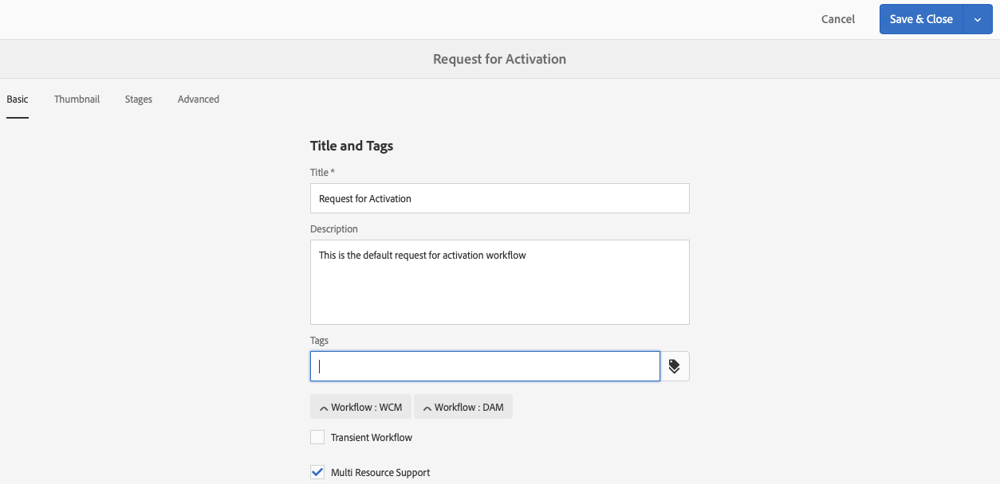

# 워크플로 모델 만들기{#creating-workflow-models}

>[!CAUTION]
>
>클래식 UI를 사용하려면 [AEM 6.3 설명서](https://helpx.adobe.com/experience-manager/6-3/help/sites-developing/workflows-models.html) 참조하십시오.

을(를) 만듭니다 [워크플로우 모델](/help/sites-developing/workflows.md#model) 사용자가 워크플로우를 시작할 때 실행되는 일련의 단계를 정의하는 방법 워크플로우가 일시적인지 또는 여러 리소스를 사용하는지 등의 모델 속성을 정의할 수도 있습니다.

사용자가 워크플로우를 시작하면 인스턴스가 시작됩니다. 사용자가 [동기화](#sync-your-workflow-generate-a-runtime-model) 변경 사항

## 새 워크플로우 만들기 {#creating-a-new-workflow}

새 워크플로우 모델을 처음 만들면 다음과 같이 포함됩니다.

* 단계, **흐름 시작** 및 **흐름 끝**.
워크플로우의 시작과 끝을 나타냅니다. 이러한 단계는 필수 단계이며 편집/제거할 수 없습니다.
* 예 **참가자** 이름이 지정된 단계 **1단계**.
이 단계는 작업 항목을 워크플로우 개시자에게 할당하도록 구성되어 있습니다. 이 단계를 편집하거나 삭제하고 필요에 따라 단계를 추가합니다.

편집기를 사용하여 새 워크플로우를 만들려면 다음을 수행하십시오.

1. 를 엽니다. **워크플로우 모델** console; via **도구**, **워크플로우**, **모델** 또는 예: [https://localhost:4502/aem/workflow](https://localhost:4502/aem/workflow)
1. 선택 **만들기**, 그런 다음 **모델 만들기**.
1. 다음 **워크플로우 모델 추가** 대화 상자가 나타납니다. 을(를) 입력합니다. **제목** 및 **이름** (선택 사항) **완료**.
1. 새 모델은 **워크플로우 모델** 콘솔.
1. 새 워크플로우를 선택한 다음 [**편집** 구성에 대해 열기](#editinganexistingworkflow):
   

>[!NOTE]
>
>프로그래밍 방식으로 모델을 만드는 경우(crx 패키지를 사용하여) 다음 내에서 하위 폴더를 만들 수도 있습니다.
>
>`/var/workflow/models`
>
>예, `/var/workflow/models/prototypes`
>
>그런 다음 이 폴더를 [해당 폴더의 모델에 대한 액세스 관리](/help/sites-administering/workflows-managing.md#create-a-subfolder-in-var-workflow-models-and-apply-the-acl-to-that).

## 워크플로우 편집 {#editing-a-workflow}

기존 워크플로우 모델을 편집하여 다음을 수행할 수 있습니다.

* [단계 정의](#addingasteptoamodel-) 그리고 [매개 변수](#configuring-a-workflow-step)
* 다음을 포함한 워크플로우 속성 구성 [단계](#configuring-workflow-stages-that-show-workflow-progress), [워크플로우가 일시적인지 여부](#creatingatransientworkflow-) 및/또는 [여러 리소스 사용](#configuring-a-workflow-for-multi-resource-support)

편집 [**기본값 및/또는 이전** (즉시 사용 가능한) 워크플로우](#editing-a-default-or-legacy-workflow-for-the-first-time) 에는 [안전 복사](/help/sites-developing/workflows-best-practices.md#locations-workflow-models) 가 변경되기 전에 변경되었습니다.

워크플로우에 대한 업데이트가 완료되면 **동기화** to **런타임 모델 생성**. 자세한 내용은 [워크플로우 동기화](#sync-your-workflow-generate-a-runtime-model) 자세한 내용

### 워크플로우 동기화 - 런타임 모델 생성 {#sync-your-workflow-generate-a-runtime-model}

**동기화** (편집기 도구 모음에서 오른쪽)에서 [런타임 모델](/help/sites-developing/workflows.md#runtime-model). 런타임 모델은 사용자가 워크플로우를 시작할 때 실제로 사용되는 모델입니다. 그렇지 않으면 **동기화** 그러면 변경 사항이 런타임 시 사용할 수 없습니다.

(또는 다른 사용자)가 워크플로우를 변경할 때 사용해야 합니다 **동기화** 개별 대화 상자(예: 단계)에 고유한 저장 옵션이 있는 경우에도 런타임 모델을 생성합니다.

변경 사항이 런타임(저장된) 모델과 동기화되면 **동기화** 가 대신 표시됩니다.

일부 단계에는 필수 필드 및/또는 유효성 검사가 빌드되어 있습니다. 이러한 조건이 충족되지 않으면 **동기화** 모델. 예를 들어, **참가자** 단계:


### 처음으로 기본 또는 레거시 워크플로우 편집 {#editing-a-default-or-legacy-workflow-for-the-first-time}

를 열 때 [기본 및/또는 레거시 모델](/help/sites-developing/workflows.md#workflow-types) 편집할 때:

* 단계 브라우저를 사용할 수 없습니다(왼쪽).
* 다음 항목이 있습니다 **편집** 작업 은 도구 모음(오른쪽)에서 사용할 수 있습니다.
* 처음에는 모델과 해당 속성이 다음과 같이 읽기 전용 모드로 표시됩니다.
   * 기본 워크플로우는 `/libs`
   * 기존 워크플로우는 `/etc`
선택 
**편집** 다음 작업을 수행합니다.
* 워크플로우의 사본을 로 `/conf`
* 단계 브라우저를 사용할 수 있도록 설정
* 변경할 수 있도록 설정

>[!NOTE]
>
>자세한 내용은 [워크플로우 모델 위치](/help/sites-developing/workflows-best-practices.md#locations-workflow-models) 추가 정보.


### 모델에 단계 추가 {#adding-a-step-to-a-model}

수행할 활동을 나타내려면 모델에 단계를 추가해야 합니다. 각 단계에서는 특정 활동을 수행합니다. 표준 AEM 인스턴스에서 여러 단계 구성 요소를 선택할 수 있습니다.

모델을 편집할 때 사용 가능한 단계가 다양한 **단계 브라우저**. 예:


>[!NOTE]
>
>AEM과 함께 설치되는 기본 단계 구성 요소에 대한 자세한 내용은 [워크플로우 단계 참조](/help/sites-developing/workflows-step-ref.md).

워크플로우 모델에 단계를 추가하려면 다음을 수행합니다.

1. 편집할 기존 워크플로우 모델을 엽니다. 에서 **워크플로우 모델** 콘솔에서 필요한 모델을 선택한 다음 **편집**.
1. 단계 브라우저를 엽니다. 사용 **사이드 패널 전환**&#x200B;상단 도구 모음의 맨 왼쪽에 있는 를 클릭합니다. 여기에서 다음과 같은 작업을 수행할 수 있습니다.

   * **필터** 참조하십시오.
   * 드롭다운 선택기를 사용하여 선택 사항을 특정 단계 그룹으로 제한합니다.
   * 설명 표시 아이콘을 선택합니다  적절한 단계에 대한 자세한 내용을 표시합니다.

   

1. 적절한 단계를 모델의 필요한 위치로 드래그합니다.

   예: **참가자 단계**.

   흐름에 추가되면 다음을 수행할 수 있습니다 [단계 구성](#configuring-a-workflow-step).

   

1. 필요에 따라 단계 또는 기타 업데이트를 추가합니다.

   런타임에 단계가 모델에 표시되는 순서대로 실행됩니다. 단계 구성 요소를 추가한 후 모델의 다른 위치로 드래그할 수 있습니다.

   기존 단계를 복사, 잘라내기, 붙여넣기, 그룹화 또는 삭제할 수도 있습니다. 과 [페이지 편집기.](/help/sites-authoring/editing-content.md)

   분할 단계는 도구 모음 옵션을 사용하여 축소/확장할 수도 있습니다. 

1. 다음 방법으로 변경 내용을 확인합니다. **동기화** (편집기 도구 모음)를 사용하여 런타임 모델을 생성합니다.

   자세한 내용은 [워크플로우 동기화](#sync-your-workflow-generate-a-runtime-model) 자세한 내용

### 워크플로우 단계 구성 {#configuring-a-workflow-step}

다음을 수행할 수 있습니다 **구성** 을 사용하여 워크플로우 단계의 동작을 사용자 정의합니다. **단계 속성** 대화 상자

1. 를 열려면 **단계 속성** 다음 중 한 단계의 대화 상자:

   * 워크플로우 모델에서* *단계를 클릭/탭하고 선택합니다. **구성** 구성 요소 도구 모음에서 를 클릭합니다.

   * 단계를 두 번 클릭합니다.
   >[!NOTE]
   >
   >AEM과 함께 설치되는 기본 단계 구성 요소에 대한 자세한 내용은 [워크플로우 단계 참조](/help/sites-developing/workflows-step-ref.md).

1. 구성 **단계 속성** 필요한 경우 사용 가능한 속성은 단계 유형에 따라 다르며, 사용 가능한 여러 탭이 있을 수도 있습니다. 예를 들어, 기본값은 **참가자 단계**, 새 워크플로우에 다음 형식으로 표시 `Step 1`:

   

1. 확인 표시를 사용하여 업데이트를 확인합니다.
1. 다음 방법으로 변경 내용을 확인합니다. **동기화** (편집기 도구 모음)를 사용하여 런타임 모델을 생성합니다.

   자세한 내용은 [워크플로우 동기화](#sync-your-workflow-generate-a-runtime-model) 자세한 내용

### 임시 워크플로우 만들기 {#creating-a-transient-workflow}

을(를) 만들 수 있습니다 [임시](/help/sites-developing/workflows.md#transient-workflows) 새 모델을 만들거나 기존 모델을 편집하여 워크플로우 모델:

1. 에 대한 워크플로우 모델 열기 [편집](#editinganexistingworkflow).
1. 선택 **워크플로우 모델 속성** 를 클릭합니다.
1. 대화 상자에서 를 활성화합니다 **임시 워크플로우** (또는 필요한 경우 비활성화):

   

1. 다음 방법으로 변경 내용을 확인합니다. **저장 및 닫기**; 후 **동기화** (편집기 도구 모음)를 사용하여 런타임 모델을 생성합니다.

   자세한 내용은 [워크플로우 동기화](#sync-your-workflow-generate-a-runtime-model) 자세한 내용

>[!NOTE]
>
>에서 워크플로우를 실행할 때 [임시](/help/sites-developing/workflows.md#transient-workflows) 모드 AEM은 워크플로우 기록을 저장하지 않습니다. 따라서, [타임라인](/help/sites-authoring/basic-handling.md#timeline) 은 해당 워크플로우와 관련된 정보를 표시하지 않습니다.

## Touch UI에서 워크플로우 모델 사용 가능 {#classic2touchui}

워크플로우 모델이 클래식 UI에 있지만 **[!UICONTROL 타임라인]** Touch UI의 레일을 선택한 다음 구성에 따라 사용 가능하게 만듭니다. 다음 단계는 **[!UICONTROL 활성화 요청]**.

1. 터치 지원 UI에서 모델을 사용할 수 없는지 확인합니다. 을 사용하여 자산 액세스 `/assets.html/content/dam` 경로. 자산을 선택합니다. 열기 **[!UICONTROL 타임라인]** 왼쪽 레일에 있습니다. 클릭 **[!UICONTROL 워크플로우 시작]** 그리고 **[!UICONTROL 활성화 요청]** 모델이 팝업 목록에 없습니다.

1. 탐색 **[!UICONTROL 도구 > 일반 > 태깅]**. 선택 **[!UICONTROL 워크플로우]**.

1. 선택 **[!UICONTROL 만들기 > 태그 만들기]**. 설정 **[!UICONTROL 제목]** 로서의 `DAM` 및 **[!UICONTROL 이름]** 로서의 `dam`. **[!UICONTROL 제출]**을 선택합니다.
   

1. 다음으로 이동 **[!UICONTROL 도구 > 워크플로우 > 모델]**. 선택 **[!UICONTROL 활성화 요청]**&#x200B;를 선택하고 을 선택합니다. **[!UICONTROL 편집]**.

1. 선택 **[!UICONTROL 편집]**&#x200B;를 열고 **[!UICONTROL 페이지 정보]** 메뉴에서 **[!UICONTROL 속성 열기]** 그리고 **[!UICONTROL 기본]** 탭(아직 열지 않은 경우)

1. 추가 `Workflow : DAM` to **[!UICONTROL 태그]** 필드. 확인(확인 표시)으로 선택 사항을 확인합니다.

1. 태그 추가 확인 **[!UICONTROL 저장 및 닫기]**.
   

1. 다음 방법으로 프로세스를 완료합니다 **[!UICONTROL 동기화]**. 이제 터치 지원 UI에서 워크플로우를 사용할 수 있습니다.

### 다중 리소스 지원을 위한 워크플로우 구성 {#configuring-a-workflow-for-multi-resource-support}

에 대한 워크플로우 모델을 구성할 수 있습니다 [다중 리소스 지원](/help/sites-developing/workflows.md#multi-resource-support) 새 모델을 만들거나 기존 모델을 편집하여 다음을 수행합니다.

1. 에 대한 워크플로우 모델 열기 [편집](#editinganexistingworkflow).
1. 선택 **워크플로우 모델 속성** 를 클릭합니다.

1. 대화 상자에서 를 활성화합니다 **다중 리소스 지원** (또는 필요한 경우 비활성화):

   

1. 다음 방법으로 변경 내용을 확인합니다. **저장 및 닫기**; 후 **동기화** (편집기 도구 모음)를 사용하여 런타임 모델을 생성합니다.

   자세한 내용은 [워크플로우 동기화](#sync-your-workflow-generate-a-runtime-model) 자세한 내용

### 워크플로우 단계 구성(워크플로우 진행 상태 표시) {#configuring-workflow-stages-that-show-workflow-progress}

[워크플로우 단계](/help/sites-developing/workflows.md#workflow-stages) 작업을 처리할 때 워크플로우의 진행 상황을 시각화하는 데 도움이 됩니다.

>[!CAUTION]
>
>워크플로우 단계가 **페이지 속성**&#x200B;하지만 워크플로우 단계에는 사용되지 않으면 진행률 표시줄에는 현재 워크플로우 단계와 관계없이 진행 상태가 표시되지 않습니다.

사용할 수 있는 단계는 워크플로우 모델에서 정의됩니다. 기존 워크플로우 모델을 업데이트하여 단계 정의를 포함할 수 있습니다. 워크플로우 모델에 대한 단계 수를 정의할 수 있습니다.

을(를) 정의하려면 **단계** 워크플로우의 경우:

1. 편집할 워크플로우 모델을 엽니다.
1. 선택 **워크플로우 모델 속성** 를 클릭합니다. 그런 다음 를 엽니다. **단계** 탭.
1. 필요한 추가(및 위치) **단계**. 워크플로우 모델에 대한 단계 수를 정의할 수 있습니다.

   예:

   

1. 클릭 **저장 및 닫기** 속성을 저장합니다.
1. 워크플로우 모델의 각 단계에 스테이지를 할당합니다. 예:

   

   스테이지는 둘 이상의 단계에 할당할 수 있습니다. 예:

   | **단계** | **스테이징** |
   |---|---|
   | 1단계 | 만들기 |
   | 2단계 | 만들기 |
   | 3단계 | 리뷰 |
   | 4단계 | 승인 |
   | 5단계 | 승인 |
   | 6단계 | 완료 |

1. 다음 방법으로 변경 내용을 확인합니다. **동기화** (편집기 도구 모음)를 사용하여 런타임 모델을 생성합니다.

   자세한 내용은 [워크플로우 동기화](#sync-your-workflow-generate-a-runtime-model) 자세한 내용

## 패키지에서 워크플로우 모델 내보내기 {#exporting-a-workflow-model-in-a-package}

패키지에서 워크플로우 모델을 내보내려면 다음을 수행하십시오.

1. 를 사용하여 새 패키지 만들기 [패키지 관리자](/help/sites-administering/package-manager.md#package-manager):

   1. 를 통해 패키지 관리자로 이동합니다 **도구**, **배포**, **패키지**.

   1. 클릭 **패키지 만들기**.
   1. 을(를) 지정합니다. **패키지 이름**&#x200B;및 기타 모든 세부 사항을 필요에 따라 구성합니다.
   1. **확인**&#x200B;을 클릭합니다.

1. 클릭 **편집** 를 클릭합니다.

1. 를 엽니다. **필터** 탭.

1. 선택 **필터 추가** 워크플로우 모델의 경로를 지정합니다 *디자인*:

   `/conf/global/settings/workflow/models/<*your-model-name*>`

   클릭 **완료**.

1. 선택 **필터 추가** 및 의 경로를 지정합니다 *런타임* 워크플로우 모델:

   `/var/workflow/models/<*your-model-name*>`

   클릭 **완료**.

1. 모델에서 사용하는 사용자 지정 스크립트에 대한 추가 필터를 추가합니다.
1. 클릭 **저장** 필터 정의를 확인하려면
1. 선택 **빌드** 패키지 정의의 도구 모음에서 를 클릭합니다.
1. 선택 **다운로드** 패키지 도구 모음에서 를 클릭합니다.

## 워크플로우를 사용하여 양식 제출 처리 {#using-workflows-to-process-form-submissions}

선택한 워크플로우에서 처리할 양식을 구성할 수 있습니다. 사용자가 양식을 제출하면 양식 제출의 데이터를 페이로드로 사용하여 새 워크플로우 인스턴스가 생성됩니다.

양식에 사용할 워크플로우를 구성하려면 다음을 수행하십시오.

1. 새 페이지를 만들고 열어서 편집합니다.
1. 추가 **양식** 구성 요소를 생성하지 않습니다.
1. **구성** a **양식 시작** 페이지에 표시된 구성 요소입니다.
1. 사용 **워크플로우 시작** 사용 가능한 워크플로우에서 원하는 워크플로우를 선택하려면 다음을 수행하십시오.

   

1. 확인 표시를 사용하여 새 양식 구성을 확인합니다.

## 워크플로우 테스트 {#testing-workflows}

다양한 페이로드 유형을 사용하도록 워크플로우를 테스트할 때 매우 좋습니다. 개발된 유형과 다른 유형을 포함합니다. 예를 들어, 워크플로우에서 자산을 처리하려는 경우 페이지를 페이로드로 설정하여 테스트하고, 이 페이지에서 오류가 발생하지 않도록 하십시오.

예를 들어 다음과 같이 새 워크플로우를 테스트합니다.

1. [워크플로우 모델 시작](/help/sites-administering/workflows-starting.md) 콘솔에서 게시할 수 있습니다.
1. 을(를) 정의합니다 **페이로드** 확인

1. 워크플로우가 계속 진행되도록 필요한 작업을 수행합니다.
1. 워크플로우가 실행되는 동안 로그 파일을 모니터링합니다.

AEM을 표시하도록 구성할 수도 있습니다 **디버그** 로그 파일에 있는 메시지입니다. 자세한 내용은 [로깅](/help/sites-deploying/configure-logging.md) 자세한 내용 및 개발이 완료되면 **로그 수준** 뒤로 **정보**.

## 예 {#examples}

### 예: 게시 요청을 수락 또는 거부하는 (단순) 워크플로우 만들기 {#example-creating-a-simple-workflow-to-accept-or-reject-a-request-for-publication}

워크플로우 만들기에 대한 몇 가지 가능성을 보여주기 위해 다음 예에서는 변형을 만듭니다. `Publish Example` 워크플로우.

1. [새 워크플로우 모델 만들기](#creating-a-new-workflow).

   새 워크플로우에는 다음이 포함됩니다.

   * **플로우 시작**
   * `Step 1`
   * **플로우 끝**

1. 삭제 `Step 1` (이 예제의 잘못된 단계 유형):

   * 단계를 클릭하고 을 선택합니다. **삭제** 구성 요소 도구 모음에서 를 클릭합니다. 동작을 확인합니다.

1. 에서 **워크플로우** 단계 브라우저를 선택하고 **참가자 단계** 작업 과정에 배치하여 다음 사이 **흐름 시작** 및 **흐름 끝**.
1. 속성 대화 상자를 열려면 다음 중 하나를 수행합니다.

   * 참가자 단계를 클릭하고 을 선택합니다 **구성** 구성 요소 도구 모음에서 를 클릭합니다.
   * 참가자 단계를 두 번 클릭합니다.

1. 에서 **공통** 탭 입력 `Validate Content` 둘 다 **제목** 및 **설명**.
1. 를 엽니다. **사용자/그룹** 탭:

   * 활성화 **이메일을 통해 사용자에게 알림**.
   * 선택 `Administrator` ( `admin`) **사용자/그룹** 필드.

   >[!NOTE]
   >
   >이메일을 보내려면 [메일 서비스 및 사용자 계정 세부 사항을 구성해야 합니다.](/help/sites-administering/notification.md).

1. 확인 표시를 사용하여 업데이트를 확인합니다.

   워크플로우 모델 개요로 돌아갑니다. 여기에서 참가자 단계의 이름은 로 변경됩니다 `Validate Content`.

1. 끌어서 놓기 **또는 분할** 작업 과정에 배치하여 다음 사이 `Validate Content` 및 **흐름 끝**.
1. 를 엽니다. **또는 분할** 참조하십시오.
1. 다음을 구성하십시오.

   * **공통**: 분할 이름을 지정합니다.
   * **분기 1**: 선택 **기본 경로**.

   * **분기 2**: 확인합니다. **기본 경로** 이 선택되어 있지 않습니다.

1. 업데이트에 대한 업데이트를 확인합니다. **또는 분할**.
1. 드래그 **참가자 단계** 왼쪽 분기에서 속성을 열고 다음 값을 지정한 다음 변경 사항을 확인합니다.

   * **제목**: `Reject Publish Request`

   * **사용자/그룹**: 예 `projects-administrators`

   * **이메일을 통해 사용자에게 알림**: 사용자에게 이메일을 통해 알림을 보내려면 활성화합니다.

1. 드래그 **프로세스 단계** 오른쪽 분기에서 속성을 열고 다음 값을 지정한 다음 변경 사항을 확인합니다.

   * **제목**: `Publish Page as Requested`

   * **프로세스**: 선택 `Activate Page`. 이 프로세스는 선택한 페이지를 게시자 인스턴스에 게시합니다.

1. 클릭 **동기화** (편집기 도구 모음)를 사용하여 런타임 모델을 생성합니다.

   자세한 내용은 [워크플로우 동기화](#sync-your-workflow-generate-a-runtime-model) 자세한 내용

   새 워크플로우 모델은 다음과 같습니다.

   

1. 사용자가 이동할 때 이 워크플로우를 페이지에 적용합니다. **완료** a **컨텐츠 유효성 검사** 한 단계 후에 **요청한 대로 페이지 게시**, 또는 **게시 요청 거부**.

   

### 예: ECMA 스크립트를 사용하여 OR 분할에 대한 규칙 정의 {#defineruleecmascript}

**또는 분할** 단계를 통해 워크플로우에 조건부 처리 경로를 도입할 수 있습니다.

OR 규칙을 정의하려면 다음과 같이 진행합니다.

1. 두 개의 스크립트를 만들어 다음 등의 방법으로 저장소에 저장합니다.

   `/apps/myapp/workflow/scripts`

   >[!NOTE]
   >
   >스크립트에는 [함수 `check()`](#function-check) 부울을 반환합니다.

1. 워크플로우를 편집하고 추가 **또는 분할** 모델에 추가합니다.
1. 속성 편집 **분기 1** 의 **또는 분할**:

   * 이를 로 정의합니다 **기본 경로** 다음을 설정하여 **값** to `true`.

   * 로서의 **규칙**를 눌러 스크립트 경로를 설정합니다. 예:
      `/apps/myapp/workflow/scripts/myscript1.ecma`
   >[!NOTE]
   >
   >필요한 경우 분기 주문을 전환할 수 있습니다.

1. 의 속성을 편집합니다 **분기 2** 의 **또는 분할**.

   * 로서의 **규칙**를 눌러 경로를 다른 스크립트로 설정합니다. 예:
      `/apps/myapp/workflow/scripts/myscript2.ecma`

1. 각 분기에 있는 개별 단계의 속성을 설정합니다. 다음을 확인합니다. **사용자/그룹** 이(가) 설정되어 있습니다.
1. 클릭 **동기화** (편집기 도구 모음)를 사용하여 런타임 모델에 대한 변경 사항을 유지합니다.

   자세한 내용은 [워크플로우 동기화](#sync-your-workflow-generate-a-runtime-model) 자세한 내용

#### 함수 Check() {#function-check}

>[!NOTE]
>
>자세한 내용은 [ECMAScript 사용](/help/sites-developing/workflows-customizing-extending.md#using-ecmascript).

다음 샘플 스크립트는 `true` 노드가 `JCR_PATH` 다음 위치 `/content/we-retail/us/en`:

```
function check() {
    if (workflowData.getPayloadType() == "JCR_PATH") {
      var path = workflowData.getPayload().toString();
      var node = jcrSession.getItem(path);

      if (node.getPath().indexOf("/content/we-retail/us/en") >= 0) {
       return true;
      } else {
       return false;
      }
     } else {
      return false;
     }
}
```

### 예: 활성화 사용자 지정 요청 {#example-customized-request-for-activation}

기본 워크플로우를 사용자 지정할 수 있습니다. 사용자 지정된 동작을 갖도록 하려면 해당 워크플로우의 세부 사항을 오버레이합니다.

예, **활성화 요청**. 이 워크플로우는 내에서 페이지를 게시하는 데 사용됩니다 **Sites** 컨텐츠 작성자에게 적절한 복제 권한이 없을 때 자동으로 트리거됩니다. 자세한 내용은 [페이지 작성 사용자 지정 - 활성화 요청 사용자 정의](/help/sites-developing/customizing-page-authoring-touch.md#customizing-the-request-for-activation-workflow) 자세한 내용
