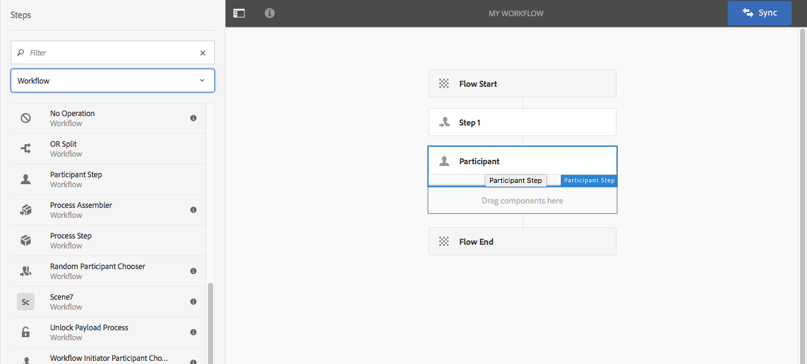

# 워크플로 모델 만들기{#creating-workflow-models}

>[!CAUTION]
>
>클래식 UI를 사용하려면 [AEM 6.3 설명서](https://helpx.adobe.com/kr/experience-manager/6-3/help/sites-developing/workflows-models.html)를 참조하십시오.

[워크플로 모델](/help/sites-developing/workflows.md#model)을(를) 만들어 사용자가 워크플로를 시작할 때 실행되는 일련의 단계를 정의합니다. 워크플로가 일시적인지 또는 여러 리소스를 사용하는지 여부와 같은 모델 속성을 정의할 수도 있습니다.

사용자가 워크플로우를 시작하면 인스턴스가 시작됩니다. 이는 변경 내용을 [동기화](#sync-your-workflow-generate-a-runtime-model)할 때 만들어지는 해당 런타임 모델입니다.

## 새 워크플로우 만들기 {#creating-a-new-workflow}

처음 워크플로우 모델을 만들 때 다음과 같은 내용이 포함됩니다.

* **흐름 시작** 및 **흐름 종료** 단계입니다.
이는 워크플로우의 시작과 끝을 나타냅니다. 이러한 단계는 필수이며 편집/제거할 수 없습니다.
* **참가자** 단계(예: **단계 1**).
이 단계는 워크플로 개시자에게 작업 항목을 할당하도록 구성되어 있습니다. 이 단계를 편집하거나 삭제하고 필요에 따라 단계를 추가합니다.

편집기로 워크플로우를 만들려면 다음 작업을 수행하십시오.

1. **워크플로 모델** 콘솔을 엽니다. **도구**, **워크플로**, **모델** 또는 예: [https://localhost:4502/aem/workflow](https://localhost:4502/aem/workflow)을(를) 통해
1. **만들기**&#x200B;를 선택한 다음 **모델 만들기**&#x200B;를 선택하십시오.
1. **워크플로 모델 추가** 대화 상자가 나타납니다. **완료**&#x200B;를 선택하기 전에 **제목** 및 **이름**(선택 사항)을 입력하십시오.
1. 새 모델이 **워크플로 모델** 콘솔에 나열됩니다.
1. 새 워크플로를 선택한 다음 [**편집**&#x200B;을 사용하여 구성에 대해 여십시오](#editinganexistingworkflow):
   

>[!NOTE]
>
>crx 패키지를 사용하여 프로그래밍 방식으로 모델을 만드는 경우 다음 내에서 하위 폴더를 만들 수도 있습니다.
>
>`/var/workflow/models`
>
>예, `/var/workflow/models/prototypes`
>
>그런 다음 [해당 폴더의 모델에 대한 액세스 관리](/help/sites-administering/workflows-managing.md#create-a-subfolder-in-var-workflow-models-and-apply-the-acl-to-that)에 이 폴더를 사용할 수 있습니다.

## 워크플로우 편집 {#editing-a-workflow}

기존 워크플로 모델을 편집하여 다음과 같은 작업을 수행할 수 있습니다.

* [단계 정의](#addingasteptoamodel-) 및 해당 [매개 변수](#configuring-a-workflow-step)
* [단계](#configuring-workflow-stages-that-show-workflow-progress), [워크플로가 일시적인지 여부](#creatingatransientworkflow-) 및/또는 [여러 리소스를 사용](#configuring-a-workflow-for-multi-resource-support)하는 워크플로 속성을 구성하십시오.

[**기본 및/또는 레거시**(기본 제공) 워크플로우를 편집하는 중](#editing-a-default-or-legacy-workflow-for-the-first-time)에는 변경 작업을 수행하기 전에 [안전한 복사본](/help/sites-developing/workflows-best-practices.md#locations-workflow-models)을 사용할 수 있도록 하는 추가 단계가 있습니다.

워크플로우에 대한 업데이트가 완료되면 **동기화**&#x200B;를 사용하여 **런타임 모델을 생성**&#x200B;해야 합니다. 자세한 내용은 [워크플로 동기화](#sync-your-workflow-generate-a-runtime-model)를 참조하십시오.

### 워크플로우 동기화 - 런타임 모델 생성 {#sync-your-workflow-generate-a-runtime-model}

**Sync**(편집기 도구 모음 오른쪽에 있음)은 [런타임 모델](/help/sites-developing/workflows.md#runtime-model)을(를) 생성합니다. 런타임 모델은 사용자가 워크플로우를 시작할 때 실제로 사용되는 모델입니다. 변경 내용을 **동기화**&#x200B;하지 않으면 변경 내용을 런타임에 사용할 수 없습니다.

사용자(또는 다른 사용자)가 워크플로우를 변경할 때 **동기화**&#x200B;를 사용하여 런타임 모델을 생성해야 합니다. 개별 대화 상자(예: 단계의 경우)에 고유한 저장 옵션이 있는 경우에도 마찬가지입니다.

변경 내용이 런타임(저장된) 모델과 동기화되면 대신 **동기화됨**&#x200B;이 표시됩니다.

일부 단계에는 필수 필드 및/또는 기본 제공 유효성 검사가 있습니다. 이러한 조건이 충족되지 않으면 모델을 **동기화**&#x200B;하려고 하면 오류가 표시됩니다. 예를 들어, **참가자** 단계에 대해 정의된 참가자가 없는 경우:


### 처음 기본 또는 이전 워크플로 편집 {#editing-a-default-or-legacy-workflow-for-the-first-time}

편집할 [기본 및/또는 레거시 모델](/help/sites-developing/workflows.md#workflow-types)을(를) 여는 경우:

* 단계 브라우저를 사용할 수 없습니다(왼쪽).
* 도구 모음(오른쪽)에서 **편집** 작업을 사용할 수 있습니다.
* 처음에는 모델 및 해당 속성이 다음과 같이 읽기 전용 모드로 표시됩니다.
   * 기본 워크플로는 `/libs`에 있습니다.
   * 레거시 워크플로가 `/etc`에 있습니다.
**편집**&#x200B;을(를) 선택하면 다음이 수행됩니다.
* `/conf`(으)로 워크플로 복사본 가져오기
* 단계 브라우저 사용 가능
* 변경할 수 있도록 설정

>[!NOTE]
>
>자세한 내용은 [워크플로 모델의 위치](/help/sites-developing/workflows-best-practices.md#locations-workflow-models)를 참조하십시오.


### 모델에 단계 추가 {#adding-a-step-to-a-model}

모델에 단계를 추가하여 수행할 활동을 나타냅니다. 각 단계는 특정 활동을 수행합니다. 표준 AEM 인스턴스에서 여러 단계 구성 요소를 사용할 수 있습니다.

모델을 편집하면 사용 가능한 단계가 **단계 브라우저**&#x200B;의 다양한 그룹에 나타납니다. 예:


>[!NOTE]
>
>AEM과 함께 설치되는 기본 단계 구성 요소에 대한 자세한 내용은 [워크플로 단계 참조](/help/sites-developing/workflows-step-ref.md)를 참조하십시오.

워크플로우 모델에 단계를 추가하려면 다음을 수행합니다.

1. 편집할 기존 워크플로우 모델을 엽니다. **워크플로 모델** 콘솔에서 필요한 모델을 선택한 다음 **편집**&#x200B;을 선택합니다.
1. 단계 브라우저를 엽니다. 상단 도구 모음의 맨 왼쪽에 있는 **사이드 패널 전환**&#x200B;을 사용합니다. 여기에서 다음과 같은 작업을 수행할 수 있습니다.

   * 특정 단계에 대해 **필터**&#x200B;합니다.
   * 드롭다운 선택기를 사용하여 선택 사항을 특정 단계 그룹으로 제한합니다.
   * 설명 표시 아이콘 을(를) 선택하여 적절한 단계에 대한 자세한 내용을 표시합니다.

   

1. 해당 단계를 모델의 필요한 위치로 드래그합니다.

   예를들어, **참가자 단계**&#x200B;입니다.

   흐름에 추가되면 [단계를 구성](#configuring-a-workflow-step)할 수 있습니다.

   

1. 필요에 따라 여러 단계 또는 기타 업데이트를 추가합니다.

   런타임에 단계는 모델에 표시되는 순서대로 실행됩니다. 단계 구성 요소를 추가한 후 모델의 다른 위치로 드래그할 수 있습니다.

   [페이지 편집기](/help/sites-authoring/editing-content.md)와 같이 기존 단계를 복사, 잘라내기, 붙여넣기, 그룹화 또는 삭제할 수도 있습니다.

   도구 모음 옵션을 사용하여 분할 단계를 축소/확장할 수도 있습니다. 

1. 런타임 모델을 생성하려면 **동기화**(편집기 도구 모음)을 사용하여 변경 사항을 확인하십시오.

   자세한 내용은 [워크플로 동기화](#sync-your-workflow-generate-a-runtime-model)를 참조하십시오.

### 워크플로우 단계 구성 {#configuring-a-workflow-step}

**구성**&#x200B;하고 **단계 속성** 대화 상자를 사용하여 워크플로 단계의 동작을 사용자 지정할 수 있습니다.

1. 다음 중 한 단계에 대한 **단계 속성** 대화 상자를 열려면

   * 워크플로우 모델에서* *단계를 클릭하고 구성 요소 도구 모음에서 **구성**&#x200B;을 선택합니다.

   * 단계를 두 번 클릭합니다.

   >[!NOTE]
   >
   >AEM과 함께 설치되는 기본 단계 구성 요소에 대한 자세한 내용은 [워크플로 단계 참조](/help/sites-developing/workflows-step-ref.md)를 참조하십시오.

1. 필요에 따라 **단계 속성**&#x200B;을 구성하십시오. 사용 가능한 속성은 단계 유형에 따라 다르며, 여러 탭을 사용할 수도 있습니다. 예를 들어 기본 **참가자 단계**&#x200B;이(가) 새 워크플로에 `Step 1`(으)로 표시됩니다.

   

1. 확인 표시를 클릭하여 업데이트를 확인합니다.
1. 런타임 모델을 생성하려면 **동기화**(편집기 도구 모음)을 사용하여 변경 사항을 확인하십시오.

   자세한 내용은 [워크플로 동기화](#sync-your-workflow-generate-a-runtime-model)를 참조하십시오.

### 임시 워크플로우 만들기 {#creating-a-transient-workflow}

모델을 만들 때 또는 기존 모델을 편집하여 [임시](/help/sites-developing/workflows.md#transient-workflows) 워크플로 모델을 만들 수 있습니다.

1. [편집](#editinganexistingworkflow)할 워크플로 모델을 엽니다.
1. 도구 모음에서 **워크플로 모델 속성**&#x200B;을 선택합니다.
1. 대화 상자에서 **임시 워크플로**&#x200B;를 활성화합니다(필요한 경우 비활성화).

   

1. **저장 및 닫기**; **동기화**(편집기 도구 모음)를 사용하여 변경 내용을 확인하여 런타임 모델을 생성합니다.

   자세한 내용은 [워크플로 동기화](#sync-your-workflow-generate-a-runtime-model)를 참조하십시오.

>[!NOTE]
>
>[임시](/help/sites-developing/workflows.md#transient-workflows) 모드에서 워크플로우를 실행하면 AEM에 워크플로우 기록이 저장되지 않습니다. 따라서 [타임라인](/help/sites-authoring/basic-handling.md#timeline)에는 해당 워크플로우와 관련된 정보가 표시되지 않습니다.

## Touch UI에서 워크플로우 모델을 사용할 수 있도록 설정 {#classic2touchui}

워크플로 모델이 클래식 UI에 있지만, Touch UI의 **[!UICONTROL 타임라인]** 레일의 선택 팝업 메뉴에 없는 경우 구성을 따라 사용할 수 있도록 하십시오. 다음 단계는 **[!UICONTROL 활성화 요청]**&#x200B;이라는 워크플로 모델을 사용하는 방법을 보여 줍니다.

1. 터치 지원 UI에서 모델을 사용할 수 없는지 확인합니다. `/assets.html/content/dam` 경로를 사용하여 자산에 액세스합니다. 자산을 선택합니다. 왼쪽 레일에서 **[!UICONTROL 타임라인]**&#x200B;을 엽니다. **[!UICONTROL 워크플로 시작]**&#x200B;을 클릭하고 **[!UICONTROL 활성화 요청]** 모델이 팝업 목록에 없는지 확인합니다.

1. **[!UICONTROL 도구 > 일반 > 태그 지정]**&#x200B;을 통해 이동합니다. **[!UICONTROL 워크플로]**&#x200B;를 선택하십시오.

1. **[!UICONTROL 만들기 > 태그 만들기]**&#x200B;를 선택합니다. **[!UICONTROL Title]**&#x200B;을(를) `DAM`(으)로 설정하고 **[!UICONTROL Name]**&#x200B;을(를) `dam`(으)로 설정합니다. **[!UICONTROL 제출]**&#x200B;을 선택합니다.
   

1. **[!UICONTROL 도구 > 워크플로 > 모델]**(으)로 이동합니다. **[!UICONTROL 활성화 요청]**&#x200B;을 선택한 다음 **[!UICONTROL 편집]**&#x200B;을 선택합니다.

1. **[!UICONTROL 편집]**&#x200B;을 선택하고 **[!UICONTROL 페이지 정보]** 메뉴를 연 다음 **[!UICONTROL 속성 열기]**&#x200B;를 선택하고 **[!UICONTROL 기본]** 탭으로 이동합니다(아직 열리지 않은 경우).

1. **[!UICONTROL 태그]** 필드에 `Workflow : DAM`을(를) 추가합니다. 확인(확인 표시)을 사용하여 선택 내용을 확인합니다.

1. **[!UICONTROL 저장 및 닫기]**&#x200B;를 사용하여 태그의 추가를 확인합니다.
   

1. **[!UICONTROL 동기화]**&#x200B;를 사용하여 프로세스를 완료합니다. 이제 터치 지원 UI에서 워크플로를 사용할 수 있습니다.

### 다중 리소스 지원을 위한 워크플로우 구성 {#configuring-a-workflow-for-multi-resource-support}

모델을 만들거나 기존 모델을 편집하여 [다중 리소스 지원](/help/sites-developing/workflows.md#multi-resource-support)에 대한 워크플로 모델을 구성할 수 있습니다.

1. [편집](#editinganexistingworkflow)할 워크플로 모델을 엽니다.
1. 도구 모음에서 **워크플로 모델 속성**&#x200B;을 선택합니다.

1. 대화 상자에서 **다중 리소스 지원**&#x200B;을 활성화합니다(필요한 경우 비활성화).

   

1. **저장 및 닫기**; **동기화**(편집기 도구 모음)를 사용하여 변경 내용을 확인하여 런타임 모델을 생성합니다.

   자세한 내용은 [워크플로 동기화](#sync-your-workflow-generate-a-runtime-model)를 참조하십시오.

### 워크플로 단계 구성(워크플로 진행률을 표시) {#configuring-workflow-stages-that-show-workflow-progress}

[워크플로 단계](/help/sites-developing/workflows.md#workflow-stages)를 통해 작업을 처리할 때 워크플로의 진행 상황을 시각화할 수 있습니다.

>[!CAUTION]
>
>워크플로 단계가 **페이지 속성**&#x200B;에 정의되어 있지만 워크플로 단계에 사용되지 않는 경우 진행률 표시줄에 현재 워크플로 단계에 관계없이 진행률이 표시되지 않습니다.

사용할 수 있는 단계는 워크플로 모델에서 정의되며, 기존 워크플로 모델을 업데이트하여 단계 정의를 포함할 수 있습니다. 워크플로 모델의 단계를 원하는 수만큼 정의할 수 있습니다.

워크플로우에 대해 **단계**&#x200B;를 정의하려면:

1. 편집할 워크플로우 모델을 엽니다.
1. 도구 모음에서 **워크플로 모델 속성**&#x200B;을 선택합니다. 그런 다음 **단계** 탭을 엽니다.
1. 필요한 **단계**&#x200B;를 추가(및 배치)하십시오. 워크플로 모델의 단계를 원하는 수만큼 정의할 수 있습니다.

   예:

   

1. 속성을 저장하려면 **저장 및 닫기**&#x200B;를 클릭하십시오.
1. 워크플로우 모델의 각 단계에 단계를 지정합니다. 예:

   

   스테이지는 두 개 이상의 단계에 지정할 수 있습니다. 예:

   | **단계** | **단계** |
   |---|---|
   | 1단계 | 만들기 |
   | 2단계 | 만들기 |
   | 3단계 | 검토 |
   | 4단계 | 승인 |
   | 5단계 | 승인 |
   | 6단계 | 완료 |

1. 런타임 모델을 생성하려면 **동기화**(편집기 도구 모음)을 사용하여 변경 사항을 확인하십시오.

   자세한 내용은 [워크플로 동기화](#sync-your-workflow-generate-a-runtime-model)를 참조하십시오.

## 패키지에서 워크플로우 모델 내보내기 {#exporting-a-workflow-model-in-a-package}

패키지에서 워크플로 모델을 내보내려면 다음을 수행하십시오.

1. [패키지 관리자](/help/sites-administering/package-manager.md#package-manager)를 사용하여 패키지 만들기:

   1. **도구**, **배포**, **패키지**&#x200B;를 통해 패키지 관리자로 이동합니다.

   1. **패키지 만들기**&#x200B;를 클릭합니다.
   1. **패키지 이름** 및 필요에 따라 기타 세부 정보를 지정하십시오.
   1. **확인**&#x200B;을 클릭합니다.

1. 새 패키지의 도구 모음에서 **편집**&#x200B;을 클릭합니다.

1. **필터** 탭을 엽니다.

1. **필터 추가**&#x200B;를 선택하고 워크플로 모델 *디자인*&#x200B;의 경로를 지정하십시오.

   `/conf/global/settings/workflow/models/<*your-model-name*>`

   **완료**&#x200B;를 클릭합니다.

1. **필터 추가**&#x200B;를 선택하고 *런타임* 워크플로 모델의 경로를 지정하십시오.

   `/var/workflow/models/<*your-model-name*>`

   **완료**&#x200B;를 클릭합니다.

1. 모델에서 사용하는 모든 사용자 지정 스크립트에 대한 필터를 추가합니다.
1. 필터 정의를 확인하려면 **저장**&#x200B;을 클릭하세요.
1. 패키지 정의의 도구 모음에서 **빌드**&#x200B;를 선택합니다.
1. 패키지 도구 모음에서 **다운로드**&#x200B;를 선택합니다.

## 워크플로우를 사용하여 양식 제출 처리 {#using-workflows-to-process-form-submissions}

선택한 워크플로우에서 처리할 양식을 구성할 수 있습니다. 사용자가 양식을 제출하면 양식 제출의 데이터를 페이로드로 하는 새 워크플로우 인스턴스가 만들어집니다.

양식과 함께 사용할 워크플로우를 구성하려면 다음 작업을 수행하십시오.

1. 편집할 페이지를 만들고 엽니다.
1. 페이지에 **Form** 구성 요소를 추가합니다.
1. 페이지에 표시된 **양식 시작** 구성 요소를 **구성**&#x200B;합니다.
1. **워크플로 시작**&#x200B;을(를) 사용하여 사용 가능한 워크플로 중에서 원하는 워크플로를 선택합니다.

   

1. 확인 표시를 사용하여 새 양식 구성을 확인합니다.

## 워크플로우 테스트 {#testing-workflows}

개발된 페이로드 유형과 다른 유형을 포함하여 다양한 페이로드 유형을 사용하도록 워크플로우를 테스트할 때 유용합니다. 예를 들어 워크플로우가 Assets을 처리하려는 경우 페이지를 페이로드로 설정하여 테스트하고 오류가 발생하지 않는지 확인합니다.

예를 들어 다음과 같이 새 워크플로를 테스트합니다.

1. 콘솔에서 [워크플로 모델을 시작](/help/sites-administering/workflows-starting.md)합니다.
1. **페이로드**&#x200B;를 정의하고 확인하십시오.

1. 워크플로우가 진행될 수 있도록 필요에 따라 작업을 수행합니다.
1. 워크플로우가 실행되는 동안 로그 파일을 모니터링합니다.

로그 파일에 **DEBUG** 메시지를 표시하도록 AEM을 구성할 수도 있습니다. 자세한 내용은 [로깅](/help/sites-deploying/configure-logging.md)을 참조하고 개발이 완료되면 **로그 수준**&#x200B;을 다시 **정보**(으)로 설정하십시오.

## 예 {#examples}

### 예: 게시 요청을 수락 또는 거부하는 (단순) 워크플로우 만들기 {#example-creating-a-simple-workflow-to-accept-or-reject-a-request-for-publication}

워크플로를 만드는 방법을 설명하기 위해 다음 예제에서는 `Publish Example` 워크플로의 변형을 만듭니다.

1. [워크플로 모델을 만듭니다](#creating-a-new-workflow).

   새 워크플로에는 다음이 포함됩니다.

   * **흐름 시작**
   * `Step 1`
   * **흐름 종료**

1. `Step 1`을(를) 삭제합니다(이 예제의 경우 잘못된 단계 유형).

   * 단계를 클릭하고 구성 요소 도구 모음에서 **삭제**&#x200B;를 선택합니다. 동작을 확인합니다.

1. 단계 브라우저의 **워크플로** 선택에서 **참가자 단계**&#x200B;을(를) 워크플로로 드래그하여 **흐름 시작**&#x200B;과(와) **흐름 종료** 사이에 배치합니다.
1. 속성 대화 상자를 열려면 다음 작업을 수행하십시오.

   * 참가자 단계를 클릭하고 구성 요소 도구 모음에서 **구성**&#x200B;을 선택합니다.
   * 참가자 단계를 두 번 클릭합니다.

1. **공용** 탭에서 **제목** 및 **설명** 모두에 대해 `Validate Content`을(를) 입력하십시오.
1. **사용자/그룹** 탭을 엽니다.

   * **전자 메일을 통해 사용자에게 알림**&#x200B;을 활성화합니다.
   * **사용자/그룹** 필드에 대해 `Administrator`(`admin`)을(를) 선택합니다.

   >[!NOTE]
   >
   >전자 메일을 보내려면 [메일 서비스 및 사용자 계정 세부 정보를 구성해야 합니다](/help/sites-administering/notification.md).

1. 확인 표시를 클릭하여 업데이트를 확인합니다.

   워크플로 모델의 개요로 돌아가게 됩니다. 여기서 참가자 단계의 이름은 `Validate Content`(으)로 변경됩니다.

1. **Or 분할**&#x200B;을(를) 워크플로우로 드래그하여 `Validate Content`에서 **흐름 끝** 사이에 배치합니다.
1. 구성을 위해 **또는 분할**&#x200B;을 엽니다.
1. 다음을 구성하십시오.

   * **일반**: 분할 이름을 지정하십시오.
   * **분기 1**: **기본 경로**&#x200B;을(를) 선택하십시오.

   * **분기 2**: **기본 경로**&#x200B;을(를) 선택하지 않았는지 확인하십시오.

1. **OR 분할**&#x200B;에 대한 업데이트를 확인합니다.
1. **참가자 단계**&#x200B;를 왼쪽 분기로 드래그하고 속성을 열고 다음 값을 지정한 다음 변경 내용을 확인합니다.

   * **제목**: `Reject Publish Request`

   * **사용자/그룹**: 예: `projects-administrators`

   * **전자 메일을 통해 사용자에게 알림**: 활성화하여 사용자에게 전자 메일을 통해 알립니다.

1. **프로세스 단계**&#x200B;을(를) 오른쪽 분기로 드래그하고 속성을 열고 다음 값을 지정한 다음 변경 내용을 확인합니다.

   * **제목**: `Publish Page as Requested`

   * **프로세스**: `Activate Page`을(를) 선택하십시오. 이 프로세스는 선택한 페이지를 게시자 인스턴스에 게시합니다.

1. 런타임 모델을 생성하려면 **동기화**(편집기 도구 모음)를 클릭하십시오.

   자세한 내용은 [워크플로 동기화](#sync-your-workflow-generate-a-runtime-model)를 참조하십시오.

   새 워크플로우 모델은 다음과 같이 표시됩니다.

   

1. 이 워크플로를 페이지에 적용하면 사용자가 **콘텐츠 유효성 검사** 단계를 **완료**(으)로 이동할 때 **요청한 대로 Publish 페이지**&#x200B;를 사용할지 또는 **Publish 요청 거부**&#x200B;를 사용할지 여부를 선택할 수 있습니다.

   

### 예: ECMA 스크립트를 사용하여 OR 분할에 대한 규칙 정의 {#defineruleecmascript}

**또는 분할** 단계를 통해 조건부 처리 경로를 워크플로우에 도입할 수 있습니다.

OR 규칙을 정의하려면 다음과 같이 진행합니다.

1. 두 개의 스크립트를 만들고 저장소(예: 아래)에 저장합니다.

   `/apps/myapp/workflow/scripts`

   >[!NOTE]
   >
   >스크립트에는 부울을 반환하는 [함수 `check()`](#function-check)이(가) 있어야 합니다.

1. 워크플로우를 편집하고 모델에 **OR 분할**&#x200B;을(를) 추가합니다.
1. **OR 분할**&#x200B;의 **분기 1**&#x200B;의 속성을 편집합니다.

   * **값**&#x200B;을(를) `true`(으)로 설정하여 **기본 경로**(으)로 정의합니다.

   * **규칙**(으)로 경로를 스크립트로 설정합니다. 예:

     `/apps/myapp/workflow/scripts/myscript1.ecma`

   >[!NOTE]
   >
   >필요한 경우 분기 순서를 변경할 수 있습니다.

1. **OR 분할**&#x200B;의 **분기 2**&#x200B;의 속성을 편집합니다.

   * **규칙**(으)로 경로를 다른 스크립트로 설정합니다. 예:

     `/apps/myapp/workflow/scripts/myscript2.ecma`

1. 각 분기의 개별 단계 속성을 설정합니다. **사용자/그룹**&#x200B;이(가) 설정되어 있는지 확인하십시오.
1. 런타임 모델에 대한 변경 사항을 유지하려면 **동기화**(편집기 도구 모음)를 클릭하십시오.

   자세한 내용은 [워크플로 동기화](#sync-your-workflow-generate-a-runtime-model)를 참조하십시오.

#### 함수 Check() {#function-check}

>[!NOTE]
>
>[ECMAScript 사용](/help/sites-developing/workflows-customizing-extending.md#using-ecmascript)을 참조하십시오.

다음 샘플 스크립트는 노드가 `/content/we-retail/us/en` 아래에 있는 `JCR_PATH`인 경우 `true`을(를) 반환합니다.

```
function check() {
    if (workflowData.getPayloadType() == "JCR_PATH") {
      var path = workflowData.getPayload().toString();
      var node = jcrSession.getItem(path);

      if (node.getPath().indexOf("/content/we-retail/us/en") >= 0) {
       return true;
      } else {
       return false;
      }
     } else {
      return false;
     }
}
```

### 예: 활성화를 위한 사용자 지정 요청 {#example-customized-request-for-activation}

모든 기본 제공 워크플로를 사용자 지정할 수 있습니다. 사용자 지정 동작을 만들려면 적절한 워크플로우의 세부 정보를 오버레이합니다.

예: **활성화 요청**. 이 워크플로는 **Sites** 내의 페이지를 게시하는 데 사용되며 콘텐츠 작성자에게 적절한 복제 권한이 없을 때 자동으로 트리거됩니다. 자세한 내용은 [페이지 작성 사용자 지정 - 활성화 요청 워크플로 사용자 지정](/help/sites-developing/customizing-page-authoring-touch.md#customizing-the-request-for-activation-workflow)을 참조하십시오.
